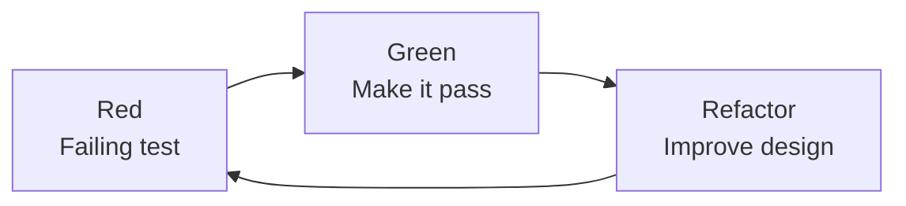

## What TDD is

TDD is a workflow:

1. write a failing test (Red)
2. write minimal code to pass (Green)
3. refactor safely (Refactor)

## Diagram: red-green-refactor



## Why TDD helps

- forces clarity on requirements
- encourages smaller functions
- reduces fear of refactoring

## Realistic TDD

TDD is easiest for:

- pure functions
- business rules

Harder for:

- UI code
- code with many external integrations

In those cases, combine TDD with integration tests.

## A full cycle, step by step

Take a small requirement: a function that turns a title into a URL slug.

**Red.** Write the smallest test that fails, and run it to see it fail for the right reason.

```python title="test_slug.py" showLineNumbers{1}
from slug import slugify


def test_lowercases_and_joins_words():
    assert slugify("Hello World") == "hello-world"
```

Running it gives `ModuleNotFoundError`, which is a real failure. Create `slug.py` with a stub and the failure becomes an assertion error, which is a better one.

**Green.** Write the simplest code that passes, even if it looks naive.

```python title="slug.py" showLineNumbers{1}
def slugify(title):
    return title.lower().replace(" ", "-")
```

**Refactor.** Nothing to clean yet. Next test:

```python title="test_slug.py" showLineNumbers{1}
def test_strips_punctuation_and_extra_spaces():
    assert slugify("  Hello,   World! ") == "hello-world"
```

It fails. Now improve the implementation, keeping the first test green:

```python title="slug.py" showLineNumbers{1}
import re


def slugify(title):
    words = re.findall(r"[a-z0-9]+", title.lower())
    return "-".join(words)
```

Both tests pass, and the refactor was safe because the tests told you so. Each cycle takes a minute or two. Long stretches with a red bar mean the steps are too big.

## Why watch it fail first

A test you never saw fail may be passing for the wrong reason, for example asserting on the wrong variable. Seeing red proves the test can detect the problem.

## What TDD gives you

- Code shaped to be testable, since you had to call it before it existed.
- A regression suite created as a by-product.
- Confidence to refactor, as the suite is the safety net.

## Where it struggles

TDD works best on logic with clear inputs and outputs. It is awkward for exploratory UI work, where you do not yet know what you want, and for code with heavy integrations. A common approach is to spike a solution to learn, throw it away, then rebuild it test-first.

## What goes wrong

- **Writing all tests first,** then all the code. That is test-first, but not the small loop.
- **Skipping the refactor step,** so the code stays ugly but passing.
- **Testing implementation details,** so refactors break tests.
- **Big steps.** If you cannot make a test pass in a few minutes, write a smaller test.

## Connections

The unit testing lesson describes what a good test looks like, and the refactoring project at the end of the module lets you practise the third step on messy code. Coverage is a by-product here, not a target.

## 🧪 Try It Yourself

### Exercise 1 – Write a unittest TestCase

<DataCampExercise
  lang="python"
  hint={`Subclass \`unittest.TestCase\` and use \`assertEqual\` to assert values.`}
  code={`# Task: Exercise 1 – Write a unittest TestCase
import unittest

def add(a, b):
    return a + b

class TestAdd(unittest.___):    # replace ___ with TestCase
    def test_positive(self):
        self.___(add(2, 3), 5)  # replace ___ with assertEqual

# Run inline
suite = unittest.TestLoader().loadTestsFromTestCase(TestAdd)
runner = unittest.TextTestRunner(verbosity=0)
result = runner.run(suite)
print("Tests run:", result.testsRun)
print("Failures:", len(result.failures))

# ── Expected Output ───────────────────────────────────────────
# Tests run: 1
# Failures: 0
# ──────────────────────────────────────────────────────────────`}
  solution={`import unittest

def add(a, b):
    return a + b

class TestAdd(unittest.TestCase):
    def test_positive(self):
        self.assertEqual(add(2, 3), 5)

suite = unittest.TestLoader().loadTestsFromTestCase(TestAdd)
runner = unittest.TextTestRunner(verbosity=0)
result = runner.run(suite)
print("Tests run:", result.testsRun)
print("Failures:", len(result.failures))`}
  sct={`test_output_contains("Tests run: 1")
test_output_contains("Failures: 0")
success_msg("unittest TestCase working!")`}
  height={160}
/>

### Exercise 2 – assertRaises

<DataCampExercise
  lang="python"
  hint={`Use \`self.assertRaises(ExceptionType)\` as a context manager.`}
  code={`# Task: Exercise 2 – assertRaises
import unittest

def divide(a, b):
    if b == 0:
        raise ValueError("Cannot divide by zero")
    return a / b

class TestDivide(unittest.TestCase):
    def test_zero(self):
        # Hint: use assertRaises to expect a ValueError
        with self.___(___):          # replace blanks: assertRaises, ValueError
            divide(10, 0)

suite = unittest.TestLoader().loadTestsFromTestCase(TestDivide)
result = unittest.TextTestRunner(verbosity=0).run(suite)
print("Passed:", result.wasSuccessful())

# ── Expected Output ───────────────────────────────────────────
# Passed: True
# ──────────────────────────────────────────────────────────────`}
  solution={`import unittest

def divide(a, b):
    if b == 0:
        raise ValueError("Cannot divide by zero")
    return a / b

class TestDivide(unittest.TestCase):
    def test_zero(self):
        with self.assertRaises(ValueError):
            divide(10, 0)

suite = unittest.TestLoader().loadTestsFromTestCase(TestDivide)
result = unittest.TextTestRunner(verbosity=0).run(suite)
print("Passed:", result.wasSuccessful())`}
  sct={`test_output_contains("Passed: True")
success_msg("assertRaises verifies exceptions!")`}
  height={160}
/>

### Exercise 3 – setUp and tearDown

<DataCampExercise
  lang="python"
  hint={`Override \`setUp\` to run before each test and \`tearDown\` after.`}
  code={`# Task: Exercise 3 – setUp and tearDown
import unittest

class TestLifecycle(unittest.TestCase):
    def ___(self):              # replace ___ with setUp
        self.data = [1, 2, 3]
        print("setUp called")

    def test_length(self):
        self.assertEqual(len(self.data), 3)

    def ___(self):              # replace ___ with tearDown
        print("tearDown called")

suite = unittest.TestLoader().loadTestsFromTestCase(TestLifecycle)
unittest.TextTestRunner(verbosity=0).run(suite)

# ── Expected Output includes ──────────────────────────────────
# setUp called
# tearDown called
# ──────────────────────────────────────────────────────────────`}
  solution={`import unittest

class TestLifecycle(unittest.TestCase):
    def setUp(self):
        self.data = [1, 2, 3]
        print("setUp called")

    def test_length(self):
        self.assertEqual(len(self.data), 3)

    def tearDown(self):
        print("tearDown called")

suite = unittest.TestLoader().loadTestsFromTestCase(TestLifecycle)
unittest.TextTestRunner(verbosity=0).run(suite)`}
  sct={`test_output_contains("setUp called")
test_output_contains("tearDown called")
success_msg("setUp/tearDown lifecycle works!")`}
  height={162}
/>

