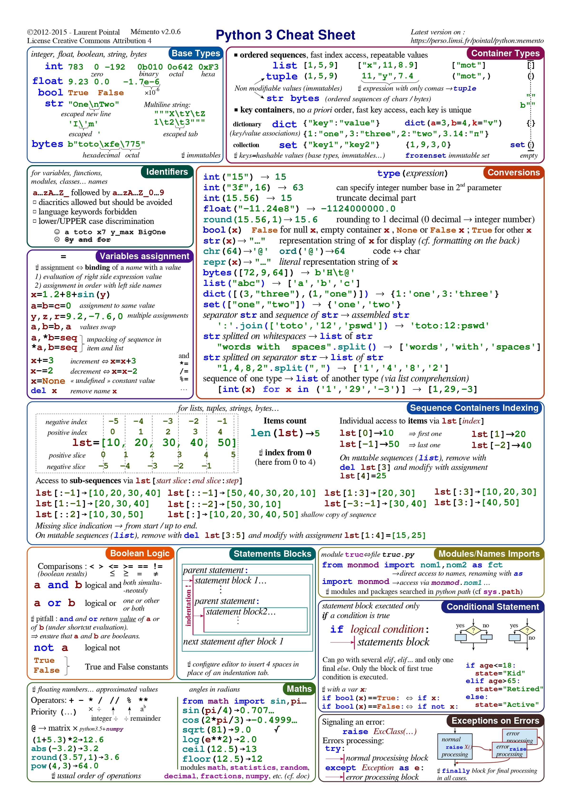
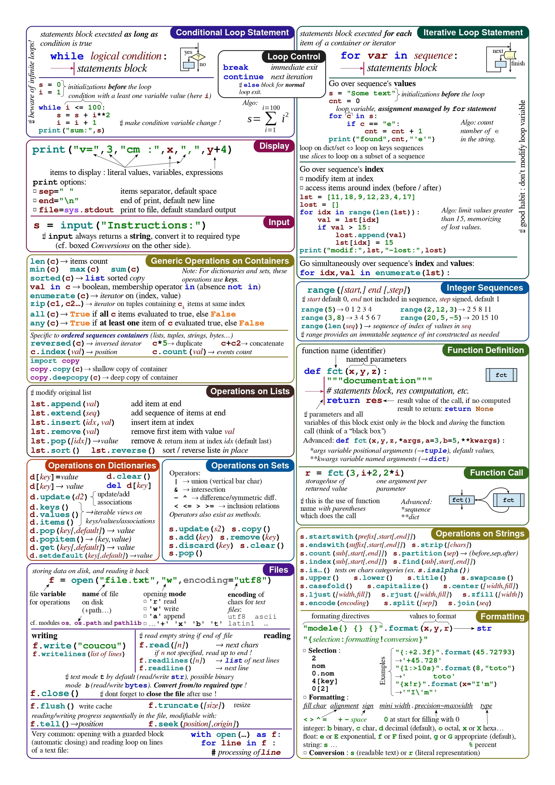

## What you'll learn

- The Python syntax and built-in types you reach for every day
- Compact tables for strings, lists, dicts and sets
- Comprehensions, functions, classes, files and exceptions at a glance
- A short tour of the most useful standard library modules

Keep this page open while you code. Each section is a reminder, not a full lesson. Follow the course lessons for the explanations.

## Syntax basics

| Idea | Example |
| --- | --- |
| Comment | `# a comment` |
| Variable | `age = 30` |
| Multiple assign | `a, b = 1, 2` |
| Swap | `a, b = b, a` |
| Types | `int`, `float`, `str`, `bool`, `list`, `tuple`, `dict`, `set`, `None` |
| Check type | `type(x)`, `isinstance(x, int)` |
| Convert | `int("5")`, `float("1.5")`, `str(10)`, `list("abc")` |
| Arithmetic | `+ - * / // % **` |
| Compare | `== != < > <= >=` |
| Logic | `and`, `or`, `not` |
| Membership | `x in items`, `x not in items` |

```python title="syntax.py" showLineNumbers{1}
x = 7
if x > 10:
    print("big")
elif x > 5:
    print("medium")
else:
    print("small")

for i in range(3):          # 0, 1, 2
    print(i)

n = 3
while n > 0:
    n -= 1

for i, ch in enumerate("abc"):
    print(i, ch)
```

## Strings

| Task | Code |
| --- | --- |
| Length | `len(s)` |
| Upper, lower | `s.upper()`, `s.lower()`, `s.title()` |
| Strip spaces | `s.strip()`, `s.lstrip()`, `s.rstrip()` |
| Split, join | `s.split(",")`, `"-".join(parts)` |
| Replace | `s.replace("a", "b")` |
| Find | `s.find("x")` (returns -1 if missing), `s.index("x")` |
| Test | `s.startswith("a")`, `s.endswith("z")`, `s.isdigit()` |
| Slice | `s[0:3]`, `s[-1]`, `s[::-1]` |
| Count | `s.count("a")` |

```python title="strings.py" showLineNumbers{1}
name = "Ada"
score = 93.456
print(f"{name} scored {score:.1f}")     # Ada scored 93.5
print(f"{score:>10.2f}")                # right aligned
print("a,b,c".split(","))               # ['a', 'b', 'c']
print("-".join(["x", "y"]))             # x-y
```

## Lists

| Task | Code |
| --- | --- |
| Create | `nums = [3, 1, 2]` |
| Add | `nums.append(4)`, `nums.insert(0, 9)`, `nums.extend([5, 6])` |
| Remove | `nums.remove(1)`, `nums.pop()`, `nums.pop(0)`, `del nums[0]` |
| Sort | `nums.sort()` (in place), `sorted(nums)` (new list) |
| Reverse | `nums.reverse()`, `nums[::-1]` |
| Slice | `nums[1:3]`, `nums[:2]`, `nums[-2:]` |
| Info | `len(nums)`, `min(nums)`, `max(nums)`, `sum(nums)` |
| Search | `nums.index(2)`, `nums.count(2)`, `2 in nums` |
| Copy | `nums.copy()` or `nums[:]` |

## Tuples

Tuples are immutable lists: `point = (3, 4)`. Unpack them with `x, y = point`.

## Dictionaries

| Task | Code |
| --- | --- |
| Create | `d = {"a": 1, "b": 2}` |
| Read | `d["a"]`, `d.get("z", 0)` |
| Set | `d["c"] = 3` |
| Delete | `del d["a"]`, `d.pop("b")` |
| Loop | `d.keys()`, `d.values()`, `d.items()` |
| Merge | `d1 \| d2`, `d.update(other)` |
| Check key | `"a" in d` |

```python title="dicts.py" showLineNumbers{1}
prices = {"apple": 3, "pear": 5}
for fruit, price in prices.items():
    print(fruit, price)

counts = {}
for ch in "banana":
    counts[ch] = counts.get(ch, 0) + 1
print(counts)       # {'b': 1, 'a': 3, 'n': 2}
```

## Sets

| Task | Code |
| --- | --- |
| Create | `s = {1, 2, 3}`, `set([1, 1, 2])`, empty: `set()` |
| Add, remove | `s.add(4)`, `s.discard(1)` |
| Union | `a \| b` |
| Intersection | `a & b` |
| Difference | `a - b` |
| Symmetric difference | `a ^ b` |

Sets hold unique values and check membership very quickly. Use them to remove duplicates: `list(set(items))`.

## Comprehensions

```python title="comprehensions.py" showLineNumbers{1}
squares = [n * n for n in range(5)]                 # [0, 1, 4, 9, 16]
evens = [n for n in range(10) if n % 2 == 0]        # [0, 2, 4, 6, 8]
lengths = {w: len(w) for w in ["hi", "python"]}     # dict comprehension
unique = {c for c in "hello"}                       # set comprehension
total = sum(n for n in range(100))                  # generator expression
```

## Functions

```python title="functions.py" showLineNumbers{1}
def greet(name, greeting="Hello"):
    """Return a greeting."""
    return f"{greeting}, {name}!"

def total(*numbers, **options):
    return sum(numbers)

square = lambda x: x * x

print(greet("Ada"))
print(greet("Ada", greeting="Hi"))
print(total(1, 2, 3))
print(list(map(square, [1, 2, 3])))
```

| Concept | Syntax |
| --- | --- |
| Default argument | `def f(a, b=2)` |
| Variable positional | `def f(*args)` |
| Variable keyword | `def f(**kwargs)` |
| Unpack call | `f(*items)`, `f(**options)` |
| Type hints | `def f(a: int) -> str` |
| Lambda | `lambda x: x + 1` |

Never use a mutable default such as `def f(items=[])`. Use `None` and create the list inside the function.

## Classes

```python title="classes.py" showLineNumbers{1}
class Dog:
    species = "canine"            # class attribute

    def __init__(self, name):
        self.name = name          # instance attribute

    def speak(self):
        return f"{self.name} says woof"

    def __repr__(self):
        return f"Dog({self.name!r})"

class Puppy(Dog):                 # inheritance
    def speak(self):
        return super().speak() + " softly"

print(Puppy("Rex").speak())
```

| Method | Purpose |
| --- | --- |
| `__init__` | Set up a new object |
| `__str__`, `__repr__` | Readable and debug text |
| `__len__` | Support `len(obj)` |
| `__eq__` | Support `==` |
| `@staticmethod` | Method with no self |
| `@classmethod` | Method that receives the class |
| `@property` | Method used like an attribute |

## Files

```python title="files.py" showLineNumbers{1}
with open("notes.txt", "w", encoding="utf-8") as f:
    f.write("hello\n")

with open("notes.txt", encoding="utf-8") as f:
    for line in f:
        print(line.strip())
```

| Mode | Meaning |
| --- | --- |
| `"r"` | Read (default) |
| `"w"` | Write, replaces the file |
| `"a"` | Append |
| `"rb"`, `"wb"` | Binary read and write |

## Exceptions

```python title="exceptions.py" showLineNumbers{1}
try:
    value = int("abc")
except ValueError as err:
    print("bad number:", err)
except (TypeError, KeyError):
    print("type or key problem")
else:
    print("no error")
finally:
    print("always runs")

raise ValueError("something is wrong")
```

| Common exception | Typical cause |
| --- | --- |
| `ValueError` | Right type, wrong value, such as `int("x")` |
| `TypeError` | Wrong type, such as `1 + "a"` |
| `KeyError` | Missing dict key |
| `IndexError` | List index out of range |
| `FileNotFoundError` | File does not exist |
| `ZeroDivisionError` | Division by zero |

## Common standard library

| Module | Handy for | Example |
| --- | --- | --- |
| `math` | Maths functions | `math.sqrt(16)` |
| `random` | Random numbers | `random.choice(items)` |
| `datetime` | Dates and times | `datetime.now()` |
| `json` | JSON text | `json.loads(text)`, `json.dumps(obj)` |
| `os`, `pathlib` | Paths and folders | `Path("a") / "b.txt"` |
| `sys` | Interpreter info | `sys.argv` |
| `re` | Regular expressions | `re.findall(r"\d+", s)` |
| `collections` | Counter, defaultdict, deque | `Counter("banana")` |
| `itertools` | Iteration helpers | `itertools.chain(a, b)` |
| `csv` | CSV files | `csv.reader(f)` |

```python title="stdlib.py" showLineNumbers{1}
from collections import Counter
from pathlib import Path
import json

print(Counter("banana").most_common(1))     # [('a', 3)]
print(json.dumps({"a": 1}))                 # {"a": 1}
print(Path("data") / "file.txt")
```

## Handy built-ins

`len`, `range`, `enumerate`, `zip`, `sorted`, `reversed`, `sum`, `min`, `max`, `any`, `all`, `map`, `filter`, `abs`, `round`, `input`, `print`, `open`, `isinstance`.

```python
>>> list(zip([1, 2], ["a", "b"]))
[(1, 'a'), (2, 'b')]
>>> any(n > 2 for n in [1, 2, 3])
True
```

## Check what you learned

<Quiz
  questions={[
    {
      q: "What does [n * n for n in range(4)] produce?",
      options: [
        "[1, 4, 9, 16]",
        "[0, 1, 4, 9]",
        "[0, 2, 4, 6]",
        "[0, 1, 2, 3]",
      ],
      answer: 1,
      explain: "range(4) yields 0, 1, 2, 3 and each one is squared, giving 0, 1, 4, 9.",
    },
    {
      q: "Which is the safest way to read a dictionary key that might be missing?",
      options: [
        "d[key]",
        "d.get(key, default)",
        "d.pop()",
        "d.keys(key)",
      ],
      answer: 1,
      explain: "d.get returns the default instead of raising KeyError when the key is absent.",
    },
    {
      q: "Why use a with statement to open a file?",
      options: [
        "It makes the file read-only",
        "It makes reading faster",
        "It closes the file automatically, even if an error happens",
        "It converts the file to text",
      ],
      answer: 2,
      explain: "with is a context manager. It guarantees the file is closed when the block ends, whether it ends normally or with an exception.",
    },
  ]}
/>

## Credits

The original printable memento below is by [Laurent Pointal](https://perso.limsi.fr/pointal/_media/python:cours:mementopython3-english.pdf).



