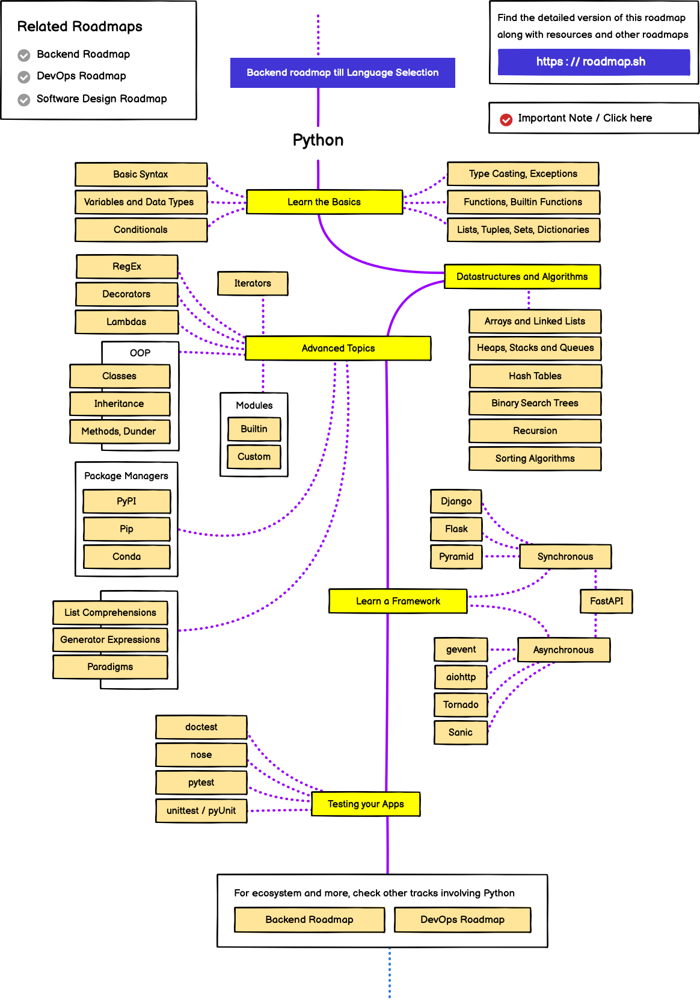

## What you'll learn

- The order to take Python Central Hub courses, and why that order works
- What each stage gives you and roughly how long it takes
- Which courses can be taken in parallel, and where DSA fits
- How to pick a path for your own goal

## The big picture

Python is a gateway language. Once you know it, you can branch into scripting, web apps, data work or AI. The roadmap below is the order that causes the least backtracking: every stage uses skills from the one before it.

```mermaid title="Python Central Hub learning roadmap" desc="Python Programming leads to Automation and Scripting, Flask and Testing, then Data Analytics, Mathematics for ML, Machine Learning and Deep Learning, with Data Structures and Algorithms alongside."
flowchart TD
  A["Python Programming"] --> B["Automation and Scripting"]
  A --> C["Web Development with Flask"]
  A --> D["Software Testing and Quality"]
  A --> E["Data Analytics with Python"]
  E --> G["Machine Learning"]
  F["Mathematics for Machine Learning"] --> G
  G --> H["Deep Learning"]
  A -.-> I["Data Structures and Algorithms"]
  I -.-> G
```

## Stage by stage

| Stage | Course | What it gives you | Rough time |
| --- | --- | --- | --- |
| 1 | Python Programming | Syntax, data types, functions, classes, files, errors, modules | 4 to 8 weeks |
| 2a | Automation and Scripting | Scripts that rename files, scrape pages, send mail and save you hours | 2 to 4 weeks |
| 2b | Web Development with Flask | Routes, templates, forms, databases and a deployable web app | 3 to 5 weeks |
| 2c | Software Testing and Quality | unittest and pytest, mocks, API tests and CI habits | 3 to 4 weeks |
| 3 | Data Analytics with Python | NumPy, pandas, cleaning, visualisation, real analysis projects | 6 to 8 weeks |
| 4 | Mathematics for Machine Learning | Linear algebra, calculus, probability and statistics for ML | 4 to 6 weeks |
| 5 | Machine Learning | Regression, classification, ensembles, tuning, deployment | 8 to 12 weeks |
| 6 | Deep Learning | Neural networks, CNNs, sequence models and training practice | 8 to 12 weeks |
| Alongside | Data Structures and Algorithms | Problem solving, complexity, interview readiness | 1 to 2 hours a week, ongoing |

These times assume about one hour a day. Double your hours and you roughly halve the weeks, but do not skip the practice exercises: they are where the learning happens.

## Stage 1: Python Programming

Everything else depends on this. Aim to be comfortable with variables, loops, functions, lists and dictionaries, reading and writing files, and handling errors. You are ready to move on when you can write a 50 line program from a blank file without copying.

```python title="stage1_check.py" showLineNumbers{1}
def word_count(text):
    counts = {}
    for word in text.lower().split():
        counts[word] = counts.get(word, 0) + 1
    return counts

print(word_count("the cat and the hat"))
```

If you can read that and explain every line, you are ready for stage 2.

## Stage 2: Pick a branch

After the basics you can pick any of three branches. They are independent, and doing all three is a good idea.

- **Automation and Scripting** gives quick wins. It is the best motivator if you want visible results fast.
- **Web Development with Flask** teaches how the web works: requests, responses, templates and databases.
- **Software Testing and Quality** teaches you to prove that code works. Testing is a skill employers notice, and it makes every later course easier.

## Stage 3: Data Analytics

Data Analytics introduces NumPy and pandas. Machine Learning is mostly data preparation, so this stage is not optional if your goal is ML. You finish with end-to-end projects that clean, explore and present data.

## Stage 4: Mathematics for ML

You do not need a maths degree. You need the intuition behind vectors, matrices, derivatives and probability. You can take this course in parallel with Data Analytics, since the two do not depend on each other.

## Stage 5 and 6: Machine Learning, then Deep Learning

Machine Learning teaches the full workflow: split data, train, evaluate honestly and deploy. Deep Learning builds on it with neural networks. Do them in this order. Most Deep Learning ideas (loss, gradient descent, overfitting, validation) are first met in Machine Learning.

## Data Structures and Algorithms, alongside

DSA is not a stage you finish. Spread it across the whole journey: one or two problems a week. It sharpens problem solving and prepares you for technical interviews.

## Choose a path for your goal

| Your goal | Path |
| --- | --- |
| Automate boring tasks | Python Programming, Automation and Scripting |
| Build web apps | Python Programming, Web Development with Flask, Software Testing and Quality |
| Become a data analyst | Python Programming, Data Analytics with Python |
| Become an ML engineer | Python Programming, Data Analytics, Mathematics for ML, Machine Learning, Deep Learning |
| Crack coding interviews | Python Programming, Data Structures and Algorithms, Software Testing and Quality |

## Tips for staying on track

- Finish the exercises at the end of every lesson before you move on.
- Build one small project per stage and keep it, even if it is rough.
- When something is hard, move on and return later. Concepts often click on the second pass.
- Revisit older courses when a later one needs them. That is normal.

## Check what you learned

<Quiz
  questions={[
    {
      q: "Which course should you take first on the Python Central Hub roadmap?",
      options: [
        "Deep Learning",
        "Python Programming",
        "Machine Learning",
        "Data Structures and Algorithms",
      ],
      answer: 1,
      explain: "Every other course uses Python, so Python Programming is the foundation. DSA runs alongside, but it also needs Python first.",
    },
    {
      q: "Which of these three courses depend on each other?",
      options: [
        "Automation and Scripting, Flask and Testing all depend on each other in a chain",
        "None of them. After Python Programming they are independent branches that you can take in any order or together",
        "Flask must be finished before Testing",
        "Testing must be finished before Automation",
      ],
      answer: 1,
      explain: "Automation and Scripting, Web Development with Flask and Software Testing and Quality are parallel branches that all start from Python Programming.",
    },
    {
      q: "Where does Deep Learning belong on the roadmap?",
      options: [
        "Right after Python Programming",
        "Before Data Analytics",
        "After Machine Learning, because it reuses ideas like loss, gradient descent and validation",
        "It is not part of the roadmap",
      ],
      answer: 2,
      explain: "Deep Learning is the last stage. Machine Learning introduces the workflow and the core ideas that neural networks build on.",
    },
  ]}
/>

## Credits

The original visual roadmap below comes from [Roadmap.sh](https://roadmap.sh). Use it as a map of topics inside Python itself.


