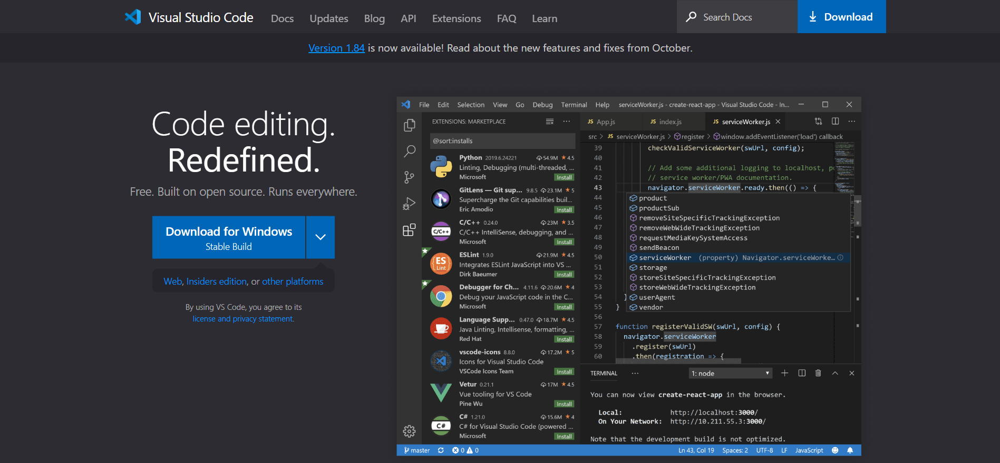
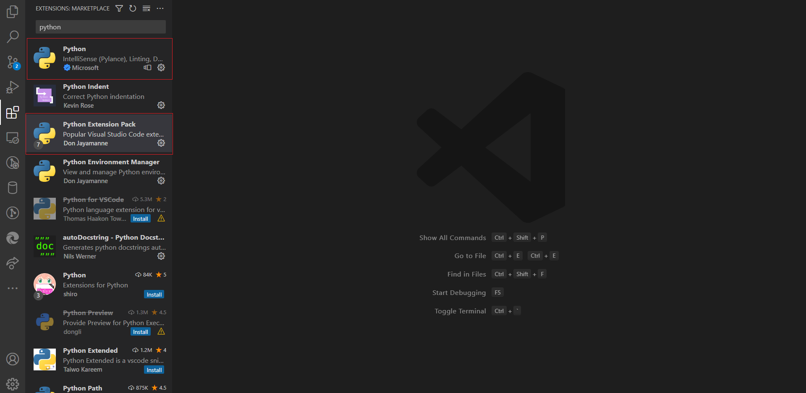
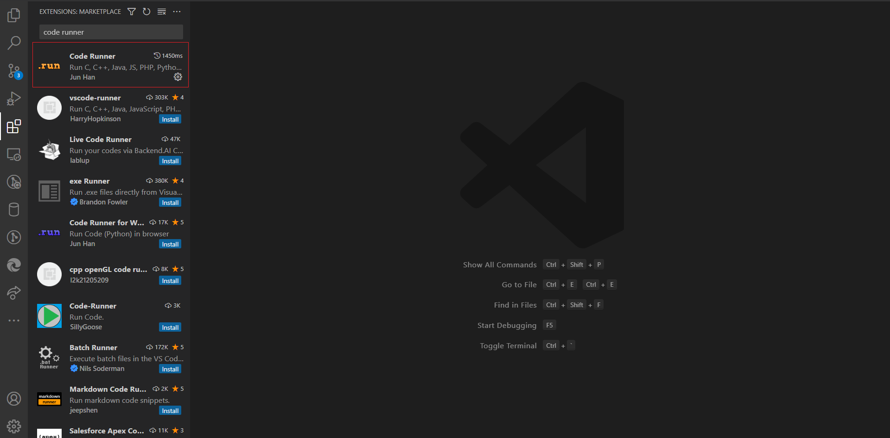
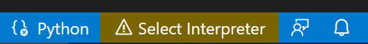
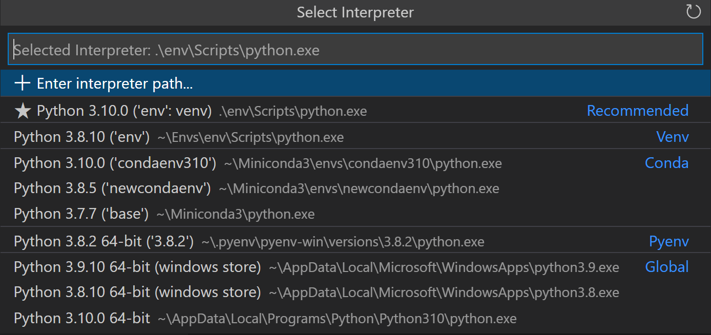
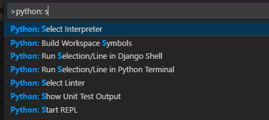
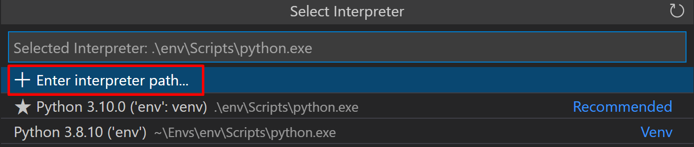

## Setting Up Visual Studio Code for Python Development: A Comprehensive Guide

Visual Studio Code (VS Code) has emerged as a powerful and versatile code editor, and its seamless integration with Python makes it a favorite among developers. Setting up Visual Studio Code for Python development is a straightforward process that opens the door to a world of efficient coding, debugging, and collaboration. In this comprehensive guide, we'll walk through the steps to set up VS Code for Python development, covering installations, configurations, and essential extensions.

## Installing Visual Studio Code

Before diving into Python-specific configurations, ensure that Visual Studio Code is installed on your machine. You can download the latest version from the official [Visual Studio Code website](https://code.visualstudio.com/).



Once the download is complete, follow the installation instructions for your operating system.

## Installing Python

To develop Python applications in Visual Studio Code, you need to have Python installed on your system. You can download the latest version of Python from the official [Python website](https://www.python.org/downloads/). During the installation, make sure to check the box that says "Add Python to PATH" to simplify the setup process.

After the installation, you can verify the Python installation by opening a terminal or command prompt and running:

```bash title="command" showLineNumbers{1} {1}
python --version
```

This should display the installed Python version.

:::tip
For more details about python installation, check out our [Python Installation Guide](/tutorials/installation/).
:::


## Installing the Python Extension for Visual Studio Code

The Python extension for Visual Studio Code is a crucial component for a smooth Python development experience. It provides features like IntelliSense, linting, debugging, and more. To install the Python extension, follow these steps:

1. Open Visual Studio Code.

2. Navigate to the Extensions view by clicking on the Extensions icon in the Activity Bar on the side of the window or using the shortcut `Ctrl+Shift+X`.

3. Search for "Python" in the Extensions view search box.

4. Select the "Python" extension provided by Microsoft and click the "Install" button.



5. You need to install another extension called "Code Runner" to run Python code directly from VS Code. Search for "Code Runner" in the Extensions view and install it.



6. After installation, you might need to reload VS Code to activate the extension.

:::tip
You can also install the Python Extension Pack, which includes the Python extension along with other useful extensions for Python development. To install the extension pack, search for "Python Extension Pack" in the Extensions view and install it.
:::

## Selecting the Python Interpreter

With the Python extension installed, you need to specify the Python interpreter that VS Code should use for your projects. Follow these steps to set the Python interpreter:

1. Open a Python file or create a new one.

2. Look in the lower right corner of the window, where you'll see "Select Python Interpreter." Click on it



   
or use the shortcut `Ctrl+Shift+P` and search for "Python: Select Interpreter."



1. Choose the Python interpreter you installed earlier. If it doesn't appear, click on "Enter interpreter path" and manually locate the Python executable.

Setting the interpreter ensures that VS Code uses the correct Python environment for your projects.
