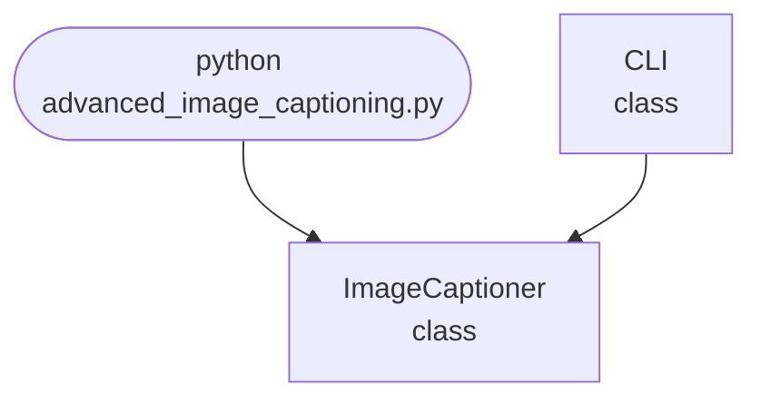

## Abstract
Advanced Image Captioning is a Python project that uses deep learning to automatically generate descriptive captions for images. The application combines computer vision and natural language processing to interpret image content and produce human-like descriptions. This project demonstrates image feature extraction, sequence modeling, and text generation using neural networks.

## Prerequisites
- Python 3.8 or above
- A code editor or IDE
- Basic understanding of deep learning and computer vision
- Required libraries: `tensorflow`, `keras`, `numpy`, `Pillow`

## Before you Start
Install Python and the required libraries:
```bash title="Install dependencies" showLineNumbers{1}
pip install tensorflow keras numpy pillow
```

## Getting Started
#### Create a Project
1. Create a folder named `advanced-image-captioning`.
2. Open the folder in your code editor or IDE.
3. Create a file named `advanced_image_captioning.py`.
4. Copy the code below into your file.

## Write the Code
<FileCode file="projects/advance/advanced_image_captioning.py" lang="python" title="Advanced Image Captioning" />

## Example Usage
```bash title="Run the image captioner" showLineNumbers{1}
python advanced_image_captioning.py
```

## How it fits together

Read from the top: this is what runs when you execute the file, and which function calls which. It is generated from the code, so it cannot drift from it.



## Explanation
### Key Features
- **Image Feature Extraction:** Uses CNNs to extract features from images.
- **Sequence Modeling:** LSTM-based model generates captions from image features.
- **Preprocessing:** Handles image loading and text tokenization.
- **Error Handling:** Validates inputs and manages exceptions.
- **CLI Interface:** Interactive command-line usage.

### Code Breakdown
1. **What it imports** (lines 11–13)
```python title="advanced_image_captioning.py" showLineNumbers startLineNumber=11
import sys
import os
import random
```

2. **`ImageCaptioner` — the class** (lines 22–31)
```python title="advanced_image_captioning.py" showLineNumbers startLineNumber=22
class ImageCaptioner:
    def __init__(self):
        pass
    def train(self, img_dir, captions_file):
        print(f"Training on {img_dir} with captions {captions_file}...")
        # Dummy: training omitted
    def predict(self, img_path):
        print(f"Predicting caption for {img_path}...")
        # Dummy: random caption
        return random.choice(["A dog running.", "A person walking.", "A car parked."])
```

3. **`CLI` — the class** (lines 33–59)
```python title="advanced_image_captioning.py" showLineNumbers startLineNumber=33
class CLI:
    @staticmethod
    def run():
        print("Advanced Image Captioning")
        while True:
            cmd = input('> ')
            if cmd.startswith('train'):
                parts = cmd.split()
                if len(parts) < 3:
                    print("Usage: train <img_dir> <captions_file>")
                    continue
                img_dir, captions_file = parts[1], parts[2]
                cap = ImageCaptioner()
                cap.train(img_dir, captions_file)
            elif cmd.startswith('predict'):
                parts = cmd.split()
                if len(parts) < 2:
                    print("Usage: predict <img_path>")
                # ... 3 more lines in the file ...
                caption = cap.predict(img_path)
                print(f"Caption: {caption}")
            elif cmd == 'exit':
                break
            else:
                print("Unknown command")
```

The file defines 2 top-level symbols in all; the whole thing is above under *Write the Code*.

## Features
- **Deep Learning-Based:** Uses CNN and LSTM for image captioning
- **Modular Design:** Separate functions for feature extraction and caption generation
- **Error Handling:** Manages invalid inputs and exceptions
- **Production-Ready:** Scalable and maintainable code

## Next Steps
Enhance the project by:
- Training with a large image-caption dataset (e.g., MS COCO)
- Saving and loading trained models and tokenizers
- Adding batch captioning for multiple images
- Creating a GUI with Tkinter or a web app with Flask
- Supporting multilingual captions
- Adding evaluation metrics (BLEU, METEOR)
- Unit testing for reliability

## Educational Value
This project teaches:
- **Computer Vision:** Feature extraction from images
- **Sequence Modeling:** Generating text from image features
- **Software Design:** Modular, maintainable code
- **Error Handling:** Writing robust Python code

## Real-World Applications
- **Photo Management Systems**
- **Accessibility Tools**
- **Social Media Automation**
- **Content Creation**

## Checkpoint exercise

This exercise practises greedy decoding of a caption from next-word probabilities, the decoder loop of every captioning model.

<DataCampExercise
  lang="python"
  hint={`At each step take the word with the highest probability from the table for the current word; stop at <end>.`}
  code={`NEXT = {
    "<start>": {"a": 0.7, "the": 0.3},
    "a": {"dog": 0.5, "cat": 0.3, "frisbee": 0.2},
    "the": {"dog": 0.6, "cat": 0.4},
    "dog": {"runs": 0.6, "<end>": 0.4},
    "cat": {"sleeps": 0.8, "<end>": 0.2},
    "runs": {"<end>": 1.0},
    "sleeps": {"<end>": 1.0},
    "frisbee": {"<end>": 1.0},
}

def greedy_caption(max_len=6):
    word, caption, logp = "<start>", [], 0.0
    import math
    for _ in range(max_len):
        options = NEXT[word]
        word = ___
        logp += math.log(options[word])
        if word == "<end>":
            break
        caption.append(word)
    return " ".join(caption), logp

caption, logp = greedy_caption()
print("caption:", caption)
print(f"log probability: {logp:.3f}")`}
  solution={`NEXT = {
    "<start>": {"a": 0.7, "the": 0.3},
    "a": {"dog": 0.5, "cat": 0.3, "frisbee": 0.2},
    "the": {"dog": 0.6, "cat": 0.4},
    "dog": {"runs": 0.6, "<end>": 0.4},
    "cat": {"sleeps": 0.8, "<end>": 0.2},
    "runs": {"<end>": 1.0},
    "sleeps": {"<end>": 1.0},
    "frisbee": {"<end>": 1.0},
}

def greedy_caption(max_len=6):
    word, caption, logp = "<start>", [], 0.0
    import math
    for _ in range(max_len):
        options = NEXT[word]
        word = max(options, key=options.get)
        logp += math.log(options[word])
        if word == "<end>":
            break
        caption.append(word)
    return " ".join(caption), logp

caption, logp = greedy_caption()
print("caption:", caption)
print(f"log probability: {logp:.3f}")`}
  sct={`test_output_contains("caption: a dog runs", pattern=False)
test_output_contains("log probability: -1.561", pattern=False)
success_msg("Nice - you ran the key step of this project.")`}
  height={160}
/>

## Conclusion
Advanced Image Captioning demonstrates how to combine computer vision and NLP to generate descriptive captions for images. With deep learning, this project can be extended for real-world applications such as accessibility, content management, and social media automation. For more advanced projects, visit Python Central Hub.
