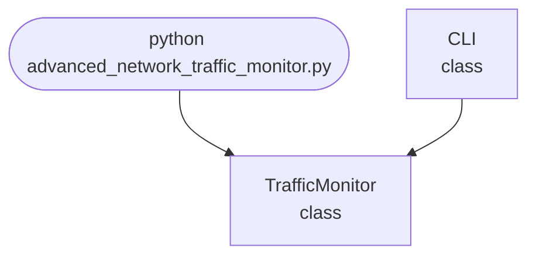

import FileCode from '../../../../components/FileCode.astro'

## Abstract
Advanced Network Traffic Monitor is a Python project that enables real-time monitoring and analysis of network traffic. The application captures packets, analyzes protocols, and visualizes traffic statistics. It demonstrates network programming, packet parsing, and data visualization, making it suitable for security analysis and network diagnostics.

## Prerequisites
- Python 3.8 or above
- A code editor or IDE
- Basic understanding of networking concepts
- Required libraries: `scapy`, `matplotlib`
- Administrator/root privileges for packet capture

## Before you Start
Install Python and the required libraries:
```bash title="Install dependencies" showLineNumbers{1}
pip install scapy matplotlib
```

## Getting Started
#### Create a Project
1. Create a folder named `advanced-network-traffic-monitor`.
2. Open the folder in your code editor or IDE.
3. Create a file named `advanced_network_traffic_monitor.py`.
4. Copy the code below into your file.

## Write the Code
<FileCode file="projects/advance/advanced_network_traffic_monitor.py" lang="python" title="Advanced Network Traffic Monitor" />

## Example Usage
```bash title="Run the network monitor" showLineNumbers{1}
sudo python advanced_network_traffic_monitor.py
```

## How it fits together

Read from the top: this is what runs when you execute the file, and which function calls which. It is generated from the code, so it cannot drift from it.



## Explanation
### Key Features
- **Packet Capture:** Uses Scapy to capture live network packets.
- **Protocol Analysis:** Identifies and counts protocols (TCP, UDP, ICMP).
- **Traffic Visualization:** Plots protocol distribution using matplotlib.
- **Error Handling:** Manages permissions and invalid inputs.
- **CLI Interface:** Interactive command-line usage.

### Code Breakdown
1. **What it imports** (lines 12–16)
```python title="advanced_network_traffic_monitor.py" showLineNumbers startLineNumber=12
import psutil
import time
import sys
import matplotlib.pyplot as plt
import numpy as np
```

2. **`TrafficMonitor` — the class** (lines 18–49)
```python title="advanced_network_traffic_monitor.py" showLineNumbers startLineNumber=18
class TrafficMonitor:
    def __init__(self):
        self.data = []
        self.timestamps = []

    def collect(self, duration=60):
        print("Collecting network traffic data...")
        for _ in range(duration):
            stats = psutil.net_io_counters()
            self.data.append(stats.bytes_sent + stats.bytes_recv)
            self.timestamps.append(time.time())
            time.sleep(1)

    def detect_anomaly(self):
        arr = np.array(self.data)
        mean = arr.mean()
        std = arr.std()
        anomalies = [(i, v) for i, v in enumerate(arr) if abs(v - mean) > 2*std]
        # ... 8 more lines in the file ...
        plt.ylabel('Bytes')
        plt.title('Network Traffic Over Time')
        plt.legend()
        plt.savefig("advanced_network_traffic_monitor.png", dpi=120, bbox_inches="tight")
        print("saved advanced_network_traffic_monitor.png")
        plt.show()
```

3. **`CLI` — the class** (lines 51–59)
```python title="advanced_network_traffic_monitor.py" showLineNumbers startLineNumber=51
class CLI:
    @staticmethod
    def run():
        monitor = TrafficMonitor()
        monitor.collect(60)
        print("Visualizing...")
        monitor.visualize()
        anomalies = monitor.detect_anomaly()
        print(f"Anomalies detected: {anomalies}")
```

The file defines 2 top-level symbols in all; the whole thing is above under *Write the Code*.

## Features
- **Real-Time Monitoring:** Captures and analyzes live traffic
- **Protocol Analysis:** Identifies and counts protocols
- **Visualization:** Plots protocol distribution
- **Error Handling:** Manages permissions and exceptions
- **Production-Ready:** Modular and maintainable code

## Next Steps
Enhance the project by:
- Adding support for more protocols
- Logging captured packets to a file
- Creating a GUI for visualization
- Integrating with intrusion detection systems
- Adding batch analysis of pcap files
- Unit testing for reliability

## Educational Value
This project teaches:
- **Network Programming:** Packet capture and analysis
- **Data Visualization:** Plotting statistics
- **Software Design:** Modular, maintainable code
- **Error Handling:** Writing robust Python code

## Real-World Applications
- **Network Diagnostics**
- **Security Analysis**
- **Traffic Engineering**
- **Educational Tools**

## Conclusion
Advanced Network Traffic Monitor provides a robust framework for real-time network analysis and visualization. With extensible design and error handling, it is suitable for diagnostics, security, and educational use. For more advanced projects, visit Python Central Hub.
