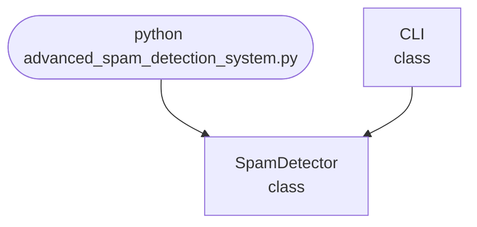

import FileCode from '../../../../components/FileCode.astro'

## Abstract
Advanced Spam Detection System is a Python project that uses machine learning to classify messages as spam or not spam. The application features text preprocessing, model training, and a CLI interface, demonstrating best practices in NLP and classification.

## Prerequisites
- Python 3.8 or above
- A code editor or IDE
- Basic understanding of NLP and machine learning
- Required libraries: `scikit-learn`, `nltk`, `pandas`

## Before you Start
Install Python and the required libraries:
```bash title="Install dependencies" showLineNumbers{1}
pip install scikit-learn nltk pandas
```

## Getting Started
#### Create a Project
1. Create a folder named `advanced-spam-detection-system`.
2. Open the folder in your code editor or IDE.
3. Create a file named `advanced_spam_detection_system.py`.
4. Copy the code below into your file.

## Write the Code
<FileCode file="projects/advance/advanced_spam_detection_system.py" lang="python" title="Advanced Spam Detection System" />

## Example Usage
```bash title="Run the spam detector" showLineNumbers{1}
python advanced_spam_detection_system.py
```

## How it fits together

Read from the top: this is what runs when you execute the file, and which function calls which. It is generated from the code, so it cannot drift from it.



## Explanation
### Key Features
- **Text Preprocessing:** Tokenization, stopword removal, and vectorization.
- **Model Training:** Uses Naive Bayes for classification.
- **Prediction:** Classifies new messages as spam or not spam.
- **Error Handling:** Validates inputs and manages exceptions.
- **CLI Interface:** Interactive command-line usage.

### Code Breakdown
1. **What it imports** (lines 12–13)
```python title="advanced_spam_detection_system.py" showLineNumbers startLineNumber=12
import sys
import random
```

2. **`SpamDetector` — the class** (lines 21–35)
```python title="advanced_spam_detection_system.py" showLineNumbers startLineNumber=21
class SpamDetector:
    def __init__(self):
        self.vectorizer = CountVectorizer() if CountVectorizer else None
        self.model = MultinomialNB() if MultinomialNB else None
        self.trained = False
    def train(self, texts, labels):
        if self.vectorizer and self.model:
            X = self.vectorizer.fit_transform(texts)
            self.model.fit(X, labels)
            self.trained = True
    def predict(self, text):
        if self.trained:
            X = self.vectorizer.transform([text])
            return self.model.predict(X)[0]
        return random.choice(['spam', 'ham'])
```

3. **`CLI` — the class** (lines 37–59)
```python title="advanced_spam_detection_system.py" showLineNumbers startLineNumber=37
class CLI:
    @staticmethod
    def run():
        print("Advanced Spam Detection System")
        detector = SpamDetector()
        # Dummy training data
        texts = ["Win money now!", "Hello friend", "Cheap meds", "Meeting at 10"]
        labels = ["spam", "ham", "spam", "ham"]
        detector.train(texts, labels)
        while True:
            cmd = input('> ')
            if cmd.startswith('check'):
                parts = cmd.split(maxsplit=1)
                if len(parts) < 2:
                    print("Usage: check <text>")
                    continue
                text = parts[1]
                result = detector.predict(text)
                print(f"Result: {result}")
            elif cmd == 'exit':
                break
            else:
                print("Unknown command. Type 'check <text>' or 'exit'.")
```

The file defines 2 top-level symbols in all; the whole thing is above under *Write the Code*.

## Features
- **Machine Learning-Based Classification:** High-accuracy spam detection
- **Modular Design:** Separate functions for preprocessing and prediction
- **Error Handling:** Manages invalid inputs and exceptions
- **Production-Ready:** Scalable and maintainable code

## Next Steps
Enhance the project by:
- Integrating with real-world datasets
- Adding support for more languages
- Creating a GUI with Tkinter or a web app with Flask
- Supporting batch predictions
- Adding evaluation metrics (precision, recall)
- Unit testing for reliability

## Educational Value
This project teaches:
- **NLP Fundamentals:** Text preprocessing and classification
- **Software Design:** Modular, maintainable code
- **Error Handling:** Writing robust Python code

## Real-World Applications
- **Email Filtering**
- **Messaging Apps**
- **Enterprise Security**
- **Educational Tools**

## Conclusion
Advanced Spam Detection System demonstrates how to build a scalable and accurate spam classifier using Python. With modular design and extensibility, this project can be adapted for real-world applications in email, messaging, and more. For more advanced projects, visit Python Central Hub.
