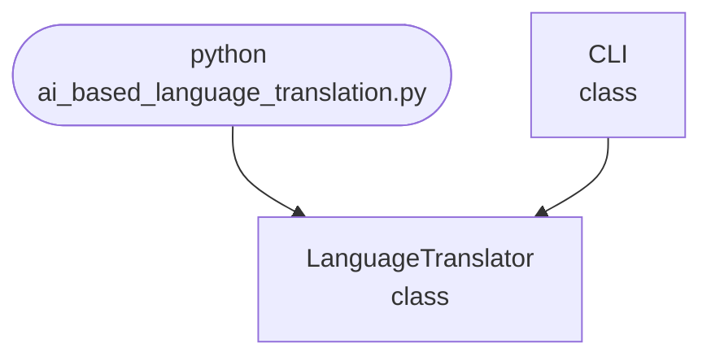

## Abstract
AI-based Language Translation is a Python project that uses AI to translate text between multiple languages. The application features multi-language support, error handling, and a CLI interface, demonstrating NLP and machine translation techniques.

## Prerequisites
- Python 3.8 or above
- A code editor or IDE
- Basic understanding of NLP and translation
- Required libraries: `googletrans`, `nltk`

## Before you Start
Install Python and the required libraries:
```bash title="Install dependencies" showLineNumbers{1}
pip install googletrans nltk
```

## Getting Started
#### Create a Project
1. Create a folder named `ai-based-language-translation`.
2. Open the folder in your code editor or IDE.
3. Create a file named `ai_based_language_translation.py`.
4. Copy the code below into your file.

## Write the Code
<FileCode file="projects/advance/ai_based_language_translation.py" lang="python" title="AI-based Language Translation" />

## Example Usage
```bash title="Run the translator" showLineNumbers{1}
python ai_based_language_translation.py
```

## How it fits together

Read from the top: this is what runs when you execute the file, and which function calls which. It is generated from the code, so it cannot drift from it.



## Explanation
### Key Features
- **Multi-Language Support:** Translates text between many languages.
- **AI-Based Translation:** Uses NLP and translation APIs.
- **Error Handling:** Validates inputs and manages exceptions.
- **CLI Interface:** Interactive command-line usage.

### Code Breakdown
1. **What it imports** (lines 12–12)
```python title="ai_based_language_translation.py" showLineNumbers startLineNumber=12
import sys
```

2. **`LanguageTranslator` — the class** (lines 18–24)
```python title="ai_based_language_translation.py" showLineNumbers startLineNumber=18
class LanguageTranslator:
    def __init__(self):
        self.translator = Translator() if Translator else None
    def translate(self, text, dest):
        if self.translator:
            return self.translator.translate(text, dest=dest).text
        return text
```

3. **`CLI` — the class** (lines 26–44)
```python title="ai_based_language_translation.py" showLineNumbers startLineNumber=26
class CLI:
    @staticmethod
    def run():
        print("AI-based Language Translation")
        translator = LanguageTranslator()
        while True:
            cmd = input('> ')
            if cmd.startswith('translate'):
                parts = cmd.split(maxsplit=2)
                if len(parts) < 3:
                    print("Usage: translate <dest_lang> <text>")
                    continue
                dest, text = parts[1], parts[2]
                result = translator.translate(text, dest)
                print(f"Translated: {result}")
            elif cmd == 'exit':
                break
            else:
                print("Unknown command. Type 'translate <dest_lang> <text>' or 'exit'.")
```

The file defines 2 top-level symbols in all; the whole thing is above under *Write the Code*.

## Features
- **AI-Based Translation:** High-accuracy multi-language support
- **Modular Design:** Separate functions for translation
- **Error Handling:** Manages invalid inputs and exceptions
- **Production-Ready:** Scalable and maintainable code

## Next Steps
Enhance the project by:
- Supporting batch translation
- Creating a GUI with Tkinter or a web app with Flask
- Adding language detection
- Supporting more translation APIs
- Unit testing for reliability

## Educational Value
This project teaches:
- **NLP Fundamentals:** Machine translation and language processing
- **Software Design:** Modular, maintainable code
- **Error Handling:** Writing robust Python code

## Real-World Applications
- **Language Learning Tools**
- **Global Communication**
- **Content Localization**
- **Educational Tools**

## Checkpoint exercise

This exercise practises dictionary translation plus a reordering rule, showing why word-by-word translation is not enough.

<DataCampExercise
  lang="python"
  hint={`Look each word up with the dict's .get(word, word) so unknown words pass through unchanged.`}
  code={`LEXICON = {"the": "la", "red": "rouge", "house": "maison", "big": "grande",
           "cat": "chat", "is": "est", "small": "petite"}
ADJECTIVES = {"rouge", "grande", "petite"}
NOUNS = {"maison", "chat"}

def word_by_word(sentence):
    return [___ for w in sentence.split()]

def reorder(words):
    out = list(words)
    for i in range(len(out) - 1):
        if out[i] in ADJECTIVES and out[i + 1] in NOUNS:
            out[i], out[i + 1] = out[i + 1], out[i]
    return out

for s in ["the red house", "the cat is small"]:
    raw = word_by_word(s)
    print(s, "->", " ".join(raw), "->", " ".join(reorder(raw)))`}
  solution={`LEXICON = {"the": "la", "red": "rouge", "house": "maison", "big": "grande",
           "cat": "chat", "is": "est", "small": "petite"}
ADJECTIVES = {"rouge", "grande", "petite"}
NOUNS = {"maison", "chat"}

def word_by_word(sentence):
    return [LEXICON.get(w, w) for w in sentence.split()]

def reorder(words):
    out = list(words)
    for i in range(len(out) - 1):
        if out[i] in ADJECTIVES and out[i + 1] in NOUNS:
            out[i], out[i + 1] = out[i + 1], out[i]
    return out

for s in ["the red house", "the cat is small"]:
    raw = word_by_word(s)
    print(s, "->", " ".join(raw), "->", " ".join(reorder(raw)))`}
  sct={`test_output_contains("the red house -> la rouge maison -> la maison rouge", pattern=False)
test_output_contains("the cat is small -> la chat est petite -> la chat est petite", pattern=False)
success_msg("Nice - you ran the key step of this project.")`}
  height={160}
/>

## Conclusion
AI-based Language Translation demonstrates how to build a scalable and accurate translation tool using Python. With modular design and extensibility, this project can be adapted for real-world applications in education, communication, and more. For more advanced projects, visit Python Central Hub.
