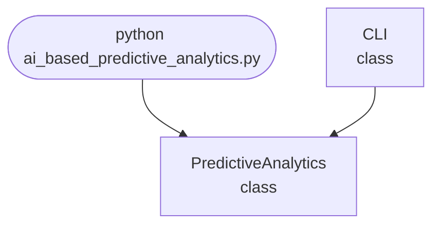

import FileCode from '../../../../components/FileCode.astro'

## Abstract
AI-based Predictive Analytics is a Python project that uses machine learning to predict future outcomes based on historical data. The application features data preprocessing, model training, and a CLI interface, demonstrating best practices in regression and forecasting.

## Prerequisites
- Python 3.8 or above
- A code editor or IDE
- Basic understanding of machine learning and regression
- Required libraries: `scikit-learn`, `numpy`, `pandas`, `matplotlib`

## Before you Start
Install Python and the required libraries:
```bash title="Install dependencies" showLineNumbers{1}
pip install scikit-learn numpy pandas matplotlib
```

## Getting Started
#### Create a Project
1. Create a folder named `ai-based-predictive-analytics`.
2. Open the folder in your code editor or IDE.
3. Create a file named `ai_based_predictive_analytics.py`.
4. Copy the code below into your file.

## Write the Code
<FileCode file="projects/advance/ai_based_predictive_analytics.py" lang="python" title="AI-based Predictive Analytics" />

## Example Usage
```bash title="Run predictive analytics" showLineNumbers{1}
python ai_based_predictive_analytics.py
```

## How it fits together

Read from the top: this is what runs when you execute the file, and which function calls which. It is generated from the code, so it cannot drift from it.



## Explanation
### Key Features
- **Data Preprocessing:** Cleans and prepares data for modeling.
- **Model Training:** Uses linear regression for prediction.
- **Forecasting:** Predicts future values based on input data.
- **Error Handling:** Validates inputs and manages exceptions.
- **CLI Interface:** Interactive command-line usage.

### Code Breakdown
1. **What it imports** (lines 11–12)
```python title="ai_based_predictive_analytics.py" showLineNumbers startLineNumber=11
import sys
import numpy as np
```

2. **`PredictiveAnalytics` — the class** (lines 20–42)
```python title="ai_based_predictive_analytics.py" showLineNumbers startLineNumber=20
class PredictiveAnalytics:
    def __init__(self):
        self.model = LinearRegression() if LinearRegression else None
        self.trained = False
    def train(self, X, y):
        if self.model:
            self.model.fit(X, y)
            self.trained = True
    def predict(self, X):
        if self.trained:
            return self.model.predict(X)
        return [np.mean(X)] * len(X)
    def plot(self, X, y):
        if plt:
            plt.scatter(X, y)
            plt.xlabel('Feature')
            plt.ylabel('Target')
            plt.title('Predictive Analytics')
            plt.savefig("ai_based_predictive_analytics.png", dpi=120, bbox_inches="tight")
            print("saved ai_based_predictive_analytics.png")
            plt.show()
        else:
            print("matplotlib not available.")
```

3. **`CLI` — the class** (lines 44–79)
```python title="ai_based_predictive_analytics.py" showLineNumbers startLineNumber=44
class CLI:
    @staticmethod
    def run():
        print("AI-based Predictive Analytics")
        analytics = PredictiveAnalytics()
        while True:
            cmd = input('> ')
            if cmd.startswith('train'):
                parts = cmd.split()
                if len(parts) < 3:
                    print("Usage: train <data_file> <labels_file>")
                    continue
                X = np.loadtxt(parts[1], delimiter=',').reshape(-1, 1)
                y = np.loadtxt(parts[2], delimiter=',')
                analytics.train(X, y)
                print("Model trained.")
            elif cmd.startswith('predict'):
                parts = cmd.split()
                # ... 12 more lines in the file ...
                y = np.loadtxt(parts[2], delimiter=',')
                analytics.plot(X, y)
            elif cmd == 'exit':
                break
            else:
                print("Unknown command")
```

The file defines 2 top-level symbols in all; the whole thing is above under *Write the Code*.

## Features
- **Machine Learning-Based Prediction:** High-accuracy forecasting
- **Modular Design:** Separate functions for preprocessing and prediction
- **Error Handling:** Manages invalid inputs and exceptions
- **Production-Ready:** Scalable and maintainable code

## Next Steps
Enhance the project by:
- Integrating with real-world datasets
- Adding support for more regression models
- Creating a GUI with Tkinter or a web app with Flask
- Supporting batch predictions
- Adding evaluation metrics (MAE, RMSE)
- Unit testing for reliability

## Educational Value
This project teaches:
- **Regression Fundamentals:** Data preprocessing and prediction
- **Software Design:** Modular, maintainable code
- **Error Handling:** Writing robust Python code

## Real-World Applications
- **Business Forecasting**
- **Financial Analysis**
- **Healthcare Analytics**
- **Educational Tools**

## Conclusion
AI-based Predictive Analytics demonstrates how to build a scalable and accurate forecasting tool using Python. With modular design and extensibility, this project can be adapted for real-world applications in business, healthcare, and more. For more advanced projects, visit Python Central Hub.
