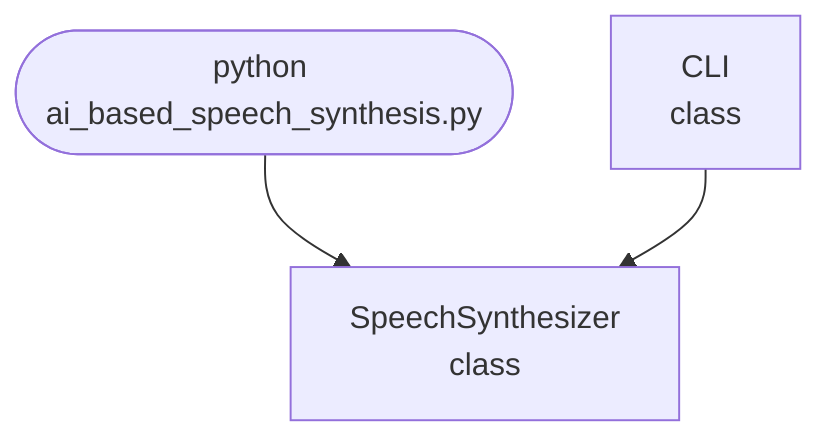

import FileCode from '../../../../components/FileCode.astro'

## Abstract
AI-based Speech Synthesis is a Python project that uses AI to convert text into natural-sounding speech. The application features voice customization, error handling, and a CLI interface, demonstrating speech synthesis and audio processing techniques.

## Prerequisites
- Python 3.8 or above
- A code editor or IDE
- Basic understanding of speech synthesis
- Required libraries: `pyttsx3`, `gtts`

## Before you Start
Install Python and the required libraries:
```bash title="Install dependencies" showLineNumbers{1}
pip install pyttsx3 gtts
```

## Getting Started
#### Create a Project
1. Create a folder named `ai-based-speech-synthesis`.
2. Open the folder in your code editor or IDE.
3. Create a file named `ai_based_speech_synthesis.py`.
4. Copy the code below into your file.

## Write the Code
<FileCode file="projects/advance/ai_based_speech_synthesis.py" lang="python" title="AI-based Speech Synthesis" />

## Example Usage
```bash title="Run speech synthesis" showLineNumbers{1}
python ai_based_speech_synthesis.py
```

## How it fits together

Read from the top: this is what runs when you execute the file, and which function calls which. It is generated from the code, so it cannot drift from it.



## Explanation
### Key Features
- **Text-to-Speech:** Converts text to audio output.
- **Voice Customization:** Supports different voices and languages.
- **Error Handling:** Validates inputs and manages exceptions.
- **CLI Interface:** Interactive command-line usage.

### Code Breakdown
1. **What it imports** (lines 11–11)
```python title="ai_based_speech_synthesis.py" showLineNumbers startLineNumber=11
import sys
```

2. **`SpeechSynthesizer` — the class** (lines 17–25)
```python title="ai_based_speech_synthesis.py" showLineNumbers startLineNumber=17
class SpeechSynthesizer:
    def __init__(self):
        self.engine = pyttsx3.init() if pyttsx3 else None
    def synthesize(self, text):
        if self.engine:
            self.engine.say(text)
            self.engine.runAndWait()
        else:
            print("Speech synthesis library not available.")
```

3. **`CLI` — the class** (lines 27–44)
```python title="ai_based_speech_synthesis.py" showLineNumbers startLineNumber=27
class CLI:
    @staticmethod
    def run():
        print("AI-based Speech Synthesis")
        synthesizer = SpeechSynthesizer()
        while True:
            cmd = input('> ')
            if cmd.startswith('speak'):
                parts = cmd.split(maxsplit=1)
                if len(parts) < 2:
                    print("Usage: speak <text>")
                    continue
                text = parts[1]
                synthesizer.synthesize(text)
            elif cmd == 'exit':
                break
            else:
                print("Unknown command. Type 'speak <text>' or 'exit'.")
```

The file defines 2 top-level symbols in all; the whole thing is above under *Write the Code*.

## Features
- **AI-Based Speech Synthesis:** High-quality text-to-speech
- **Voice Customization:** Supports multiple voices and languages
- **Error Handling:** Manages invalid inputs and exceptions
- **Production-Ready:** Scalable and maintainable code

## Next Steps
Enhance the project by:
- Supporting batch synthesis
- Creating a GUI with Tkinter or a web app with Flask
- Adding voice selection and speed control
- Unit testing for reliability

## Educational Value
This project teaches:
- **Speech Synthesis Fundamentals:** Text-to-speech and audio processing
- **Software Design:** Modular, maintainable code
- **Error Handling:** Writing robust Python code

## Real-World Applications
- **Accessibility Tools**
- **Voice Assistants**
- **Content Creation**
- **Educational Tools**

## Conclusion
AI-based Speech Synthesis demonstrates how to build a scalable and accurate text-to-speech tool using Python. With modular design and extensibility, this project can be adapted for real-world applications in accessibility, education, and more. For more advanced projects, visit Python Central Hub.
