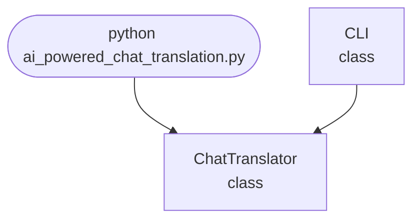

import FileCode from '../../../../components/FileCode.astro'

## Abstract
AI-powered Chat Translation is a Python project that uses AI to translate chat messages in real time. The application features multi-language support, error handling, and a CLI interface, demonstrating NLP and machine translation techniques.

## Prerequisites
- Python 3.8 or above
- A code editor or IDE
- Basic understanding of NLP and translation
- Required libraries: `googletrans`, `nltk`

## Before you Start
Install Python and the required libraries:
```bash title="Install dependencies" showLineNumbers{1}
pip install googletrans nltk
```

## Getting Started
#### Create a Project
1. Create a folder named `ai-powered-chat-translation`.
2. Open the folder in your code editor or IDE.
3. Create a file named `ai_powered_chat_translation.py`.
4. Copy the code below into your file.

## Write the Code
<FileCode file="projects/advance/ai_powered_chat_translation.py" lang="python" title="AI-powered Chat Translation" />

## Example Usage
```bash title="Run chat translation" showLineNumbers{1}
python ai_powered_chat_translation.py
```

## How it fits together

Read from the top: this is what runs when you execute the file, and which function calls which. It is generated from the code, so it cannot drift from it.



## Explanation
### Key Features
- **Real-Time Translation:** Translates chat messages instantly.
- **Multi-Language Support:** Supports many languages.
- **Error Handling:** Validates inputs and manages exceptions.
- **CLI Interface:** Interactive command-line usage.

### Code Breakdown
1. **What it imports** (lines 11–11)
```python title="ai_powered_chat_translation.py" showLineNumbers startLineNumber=11
import sys
```

2. **`ChatTranslator` — the class** (lines 17–23)
```python title="ai_powered_chat_translation.py" showLineNumbers startLineNumber=17
class ChatTranslator:
    def __init__(self):
        self.translator = Translator() if Translator else None
    def translate(self, text, dest='en'):
        if self.translator:
            return self.translator.translate(text, dest=dest).text
        return "Translation library not available."
```

3. **`CLI` — the class** (lines 25–44)
```python title="ai_powered_chat_translation.py" showLineNumbers startLineNumber=25
class CLI:
    @staticmethod
    def run():
        print("AI-powered Chat Translation")
        translator = ChatTranslator()
        while True:
            cmd = input('> ')
            if cmd.startswith('translate'):
                parts = cmd.split(maxsplit=2)
                if len(parts) < 3:
                    print("Usage: translate <text> <lang>")
                    continue
                text = parts[1]
                lang = parts[2]
                result = translator.translate(text, dest=lang)
                print(f"Translated: {result}")
            elif cmd == 'exit':
                break
            else:
                print("Unknown command. Type 'translate <text> <lang>' or 'exit'.")
```

The file defines 2 top-level symbols in all; the whole thing is above under *Write the Code*.

## Features
- **AI-Based Chat Translation:** High-accuracy real-time translation
- **Multi-Language Support:** Supports multiple languages
- **Error Handling:** Manages invalid inputs and exceptions
- **Production-Ready:** Scalable and maintainable code

## Next Steps
Enhance the project by:
- Supporting batch translation
- Creating a GUI with Tkinter or a web app with Flask
- Adding language detection
- Supporting more translation APIs
- Unit testing for reliability

## Educational Value
This project teaches:
- **NLP Fundamentals:** Machine translation and language processing
- **Software Design:** Modular, maintainable code
- **Error Handling:** Writing robust Python code

## Real-World Applications
- **Messaging Apps**
- **Global Communication**
- **Content Localization**
- **Educational Tools**

## Conclusion
AI-powered Chat Translation demonstrates how to build a scalable and accurate chat translation tool using Python. With modular design and extensibility, this project can be adapted for real-world applications in messaging, education, and more. For more advanced projects, visit Python Central Hub.
