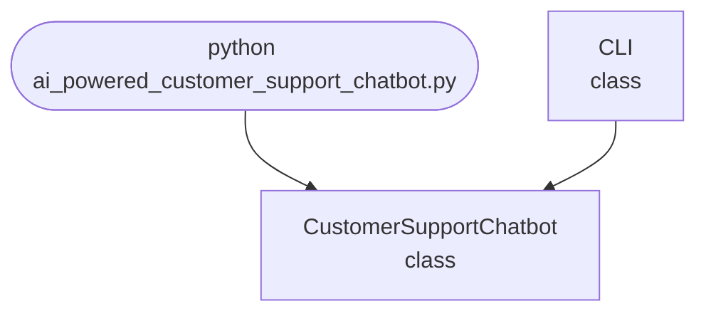

## Abstract
AI-powered Customer Support Chatbot is a Python project that uses AI to provide automated customer support. The application features intent recognition, context management, and a CLI interface, demonstrating NLP and dialogue management techniques.

## Prerequisites
- Python 3.8 or above
- A code editor or IDE
- Basic understanding of NLP and chatbot design
- Required libraries: `nltk`, `scikit-learn`

## Before you Start
Install Python and the required libraries:
```bash title="Install dependencies" showLineNumbers{1}
pip install nltk scikit-learn
```

## Getting Started
#### Create a Project
1. Create a folder named `ai-powered-customer-support-chatbot`.
2. Open the folder in your code editor or IDE.
3. Create a file named `ai_powered_customer_support_chatbot.py`.
4. Copy the code below into your file.

## Write the Code
<FileCode file="projects/advance/ai_powered_customer_support_chatbot.py" lang="python" title="AI-powered Customer Support Chatbot" />

## Example Usage
```bash title="Run customer support chatbot" showLineNumbers{1}
python ai_powered_customer_support_chatbot.py
```

## How it fits together

Read from the top: this is what runs when you execute the file, and which function calls which. It is generated from the code, so it cannot drift from it.



## Explanation
### Key Features
- **Intent Recognition:** Classifies user queries using NLP.
- **Context Management:** Tracks conversation state.
- **Dialogue Management:** Provides relevant responses.
- **Error Handling:** Validates inputs and manages exceptions.
- **CLI Interface:** Interactive command-line usage.

### Code Breakdown
1. **What it imports** (lines 11–11)
```python title="ai_powered_customer_support_chatbot.py" showLineNumbers startLineNumber=11
import sys
```

2. **`CustomerSupportChatbot` — the class** (lines 20–32)
```python title="ai_powered_customer_support_chatbot.py" showLineNumbers startLineNumber=20
class CustomerSupportChatbot:
    def __init__(self):
        self.pairs = [
            [r"(hi|hello|hey)", ["Hello! How can I help you today?"]],
            [r"(problem|issue)", ["Can you describe your problem in detail?"]],
            [r"(refund)", ["Refunds are processed within 5 business days."]],
            [r"(bye|exit)", ["Goodbye! Have a nice day."]],
        ]
        self.chat = Chat(self.pairs, reflections) if Chat else None
    def respond(self, text):
        if self.chat:
            return self.chat.respond(text)
        return "Chatbot library not available."
```

3. **`CLI` — the class** (lines 34–45)
```python title="ai_powered_customer_support_chatbot.py" showLineNumbers startLineNumber=34
class CLI:
    @staticmethod
    def run():
        print("AI-powered Customer Support Chatbot")
        bot = CustomerSupportChatbot()
        while True:
            cmd = input('> ')
            if cmd == 'exit':
                print("Goodbye!")
                break
            response = bot.respond(cmd)
            print(response)
```

The file defines 2 top-level symbols in all; the whole thing is above under *Write the Code*.

## Features
- **AI-Based Customer Support:** Automated responses and intent recognition
- **Context Management:** Tracks conversation state
- **Error Handling:** Manages invalid inputs and exceptions
- **Production-Ready:** Scalable and maintainable code

## Next Steps
Enhance the project by:
- Supporting more intents and responses
- Creating a GUI with Tkinter or a web app with Flask
- Integrating with external APIs
- Unit testing for reliability

## Educational Value
This project teaches:
- **NLP Fundamentals:** Intent recognition and dialogue management
- **Software Design:** Modular, maintainable code
- **Error Handling:** Writing robust Python code

## Real-World Applications
- **Customer Support Bots**
- **Virtual Assistants**
- **Automated Order Systems**
- **Educational Tools**

## Checkpoint exercise

This exercise practises TF-IDF retrieval of the best FAQ answer, the backbone of a support bot.

<DataCampExercise
  lang="python"
  hint={`IDF is log(number of documents / documents containing the word).`}
  code={`import math
from collections import Counter

faqs = {
    "reset password": "to reset your password open settings and choose reset",
    "refund policy": "refunds are available within thirty days of purchase",
    "delivery time": "delivery takes three to five working days",
}
docs = {k: (k + " " + v).split() for k, v in faqs.items()}
n = len(docs)
df = Counter(w for words in docs.values() for w in set(words))
idf = {w: ___ for w in df}

def score(query, words):
    counts = Counter(words)
    return sum(counts[w] * idf.get(w, 0) for w in query.lower().split())

for q in ["how do i reset my password", "when is delivery", "can i get a refund"]:
    best = max(docs, key=lambda k: score(q, docs[k]))
    print(f"{q!r} -> {best}")`}
  solution={`import math
from collections import Counter

faqs = {
    "reset password": "to reset your password open settings and choose reset",
    "refund policy": "refunds are available within thirty days of purchase",
    "delivery time": "delivery takes three to five working days",
}
docs = {k: (k + " " + v).split() for k, v in faqs.items()}
n = len(docs)
df = Counter(w for words in docs.values() for w in set(words))
idf = {w: math.log(n / df[w]) for w in df}

def score(query, words):
    counts = Counter(words)
    return sum(counts[w] * idf.get(w, 0) for w in query.lower().split())

for q in ["how do i reset my password", "when is delivery", "can i get a refund"]:
    best = max(docs, key=lambda k: score(q, docs[k]))
    print(f"{q!r} -> {best}")`}
  sct={`test_output_contains("'how do i reset my password' -> reset password", pattern=False)
test_output_contains("'when is delivery' -> delivery time", pattern=False)
test_output_contains("'can i get a refund' -> refund policy", pattern=False)
success_msg("Nice - you ran the key step of this project.")`}
  height={160}
/>

## Conclusion
AI-powered Customer Support Chatbot demonstrates how to build a scalable and accurate customer support tool using Python. With modular design and extensibility, this project can be adapted for real-world applications in support, automation, and more. For more advanced projects, visit Python Central Hub.
