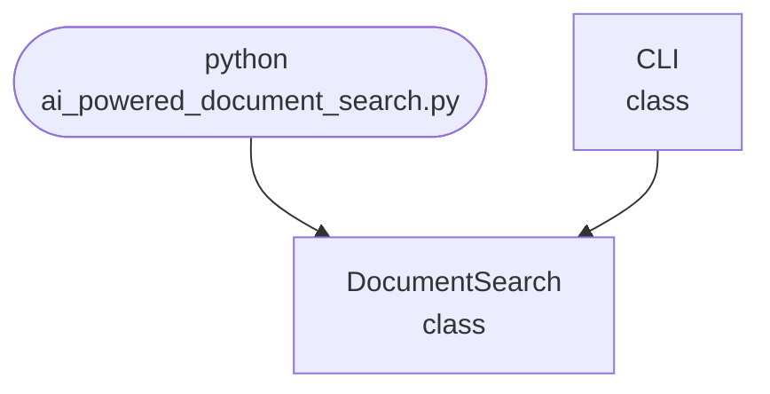

## Abstract
AI-powered Document Search is a Python project that uses AI to perform semantic search and ranking of documents. The application features NLP-based ranking, error handling, and a CLI interface, demonstrating information retrieval and text processing techniques.

## Prerequisites
- Python 3.8 or above
- A code editor or IDE
- Basic understanding of NLP and information retrieval
- Required libraries: `scikit-learn`, `numpy`, `pandas`

## Before you Start
Install Python and the required libraries:
```bash title="Install dependencies" showLineNumbers{1}
pip install scikit-learn numpy pandas
```

## Getting Started
#### Create a Project
1. Create a folder named `ai-powered-document-search`.
2. Open the folder in your code editor or IDE.
3. Create a file named `ai_powered_document_search.py`.
4. Copy the code below into your file.

## Write the Code
<FileCode file="projects/advance/ai_powered_document_search.py" lang="python" title="AI-powered Document Search" />

## Example Usage
```bash title="Run document search" showLineNumbers{1}
python ai_powered_document_search.py
```

## How it fits together

Read from the top: this is what runs when you execute the file, and which function calls which. It is generated from the code, so it cannot drift from it.



## Explanation
### Key Features
- **Semantic Search:** Uses NLP for document ranking.
- **Information Retrieval:** Finds relevant documents based on queries.
- **Error Handling:** Validates inputs and manages exceptions.
- **CLI Interface:** Interactive command-line usage.

### Code Breakdown
1. **What it imports** (lines 11–11)
```python title="ai_powered_document_search.py" showLineNumbers startLineNumber=11
import sys
```

2. **`DocumentSearch` — the class** (lines 19–34)
```python title="ai_powered_document_search.py" showLineNumbers startLineNumber=19
class DocumentSearch:
    def __init__(self):
        self.vectorizer = TfidfVectorizer() if TfidfVectorizer else None
        self.documents = []
        self.vectors = None
    def add_documents(self, docs):
        self.documents.extend(docs)
        if self.vectorizer:
            self.vectors = self.vectorizer.fit_transform(self.documents)
    def search(self, query):
        if self.vectorizer and self.vectors is not None:
            query_vec = self.vectorizer.transform([query])
            scores = cosine_similarity(query_vec, self.vectors).flatten()
            ranked = sorted(zip(self.documents, scores), key=lambda x: x[1], reverse=True)
            return ranked[:5]
        return []
```

3. **`CLI` — the class** (lines 36–63)
```python title="ai_powered_document_search.py" showLineNumbers startLineNumber=36
class CLI:
    @staticmethod
    def run():
        print("AI-powered Document Search")
        searcher = DocumentSearch()
        while True:
            cmd = input('> ')
            if cmd.startswith('add'):
                parts = cmd.split(maxsplit=1)
                if len(parts) < 2:
                    print("Usage: add <doc1|doc2|...>")
                    continue
                docs = parts[1].split('|')
                searcher.add_documents(docs)
                print(f"Added {len(docs)} documents.")
            elif cmd.startswith('search'):
                parts = cmd.split(maxsplit=1)
                if len(parts) < 2:
                # ... 4 more lines in the file ...
                for doc, score in results:
                    print(f"Score: {score:.2f} | Doc: {doc}")
            elif cmd == 'exit':
                break
            else:
                print("Unknown command")
```

The file defines 2 top-level symbols in all; the whole thing is above under *Write the Code*.

## Features
- **AI-Based Document Search:** High-accuracy semantic ranking
- **Modular Design:** Separate functions for search and ranking
- **Error Handling:** Manages invalid inputs and exceptions
- **Production-Ready:** Scalable and maintainable code

## Next Steps
Enhance the project by:
- Integrating with real-world document datasets
- Supporting batch search
- Creating a GUI with Tkinter or a web app with Flask
- Adding evaluation metrics (precision, recall)
- Unit testing for reliability

## Educational Value
This project teaches:
- **Information Retrieval:** Semantic search and ranking
- **Software Design:** Modular, maintainable code
- **Error Handling:** Writing robust Python code

## Real-World Applications
- **Enterprise Search Tools**
- **Content Management**
- **Educational Tools**

## Checkpoint exercise

This exercise practises building an inverted index and ranking documents for a query, the core of document search.

<DataCampExercise
  lang="python"
  hint={`Map each word to the set of document ids containing it, then count how many query words each document matches.`}
  code={`docs = {
    1: "python makes data analysis simple",
    2: "machine learning with python and numpy",
    3: "cooking pasta is simple",
    4: "data science and machine learning",
}

index = {}
for doc_id, text in docs.items():
    for word in text.split():
        index.setdefault(word, set()).add(___)

def search(query):
    scores = {}
    for word in query.split():
        for doc_id in index.get(word, set()):
            scores[doc_id] = scores.get(doc_id, 0) + 1
    return sorted(scores.items(), key=lambda kv: (-kv[1], kv[0]))

print("docs containing 'python':", sorted(index["python"]))
print("ranking for 'machine learning python':", search("machine learning python"))
print("ranking for 'simple data':", search("simple data"))`}
  solution={`docs = {
    1: "python makes data analysis simple",
    2: "machine learning with python and numpy",
    3: "cooking pasta is simple",
    4: "data science and machine learning",
}

index = {}
for doc_id, text in docs.items():
    for word in text.split():
        index.setdefault(word, set()).add(doc_id)

def search(query):
    scores = {}
    for word in query.split():
        for doc_id in index.get(word, set()):
            scores[doc_id] = scores.get(doc_id, 0) + 1
    return sorted(scores.items(), key=lambda kv: (-kv[1], kv[0]))

print("docs containing 'python':", sorted(index["python"]))
print("ranking for 'machine learning python':", search("machine learning python"))
print("ranking for 'simple data':", search("simple data"))`}
  sct={`test_output_contains("docs containing 'python': [1, 2]", pattern=False)
test_output_contains("ranking for 'machine learning python': [(2, 3), (4, 2), (1, 1)]", pattern=False)
test_output_contains("ranking for 'simple data': [(1, 2), (3, 1), (4, 1)]", pattern=False)
success_msg("Nice - you ran the key step of this project.")`}
  height={160}
/>

## Conclusion
AI-powered Document Search demonstrates how to build a scalable and accurate semantic search tool using Python. With modular design and extensibility, this project can be adapted for real-world applications in enterprise, education, and more. For more advanced projects, visit Python Central Hub.
