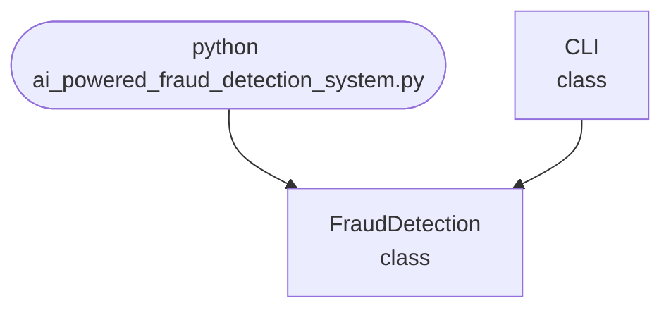

## Abstract
AI-powered Fraud Detection System is a Python project that uses AI to detect fraudulent activities. The application features anomaly detection, model training, and a CLI interface, demonstrating best practices in security analytics and machine learning.

## Prerequisites
- Python 3.8 or above
- A code editor or IDE
- Basic understanding of machine learning and anomaly detection
- Required libraries: `scikit-learn`, `numpy`, `pandas`

## Before you Start
Install Python and the required libraries:
```bash title="Install dependencies" showLineNumbers{1}
pip install scikit-learn numpy pandas
```

## Getting Started
#### Create a Project
1. Create a folder named `ai-powered-fraud-detection-system`.
2. Open the folder in your code editor or IDE.
3. Create a file named `ai_powered_fraud_detection_system.py`.
4. Copy the code below into your file.

## Write the Code
<FileCode file="projects/advance/ai_powered_fraud_detection_system.py" lang="python" title="AI-powered Fraud Detection System" />

## Example Usage
```bash title="Run fraud detection" showLineNumbers{1}
python ai_powered_fraud_detection_system.py
```

## How it fits together

Read from the top: this is what runs when you execute the file, and which function calls which. It is generated from the code, so it cannot drift from it.



## Explanation
### Key Features
- **Anomaly Detection:** Identifies unusual patterns in data.
- **Model Training:** Uses machine learning for fraud detection.
- **Prediction:** Flags potential fraud cases.
- **Error Handling:** Validates inputs and manages exceptions.
- **CLI Interface:** Interactive command-line usage.

### Code Breakdown
1. **What it imports** (lines 12–13)
```python title="ai_powered_fraud_detection_system.py" showLineNumbers startLineNumber=12
import sys
import numpy as np
```

2. **`FraudDetection` — the class** (lines 19–30)
```python title="ai_powered_fraud_detection_system.py" showLineNumbers startLineNumber=19
class FraudDetection:
    def __init__(self):
        self.model = IsolationForest() if IsolationForest else None
        self.trained = False
    def train(self, X):
        if self.model:
            self.model.fit(X)
            self.trained = True
    def predict(self, X):
        if self.trained:
            return self.model.predict(X)
        return [1] * len(X)
```

3. **`CLI` — the class** (lines 32–59)
```python title="ai_powered_fraud_detection_system.py" showLineNumbers startLineNumber=32
class CLI:
    @staticmethod
    def run():
        print("AI-powered Fraud Detection System")
        print("Commands: train <data_file>, predict <data_file>, exit")
        detector = FraudDetection()
        while True:
            cmd = input('> ')
            if cmd.startswith('train'):
                parts = cmd.split()
                if len(parts) < 2:
                    print("Usage: train <data_file>")
                    continue
                X = np.loadtxt(parts[1], delimiter=',')
                detector.train(X)
                print("Model trained.")
            elif cmd.startswith('predict'):
                parts = cmd.split()
                # ... 4 more lines in the file ...
                preds = detector.predict(X)
                print(f"Predictions: {preds}")
            elif cmd == 'exit':
                break
            else:
                print("Unknown command")
```

The file defines 2 top-level symbols in all; the whole thing is above under *Write the Code*.

## Features
- **AI-Based Fraud Detection:** High-accuracy anomaly detection
- **Modular Design:** Separate functions for detection and prediction
- **Error Handling:** Manages invalid inputs and exceptions
- **Production-Ready:** Scalable and maintainable code

## Next Steps
Enhance the project by:
- Integrating with real-world fraud datasets
- Supporting batch detection
- Creating a GUI with Tkinter or a web app with Flask
- Adding evaluation metrics (precision, recall)
- Unit testing for reliability

## Educational Value
This project teaches:
- **Security Analytics:** Anomaly detection and prediction
- **Software Design:** Modular, maintainable code
- **Error Handling:** Writing robust Python code

## Real-World Applications
- **Financial Fraud Detection**
- **Security Analytics**
- **Enterprise Risk Management**
- **Educational Tools**

## Checkpoint exercise

This exercise practises z-score screening plus precision and recall, the first line of defence in fraud detection.

<DataCampExercise
  lang="python"
  hint={`A z-score is (amount - mean) / standard deviation of the normal history.`}
  code={`import numpy as np

history = np.array([20, 35, 18, 42, 30, 25, 38, 28, 33, 27], dtype=float)
mean, std = history.mean(), history.std()

new = np.array([31, 29, 400, 22, 150, 36])
is_fraud = np.array([0, 0, 1, 0, 1, 0])

z = ___
flagged = np.abs(z) > 3
print("z-scores:", np.round(z, 1))
print("flagged:", np.nonzero(flagged)[0].tolist())

tp = int((flagged & (is_fraud == 1)).sum())
fp = int((flagged & (is_fraud == 0)).sum())
fn = int((~flagged & (is_fraud == 1)).sum())
print(f"precision {tp / (tp + fp):.2f}, recall {tp / (tp + fn):.2f}")`}
  solution={`import numpy as np

history = np.array([20, 35, 18, 42, 30, 25, 38, 28, 33, 27], dtype=float)
mean, std = history.mean(), history.std()

new = np.array([31, 29, 400, 22, 150, 36])
is_fraud = np.array([0, 0, 1, 0, 1, 0])

z = (new - mean) / std
flagged = np.abs(z) > 3
print("z-scores:", np.round(z, 1))
print("flagged:", np.nonzero(flagged)[0].tolist())

tp = int((flagged & (is_fraud == 1)).sum())
fp = int((flagged & (is_fraud == 0)).sum())
fn = int((~flagged & (is_fraud == 1)).sum())
print(f"precision {tp / (tp + fp):.2f}, recall {tp / (tp + fn):.2f}")`}
  sct={`test_output_contains("z-scores: [ 0.2 -0.1 51.2 -1.1 16.7  0.9]", pattern=False)
test_output_contains("flagged: [2, 4]", pattern=False)
test_output_contains("precision 1.00, recall 1.00", pattern=False)
success_msg("Nice - you ran the key step of this project.")`}
  height={160}
/>

## Conclusion
AI-powered Fraud Detection System demonstrates how to build a scalable and accurate fraud detection tool using Python. With modular design and extensibility, this project can be adapted for real-world applications in finance, security, and more. For more advanced projects, visit Python Central Hub.
