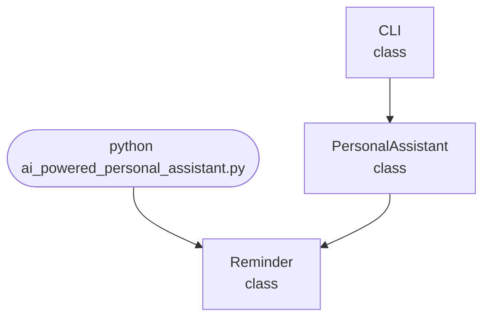

## Abstract
AI-powered Personal Assistant is a Python project that uses AI to automate tasks and respond to voice commands. The application features task automation, voice recognition, and a CLI interface, demonstrating best practices in assistant design and automation.

## Prerequisites
- Python 3.8 or above
- A code editor or IDE
- Basic understanding of automation and voice recognition
- Required libraries: `speechrecognition`, `pyttsx3`, `datetime`, `os`

## Before you Start
Install Python and the required libraries:
```bash title="Install dependencies" showLineNumbers{1}
pip install SpeechRecognition pyttsx3
```

## Getting Started
#### Create a Project
1. Create a folder named `ai-powered-personal-assistant`.
2. Open the folder in your code editor or IDE.
3. Create a file named `ai_powered_personal_assistant.py`.
4. Copy the code below into your file.

## Write the Code
<FileCode file="projects/advance/ai_powered_personal_assistant.py" lang="python" title="AI-powered Personal Assistant" />

## Example Usage
```bash title="Run personal assistant" showLineNumbers{1}
python ai_powered_personal_assistant.py
```

## How it fits together

Read from the top: this is what runs when you execute the file, and which function calls which. It is generated from the code, so it cannot drift from it.



## Explanation
### Key Features
- **Task Automation:** Automates common tasks (e.g., reminders, opening apps).
- **Voice Commands:** Responds to spoken instructions.
- **Error Handling:** Validates inputs and manages exceptions.
- **CLI Interface:** Interactive command-line usage.

### Code Breakdown
1. **What it imports** (lines 12–17)
```python title="ai_powered_personal_assistant.py" showLineNumbers startLineNumber=12
import sys
import datetime
import threading
import time
import re
from collections import defaultdict
```

2. **`Reminder` — the class** (lines 25–29)
```python title="ai_powered_personal_assistant.py" showLineNumbers startLineNumber=25
class Reminder:
    def __init__(self, time, message):
        self.time = time
        self.message = message
        self.triggered = False
```

3. **`PersonalAssistant` — the class** (lines 31–91)
```python title="ai_powered_personal_assistant.py" showLineNumbers startLineNumber=31
class PersonalAssistant:
    def __init__(self):
        self.reminders = []
        self.schedule = defaultdict(list)
        self.running = True
        self.thread = threading.Thread(target=self.check_reminders, daemon=True)
        self.thread.start()

    def add_reminder(self, time_str, message):
        try:
            t = datetime.datetime.strptime(time_str, '%Y-%m-%d %H:%M')
            self.reminders.append(Reminder(t, message))
            print(f"Reminder set for {t}: {message}")
        except Exception as e:
            print(f"Error: {e}")

    def add_schedule(self, date_str, event):
        self.schedule[date_str].append(event)
        # ... 37 more lines in the file ...
        elif cmd == 'exit':
            self.running = False
            print("Goodbye!")
            sys.exit(0)
        else:
            print("Unknown command.")
```

4. **`CLI` — the class** (lines 93–105)
```python title="ai_powered_personal_assistant.py" showLineNumbers startLineNumber=93
class CLI:
    @staticmethod
    def run():
        pa = PersonalAssistant()
        print("AI Powered Personal Assistant")
        print("Commands:")
        print("- remind me at YYYY-MM-DD HH:MM to <message>")
        print("- schedule <event> on YYYY-MM-DD")
        print("- show schedule for YYYY-MM-DD")
        print("- exit")
        while pa.running:
            cmd = input('> ')
            pa.parse_command(cmd)
```

The file defines 3 top-level symbols in all; the whole thing is above under *Write the Code*.

## Features
- **AI-Based Personal Assistant:** Automates tasks and responds to voice commands
- **Task Automation:** Handles reminders, app launching, and more
- **Error Handling:** Manages invalid inputs and exceptions
- **Production-Ready:** Scalable and maintainable code

## Next Steps
Enhance the project by:
- Supporting more tasks and integrations
- Creating a GUI with Tkinter or a web app with Flask
- Adding natural language understanding
- Unit testing for reliability

## Educational Value
This project teaches:
- **Assistant Design:** Task automation and voice recognition
- **Software Design:** Modular, maintainable code
- **Error Handling:** Writing robust Python code

## Real-World Applications
- **Personal Productivity Tools**
- **Smart Home Assistants**
- **Educational Tools**

## Checkpoint exercise

This exercise practises parsing a command into an intent and slots with regular expressions, the front door of an assistant.

<DataCampExercise
  lang="python"
  hint={`Use re.match(pattern, text) and read the captured groups with m.group(1).`}
  code={`import re

PATTERNS = [
    ("set_timer", r"set a timer for (\\d+) (seconds|minutes)"),
    ("weather", r"what is the weather in ([a-z ]+)"),
    ("remind", r"remind me to (.+) at (\\d{1,2}(?:am|pm))"),
]

def parse(text):
    for intent, pattern in PATTERNS:
        m = ___
        if m:
            return intent, m.groups()
    return "unknown", ()

for cmd in ["Set a timer for 10 minutes", "What is the weather in New York",
            "Remind me to call mom at 6pm", "sing a song"]:
    print(parse(cmd))`}
  solution={`import re

PATTERNS = [
    ("set_timer", r"set a timer for (\\d+) (seconds|minutes)"),
    ("weather", r"what is the weather in ([a-z ]+)"),
    ("remind", r"remind me to (.+) at (\\d{1,2}(?:am|pm))"),
]

def parse(text):
    for intent, pattern in PATTERNS:
        m = re.match(pattern, text.lower())
        if m:
            return intent, m.groups()
    return "unknown", ()

for cmd in ["Set a timer for 10 minutes", "What is the weather in New York",
            "Remind me to call mom at 6pm", "sing a song"]:
    print(parse(cmd))`}
  sct={`test_output_contains("('set_timer', ('10', 'minutes'))", pattern=False)
test_output_contains("('remind', ('call mom', '6pm'))", pattern=False)
test_output_contains("('unknown', ())", pattern=False)
success_msg("Nice - you ran the key step of this project.")`}
  height={160}
/>

## Conclusion
AI-powered Personal Assistant demonstrates how to build a scalable and accurate assistant tool using Python. With modular design and extensibility, this project can be adapted for real-world applications in productivity, automation, and more. For more advanced projects, visit Python Central Hub.
