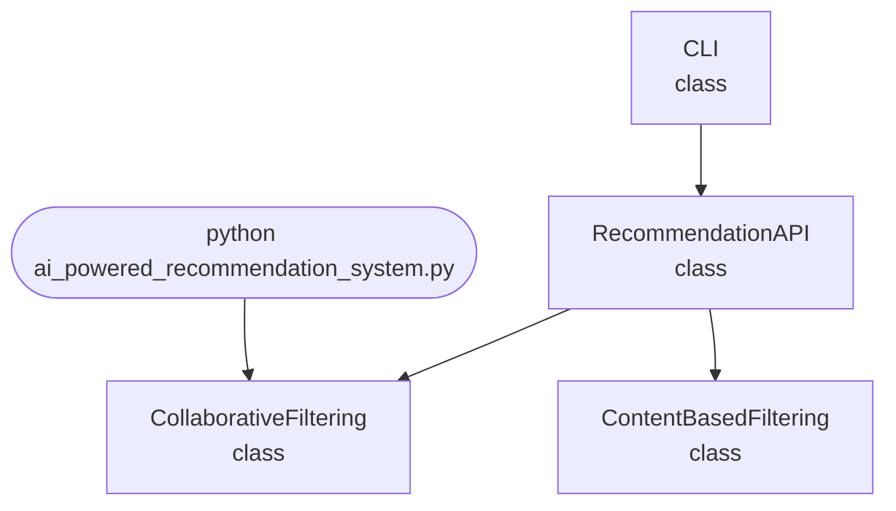

import FileCode from '../../../../components/FileCode.astro'

## Abstract
AI-powered Recommendation System is a Python project that uses AI to suggest items to users. The application features collaborative filtering, content-based methods, and a CLI interface, demonstrating best practices in recommender systems and machine learning.

## Prerequisites
- Python 3.8 or above
- A code editor or IDE
- Basic understanding of recommender systems and machine learning
- Required libraries: `scikit-learn`, `numpy`, `pandas`

## Before you Start
Install Python and the required libraries:
```bash title="Install dependencies" showLineNumbers{1}
pip install scikit-learn numpy pandas
```

## Getting Started
#### Create a Project
1. Create a folder named `ai-powered-recommendation-system`.
2. Open the folder in your code editor or IDE.
3. Create a file named `ai_powered_recommendation_system.py`.
4. Copy the code below into your file.

## Write the Code
<FileCode file="projects/advance/ai_powered_recommendation_system.py" lang="python" title="AI-powered Recommendation System" />

## Example Usage
```bash title="Run recommendation system" showLineNumbers{1}
python ai_powered_recommendation_system.py
```

## How it fits together

Read from the top: this is what runs when you execute the file, and which function calls which. It is generated from the code, so it cannot drift from it.



## Explanation
### Key Features
- **Collaborative Filtering:** Suggests items based on user similarity.
- **Content-Based Filtering:** Recommends items based on item features.
- **Hybrid Approach:** Combines both methods for improved accuracy.
- **Error Handling:** Validates inputs and manages exceptions.
- **CLI Interface:** Interactive command-line usage.

### Code Breakdown
1. **What it imports** (lines 11–15)
```python title="ai_powered_recommendation_system.py" showLineNumbers startLineNumber=11
import numpy as np
import pandas as pd
from flask import Flask, request, jsonify
import sys
import threading
```

2. **`CollaborativeFiltering` — the class** (lines 17–29)
```python title="ai_powered_recommendation_system.py" showLineNumbers startLineNumber=17
class CollaborativeFiltering:
    def __init__(self, ratings):
        self.ratings = ratings
        self.user_means = ratings.mean(axis=1)

    def predict(self, user, item):
        if item not in self.ratings.columns or user not in self.ratings.index:
            return None
        sim = self.ratings.corrwith(self.ratings[item])
        sim = sim.dropna()
        user_ratings = self.ratings.loc[user]
        weighted_sum = np.dot(sim, user_ratings)
        return weighted_sum / sim.sum() if sim.sum() != 0 else self.user_means[user]
```

3. **`ContentBasedFiltering` — the class** (lines 31–39)
```python title="ai_powered_recommendation_system.py" showLineNumbers startLineNumber=31
class ContentBasedFiltering:
    def __init__(self, items, features):
        self.items = items
        self.features = features

    def recommend(self, user_profile):
        scores = np.dot(self.features, user_profile)
        idx = np.argsort(scores)[::-1]
        return [self.items[i] for i in idx[:5]]
```

4. **`RecommendationAPI` — the class** (lines 41–65)
```python title="ai_powered_recommendation_system.py" showLineNumbers startLineNumber=41
class RecommendationAPI:
    def __init__(self, ratings, items, features):
        self.cf = CollaborativeFiltering(ratings)
        self.cb = ContentBasedFiltering(items, features)
        self.app = Flask(__name__)
        self.setup_routes()

    def setup_routes(self):
        @self.app.route('/predict', methods=['POST'])
        def predict():
            data = request.json
            user = data.get('user')
            item = data.get('item')
            pred = self.cf.predict(user, item)
            return jsonify({'prediction': pred})

        @self.app.route('/recommend', methods=['POST'])
        def recommend():
            data = request.json
            user_profile = np.array(data.get('profile'))
            recs = self.cb.recommend(user_profile)
            return jsonify({'recommendations': recs})

    def run(self):
        self.app.run(debug=True)
```

5. **`CLI` — the class** (lines 67–75)
```python title="ai_powered_recommendation_system.py" showLineNumbers startLineNumber=67
class CLI:
    @staticmethod
    def run():
        ratings = pd.DataFrame(np.random.randint(1, 6, (10, 10)), columns=[f'item{i}' for i in range(10)], index=[f'user{j}' for j in range(10)])
        items = [f'item{i}' for i in range(10)]
        features = np.random.rand(10, 5)
        api = RecommendationAPI(ratings, items, features)
        print("Starting Recommendation API on http://127.0.0.1:5000 ...")
        api.run()
```

The file defines 4 top-level symbols in all; the whole thing is above under *Write the Code*.

## Features
- **AI-Based Recommendation Engine:** High-accuracy suggestions
- **Hybrid Approach:** Combines collaborative and content-based methods
- **Error Handling:** Manages invalid inputs and exceptions
- **Production-Ready:** Scalable and maintainable code

## Next Steps
Enhance the project by:
- Integrating with real-world datasets
- Supporting batch recommendations
- Creating a GUI with Tkinter or a web app with Flask
- Adding evaluation metrics (precision, recall)
- Unit testing for reliability

## Educational Value
This project teaches:
- **Recommender System Fundamentals:** Collaborative and content-based filtering
- **Software Design:** Modular, maintainable code
- **Error Handling:** Writing robust Python code

## Real-World Applications
- **E-commerce Product Recommendations**
- **Content Streaming Platforms**
- **Social Media Feeds**
- **Educational Tools**

## Conclusion
AI-powered Recommendation System demonstrates how to build a scalable and accurate recommendation engine using Python. With modular design and extensibility, this project can be adapted for real-world applications in e-commerce, media, and more. For more advanced projects, visit Python Central Hub.
