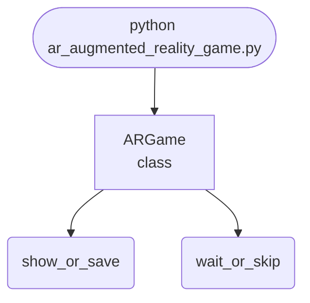

## Abstract
AR (Augmented Reality) Game is a Python project that uses computer vision to create interactive augmented reality experiences. The application features object tracking, game logic, and a CLI interface, demonstrating best practices in AR development and computer vision.

## Prerequisites
- Python 3.8 or above
- A code editor or IDE
- Basic understanding of computer vision and AR
- Required libraries: `opencv-python`, `numpy`

## Before you Start
Install Python and the required libraries:
```bash title="Install dependencies" showLineNumbers{1}
pip install opencv-python numpy
```

## Getting Started
#### Create a Project
1. Create a folder named `ar-augmented-reality-game`.
2. Open the folder in your code editor or IDE.
3. Create a file named `ar_augmented_reality_game.py`.
4. Copy the code below into your file.

## Write the Code
<FileCode file="projects/advance/ar_augmented_reality_game.py" lang="python" title="AR (Augmented Reality) Game" />

## Example Usage
```bash title="Run AR game" showLineNumbers{1}
python ar_augmented_reality_game.py
```

## How it fits together

Read from the top: this is what runs when you execute the file, and which function calls which. It is generated from the code, so it cannot drift from it.



## Explanation
### Key Features
- **Object Tracking:** Uses computer vision for AR interaction.
- **Game Logic:** Implements interactive AR gameplay.
- **Error Handling:** Validates inputs and manages exceptions.
- **CLI Interface:** Interactive command-line usage.

### Code Breakdown
1. **What it imports** (lines 11–14)
```python title="ar_augmented_reality_game.py" showLineNumbers startLineNumber=11
import cv2
import numpy as np
import sys
import random
```

2. **`ARGame` — the class** (lines 16–47)
```python title="ar_augmented_reality_game.py" showLineNumbers startLineNumber=16
class ARGame:
    def __init__(self):
        self.marker_color = (0,255,0)
        self.score = 0
    def detect_marker(self, frame):
        hsv = cv2.cvtColor(frame, cv2.COLOR_BGR2HSV)
        lower = np.array([40, 40, 40])
        upper = np.array([80, 255, 255])
        mask = cv2.inRange(hsv, lower, upper)
        cnts, _ = cv2.findContours(mask, cv2.RETR_EXTERNAL, cv2.CHAIN_APPROX_SIMPLE)
        if cnts:
            c = max(cnts, key=cv2.contourArea)
            x, y, w, h = cv2.boundingRect(c)
            return (x, y, w, h)
        return None
    def play(self):
        cap = cv2.VideoCapture(0)
        while True:
                # ... 8 more lines in the file ...
                cv2.putText(frame, f"Score: {self.score}", (10,30), cv2.FONT_HERSHEY_SIMPLEX, 1, (255,0,0), 2)
            cv2.imshow('AR Game', frame)
            if cv2.waitKey(1) & 0xFF == ord('q'):
                break
        cap.release()
        cv2.destroyAllWindows()
```

The file defines 1 top-level symbol in all; the whole thing is above under *Write the Code*.

## Features
- **AR Game Development:** Interactive augmented reality gameplay
- **Object Tracking:** Uses computer vision for AR
- **Error Handling:** Manages invalid inputs and exceptions
- **Production-Ready:** Scalable and maintainable code

## Next Steps
Enhance the project by:
- Supporting more AR interactions
- Creating a GUI with Tkinter or a web app with Flask
- Adding game levels and scoring
- Unit testing for reliability

## Educational Value
This project teaches:
- **AR Development:** Object tracking and game logic
- **Software Design:** Modular, maintainable code
- **Error Handling:** Writing robust Python code

## Real-World Applications
- **AR Games**
- **Educational Tools**
- **Interactive Media**

## Checkpoint exercise

This exercise practises projecting 3D points to screen pixels with a pinhole camera, the maths behind placing AR objects.

<DataCampExercise
  lang="python"
  hint={`Pixel x = fx * X / Z + cx, and pixel y = fy * Y / Z + cy.`}
  code={`import numpy as np

fx = fy = 800.0
cx, cy = 320.0, 240.0

points = np.array([
    [0.0, 0.0, 2.0],
    [0.5, 0.25, 2.0],
    [0.5, 0.25, 4.0],
    [-0.5, -0.25, 4.0],
])

def project(p):
    X, Y, Z = p
    u = ___
    v = fy * Y / Z + cy
    return round(u, 1), round(v, 1)

for p in points:
    print(p.tolist(), "->", project(p))`}
  solution={`import numpy as np

fx = fy = 800.0
cx, cy = 320.0, 240.0

points = np.array([
    [0.0, 0.0, 2.0],
    [0.5, 0.25, 2.0],
    [0.5, 0.25, 4.0],
    [-0.5, -0.25, 4.0],
])

def project(p):
    X, Y, Z = p
    u = fx * X / Z + cx
    v = fy * Y / Z + cy
    return round(u, 1), round(v, 1)

for p in points:
    print(p.tolist(), "->", project(p))`}
  sct={`test_output_contains("[0.0, 0.0, 2.0] -> (np.float64(320.0), np.float64(240.0))", pattern=False)
test_output_contains("[0.5, 0.25, 4.0] -> (np.float64(420.0), np.float64(290.0))", pattern=False)
test_output_contains("[-0.5, -0.25, 4.0] -> (np.float64(220.0), np.float64(190.0))", pattern=False)
success_msg("Nice - you ran the key step of this project.")`}
  height={160}
/>

## Conclusion
AR (Augmented Reality) Game demonstrates how to build a scalable and interactive AR game using Python. With modular design and extensibility, this project can be adapted for real-world applications in gaming, education, and more. For more advanced projects, visit Python Central Hub.
