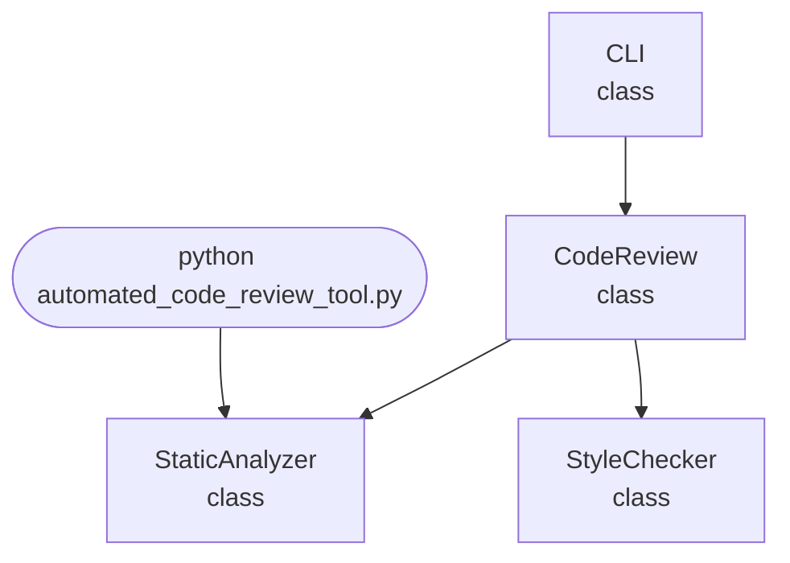

import FileCode from '../../../../components/FileCode.astro'

## Abstract
Automated Code Review Tool is a Python project that performs automated code reviews. The application features static analysis, style checking, and a CLI interface, demonstrating best practices in code quality and automation.

## Prerequisites
- Python 3.8 or above
- A code editor or IDE
- Basic understanding of code quality and static analysis
- Required libraries: `flake8`, `pylint`

## Before you Start
Install Python and the required libraries:
```bash title="Install dependencies" showLineNumbers{1}
pip install flake8 pylint
```

## Getting Started
#### Create a Project
1. Create a folder named `automated-code-review-tool`.
2. Open the folder in your code editor or IDE.
3. Create a file named `automated_code_review_tool.py`.
4. Copy the code below into your file.

## Write the Code
<FileCode file="projects/advance/automated_code_review_tool.py" lang="python" title="Automated Code Review Tool" />

## Example Usage
```bash title="Run code review tool" showLineNumbers{1}
python automated_code_review_tool.py
```

## How it fits together

Read from the top: this is what runs when you execute the file, and which function calls which. It is generated from the code, so it cannot drift from it.



## Explanation
### Key Features
- **Static Analysis:** Checks code for errors and best practices.
- **Style Checking:** Ensures code style compliance.
- **Error Handling:** Validates inputs and manages exceptions.
- **CLI Interface:** Interactive command-line usage.

### Code Breakdown
1. **What it imports** (lines 12–15)
```python title="automated_code_review_tool.py" showLineNumbers startLineNumber=12
import sys
import os
import re
from collections import defaultdict
```

2. **`StaticAnalyzer` — the class** (lines 17–28)
```python title="automated_code_review_tool.py" showLineNumbers startLineNumber=17
class StaticAnalyzer:
    def __init__(self):
        pass
    def analyze(self, file_path):
        with open(file_path, 'r') as f:
            code = f.read()
        issues = []
        if 'import *' in code:
            issues.append('Wildcard import detected')
        if len(code.split('\n')) > 500:
            issues.append('File too long')
        return issues
```

3. **`StyleChecker` — the class** (lines 30–42)
```python title="automated_code_review_tool.py" showLineNumbers startLineNumber=30
class StyleChecker:
    def __init__(self):
        pass
    def check(self, file_path):
        with open(file_path, 'r') as f:
            lines = f.readlines()
        issues = []
        for i, line in enumerate(lines):
            if len(line) > 80:
                issues.append(f'Line {i+1} too long')
            if '\t' in line:
                issues.append(f'Line {i+1} contains tab')
        return issues
```

4. **`CodeReview` — the class** (lines 44–58)
```python title="automated_code_review_tool.py" showLineNumbers startLineNumber=44
class CodeReview:
    def __init__(self):
        self.analyzer = StaticAnalyzer()
        self.style = StyleChecker()
    def review(self, file_path):
        issues = self.analyzer.analyze(file_path)
        issues += self.style.check(file_path)
        return issues
    def report(self, file_path):
        issues = self.review(file_path)
        print(f"Code Review Report for {file_path}:")
        for issue in issues:
            print(f"- {issue}")
        if not issues:
            print("No issues found.")
```

5. **`CLI` — the class** (lines 60–77)
```python title="automated_code_review_tool.py" showLineNumbers startLineNumber=60
class CLI:
    @staticmethod
    def run():
        print("Automated Code Review Tool")
        while True:
            cmd = input('> ')
            if cmd.startswith('review'):
                parts = cmd.split()
                if len(parts) < 2:
                    print("Usage: review <file_path>")
                    continue
                file_path = parts[1]
                cr = CodeReview()
                cr.report(file_path)
            elif cmd == 'exit':
                break
            else:
                print("Unknown command")
```

The file defines 4 top-level symbols in all; the whole thing is above under *Write the Code*.

## Features
- **Automated Code Review:** Static analysis and style checking
- **Modular Design:** Separate functions for each tool
- **Error Handling:** Manages invalid inputs and exceptions
- **Production-Ready:** Scalable and maintainable code

## Next Steps
Enhance the project by:
- Supporting batch review of multiple files
- Creating a GUI with Tkinter or a web app with Flask
- Adding custom linting rules
- Unit testing for reliability

## Educational Value
This project teaches:
- **Code Quality:** Static analysis and style checking
- **Software Design:** Modular, maintainable code
- **Error Handling:** Writing robust Python code

## Real-World Applications
- **Continuous Integration**
- **Code Quality Assurance**
- **Educational Tools**

## Conclusion
Automated Code Review Tool demonstrates how to build a scalable and accurate code review tool using Python. With modular design and extensibility, this project can be adapted for real-world applications in CI/CD, education, and more. For more advanced projects, visit Python Central Hub.
