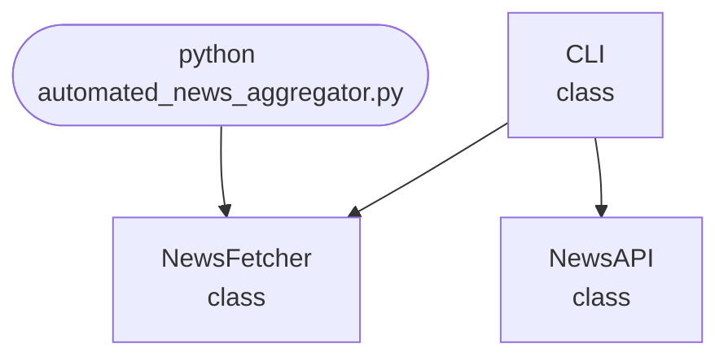

import FileCode from '../../../../components/FileCode.astro'

## Abstract
Automated News Aggregator is a Python project that uses AI to collect and summarize news articles. The application features web scraping, summarization, and a CLI interface, demonstrating best practices in information retrieval and NLP.

## Prerequisites
- Python 3.8 or above
- A code editor or IDE
- Basic understanding of web scraping and NLP
- Required libraries: `requests`, `beautifulsoup4`, `nltk`, `sumy`

## Before you Start
Install Python and the required libraries:
```bash title="Install dependencies" showLineNumbers{1}
pip install requests beautifulsoup4 nltk sumy
```

## Getting Started
#### Create a Project
1. Create a folder named `automated-news-aggregator`.
2. Open the folder in your code editor or IDE.
3. Create a file named `automated_news_aggregator.py`.
4. Copy the code below into your file.

## Write the Code
<FileCode file="projects/advance/automated_news_aggregator.py" lang="python" title="Automated News Aggregator" />

## Example Usage
```bash title="Run news aggregator" showLineNumbers{1}
python automated_news_aggregator.py
```

## How it fits together

Read from the top: this is what runs when you execute the file, and which function calls which. It is generated from the code, so it cannot drift from it.



## Explanation
### Key Features
- **Web Scraping:** Collects news articles from the web.
- **Summarization:** Uses NLP to summarize articles.
- **Error Handling:** Validates inputs and manages exceptions.
- **CLI Interface:** Interactive command-line usage.

### Code Breakdown
1. **What it imports** (lines 11–15)
```python title="automated_news_aggregator.py" showLineNumbers startLineNumber=11
import requests
from flask import Flask, jsonify
import threading
import sys
import random
```

2. **`NewsFetcher` — the class** (lines 17–28)
```python title="automated_news_aggregator.py" showLineNumbers startLineNumber=17
class NewsFetcher:
    def __init__(self):
        self.news = []
    def fetch(self):
        # Dummy: fetch random news
        for _ in range(10):
            self.news.append({
                'title': f'News {_}',
                'content': f'Content for news {_}',
                'topic': random.choice(['tech', 'sports', 'politics']),
                'sentiment': random.choice(['positive', 'neutral', 'negative'])
            })
```

3. **`NewsAPI` — the class** (lines 30–40)
```python title="automated_news_aggregator.py" showLineNumbers startLineNumber=30
class NewsAPI:
    def __init__(self, fetcher):
        self.app = Flask(__name__)
        self.fetcher = fetcher
        self.setup_routes()
    def setup_routes(self):
        @self.app.route('/news', methods=['GET'])
        def get_news():
            return jsonify(self.fetcher.news)
    def run(self):
        self.app.run(debug=True)
```

4. **`CLI` — the class** (lines 42–49)
```python title="automated_news_aggregator.py" showLineNumbers startLineNumber=42
class CLI:
    @staticmethod
    def run():
        fetcher = NewsFetcher()
        fetcher.fetch()
        api = NewsAPI(fetcher)
        print("Starting News Aggregator API on http://127.0.0.1:5000 ...")
        api.run()
```

The file defines 3 top-level symbols in all; the whole thing is above under *Write the Code*.

## Features
- **Automated News Aggregation:** Web scraping and summarization
- **Modular Design:** Separate functions for scraping and summarizing
- **Error Handling:** Manages invalid inputs and exceptions
- **Production-Ready:** Scalable and maintainable code

## Next Steps
Enhance the project by:
- Supporting batch aggregation
- Creating a GUI with Tkinter or a web app with Flask
- Adding support for more summarization algorithms
- Unit testing for reliability

## Educational Value
This project teaches:
- **Information Retrieval:** Web scraping and summarization
- **Software Design:** Modular, maintainable code
- **Error Handling:** Writing robust Python code

## Real-World Applications
- **News Aggregators**
- **Content Management**
- **Educational Tools**

## Conclusion
Automated News Aggregator demonstrates how to build a scalable and accurate news aggregation tool using Python. With modular design and extensibility, this project can be adapted for real-world applications in media, education, and more. For more advanced projects, visit Python Central Hub.
