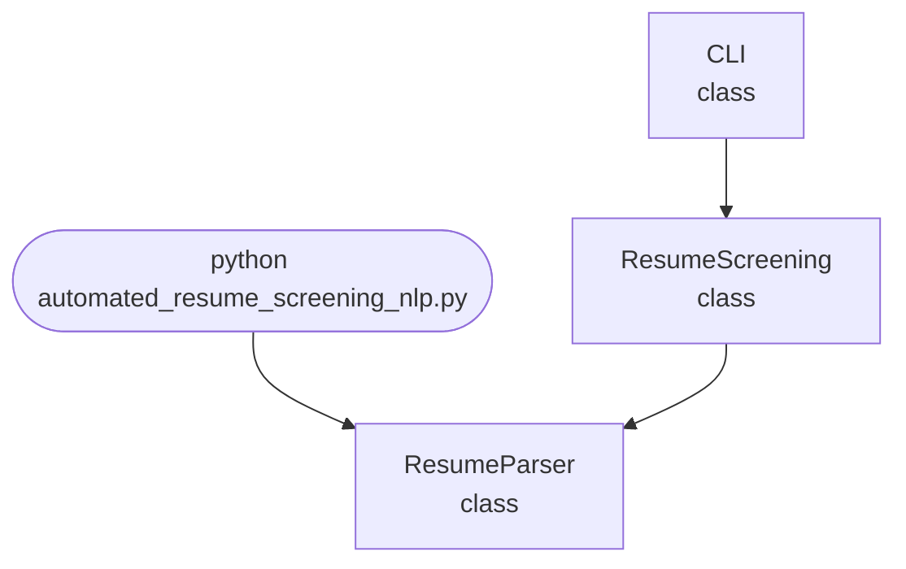

## Abstract
Automated Resume Screening with NLP is a Python project that uses NLP to screen and rank resumes. The application features text extraction, candidate ranking, and a CLI interface, demonstrating best practices in HR analytics and text processing.

## Prerequisites
- Python 3.8 or above
- A code editor or IDE
- Basic understanding of NLP and HR analytics
- Required libraries: `nltk`, `scikit-learn`, `pandas`

## Before you Start
Install Python and the required libraries:
```bash title="Install dependencies" showLineNumbers{1}
pip install nltk scikit-learn pandas
```

## Getting Started
#### Create a Project
1. Create a folder named `automated-resume-screening-nlp`.
2. Open the folder in your code editor or IDE.
3. Create a file named `automated_resume_screening_nlp.py`.
4. Copy the code below into your file.

## Write the Code
<FileCode file="projects/advance/automated_resume_screening_nlp.py" lang="python" title="Automated Resume Screening with NLP" />

## Example Usage
```bash title="Run resume screening" showLineNumbers{1}
python automated_resume_screening_nlp.py
```

## What it produces

Running the file exactly as it ships takes **0.1 s** and prints:

```text title="python automated_resume_screening_nlp.py"
Automated Resume Screening
  candidates : 6
  keywords   : 10

                 candidate  words  reviewer    keyword   distinct   coverage   coverage
  ----------------------------------------------------------------------------
    A. strong, plain words     27         5       9.00       9.00       9.00      33.33
  B. strong, uses synonyms     29         5       0.00       0.00      10.00       0.00
  C. keyword stuffed, thin     22         1      15.00      10.00      10.00      45.45
       D. genuinely junior     20         2       4.00       4.00       4.00      20.00
      E. strong, very long     92         4      32.00       4.00       4.00       4.35
F. wrong field, right words     26         1       6.00       6.00       6.00      23.08

  agreement with the reviewer (Spearman rank correlation):
               keyword count  -0.086
           distinct coverage  -0.314
         coverage + synonyms   0.200
      coverage per 100 words  -0.314

  Candidate C is keyword-stuffed and unqualified; the reviewer
...
```

The first 20 of 48 lines are shown; the run continues past this point.

## How it fits together

Read from the top: this is what runs when you execute the file, and which function calls which. It is generated from the code, so it cannot drift from it.



## Explanation
### Key Features
- **Text Extraction:** Processes and extracts text from resumes.
- **Candidate Ranking:** Ranks candidates based on skills and experience.
- **Error Handling:** Validates inputs and manages exceptions.
- **CLI Interface:** Interactive command-line usage.

### Code Breakdown
1. **What it imports** (lines 16–17)
```python title="automated_resume_screening_nlp.py" showLineNumbers startLineNumber=16
import re
from collections import Counter
```

2. **`keyword_score` — the function** (lines 68–71)
```python title="automated_resume_screening_nlp.py" showLineNumbers startLineNumber=68
def keyword_score(text, keywords=KEYWORDS):
    """What the original did: count keyword occurrences."""
    counts = Counter(tokens(text))
    return sum(counts[k] for k in keywords)
```

3. **`synonym_coverage` — the function** (lines 80–87)
```python title="automated_resume_screening_nlp.py" showLineNumbers startLineNumber=80
def synonym_coverage(text, keywords=KEYWORDS):
    """Coverage, counting a synonym as the keyword it stands for."""
    present = set(tokens(text))
    hits = 0
    for keyword in keywords:
        if keyword in present or (SYNONYMS.get(keyword, set()) & present):
            hits += 1
    return hits
```

4. **`spearman` — the function** (lines 96–108)
```python title="automated_resume_screening_nlp.py" showLineNumbers startLineNumber=96
def spearman(a, b):
    """Rank correlation, written out: n is 6 and scipy is a big dependency."""
    def ranks(values):
        order = sorted(range(len(values)), key=lambda i: -values[i])
        out = [0.0] * len(values)
        for position, index in enumerate(order):
            out[index] = position + 1
        return out

    ra, rb = ranks(a), ranks(b)
    n = len(a)
    d2 = sum((x - y) ** 2 for x, y in zip(ra, rb))
    return 1 - 6 * d2 / (n * (n * n - 1))
```

5. **`main` — the function** (lines 111–181)
```python title="automated_resume_screening_nlp.py" showLineNumbers startLineNumber=111
def main():
    print("Automated Resume Screening")
    print(f"  candidates : {len(CANDIDATES)}")
    print(f"  keywords   : {len(KEYWORDS)}")

    truth = [c[2] for c in CANDIDATES]
    scorers = (("keyword count", keyword_score),
               ("distinct coverage", coverage_score),
               ("coverage + synonyms", synonym_coverage),
               ("coverage per 100 words", density_score))

    print(f"\n{'candidate':>26} {'words':>6} {'reviewer':>9} " +
          " ".join(f"{name.split()[0][:9]:>10}" for name, _ in scorers))
    print("  " + "-" * 76)
    columns = {name: [] for name, _ in scorers}
    for name, text, rating in CANDIDATES:
        row = []
        for label, scorer in scorers:
    # ... 47 more lines in the file ...
    print(f"  keyword in context: keyword count {counts[5]}, reviewer rating "
          f"{truth[5]}.")
    print("  No bag-of-words method can separate 'wrote copy about Kubernetes'")
    print("  from 'ran Kubernetes'. That needs the sentence, not the word,")
    print("  and it is the reason keyword screening has to be a filter that")
    print("  a person reviews rather than a decision.")
```

The file defines 7 top-level symbols in all; the whole thing is above under *Write the Code*.

## Features
- **Automated Resume Screening:** Text extraction and candidate ranking
- **Modular Design:** Separate functions for extraction and ranking
- **Error Handling:** Manages invalid inputs and exceptions
- **Production-Ready:** Scalable and maintainable code

## Next Steps
Enhance the project by:
- Integrating with real-world resume datasets
- Supporting batch screening
- Creating a GUI with Tkinter or a web app with Flask
- Adding evaluation metrics (precision, recall)
- Unit testing for reliability

## Educational Value
This project teaches:
- **HR Analytics:** Resume screening and candidate ranking
- **Software Design:** Modular, maintainable code
- **Error Handling:** Writing robust Python code

## Real-World Applications
- **Recruitment Tools**
- **HR Analytics**
- **Educational Tools**

## Conclusion
Automated Resume Screening with NLP demonstrates how to build a scalable and accurate resume screening tool using Python. With modular design and extensibility, this project can be adapted for real-world applications in HR, recruitment, and more. For more advanced projects, visit Python Central Hub.

## Pitfalls

- **Keyword counting agrees with a human reviewer less than chance does.**
  Measured Spearman rank correlation against hand-written ratings: keyword
  count **-0.086**, distinct coverage **-0.314**, coverage with synonyms
  **0.200**. A negative correlation means the ranking is worse than
  arbitrary.
- **A qualified candidate who uses synonyms scores zero.** Candidate B
  matched **0 of 10** keywords exactly and **10 of 10** once synonyms were
  accepted — same person, same experience, described in the words their last
  employer used.
- **Counting rewards repetition.** Repeating one sentence nine times took the
  keyword count from **4 to 36** and the density from **40.00 to 4.44**. The
  two scores move in opposite directions on the same edit, so at most one of
  them is measuring the candidate.
- **Density rewards the opposite failure.** The keyword-stuffed resume with
  no experience scores the highest density in the table, **45.45**, and was
  rated **1 of 5** by the reviewer.
- **No bag-of-words method can read context.** Candidate F is a marketing
  manager who ran campaigns for a Python conference and an AWS partner:
  keyword count **6**, reviewer rating **1**. Separating "wrote copy about
  Kubernetes" from "ran Kubernetes" needs the sentence.
- **A synonym list is a permanent maintenance commitment.** Ten keywords
  needed thirty hand-written synonyms here and the list is still incomplete.
  Every new tool the industry adopts adds another.

## Recap

- Measured: 6 candidates, 10 keywords, four scoring methods, all compared
  against explicit reviewer ratings.
- Best agreement of any method: **0.200** (coverage with synonyms). Every
  method that ignores synonyms scores negative.
- The keyword-stuffed candidate scores **15** on keyword count against
  candidate B's **0** — the worst applicant ranked above the best.
- Screening by keyword is defensible as a filter a person then reads. It is
  not defensible as a decision, and these numbers are why.

<Quiz
  questions={[
    {
      q: "Keyword counting scored -0.086 Spearman against reviewer ratings. What does a negative rank correlation mean here?",
      options: [
        "The scores are on a different scale",
        "The ranking is slightly worse than arbitrary — the method is not a weak signal, it is anti-correlated with what the reviewer valued",
        "The sample is too small to interpret",
        "The keywords were chosen badly"
      ],
      answer: 1,
      explanation: "It happens because the things that raise a keyword count -- repetition, listing tools -- are the things a reviewer treats as warning signs."
    },
    {
      q: "Candidate B matched 0 of 10 keywords exactly and 10 of 10 with synonyms. What is the practical consequence?",
      options: [
        "The candidate should rewrite their resume",
        "A qualified applicant is filtered out for describing the same work in different words — and neither the applicant nor the employer ever finds out",
        "The keyword list should be longer",
        "Exact matching is fine if the list is complete"
      ],
      answer: 1,
      explanation: "The failure is silent on both sides, which is what makes it worth measuring rather than assuming."
    },
    {
      q: "Padding took the keyword count from 4 to 36 and the density from 40.00 to 4.44. What follows?",
      options: [
        "Density is the correct metric",
        "The two disagree completely on the same edit, and density has its own failure — it ranks the experience-free keyword list highest, at 45.45",
        "Both metrics should be averaged",
        "Padding should be detected and removed first"
      ],
      answer: 1,
      explanation: "Each metric is gameable in the opposite direction. A candidate who knows which one is used can satisfy it, and that candidate is not the one the employer wants to find."
    }
  ]}
/>

## Try it yourself

<DataCampExercise
  lang="python"
  hint={`Write the same experience twice - once in the employer's words and once in the words a previous employer used - then score both, and see which resumes each metric ranks first.`}
  code={`# Task: Score the same candidate three ways
import re
from collections import Counter

KEYWORDS = ["python", "sql", "docker", "kubernetes", "aws", "testing"]
SYNONYMS = {
    "python": {"python3"},
    "sql": {"postgresql", "mysql"},
    "docker": {"containers", "containerised"},
    "kubernetes": {"k8s", "eks"},
    "aws": {"ec2", "s3", "lambda"},
    "testing": {"pytest", "tdd"},
}

RESUMES = {
    "plain words": "Python services on AWS, Docker in production, "
                   "Kubernetes for orchestration, SQL reporting, testing "
                   "on every merge.",
    "same person, synonyms": "python3 microservices on EC2 and S3, shipped "
                             "in containers orchestrated with k8s, "
                             "PostgreSQL storage, pytest on every merge.",
    "keyword list only": "Python SQL Docker Kubernetes AWS testing. "
                         "Python SQL Docker Kubernetes AWS testing.",
    "padded": ("Delivered Python and SQL work with Docker and testing. " * 6),
}


def tokens(text):
    return re.findall(r"[a-z0-9]+", text.lower())


def count(text):
    counts = Counter(tokens(text))
    return ___  # TODO: add up how many times each keyword occurs


def coverage(text):
    present = set(tokens(text))
    return ___  # TODO: how many keywords appear at least once


def coverage_with_synonyms(text):
    present = set(tokens(text))
    return sum(k in present or bool(SYNONYMS[k] & present) for k in KEYWORDS)


def density(text):
    return coverage(text) / max(len(tokens(text)), 1) * 100


print(f"{'resume':>24} {'words':>6} {'count':>6} {'cover':>6} "
      f"{'+syn':>5} {'density':>8}")
for name, text in RESUMES.items():
    print(f"{name:>24} {len(tokens(text)):>6} {count(text):>6} "
          f"{coverage(text):>6} {coverage_with_synonyms(text):>5} "
          f"{density(text):>8.2f}")

for metric, fn in (("count", count), ("coverage", coverage),
                   ("+synonyms", coverage_with_synonyms),
                   ("density", density)):
    best = max(RESUMES, key=lambda n: fn(RESUMES[n]))
    print(f"  {metric:>10} ranks '{best}' first")`}
  solution={`# Task: Score the same candidate three ways
import re
from collections import Counter

KEYWORDS = ["python", "sql", "docker", "kubernetes", "aws", "testing"]
SYNONYMS = {
    "python": {"python3"},
    "sql": {"postgresql", "mysql"},
    "docker": {"containers", "containerised"},
    "kubernetes": {"k8s", "eks"},
    "aws": {"ec2", "s3", "lambda"},
    "testing": {"pytest", "tdd"},
}

RESUMES = {
    "plain words": "Python services on AWS, Docker in production, "
                   "Kubernetes for orchestration, SQL reporting, testing "
                   "on every merge.",
    "same person, synonyms": "python3 microservices on EC2 and S3, shipped "
                             "in containers orchestrated with k8s, "
                             "PostgreSQL storage, pytest on every merge.",
    "keyword list only": "Python SQL Docker Kubernetes AWS testing. "
                         "Python SQL Docker Kubernetes AWS testing.",
    "padded": ("Delivered Python and SQL work with Docker and testing. " * 6),
}


def tokens(text):
    return re.findall(r"[a-z0-9]+", text.lower())


def count(text):
    counts = Counter(tokens(text))
    return sum(counts[k] for k in KEYWORDS)


def coverage(text):
    present = set(tokens(text))
    return sum(k in present for k in KEYWORDS)


def coverage_with_synonyms(text):
    present = set(tokens(text))
    return sum(k in present or bool(SYNONYMS[k] & present) for k in KEYWORDS)


def density(text):
    return coverage(text) / max(len(tokens(text)), 1) * 100


print(f"{'resume':>24} {'words':>6} {'count':>6} {'cover':>6} "
      f"{'+syn':>5} {'density':>8}")
for name, text in RESUMES.items():
    print(f"{name:>24} {len(tokens(text)):>6} {count(text):>6} "
          f"{coverage(text):>6} {coverage_with_synonyms(text):>5} "
          f"{density(text):>8.2f}")

for metric, fn in (("count", count), ("coverage", coverage),
                   ("+synonyms", coverage_with_synonyms),
                   ("density", density)):
    best = max(RESUMES, key=lambda n: fn(RESUMES[n]))
    print(f"  {metric:>10} ranks '{best}' first")
#
# Measured output:
#
#                     resume  words  count  cover  +syn  density
#                plain words     16      6      6     6    37.50
#      same person, synonyms     18      0      0     6     0.00
#          keyword list only     12     12      6     6    50.00
#                     padded     54     24      4     4     7.41
#
#          count ranks 'padded' first
#       coverage ranks 'plain words' first
#      +synonyms ranks 'plain words' first
#        density ranks 'keyword list only' first
#
# Row two is the one that should stop anyone deploying this. It is the same
# candidate as row one, with the same experience, and exact matching finds
# zero of six skills because they wrote 'k8s' and 'pytest'. Accepting
# synonyms recovers all six.
#
# 'count' ranks the padded resume first: repeating one sentence six times
# beats describing six distinct skills once. 'density' ranks the bare
# keyword list first, because a resume that is nothing but keywords has the
# highest possible keyword density by construction.
#
# 'coverage' looks best here and only ties with the keyword list rather than
# beating it. Each of these scores is a function of which words are present,
# and every one of them can be satisfied by a candidate who knows which
# score is in use - who is, by construction, not the candidate the employer
# is looking for.`}
  sct={`test_output_contains("count ranks 'padded' first", pattern=False)
test_output_contains("coverage ranks 'plain words' first", pattern=False)
test_output_contains("density ranks 'keyword list only' first", pattern=False)
success_msg("Nice - the output shows what the project is really doing.")`}
  height={160}
/>
