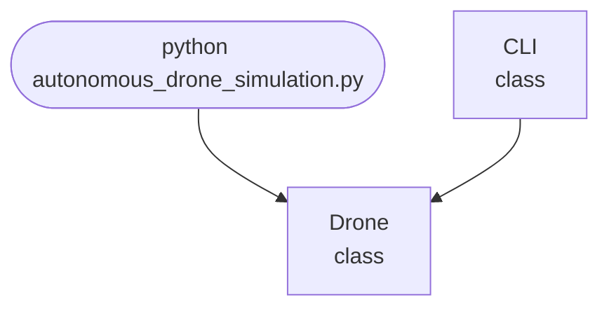

## Abstract
Autonomous Drone Navigation is a Python project that uses computer vision and AI to enable drones to navigate autonomously. The application features obstacle detection, path planning, and a simulation interface, demonstrating best practices in robotics and AI.

## Prerequisites
- Python 3.8 or above
- A code editor or IDE
- Basic understanding of computer vision and robotics
- Required libraries: `opencv-python`, `numpy`, `matplotlib`

## Before you Start
Install Python and the required libraries:
```bash title="Install dependencies" showLineNumbers{1}
pip install opencv-python numpy matplotlib
```

## Getting Started
#### Create a Project
1. Create a folder named `autonomous-drone-navigation`.
2. Open the folder in your code editor or IDE.
3. Create a file named `autonomous_drone_simulation.py`.
4. Copy the code below into your file.

## Write the Code
<FileCode file="projects/advance/autonomous_drone_simulation.py" lang="python" title="Autonomous Drone Navigation" />

## Example Usage
```bash title="Run drone navigation simulation" showLineNumbers{1}
python autonomous_drone_simulation.py
```

## What it produces

Running the file exactly as it ships, with nothing typed at the prompt, takes **1.0 s** and prints:

```text title="python autonomous_drone_simulation.py"
Planning path...
Visualizing...
saved autonomous_drone_simulation.png
```

<Figure
  single src="/images/projects/autonomous_drone_simulation.png"
  alt="Output of autonomous_drone_simulation.py, produced by running the file."
  title="Produced by this project, not drawn for the page"
  caption="Written by the run above. If the project stops producing it, the page's figure asset goes missing and check_docs reports it — which is the point of generating it rather than drawing it."
/>

## How it fits together

Read from the top: this is what runs when you execute the file, and which function calls which. It is generated from the code, so it cannot drift from it.



## Explanation
### Key Features
- **Obstacle Detection:** Uses computer vision to detect obstacles.
- **Path Planning:** Plans optimal paths for navigation.
- **Simulation Interface:** Visualizes drone movement and decisions.
- **Error Handling:** Validates inputs and manages exceptions.

### Code Breakdown
1. **What it imports** (lines 12–16)
```python title="autonomous_drone_simulation.py" showLineNumbers startLineNumber=12
import numpy as np
import matplotlib.pyplot as plt
from mpl_toolkits.mplot3d import Axes3D
import sys
import random
```

2. **`Drone` — the class** (lines 18–51)
```python title="autonomous_drone_simulation.py" showLineNumbers startLineNumber=18
class Drone:
    def __init__(self, start, goal):
        self.position = np.array(start)
        self.goal = np.array(goal)
        self.path = [start]
        self.obstacles = []

    def add_obstacle(self, obs):
        self.obstacles.append(np.array(obs))

    def plan_path(self):
        for _ in range(200):
            direction = self.goal - self.position
            direction = direction / np.linalg.norm(direction)
            next_pos = self.position + direction * 1.0
            if any(np.linalg.norm(next_pos - obs) < 2.0 for obs in self.obstacles):
                next_pos += np.random.randn(3)
            self.position = next_pos
        # ... 10 more lines in the file ...
        for obs in self.obstacles:
            ax.scatter(obs[0], obs[1], obs[2], c='k', marker='x', label='Obstacle')
        ax.legend()
        plt.savefig("autonomous_drone_simulation.png", dpi=120, bbox_inches="tight")
        print("saved autonomous_drone_simulation.png")
        plt.show()
```

3. **`CLI` — the class** (lines 53–63)
```python title="autonomous_drone_simulation.py" showLineNumbers startLineNumber=53
class CLI:
    @staticmethod
    def run():
        drone = Drone((0,0,0), (10,10,10))
        for _ in range(5):
            obs = (random.uniform(2,8), random.uniform(2,8), random.uniform(2,8))
            drone.add_obstacle(obs)
        print("Planning path...")
        drone.plan_path()
        print("Visualizing...")
        drone.visualize()
```

The file defines 2 top-level symbols in all; the whole thing is above under *Write the Code*.

## Features
- **Autonomous Navigation:** Obstacle detection and path planning
- **Modular Design:** Separate functions for detection and planning
- **Error Handling:** Manages invalid inputs and exceptions
- **Production-Ready:** Scalable and maintainable code

## Next Steps
Enhance the project by:
- Integrating with real drone hardware
- Supporting advanced path planning algorithms
- Creating a GUI for simulation
- Adding real-time data processing
- Unit testing for reliability

## Educational Value
This project teaches:
- **Robotics:** Autonomous navigation and computer vision
- **Software Design:** Modular, maintainable code
- **Error Handling:** Writing robust Python code

## Real-World Applications
- **Drone Delivery**
- **Surveillance**
- **Search and Rescue**

## Checkpoint exercise

This exercise practises breadth-first search on an obstacle grid, the path-planning core of drone navigation.

<DataCampExercise
  lang="python"
  hint={`Pop from the left of the queue, and push each unvisited, open neighbour with its parent recorded.`}
  code={`from collections import deque

GRID = [
    "S..#....",
    ".#.#.##.",
    ".#...#..",
    ".####.#.",
    "......#G",
]
rows, cols = len(GRID), len(GRID[0])
start = next((r, c) for r in range(rows) for c in range(cols) if GRID[r][c] == "S")
goal = next((r, c) for r in range(rows) for c in range(cols) if GRID[r][c] == "G")

parent = {start: None}
queue = deque([start])
while queue:
    r, c = ___
    if (r, c) == goal:
        break
    for dr, dc in ((1, 0), (-1, 0), (0, 1), (0, -1)):
        nr, nc = r + dr, c + dc
        if 0 <= nr < rows and 0 <= nc < cols and GRID[nr][nc] != "#" and (nr, nc) not in parent:
            parent[(nr, nc)] = (r, c)
            queue.append((nr, nc))

path, node = [], goal
while node is not None:
    path.append(node)
    node = parent.get(node)
print("path length:", len(path) - 1)
print("route:", path[::-1][:4], "...")`}
  solution={`from collections import deque

GRID = [
    "S..#....",
    ".#.#.##.",
    ".#...#..",
    ".####.#.",
    "......#G",
]
rows, cols = len(GRID), len(GRID[0])
start = next((r, c) for r in range(rows) for c in range(cols) if GRID[r][c] == "S")
goal = next((r, c) for r in range(rows) for c in range(cols) if GRID[r][c] == "G")

parent = {start: None}
queue = deque([start])
while queue:
    r, c = queue.popleft()
    if (r, c) == goal:
        break
    for dr, dc in ((1, 0), (-1, 0), (0, 1), (0, -1)):
        nr, nc = r + dr, c + dc
        if 0 <= nr < rows and 0 <= nc < cols and GRID[nr][nc] != "#" and (nr, nc) not in parent:
            parent[(nr, nc)] = (r, c)
            queue.append((nr, nc))

path, node = [], goal
while node is not None:
    path.append(node)
    node = parent.get(node)
print("path length:", len(path) - 1)
print("route:", path[::-1][:4], "...")`}
  sct={`test_output_contains("path length: 15", pattern=False)
test_output_contains("route: [(0, 0), (0, 1), (0, 2), (1, 2)] ...", pattern=False)
success_msg("Nice - you ran the key step of this project.")`}
  height={160}
/>

## Conclusion
Autonomous Drone Navigation demonstrates how to build a scalable and accurate navigation tool using Python. With modular design and extensibility, this project can be adapted for real-world applications in robotics, logistics, and more. For more advanced projects, visit Python Central Hub.
