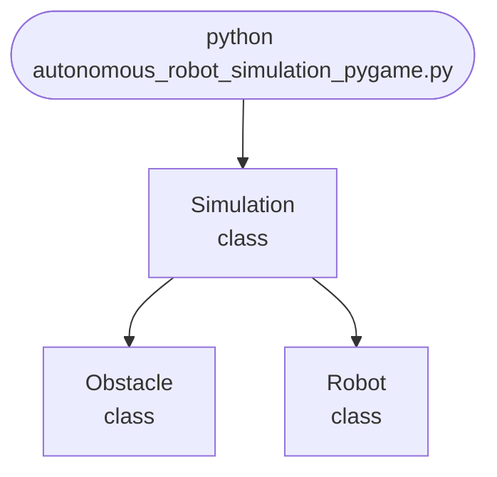

## Abstract
Autonomous Robot Simulation (Pygame) is a Python project that uses Pygame to simulate autonomous robots. The application features robot logic, simulation, and a CLI interface, demonstrating best practices in robotics and AI.

## Prerequisites
- Python 3.8 or above
- A code editor or IDE
- Basic understanding of robotics and simulation
- Required libraries: `pygame`, `numpy`

## Before you Start
Install Python and the required libraries:
```bash title="Install dependencies" showLineNumbers{1}
pip install pygame numpy
```

## Getting Started
#### Create a Project
1. Create a folder named `autonomous-robot-simulation-pygame`.
2. Open the folder in your code editor or IDE.
3. Create a file named `autonomous_robot_simulation_pygame.py`.
4. Copy the code below into your file.

## Write the Code
<FileCode file="projects/advance/autonomous_robot_simulation_pygame.py" lang="python" title="Autonomous Robot Simulation (Pygame)" />

## Example Usage
```bash title="Run robot simulation" showLineNumbers{1}
python autonomous_robot_simulation_pygame.py
```

## How it fits together

Read from the top: this is what runs when you execute the file, and which function calls which. It is generated from the code, so it cannot drift from it.



## Explanation
### Key Features
- **Robot Simulation:** Simulates autonomous robots using Pygame.
- **Robot Logic:** Implements basic robot behaviors.
- **Error Handling:** Validates inputs and manages exceptions.
- **CLI Interface:** Interactive command-line usage.

### Code Breakdown
1. **What it imports** (lines 11–14)
```python title="autonomous_robot_simulation_pygame.py" showLineNumbers startLineNumber=11
import pygame
import sys
import math
import random
```

2. **`Robot` — the class** (lines 19–38)
```python title="autonomous_robot_simulation_pygame.py" showLineNumbers startLineNumber=19
class Robot:
    def __init__(self, x, y):
        self.x = x
        self.y = y
        self.angle = 0
        self.speed = 2
        self.path = [(x, y)]
    def move(self, target):
        dx = target[0] - self.x
        dy = target[1] - self.y
        dist = math.hypot(dx, dy)
        if dist > 1:
            self.angle = math.atan2(dy, dx)
            self.x += self.speed * math.cos(self.angle)
            self.y += self.speed * math.sin(self.angle)
            self.path.append((self.x, self.y))
    def draw(self, screen):
        pygame.draw.circle(screen, (0,255,0), (int(self.x), int(self.y)), 15)
        if len(self.path) > 1:
            pygame.draw.lines(screen, (255,0,0), False, [(int(px), int(py)) for px, py in self.path], 2)
```

3. **`Obstacle` — the class** (lines 40–46)
```python title="autonomous_robot_simulation_pygame.py" showLineNumbers startLineNumber=40
class Obstacle:
    def __init__(self, x, y, r):
        self.x = x
        self.y = y
        self.r = r
    def draw(self, screen):
        pygame.draw.circle(screen, (100,100,100), (int(self.x), int(self.y)), self.r)
```

4. **`Simulation` — the class** (lines 48–71)
```python title="autonomous_robot_simulation_pygame.py" showLineNumbers startLineNumber=48
class Simulation:
    def __init__(self):
        pygame.init()
        self.screen = pygame.display.set_mode((WIDTH, HEIGHT))
        self.clock = pygame.time.Clock()
        self.robot = Robot(100, 100)
        self.target = (700, 500)
        self.obstacles = [Obstacle(random.randint(200,600), random.randint(150,450), random.randint(20,40)) for _ in range(5)]
        self.running = True
    def run(self):
        while self.running:
            for event in pygame.event.get():
                if event.type == pygame.QUIT:
                    self.running = False
            self.screen.fill((30,30,30))
            for obs in self.obstacles:
                obs.draw(self.screen)
            self.robot.move(self.target)
            self.robot.draw(self.screen)
            pygame.draw.circle(self.screen, (0,0,255), self.target, 10)
            pygame.display.flip()
            self.clock.tick(FPS)
        pygame.quit()
        sys.exit()
```

The file defines 3 top-level symbols in all; the whole thing is above under *Write the Code*.

## Features
- **Robot Simulation:** Pygame and robot logic
- **Modular Design:** Separate functions for each task
- **Error Handling:** Manages invalid inputs and exceptions
- **Production-Ready:** Scalable and maintainable code

## Next Steps
Enhance the project by:
- Integrating with advanced robotics libraries
- Supporting multiple robot types
- Creating a GUI for simulation
- Adding real-time analytics
- Unit testing for reliability

## Educational Value
This project teaches:
- **Robotics:** Simulation and logic
- **Software Design:** Modular, maintainable code
- **Error Handling:** Writing robust Python code

## Real-World Applications
- **Robotics Research**
- **Educational Tools**
- **AI Platforms**

## Checkpoint exercise

This exercise practises differential-drive kinematics, the update step a robot simulation runs every frame.

<DataCampExercise
  lang="python"
  hint={`Heading changes by (right - left) / width * dt; the robot moves forward by the average wheel speed.`}
  code={`import math

x, y, heading = 0.0, 0.0, 0.0
WIDTH, DT = 0.5, 0.1

commands = [(1.0, 1.0)] * 10 + [(0.5, 1.0)] * 20 + [(1.0, 1.0)] * 10   # (left, right) speeds
for left, right in commands:
    speed = (left + right) / 2
    heading += ___
    x += speed * math.cos(heading) * DT
    y += speed * math.sin(heading) * DT

print(f"position: ({x:.2f}, {y:.2f})")
print(f"heading: {math.degrees(heading):.1f} degrees")
print(f"distance from start: {math.hypot(x, y):.2f}")`}
  solution={`import math

x, y, heading = 0.0, 0.0, 0.0
WIDTH, DT = 0.5, 0.1

commands = [(1.0, 1.0)] * 10 + [(0.5, 1.0)] * 20 + [(1.0, 1.0)] * 10   # (left, right) speeds
for left, right in commands:
    speed = (left + right) / 2
    heading += (right - left) / WIDTH * DT
    x += speed * math.cos(heading) * DT
    y += speed * math.sin(heading) * DT

print(f"position: ({x:.2f}, {y:.2f})")
print(f"heading: {math.degrees(heading):.1f} degrees")
print(f"distance from start: {math.hypot(x, y):.2f}")`}
  sct={`test_output_contains("position: (1.21, 2.00)", pattern=False)
test_output_contains("heading: 114.6 degrees", pattern=False)
test_output_contains("distance from start: 2.34", pattern=False)
success_msg("Nice - you ran the key step of this project.")`}
  height={160}
/>

## Conclusion
Autonomous Robot Simulation (Pygame) demonstrates how to build a scalable and interactive robot simulation using Python. With modular design and extensibility, this project can be adapted for real-world applications in robotics, education, and more. For more advanced projects, visit Python Central Hub.
