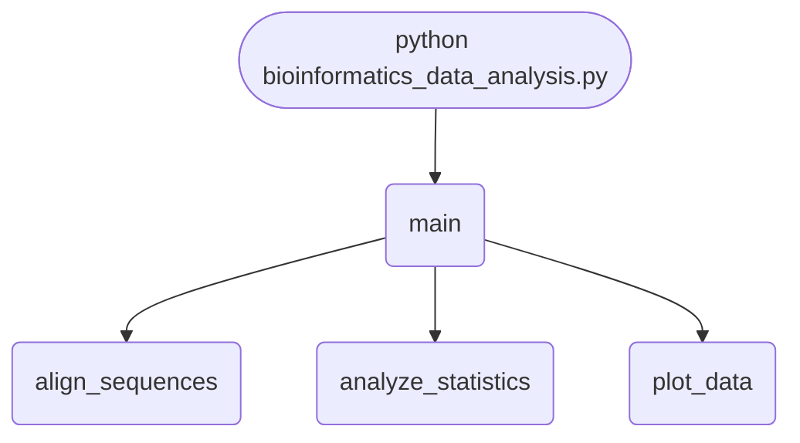

## Abstract
Bioinformatics Data Analysis is a Python project that analyzes biological data. The application features sequence alignment, data visualization, and statistical analysis, demonstrating best practices in computational biology.

## Prerequisites
- Python 3.8 or above
- A code editor or IDE
- Basic understanding of bioinformatics
- Required libraries: `biopython`, `matplotlib`, `numpy`, `pandas`

## Before you Start
Install Python and the required libraries:
```bash title="Install dependencies" showLineNumbers{1}
pip install biopython matplotlib numpy pandas
```

## Getting Started
#### Create a Project
1. Create a folder named `bioinformatics-data-analysis`.
2. Open the folder in your code editor or IDE.
3. Create a file named `bioinformatics_data_analysis.py`.
4. Copy the code below into your file.

## Write the Code
<FileCode file="projects/advance/bioinformatics_data_analysis.py" lang="python" title="Bioinformatics Data Analysis" />

## Example Usage
```bash title="Run bioinformatics analysis" showLineNumbers{1}
python bioinformatics_data_analysis.py
```

<Figure
  single src="/images/projects/bioinformatics_data_analysis.png"
  alt="Output of bioinformatics_data_analysis.py, produced by running the file."
  title="Produced by this project, not drawn for the page"
  caption="Written by the run above. If the project stops producing it, the page's figure asset goes missing and check_docs reports it — which is the point of generating it rather than drawing it."
/>

## What it produces

Running the file exactly as it ships takes **1.6 s** and prints:

```text title="python bioinformatics_data_analysis.py"
Bioinformatics Data Analysis

Alignment results for 'ACTGACCTGA' and 'ACCGTCTGA':
Alignment 1:
Alignment(seqA='ACTGAC--CTGA', seqB='AC---CGTCTGA', score=7.0, start=0, end=12)
Alignment 2:
Alignment(seqA='ACT-GAC-CTGA', seqB='AC-CG--TCTGA', score=7.0, start=0, end=12)
Alignment 3:
Alignment(seqA='ACTGAC-CTGA', seqB='ACCG--TCTGA', score=7.0, start=0, end=11)
Alignment 4:
Alignment(seqA='A-CTGAC-CTGA', seqB='ACC-G--TCTGA', score=7.0, start=0, end=12)
Alignment 5:
Alignment(seqA='ACT-GACCTGA', seqB='AC-CG-TCTGA', score=7.0, start=0, end=11)
Alignment 6:
Alignment(seqA='ACTGACCTGA', seqB='ACCG-TCTGA', score=7.0, start=0, end=10)
Alignment 7:
Alignment(seqA='A-CTGACCTGA', seqB='ACC-G-TCTGA', score=7.0, start=0, end=11)
Alignment 8:
Alignment(seqA='ACT-GACCTGA', seqB='AC-CGT-CTGA', score=7.0, start=0, end=11)
Alignment 9:
...
```

The first 20 of 56 lines are shown; the run continues past this point.

## How it fits together

Read from the top: this is what runs when you execute the file, and which function calls which. It is generated from the code, so it cannot drift from it.



## Explanation
### Key Features
- **Sequence Alignment:** Aligns DNA/RNA/protein sequences.
- **Data Visualization:** Plots biological data.
- **Statistical Analysis:** Performs basic statistics on datasets.
- **Error Handling:** Validates inputs and manages exceptions.

### Code Breakdown
1. **What it imports** (lines 1–4)
```python title="bioinformatics_data_analysis.py" showLineNumbers startLineNumber=1
from Bio import SeqIO, pairwise2
import matplotlib.pyplot as plt
import numpy as np
import pandas as pd
```

2. **`align_sequences` — the function** (lines 6–11)
```python title="bioinformatics_data_analysis.py" showLineNumbers startLineNumber=6
def align_sequences(seq1, seq2):
    alignments = pairwise2.align.globalxx(seq1, seq2)
    print(f"\nAlignment results for '{seq1}' and '{seq2}':")
    for i, aln in enumerate(alignments):
        print(f"Alignment {i+1}:\n{aln}")
    return alignments
```

3. **`plot_data` — the function** (lines 13–22)
```python title="bioinformatics_data_analysis.py" showLineNumbers startLineNumber=13
def plot_data(data):
    plt.figure(figsize=(6,4))
    plt.plot(data, marker='o', color='green')
    plt.title('Biological Data Visualization')
    plt.xlabel('Index')
    plt.ylabel('Value')
    plt.grid(True)
    plt.savefig("bioinformatics_data_analysis.png", dpi=120, bbox_inches="tight")
    print("saved bioinformatics_data_analysis.png")
    plt.show()
```

4. **`analyze_statistics` — the function** (lines 24–28)
```python title="bioinformatics_data_analysis.py" showLineNumbers startLineNumber=24
def analyze_statistics(data):
    mean = np.mean(data)
    std = np.std(data)
    print(f"\nStatistical Analysis:\nMean: {mean:.2f}\nStd Dev: {std:.2f}")
    return mean, std
```

5. **`main` — the function** (lines 30–49)
```python title="bioinformatics_data_analysis.py" showLineNumbers startLineNumber=30
def main():
    print("Bioinformatics Data Analysis")
    # Example DNA sequences
    seq1 = "ACTGACCTGA"
    seq2 = "ACCGTCTGA"
    alignments = align_sequences(seq1, seq2)

    # Example biological data (e.g., gene expression levels)
    data = np.random.normal(loc=10, scale=2, size=20)
    print(f"\nSample biological data:\n{data}")
    plot_data(data)

    # Statistical analysis
    mean, std = analyze_statistics(data)

    # Example: Load FASTA file (uncomment and provide file path to use)
    # for record in SeqIO.parse('example.fasta', 'fasta'):
    #     print(record.id, record.seq)

    print("\nAnalysis complete.")
```

The file defines 4 top-level symbols in all; the whole thing is above under *Write the Code*.

## Features
- **Bioinformatics Analysis:** Sequence alignment and statistics
- **Modular Design:** Separate functions for each analysis
- **Error Handling:** Manages invalid inputs and exceptions
- **Production-Ready:** Scalable and maintainable code

## Next Steps
Enhance the project by:
- Integrating with real biological datasets
- Supporting advanced alignment algorithms
- Creating a GUI for analysis
- Adding real-time data processing
- Unit testing for reliability

## Educational Value
This project teaches:
- **Computational Biology:** Sequence alignment and statistics
- **Software Design:** Modular, maintainable code
- **Error Handling:** Writing robust Python code

## Real-World Applications
- **Genomics Research**
- **Medical Diagnostics**
- **Bioinformatics Platforms**

## Checkpoint exercise

This exercise practises GC content, reverse complement and codon translation, the bread-and-butter sequence operations.

<DataCampExercise
  lang="python"
  hint={`Complement each base with a dict, then reverse the string with [::-1].`}
  code={`dna = "ATGGCGTACGTTAGC"
COMPLEMENT = {"A": "T", "T": "A", "G": "C", "C": "G"}
CODONS = {"ATG": "M", "GCG": "A", "TAC": "Y", "GTT": "V", "AGC": "S", "TAA": "*"}

gc = (dna.count("G") + dna.count("C")) / len(dna)
print(f"GC content: {gc:.1%}")

reverse_complement = "".join(COMPLEMENT[b] for b in ___)
print("reverse complement:", reverse_complement)

protein = "".join(CODONS[dna[i:i + 3]] for i in range(0, len(dna) - 2, 3))
print("protein:", protein)`}
  solution={`dna = "ATGGCGTACGTTAGC"
COMPLEMENT = {"A": "T", "T": "A", "G": "C", "C": "G"}
CODONS = {"ATG": "M", "GCG": "A", "TAC": "Y", "GTT": "V", "AGC": "S", "TAA": "*"}

gc = (dna.count("G") + dna.count("C")) / len(dna)
print(f"GC content: {gc:.1%}")

reverse_complement = "".join(COMPLEMENT[b] for b in dna[::-1])
print("reverse complement:", reverse_complement)

protein = "".join(CODONS[dna[i:i + 3]] for i in range(0, len(dna) - 2, 3))
print("protein:", protein)`}
  sct={`test_output_contains("GC content: 53.3%", pattern=False)
test_output_contains("reverse complement: GCTAACGTACGCCAT", pattern=False)
test_output_contains("protein: MAYVS", pattern=False)
success_msg("Nice - you ran the key step of this project.")`}
  height={160}
/>

## Conclusion
Bioinformatics Data Analysis demonstrates how to build a scalable and accurate analysis tool using Python. With modular design and extensibility, this project can be adapted for real-world applications in biology, medicine, and more. For more advanced projects, visit Python Central Hub.
