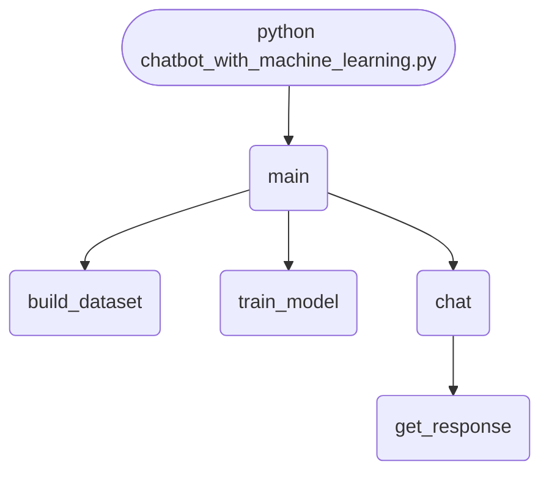

import FileCode from '../../../../components/FileCode.astro'

## Abstract
Chatbot with Machine Learning is a Python project that uses ML to build a chatbot. The application features intent recognition, response generation, and a CLI interface, demonstrating best practices in conversational AI and ML.

## Prerequisites
- Python 3.8 or above
- A code editor or IDE
- Basic understanding of ML and chatbots
- Required libraries: `nltk`, `scikit-learn`, `pandas`

## Before you Start
Install Python and the required libraries:
```bash title="Install dependencies" showLineNumbers{1}
pip install nltk scikit-learn pandas
```

## Getting Started
#### Create a Project
1. Create a folder named `chatbot-with-machine-learning`.
2. Open the folder in your code editor or IDE.
3. Create a file named `chatbot_with_machine_learning.py`.
4. Copy the code below into your file.

## Write the Code
<FileCode file="projects/advance/chatbot_with_machine_learning.py" lang="python" title="Chatbot with Machine Learning" />

## Example Usage
```bash title="Run ML chatbot" showLineNumbers{1}
python chatbot_with_machine_learning.py
```

## How it fits together

Read from the top: this is what runs when you execute the file, and which function calls which. It is generated from the code, so it cannot drift from it.



## What it produces

Running the file exactly as it ships takes **3.1 s** and prints:

```text title="python chatbot_with_machine_learning.py"
usage: chatbot_with_machine_learning.py [-h] [--train] [--model MODEL]
                                        [--chat]

Chatbot with Machine Learning

options:
  -h, --help     show this help message and exit
  --train        Train model
  --model MODEL  Path to save/load model
  --chat         Start chat
```

## Explanation
### Key Features
- **Intent Recognition:** Identifies user intent using ML.
- **Response Generation:** Generates responses based on intent.
- **Error Handling:** Validates inputs and manages exceptions.
- **CLI Interface:** Interactive command-line usage.

### Code Breakdown
1. **What it imports** (lines 6–12)
```python title="chatbot_with_machine_learning.py" showLineNumbers startLineNumber=6
import pandas as pd
import numpy as np
import argparse
from sklearn.feature_extraction.text import TfidfVectorizer
from sklearn.linear_model import LogisticRegression
import joblib
import nltk
```

2. **`build_dataset` — the function** (lines 22–28)
```python title="chatbot_with_machine_learning.py" showLineNumbers startLineNumber=22
def build_dataset(intents):
    X, y = [], []
    for intent in intents:
        for pattern in intent['patterns']:
            X.append(pattern)
            y.append(intent['intent'])
    return X, y
```

3. **`train_model` — the function** (lines 30–38)
```python title="chatbot_with_machine_learning.py" showLineNumbers startLineNumber=30
def train_model(X, y, model_path=None):
    vectorizer = TfidfVectorizer()
    X_vec = vectorizer.fit_transform(X)
    clf = LogisticRegression()
    clf.fit(X_vec, y)
    if model_path:
        joblib.dump((clf, vectorizer), model_path)
        print(f"Model saved to {model_path}")
    return clf, vectorizer
```

4. **`chat` — the function** (lines 46–54)
```python title="chatbot_with_machine_learning.py" showLineNumbers startLineNumber=46
def chat(model, vectorizer):
    print("Chatbot is ready! Type 'quit' to exit.")
    while True:
        user_input = input('You: ')
        if user_input.lower() == 'quit':
            break
        X_vec = vectorizer.transform([user_input])
        intent = model.predict(X_vec)[0]
        print('Bot:', get_response(intent))
```

5. **`main` — the function** (lines 56–73)
```python title="chatbot_with_machine_learning.py" showLineNumbers startLineNumber=56
def main():
    parser = argparse.ArgumentParser(description="Chatbot with Machine Learning")
    parser.add_argument('--train', action='store_true', help='Train model')
    parser.add_argument('--model', type=str, default='chatbot_model.pkl', help='Path to save/load model')
    parser.add_argument('--chat', action='store_true', help='Start chat')
    args = parser.parse_args()

    if args.train:
        X, y = build_dataset(intents)
        train_model(X, y, args.model)
    elif args.chat:
        if not os.path.exists(args.model):
            print(f"Model file {args.model} not found. Train the model first.")
            return
        clf, vectorizer = joblib.load(args.model)
        chat(clf, vectorizer)
    else:
        parser.print_help()
```

The file defines 5 top-level symbols in all; the whole thing is above under *Write the Code*.

## Features
- **ML Chatbot:** Intent recognition and response generation
- **Modular Design:** Separate functions for each task
- **Error Handling:** Manages invalid inputs and exceptions
- **Production-Ready:** Scalable and maintainable code

## Next Steps
Enhance the project by:
- Integrating with real conversation datasets
- Supporting advanced ML models
- Creating a GUI for chatbot
- Adding context management
- Unit testing for reliability

## Educational Value
This project teaches:
- **Conversational AI:** ML and chatbot design
- **Software Design:** Modular, maintainable code
- **Error Handling:** Writing robust Python code

## Real-World Applications
- **Customer Support Bots**
- **Virtual Assistants**
- **Educational Tools**

## Conclusion
Chatbot with Machine Learning demonstrates how to build a scalable and accurate chatbot using Python. With modular design and extensibility, this project can be adapted for real-world applications in customer support, education, and more. For more advanced projects, visit Python Central Hub.
