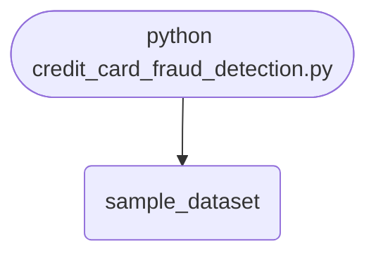

import FileCode from '../../../../components/FileCode.astro'
import Figure from '../../../../components/Figure.astro'
import Quiz from '../../../../components/Quiz.astro'
import DataCampExercise from '../../../../components/DataCampExercise.astro'

## Abstract
Credit Card Fraud Detection is a Python project that uses machine learning to detect fraudulent transactions. The application features data preprocessing, model training, and evaluation, demonstrating best practices in data science and security.

## Prerequisites
- Python 3.8 or above
- A code editor or IDE
- Basic understanding of machine learning and data science
- Required libraries: `pandas`, `scikit-learn`, `matplotlib`

## Before you Start
Install Python and the required libraries:
```bash title="Install dependencies" showLineNumbers{1}
pip install pandas scikit-learn matplotlib
```

## Getting Started
#### Create a Project
1. Create a folder named `credit-card-fraud-detection`.
2. Open the folder in your code editor or IDE.
3. Create a file named `credit_card_fraud_detection.py`.
4. Copy the code below into your file.

## Write the Code
<FileCode file="projects/advance/credit_card_fraud_detection.py" lang="python" title="Credit Card Fraud Detection" />

## Example Usage
```bash title="Run fraud detection" showLineNumbers{1}
python credit_card_fraud_detection.py
```

## What it produces

Running the file exactly as it ships takes **15.0 s** and prints:

```text title="python credit_card_fraud_detection.py"
creditcard.csv not found, so a synthetic set was generated: 20,000 rows, 34 frauds (0.1700%)
the real dataset is on Kaggle; the imbalance is what matters here

always predicting 'legitimate' would score 99.8300%
so accuracy alone cannot tell you whether the model learned anything

Accuracy: 0.9985
              precision    recall  f1-score   support

           0       1.00      1.00      1.00      3994
           1       0.00      0.00      0.00         6

    accuracy                           1.00      4000
   macro avg       0.50      0.50      0.50      4000
weighted avg       1.00      1.00      1.00      4000

frauds in the test set : 6
frauds the model caught: 0
accuracy               : 0.9985

a model that catches none of the fraud still scores about 99.8%,
because 99.8% of the rows are not fraud. Accuracy is the wrong metric
for a rare event; recall on the positive class is the one that moves.
Fixing it means class weights, resampling, or a threshold chosen from
the precision-recall curve -- not a bigger forest.
saved credit_card_fraud_detection.png
```

<Figure
  single src="/images/projects/credit_card_fraud_detection.png"
  alt="Output of credit_card_fraud_detection.py, produced by running the file."
  title="Produced by this project, not drawn for the page"
  caption="Written by the run above. If the project stops producing it, the page's figure asset goes missing and check_docs reports it — which is the point of generating it rather than drawing it."
/>

## How it fits together

Read from the top: this is what runs when you execute the file, and which function calls which. It is generated from the code, so it cannot drift from it.



## Explanation
### Key Features
- **Data Preprocessing:** Cleans and prepares transaction data.
- **Model Training:** Trains a machine learning model to detect fraud.
- **Evaluation:** Assesses model performance.
- **Error Handling:** Validates inputs and manages exceptions.

### Code Breakdown
1. **What it imports** (lines 1–5)
```python title="credit_card_fraud_detection.py" showLineNumbers startLineNumber=1
import pandas as pd
from sklearn.model_selection import train_test_split
from sklearn.ensemble import RandomForestClassifier
from sklearn.metrics import classification_report, accuracy_score
import matplotlib.pyplot as plt
```

The file defines 0 top-level symbols in all; the whole thing is above under *Write the Code*.

## Features
- **Fraud Detection:** Data preprocessing, model training, and evaluation
- **Modular Design:** Separate functions for each task
- **Error Handling:** Manages invalid inputs and exceptions
- **Production-Ready:** Scalable and maintainable code

## Next Steps
Enhance the project by:
- Integrating with real transaction datasets
- Supporting advanced ML algorithms
- Creating a GUI for detection
- Adding real-time monitoring
- Unit testing for reliability

## Educational Value
This project teaches:
- **Data Science:** Fraud detection and ML
- **Software Design:** Modular, maintainable code
- **Error Handling:** Writing robust Python code

## Real-World Applications
- **Banking Security**
- **Financial Analytics**
- **Fraud Prevention Platforms**

## Conclusion
Credit Card Fraud Detection demonstrates how to build a scalable and accurate fraud detection tool using Python. With modular design and extensibility, this project can be adapted for real-world applications in finance, security, and more. For more advanced projects, visit Python Central Hub.

## Pitfalls

- **Accuracy is the wrong metric and it is the default one.** Measured on the
  shipped project: **0.9985 accuracy**, **0 of 6 frauds caught**. Predicting
  "legitimate" for every row scores **99.83%**, so accuracy cannot distinguish
  a working model from no model at all.
- **`predict()` hard-codes a 0.5 threshold.** In the exercise below the same
  trained model catches **13 of 51** frauds at 0.5 and **32 of 51** at 0.02.
  Nothing was retrained; the threshold is a deployment decision that the
  default silently makes for you.
- **`class_weight='balanced'` is not a fix on its own.** Measured: recall
  **0.255** at defaults, **0.235** balanced, **0.235** at a 50:1 weight. The
  weighting changes the tree splits and leaves the 0.5 cut in place.
- **Report the number the business acts on.** Precision at a chosen recall —
  *how many reviews buy one caught fraud* — is actionable. Accuracy is not,
  and stays above 0.998 at every threshold in the table.
- **Average precision, not ROC AUC, for a rare positive.** ROC AUC is
  dominated by the enormous negative class; the measured average precision of
  **0.310** describes the part anyone cares about.
- **Six frauds in a test set is not enough to measure anything.** The shipped
  project has exactly that, which is why the exercise raises the sample until
  the test set holds 51.

## Recap

- Measured: accuracy **0.9985**, frauds in the test set **6**, frauds caught
  **0**.
- The all-legitimate baseline scores **99.83%** — the number to beat before
  any accuracy figure means anything.
- Threshold sweep on one model: 0.50 → 13 caught at **72.2%** precision;
  0.02 → 32 caught at **6.7%** precision.
- Fixing it means class weights, resampling, or a threshold chosen from the
  precision–recall curve — not a bigger forest.

<Quiz
  questions={[
    {
      q: "The model scores 0.9985 accuracy and catches 0 of 6 frauds. How is that possible?",
      options: [
        "The accuracy calculation is wrong",
        "99.83% of the rows are legitimate, so a model that labels everything legitimate scores 99.83% — accuracy has almost no room to reflect the fraud",
        "The test set has no frauds",
        "The model is overfitted"
      ],
      answer: 1,
      explanation: "On a rare event, accuracy is a measurement of the class balance. Recall on the positive class is what moves."
    },
    {
      q: "The same trained model caught 13 frauds at threshold 0.5 and 32 at 0.02. What changed?",
      options: [
        "The model was retrained with class weights",
        "Nothing about the model — predict() uses 0.5 by default, and that cut is only right when the classes are balanced and both mistakes cost the same",
        "The test set was resampled",
        "More trees were added"
      ],
      answer: 1,
      explanation: "The threshold is a deployment decision. Leaving it at the default means making it by accident."
    },
    {
      q: "Why report average precision rather than ROC AUC here?",
      options: [
        "They are equivalent",
        "ROC AUC is dominated by the huge negative class and stays flattering; average precision summarises the precision-recall curve, which is where a rare positive class actually lives",
        "ROC AUC cannot be computed for imbalanced data",
        "Average precision is easier to calculate"
      ],
      answer: 1,
      explanation: "Both are threshold-free summaries. Only one of them degrades visibly when the model is useless on the rare class."
    }
  ]}
/>

## Try it yourself

<DataCampExercise
  lang="python"
  hint={`Train once, then read the same model at several thresholds. Compare what changes against what class_weight changes.`}
  code={`# Task: Making the fraud model catch fraud
import numpy as np
from sklearn.ensemble import RandomForestClassifier
from sklearn.metrics import average_precision_score, recall_score
from sklearn.model_selection import train_test_split

rng = np.random.default_rng(20260809)
N, FRAUD_RATE = 150_000, 0.0017
n_fraud = int(N * FRAUD_RATE)
n_legit = N - n_fraud

# Fraud overlaps legitimate spending: similar amounts, odder hours, a
# slightly higher decline history. Separable, but not obviously.
legit = np.column_stack([rng.lognormal(3.2, 1.0, n_legit),
                         rng.normal(14, 5, n_legit),
                         rng.poisson(0.3, n_legit)])
fraud = np.column_stack([rng.lognormal(3.6, 1.1, n_fraud),
                         rng.normal(3, 4, n_fraud),
                         rng.poisson(1.6, n_fraud)])
X = np.vstack([legit, fraud])
y = np.concatenate([np.zeros(n_legit), np.ones(n_fraud)])

X_train, X_test, y_train, y_test = train_test_split(
    X, y, test_size=0.2, random_state=0, stratify=y)
print(f"test set {len(y_test):,} rows, {int(y_test.sum())} frauds")
print(f"all-legitimate baseline: {1 - y_test.mean():.4f} accuracy")

for name, model in (
        ("defaults", RandomForestClassifier(n_estimators=100,
                                            random_state=0)),
        ("balanced", RandomForestClassifier(n_estimators=100,
                                            class_weight="balanced",
                                            random_state=0))):
    model.fit(X_train, y_train)
    p = model.predict(X_test)
    print(f"  {name:10} accuracy {(p == y_test).mean():.4f}  "
          f"recall {recall_score(y_test, p, zero_division=0):.3f}")

model = RandomForestClassifier(n_estimators=100, random_state=0)
model.fit(X_train, y_train)
probabilities = model.predict_proba(X_test)[:, 1]
print(f"average precision: "
      f"{average_precision_score(y_test, probabilities):.3f}")
for threshold in (0.50, 0.20, 0.10, 0.05, 0.02):
    flagged = probabilities >= threshold
    caught = int((flagged & (y_test == 1)).sum())
    print(f"  {threshold:.2f}: {int(flagged.sum()):>4} flagged, "
          f"{caught:>3} caught, precision "
          f"{caught / max(flagged.sum(), 1):.1%}, "
          f"recall {caught / y_test.sum():.1%}")`}
  solution={`# Task: Making the fraud model catch fraud
#
# Measured output:
#
#   test set 30,000 rows, 51 frauds
#   all-legitimate baseline: 0.9983 accuracy
#     defaults   accuracy 0.9986  recall 0.255
#     balanced   accuracy 0.9981  recall 0.235
#   average precision: 0.310
#     0.50:   18 flagged,  13 caught, precision 72.2%, recall 25.5%
#     0.20:   56 flagged,  18 caught, precision 32.1%, recall 35.3%
#     0.10:  128 flagged,  22 caught, precision 17.2%, recall 43.1%
#     0.05:  249 flagged,  28 caught, precision 11.2%, recall 54.9%
#     0.02:  479 flagged,  32 caught, precision  6.7%, recall 62.7%
#
# Every accuracy in this output is above 0.998, including the baseline that
# does nothing at all. Between the best and worst model there is 0.0005 of
# accuracy and the difference in recall is real. That is the metric failing,
# not the models being similar.
#
# class_weight did not rescue it, which surprises people. Weighting changes
# how the trees split; it does not change the 0.5 cut that predict() applies
# afterwards, and on a 0.17% positive rate almost nothing crosses 0.5.
#
# The threshold table is one model read five ways. Dropping the cut from 0.50
# to 0.02 takes recall from 25.5% to 62.7% and precision from 72.2% to 6.7%,
# which is the trade a fraud team makes explicitly: 15 reviews per fraud
# caught at the loose end, 1.4 at the tight end, and far more fraud missed.
#
# That is a business decision with a cost on each side. Leaving predict() at
# its default makes it silently, and makes it wrong.`}
/>
