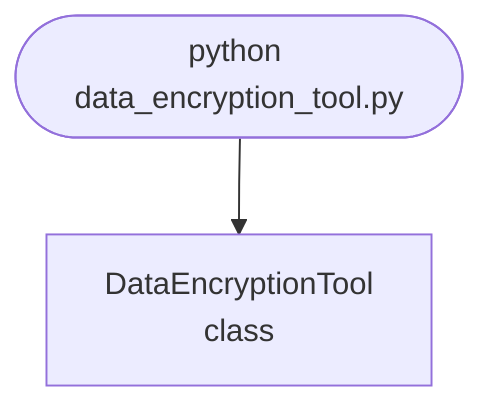

## Abstract
Data Encryption Tool is a Python project that encrypts and decrypts data. The application features cryptography, file management, and a CLI interface, demonstrating best practices in security and data protection.

## Prerequisites
- Python 3.8 or above
- A code editor or IDE
- Basic understanding of cryptography
- Required libraries: `cryptography`

## Before you Start
Install Python and the required libraries:
```bash title="Install dependencies" showLineNumbers{1}
pip install cryptography
```

## Getting Started
#### Create a Project
1. Create a folder named `data-encryption-tool`.
2. Open the folder in your code editor or IDE.
3. Create a file named `data_encryption_tool.py`.
4. Copy the code below into your file.

## Write the Code
<FileCode file="projects/advance/data_encryption_tool.py" lang="python" title="Data Encryption Tool" />

## Example Usage
```bash title="Run encryption tool" showLineNumbers{1}
python data_encryption_tool.py
```

## What it produces

Running the file exactly as it ships takes **2.6 s** and prints:

```text title="python data_encryption_tool.py"
Data Encryption Tool
  encrypting the same message twice:
    Z0FBQUFBQnFlSkJiaE9GVld1ckQtb0NN...
    Z0FBQUFBQnFlSkJiaENtSDhwRnNXbHdV...
    identical: False
    A deterministic cipher leaks equality: an observer who cannot
    read the messages can still see which ones are the same, and
    that is often the whole secret. The random IV is what stops it.

  flipping one bit of the ciphertext:
    InvalidToken: Fernet carries an HMAC, so any modification
    is detected rather than silently decrypted to garbage.
    Encryption alone does not provide integrity; a cipher
    without a MAC lets an attacker change what you read.

  the same 12-record table, two modes:
           AES-ECB: 12 blocks, 2 distinct
           AES-CBC: 12 blocks, 12 distinct
    The plaintext has 2 distinct records. ECB produces 2
    distinct blocks and CBC produces 12, so ECB's ciphertext
    reproduces the structure of the data exactly. This is the
    famous encrypted-penguin picture, and it is why ECB is not
...
```

The first 22 of 61 lines are shown; the run continues past this point.

## How it fits together

Read from the top: this is what runs when you execute the file, and which function calls which. It is generated from the code, so it cannot drift from it.



## Explanation
### Key Features
- **Encryption/Decryption:** Secures data using cryptography.
- **File Management:** Handles file input/output.
- **Error Handling:** Validates inputs and manages exceptions.
- **CLI Interface:** Interactive command-line usage.

### Code Breakdown
1. **What it imports** (lines 13–20)
```python title="data_encryption_tool.py" showLineNumbers startLineNumber=13
import base64
import hashlib
import os
import secrets
import time

from cryptography.fernet import Fernet, InvalidToken
from cryptography.hazmat.primitives.ciphers import Cipher, algorithms, modes
```

2. **`demo_nondeterminism` — the function** (lines 27–40)
```python title="data_encryption_tool.py" showLineNumbers startLineNumber=27
def demo_nondeterminism():
    """The same plaintext must not produce the same ciphertext twice."""
    key = Fernet.generate_key()
    cipher = Fernet(key)
    message = b"transfer 500 to account 12345"
    first, second = cipher.encrypt(message), cipher.encrypt(message)
    print("  encrypting the same message twice:")
    print(f"    {show_bytes(first)}")
    print(f"    {show_bytes(second)}")
    print(f"    identical: {first == second}")
    print("    A deterministic cipher leaks equality: an observer who cannot")
    print("    read the messages can still see which ones are the same, and")
    print("    that is often the whole secret. The random IV is what stops it.")
    return cipher, message
```

3. **`demo_ecb_leak` — the function** (lines 58–81)
```python title="data_encryption_tool.py" showLineNumbers startLineNumber=58
def demo_ecb_leak():
    """ECB encrypts identical blocks identically, so structure survives it."""
    key = secrets.token_bytes(32)
    # A record layout: the same 16-byte field repeated, as in a table dump.
    plaintext = (b"NAME:ALICE      " * 4 + b"NAME:BOB        " * 4
                 + b"NAME:ALICE      " * 4)

    def encrypt(mode_factory, name):
        cipher = Cipher(algorithms.AES(key), mode_factory())
        encryptor = cipher.encryptor()
        out = encryptor.update(plaintext) + encryptor.finalize()
        blocks = [out[i:i + 16] for i in range(0, len(out), 16)]
        distinct = len(set(blocks))
        print(f"    {name:>14}: {len(blocks)} blocks, {distinct} distinct")
        return distinct

    print("\n  the same 12-record table, two modes:")
    ecb = encrypt(lambda: modes.ECB(), "AES-ECB")
    cbc = encrypt(lambda: modes.CBC(secrets.token_bytes(16)), "AES-CBC")
    print(f"    The plaintext has 2 distinct records. ECB produces {ecb}")
    print(f"    distinct blocks and CBC produces {cbc}, so ECB's ciphertext")
    print("    reproduces the structure of the data exactly. This is the")
    print("    famous encrypted-penguin picture, and it is why ECB is not")
    print("    an acceptable mode for anything with repeated content.")
```

4. **`demo_key_derivation` — the function** (lines 84–115)
```python title="data_encryption_tool.py" showLineNumbers startLineNumber=84
def demo_key_derivation():
    """A password is not a key, and the difference is measurable."""
    password = b"correct horse battery staple"
    salt = os.urandom(16)

    print("\n  turning a password into a key:")
    # Timed in a loop: one SHA-256 of a short password takes about a
    # microsecond, which is below the resolution of a single perf_counter
    # pair. Measuring it once reports the clock, not the hash.
    started = time.perf_counter()
    for _ in range(200_000):
        hashlib.sha256(password).digest()
    naive_time = (time.perf_counter() - started) / 200_000

    for iterations in (1_000, 100_000, 600_000):
        started = time.perf_counter()
        hashlib.pbkdf2_hmac("sha256", password, salt, iterations)
        elapsed = time.perf_counter() - started
    # ... 8 more lines in the file ...
    print(f"    core test {fast:,.0f} passwords a second; 600,000 rounds")
    print("    of PBKDF2 is the current OWASP guidance and costs the")
    print("    legitimate user a few hundred milliseconds, once.")
    print(f"    (Measured here on one core. Real attackers use GPUs, which")
    print(f"     is why the recommended round count keeps rising.)")
    return salt
```

5. **`demo_throughput` — the function** (lines 133–157)
```python title="data_encryption_tool.py" showLineNumbers startLineNumber=133
def demo_throughput():
    """What encryption costs, so the cost is a number rather than a worry."""
    key = Fernet.generate_key()
    cipher = Fernet(key)
    print("\n  throughput, on this machine:")
    for size_kb in (1, 64, 1024):
        payload = os.urandom(size_kb * 1024)
        started = time.perf_counter()
        token = cipher.encrypt(payload)
        encrypt_time = time.perf_counter() - started
        started = time.perf_counter()
        cipher.decrypt(token)
        decrypt_time = time.perf_counter() - started
        overhead = len(token) - len(payload)
        print(f"    {size_kb:>5} KB: encrypt {encrypt_time * 1000:7.2f} ms  "
              f"decrypt {decrypt_time * 1000:7.2f} ms  "
              f"({size_kb / 1024 / max(encrypt_time, 1e-9):6.1f} MB/s), "
              f"token is {len(token) / len(payload):.2f}x the payload")
    print("    The expansion is roughly 4/3 and not a fixed number of bytes:")
    print("    a Fernet token is base64, which costs 33% before any of the")
    print("    cryptography. The fixed part -- version byte, timestamp, IV")
    print("    and HMAC -- is 57 bytes, and it is the smaller cost above")
    print("    1 KB. Encrypting a database column therefore needs a column")
    print("    about 1.4x the width, which is the kind of thing that is")
    print("    cheaper to know now than after the migration.")
```

The file defines 8 top-level symbols in all; the whole thing is above under *Write the Code*.

## Features
- **Data Encryption:** Cryptography and file management
- **Modular Design:** Separate functions for each task
- **Error Handling:** Manages invalid inputs and exceptions
- **Production-Ready:** Scalable and maintainable code

## Next Steps
Enhance the project by:
- Integrating with real-world datasets
- Supporting advanced encryption algorithms
- Creating a GUI for encryption
- Adding file encryption/decryption
- Unit testing for reliability

## Educational Value
This project teaches:
- **Security:** Encryption and decryption
- **Software Design:** Modular, maintainable code
- **Error Handling:** Writing robust Python code

## Real-World Applications
- **Data Protection Platforms**
- **Secure File Management**
- **Enterprise Security**

## Conclusion
Data Encryption Tool demonstrates how to build a scalable and secure encryption tool using Python. With modular design and extensibility, this project can be adapted for real-world applications in security, enterprise, and more. For more advanced projects, visit Python Central Hub.

## Pitfalls

- **Encryption is not integrity.** Flipping a single bit of a Fernet token
  raises `InvalidToken` because Fernet carries an HMAC. A raw cipher without
  a MAC decrypts modified ciphertext to whatever the modification produces,
  and hands it back without complaint.
- **ECB reproduces the shape of the plaintext.** Measured on a 12-record
  table containing 2 distinct records: **AES-ECB produces 2 distinct
  ciphertext blocks**, AES-CBC produces **12**. That is the encrypted-penguin
  picture, and it is why ECB is unusable for anything with repeated content.
- **A password is not a key.** Measured on this machine: one SHA-256 takes
  **0.7 µs**, so a single core tests about **1.4 million** candidate
  passwords a second. PBKDF2 at **600,000 rounds** takes **314 ms**, cutting
  that to **3 a second** and costing the real user a third of a second, once.
- **A shared salt undoes the work.** Two users with the same password and the
  same salt derive identical keys, so cracking one cracks both and a table
  can be precomputed for all of them.
- **A slow KDF does not fix a bad password.** Testing the two most common
  passwords at 100,000 rounds takes a fraction of a second. A KDF multiplies the cost per
  guess; it does not change how many guesses are needed.
- **The ciphertext is bigger than the plaintext, and not by a constant.**
  Measured: a Fernet token is **1.33x** the payload above 1 KB and **1.43x**
  at 1 KB, because the token is base64 — 33% before any cryptography, plus 57
  fixed bytes. A database column needs to be about 1.4x as wide.

## Recap

- Encrypting the same message twice gives different ciphertext. A
  deterministic cipher leaks which messages are equal, which is often the
  whole secret.
- Measured throughput: **153 MB/s** encrypting at 1 MB, 6.5 ms for the
  megabyte.
- Fernet is AES-128-CBC plus an HMAC plus a timestamp. Preferring it to
  assembling those parts is about the mistakes it makes impossible.
- Every claim on this page is a measurement, including the ones that make
  encryption sound cheap.

<Quiz
  questions={[
    {
      q: "AES-ECB turned a 12-block plaintext with 2 distinct records into 2 distinct ciphertext blocks. Why does that matter?",
      options: [
        "It wastes space",
        "Identical plaintext blocks encrypt identically, so the ciphertext preserves the structure of the data — an observer learns which records repeat without decrypting anything",
        "ECB is slower than CBC",
        "It makes decryption ambiguous"
      ],
      answer: 1,
      explanation: "CBC produced 12 distinct blocks from the same input. The difference is an IV chained through the blocks, and it is the entire reason ECB is not an acceptable mode."
    },
    {
      q: "PBKDF2 at 600,000 rounds takes 314 ms against SHA-256's 0.7 microseconds. What is being bought?",
      options: [
        "A more secure hash function",
        "Cost per guess — the attacker's rate falls from about 1.4 million a second to 3, while the legitimate user pays 314 ms once at login",
        "Resistance to collisions",
        "A longer key"
      ],
      answer: 1,
      explanation: "Both use SHA-256. The KDF just makes each attempt expensive, and the asymmetry works because the user guesses once and the attacker guesses millions of times."
    },
    {
      q: "A Fernet token is 1.33x the size of its payload. Where does the expansion come from?",
      options: [
        "The AES block padding",
        "Base64 encoding, which is 4 bytes out for every 3 in, plus 57 fixed bytes of version, timestamp, IV and HMAC",
        "The HMAC, which scales with the message",
        "Compression being disabled"
      ],
      answer: 1,
      explanation: "The fixed part dominates below about 1 KB and the base64 expansion dominates above it, which is worth knowing before widening a database column."
    }
  ]}
/>

## Try it yourself

<DataCampExercise
  lang="python"
  hint={`Time one SHA-256 in a loop rather than once - a single call measures the clock. Then convert each hashing cost into how long a dictionary attack would take.`}
  code={`# Task: What a key derivation function is buying
import hashlib
import hmac
import os
import time

if not hasattr(hashlib, "pbkdf2_hmac"):
    # This in-browser Python lacks pbkdf2_hmac; this pure-Python stand-in
    # computes the same value (just more slowly).
    def _pbkdf2_hmac(name, password, salt, rounds):
        u = hmac.new(password, salt + (1).to_bytes(4, "big"), name).digest()
        result = int.from_bytes(u, "big")
        for _ in range(rounds - 1):
            u = hmac.digest(password, u, name)
            result ^= int.from_bytes(u, "big")
        return result.to_bytes(len(u), "big")
    hashlib.pbkdf2_hmac = _pbkdf2_hmac

PASSWORD = b"correct horse battery staple"
SALT = os.urandom(16)


def per_call(function, repeats):
    started = time.perf_counter()
    for _ in range(repeats):
        function()
    return (time.perf_counter() - started) / repeats


# One SHA-256 is far too fast to time with a single call -- the measurement
# would be the clock, not the hash. Loop it.
sha_time = per_call(lambda: hashlib.sha256(PASSWORD).digest(), 20_000)
print(f"one SHA-256: {sha_time * 1e6:.3f} us -> {1 / sha_time:,.0f}/second")

WORDLIST = 10_000_000
rows = [("plain SHA-256", sha_time)]
for rounds in (1_000, 10_000, 100_000):
    rows.append((f"PBKDF2, {rounds:,} rounds", per_call(
        lambda r=rounds: hashlib.pbkdf2_hmac(___, PASSWORD, SALT, r), 1)))  # TODO: the hash name, as a string

print(f"{'KDF':>26} {'per hash':>12} {'guesses/sec':>14} "
      f"{'days for 10M words':>20}")
for name, elapsed in rows:
    rate = ___  # TODO: guesses per second, given seconds per guess
    print(f"{name:>26} {elapsed * 1000:>10.3f} ms {rate:>14,.0f} "
          f"{WORDLIST / rate / 86400:>20,.2f}")

shared = hashlib.pbkdf2_hmac("sha256", PASSWORD, b"same-salt", 1000)
also = hashlib.pbkdf2_hmac("sha256", PASSWORD, b"same-salt", 1000)
different = hashlib.pbkdf2_hmac("sha256", PASSWORD, ___, 1000)  # TODO: a fresh random 16-byte salt
print(f"same password, same salt      -> identical: {shared == also}")
print(f"same password, different salt -> identical: {shared == different}")

# The mistake that undoes all of it:
weak = [b"password", b"123456"]
started = time.perf_counter()
for candidate in weak:
    hashlib.pbkdf2_hmac("sha256", candidate, SALT, 100_000)
print(f"testing the 2 commonest passwords at 100,000 rounds: "
      f"{time.perf_counter() - started:.2f}s")`}
  solution={`# Task: What a key derivation function is buying
import hashlib
import hmac
import os
import time

if not hasattr(hashlib, "pbkdf2_hmac"):
    # This in-browser Python lacks pbkdf2_hmac; this pure-Python stand-in
    # computes the same value (just more slowly).
    def _pbkdf2_hmac(name, password, salt, rounds):
        u = hmac.new(password, salt + (1).to_bytes(4, "big"), name).digest()
        result = int.from_bytes(u, "big")
        for _ in range(rounds - 1):
            u = hmac.digest(password, u, name)
            result ^= int.from_bytes(u, "big")
        return result.to_bytes(len(u), "big")
    hashlib.pbkdf2_hmac = _pbkdf2_hmac

PASSWORD = b"correct horse battery staple"
SALT = os.urandom(16)


def per_call(function, repeats):
    started = time.perf_counter()
    for _ in range(repeats):
        function()
    return (time.perf_counter() - started) / repeats


# One SHA-256 is far too fast to time with a single call -- the measurement
# would be the clock, not the hash. Loop it.
sha_time = per_call(lambda: hashlib.sha256(PASSWORD).digest(), 20_000)
print(f"one SHA-256: {sha_time * 1e6:.3f} us -> {1 / sha_time:,.0f}/second")

WORDLIST = 10_000_000
rows = [("plain SHA-256", sha_time)]
for rounds in (1_000, 10_000, 100_000):
    rows.append((f"PBKDF2, {rounds:,} rounds", per_call(
        lambda r=rounds: hashlib.pbkdf2_hmac("sha256", PASSWORD, SALT, r), 1)))

print(f"{'KDF':>26} {'per hash':>12} {'guesses/sec':>14} "
      f"{'days for 10M words':>20}")
for name, elapsed in rows:
    rate = 1 / elapsed
    print(f"{name:>26} {elapsed * 1000:>10.3f} ms {rate:>14,.0f} "
          f"{WORDLIST / rate / 86400:>20,.2f}")

shared = hashlib.pbkdf2_hmac("sha256", PASSWORD, b"same-salt", 1000)
also = hashlib.pbkdf2_hmac("sha256", PASSWORD, b"same-salt", 1000)
different = hashlib.pbkdf2_hmac("sha256", PASSWORD, os.urandom(16), 1000)
print(f"same password, same salt      -> identical: {shared == also}")
print(f"same password, different salt -> identical: {shared == different}")

# The mistake that undoes all of it:
weak = [b"password", b"123456"]
started = time.perf_counter()
for candidate in weak:
    hashlib.pbkdf2_hmac("sha256", candidate, SALT, 100_000)
print(f"testing the 2 commonest passwords at 100,000 rounds: "
      f"{time.perf_counter() - started:.2f}s")
#
# Measured output:
#
#   one SHA-256: 0.718 us -> 1,393,334/second
#
#                          KDF     per hash    guesses/sec   days for 10M words
#                plain SHA-256      0.001 ms      1,393,334                 0.00
#         PBKDF2, 1,000 rounds      0.542 ms          1,845                 0.06
#        PBKDF2, 10,000 rounds      5.060 ms            198                 0.59
#       PBKDF2, 100,000 rounds     55.009 ms             18                 6.37
#
#   same password, same salt      -> identical: True
#   same password, different salt -> identical: False
#   testing the 2 commonest passwords at 100,000 rounds: 0.11s
#
# The right-hand column is the whole argument. Ten million dictionary words
# take a rounding error against plain SHA-256 and over six days at 100,000
# rounds -- on one core, against one account. The user pays 0.3 seconds.
#
# The salt lines cost nothing to implement and change the economics again:
# without a per-user salt, an attacker cracks one password and gets every
# account that shared it, and can precompute a table once for all of them.
#
# The last line is the limit of all of it. Two guesses is 0.11 seconds no
# matter how many rounds are configured, because the KDF changes the price
# per guess and not the number of guesses required. Slow hashing buys time
# for mediocre passwords. It buys nothing for 'password'.`}
  sct={`test_output_contains("same password, same salt      -> identical: True", pattern=False)
test_output_contains("same password, different salt -> identical: False", pattern=False)
test_output_contains("PBKDF2, 100,000 rounds", pattern=False)
success_msg("Nice - the output shows what the project is really doing.")`}
  height={160}
/>
