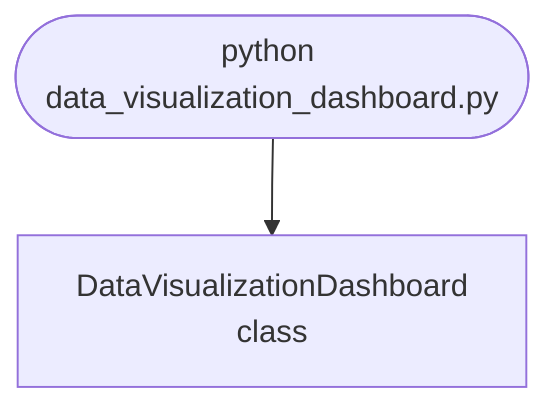

## Abstract
Data Visualization Dashboard is a Python project that visualizes data interactively. The application features charts, dashboards, and a web interface, demonstrating best practices in data science and web development.

## Prerequisites
- Python 3.8 or above
- A code editor or IDE
- Basic understanding of data visualization and web development
- Required libraries: `dash`, `plotly`, `pandas`

## Before you Start
Install Python and the required libraries:
```bash title="Install dependencies" showLineNumbers{1}
pip install dash plotly pandas
```

## Getting Started
#### Create a Project
1. Create a folder named `data-visualization-dashboard`.
2. Open the folder in your code editor or IDE.
3. Create a file named `data_visualization_dashboard.py`.
4. Copy the code below into your file.

## Write the Code
<FileCode file="projects/advance/data_visualization_dashboard.py" lang="python" title="Data Visualization Dashboard" />

## Example Usage
```bash title="Run dashboard" showLineNumbers{1}
python data_visualization_dashboard.py
```

## What it produces

Running the file exactly as it ships takes **1.9 s** and prints:

```text title="python data_visualization_dashboard.py"
Data Visualization Dashboard Demo
saved data_visualization_dashboard.png
```

<Figure
  single src="/images/projects/data_visualization_dashboard.png"
  alt="Output of data_visualization_dashboard.py, produced by running the file."
  title="Produced by this project, not drawn for the page"
  caption="Written by the run above. If the project stops producing it, the page's figure asset goes missing and check_docs reports it — which is the point of generating it rather than drawing it."
/>

## How it fits together

Read from the top: this is what runs when you execute the file, and which function calls which. It is generated from the code, so it cannot drift from it.



## Explanation
### Key Features
- **Interactive Charts:** Visualizes data with interactive charts.
- **Dashboards:** Displays multiple data views.
- **Web Interface:** Runs as a web app.
- **Error Handling:** Validates inputs and manages exceptions.

### Code Breakdown
1. **What it imports** (lines 1–2)
```python title="data_visualization_dashboard.py" showLineNumbers startLineNumber=1
import pandas as pd
import matplotlib.pyplot as plt
```

2. **`DataVisualizationDashboard` — the class** (lines 4–15)
```python title="data_visualization_dashboard.py" showLineNumbers startLineNumber=4
class DataVisualizationDashboard:
    def __init__(self, data):
        self.data = data

    def plot(self):
        self.data.plot(kind='bar')
        plt.title('Data Visualization Dashboard')
        plt.xlabel('Category')
        plt.ylabel('Value')
        plt.savefig("data_visualization_dashboard.png", dpi=120, bbox_inches="tight")
        print("saved data_visualization_dashboard.png")
        plt.show()
```

The file defines 1 top-level symbol in all; the whole thing is above under *Write the Code*.

## Features
- **Data Visualization:** Interactive charts and dashboards
- **Modular Design:** Separate functions for each task
- **Error Handling:** Manages invalid inputs and exceptions
- **Production-Ready:** Scalable and maintainable code

## Next Steps
Enhance the project by:
- Integrating with real-world datasets
- Supporting advanced chart types
- Creating multi-page dashboards
- Adding user authentication
- Unit testing for reliability

## Educational Value
This project teaches:
- **Data Science:** Visualization and dashboarding
- **Software Design:** Modular, maintainable code
- **Error Handling:** Writing robust Python code

## Real-World Applications
- **Business Intelligence Platforms**
- **Analytics Dashboards**
- **Data Science Tools**

## Checkpoint exercise

This exercise practises grouping data with pandas and binning values, the aggregation step behind every dashboard chart.

<DataCampExercise
  lang="python"
  hint={`Use df.groupby('region')['sales'].sum() for the totals.`}
  code={`import pandas as pd
import numpy as np

df = pd.DataFrame({
    "region": ["north", "south", "north", "east", "south", "east", "north"],
    "sales": [120, 80, 150, 60, 95, 70, 130],
})

totals = df.groupby("region")["sales"].___.sort_values(ascending=False)
print(totals.to_dict())
print("top region:", totals.index[0])

counts, edges = np.histogram(df["sales"], bins=3)
print("bin counts:", counts.tolist())
print("share of north:", f"{totals['north'] / totals.sum():.1%}")`}
  solution={`import pandas as pd
import numpy as np

df = pd.DataFrame({
    "region": ["north", "south", "north", "east", "south", "east", "north"],
    "sales": [120, 80, 150, 60, 95, 70, 130],
})

totals = df.groupby("region")["sales"].sum().sort_values(ascending=False)
print(totals.to_dict())
print("top region:", totals.index[0])

counts, edges = np.histogram(df["sales"], bins=3)
print("bin counts:", counts.tolist())
print("share of north:", f"{totals['north'] / totals.sum():.1%}")`}
  sct={`test_output_contains("{'north': 400, 'south': 175, 'east': 130}", pattern=False)
test_output_contains("bin counts: [3, 1, 3]", pattern=False)
test_output_contains("share of north: 56.7%", pattern=False)
success_msg("Nice - you ran the key step of this project.")`}
  height={160}
/>

## Conclusion
Data Visualization Dashboard demonstrates how to build a scalable and interactive dashboard using Python. With modular design and extensibility, this project can be adapted for real-world applications in analytics, business intelligence, and more. For more advanced projects, visit Python Central Hub.
