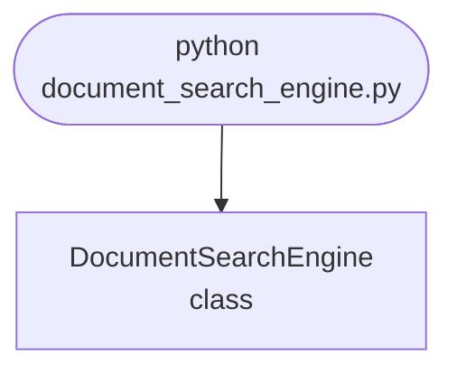

import FileCode from '../../../../components/FileCode.astro'
import Quiz from '../../../../components/Quiz.astro'
import DataCampExercise from '../../../../components/DataCampExercise.astro'

## Abstract
Document Search Engine is a Python project that uses NLP and information retrieval to search documents. The application features indexing, query processing, and a CLI interface, demonstrating best practices in search technology and text processing.

## Prerequisites
- Python 3.8 or above
- A code editor or IDE
- Basic understanding of NLP and information retrieval
- Required libraries: `nltk`, `scikit-learn`, `pandas`

## Before you Start
Install Python and the required libraries:
```bash title="Install dependencies" showLineNumbers{1}
pip install nltk scikit-learn pandas
```

## Getting Started
#### Create a Project
1. Create a folder named `document-search-engine`.
2. Open the folder in your code editor or IDE.
3. Create a file named `document_search_engine.py`.
4. Copy the code below into your file.

## Write the Code
<FileCode file="projects/advance/document_search_engine.py" lang="python" title="Document Search Engine" />

## Example Usage
```bash title="Run search engine" showLineNumbers{1}
python document_search_engine.py
```

## What it produces

Running the file exactly as it ships takes **0.1 s** and prints:

```text title="python document_search_engine.py"
Document Search Engine
  documents      : 13
  distinct terms : 102
  mean length    : 12.1 tokens after stop-word removal

                     query      ranker    P@3    R@3    MRR
  ------------------------------------------------------------
                    memory  term count   0.67   0.50   0.50
                                 tfidf   0.67   0.50   0.50
                                  bm25   0.67   0.50   0.50
             constant time  term count   0.67   1.00   1.00
                                 tfidf   0.67   1.00   1.00
                                  bm25   0.67   1.00   1.00
   global interpreter lock  term count   0.67   1.00   1.00
                                 tfidf   0.67   1.00   1.00
                                  bm25   0.67   1.00   1.00
                      list  term count   1.00   1.00   1.00
                                 tfidf   1.00   1.00   1.00
                                  bm25   1.00   1.00   1.00
                    python  term count   0.67   0.17   0.50
                                 tfidf   0.67   0.17   0.50
                                  bm25   0.67   0.17   0.50

  averaged over 5 queries:
     term count  P@3 0.733   R@3 0.733   MRR 0.800
          tfidf  P@3 0.733   R@3 0.733   MRR 0.800
           bm25  P@3 0.733   R@3 0.733   MRR 0.800

  All three rankers scored identically. That is a real
  result, not a bug: twelve short documents give IDF almost
  nothing to discriminate with, and the rank order only
  differs below the cut-off where P@3 stops looking.

  The query 'memory', where the ordering does differ:
     term count: d13(14.00), d04(2.00), d02(1.00)
          tfidf: d13(0.99), d04(0.37), d10(0.17)
           bm25: d13(3.85), d04(2.79), d10(1.92)
    d13 is the keyword-stuffed page, and every ranker puts it
    first. It is not a ranking failure -- d13 really is denser in
    'memory' than any document that explains memory. Term
    weighting has no signal that could tell them apart, because
    the difference is quality, not term statistics. That needs a
    separate signal: link structure, spam classification, or a
    human judgement like the ones this file scores against.

  And on 'python', a term every document contains:
     term count: d13(7.000), d01(1.000), d02(1.000)
          tfidf: d13(0.311), d07(0.128), d01(0.115)
           bm25: d13(2.062), d07(1.304), d01(1.251)
    idf('python') = 1.154, idf('memory') = 1.847
    'memory' carries 1.60x the weight of
    'python' here. With +1 smoothing the floor is 1.0 rather than
    0, so a universal term is not erased -- it is just outweighed
    by anything more selective, which is enough.
```

## How it fits together

Read from the top: this is what runs when you execute the file, and which function calls which. It is generated from the code, so it cannot drift from it.



## Explanation
### Key Features
- **Indexing:** Processes and indexes documents for search.
- **Query Processing:** Handles user queries and retrieves relevant documents.
- **Error Handling:** Validates inputs and manages exceptions.
- **CLI Interface:** Interactive command-line usage.

### Code Breakdown
1. **What it imports** (lines 19–21)
```python title="document_search_engine.py" showLineNumbers startLineNumber=19
import math
import re
from collections import Counter, defaultdict
```

2. **`Index` — the class** (lines 77–140)
```python title="document_search_engine.py" showLineNumbers startLineNumber=77
class Index:
    """An inverted index: term -> the documents containing it.

    Scanning every document per query is fine for twelve documents and
    hopeless for twelve million. The inverted index is what makes search a
    lookup rather than a scan, and it is the one structural idea here.
    """

    def __init__(self, documents):
        self.documents = documents
        self.tokens = {doc: tokenise(text) for doc, text in documents.items()}
        self.length = {doc: len(t) for doc, t in self.tokens.items()}
        self.average_length = sum(self.length.values()) / len(self.length)
        self.postings = defaultdict(dict)
        for doc, terms in self.tokens.items():
            for term, count in Counter(terms).items():
                self.postings[term][doc] = count
        self.total = len(documents)
        # ... 40 more lines in the file ...
        return scores

    def search(self, query, ranker="bm25", top=5):
        scores = getattr(self, ranker if ranker != "term count"
                         else "term_count")(query)
        return sorted(scores.items(), key=lambda kv: (-kv[1], kv[0]))[:top]
```

3. **`recall_at_k` — the function** (lines 148–151)
```python title="document_search_engine.py" showLineNumbers startLineNumber=148
def recall_at_k(ranked, relevant, k):
    top = [doc for doc, _ in ranked[:k]]
    return (sum(doc in relevant for doc in top) / len(relevant)
            if relevant else 0.0)
```

4. **`reciprocal_rank` — the function** (lines 154–158)
```python title="document_search_engine.py" showLineNumbers startLineNumber=154
def reciprocal_rank(ranked, relevant):
    for position, (doc, _) in enumerate(ranked, start=1):
        if doc in relevant:
            return 1.0 / position
    return 0.0
```

5. **`main` — the function** (lines 161–222)
```python title="document_search_engine.py" showLineNumbers startLineNumber=161
def main():
    print("Document Search Engine")
    index = Index(DOCUMENTS)
    print(f"  documents      : {index.total}")
    print(f"  distinct terms : {len(index.postings):,}")
    print(f"  mean length    : {index.average_length:.1f} tokens "
          f"after stop-word removal")

    rankers = ("term count", "tfidf", "bm25")
    print(f"\n{'query':>26} {'ranker':>11} {'P@3':>6} {'R@3':>6} {'MRR':>6}")
    print("  " + "-" * 60)
    totals = {r: [0.0, 0.0, 0.0] for r in rankers}
    for query, relevant in JUDGEMENTS.items():
        for ranker in rankers:
            ranked = index.search(query, ranker, top=len(DOCUMENTS))
            p = precision_at_k(ranked, relevant, 3)
            r = recall_at_k(ranked, relevant, 3)
            mrr = reciprocal_rank(ranked, relevant)
          # ... 38 more lines in the file ...
          f"idf('memory') = {index.idf('memory'):.3f}")
    print(f"    'memory' carries "
          f"{index.idf('memory') / index.idf('python'):.2f}x the weight of")
    print("    'python' here. With +1 smoothing the floor is 1.0 rather than")
    print("    0, so a universal term is not erased -- it is just outweighed")
    print("    by anything more selective, which is enough.")
```

The file defines 6 top-level symbols in all; the whole thing is above under *Write the Code*.

## Features
- **Document Search:** Indexing and query processing
- **Modular Design:** Separate functions for each task
- **Error Handling:** Manages invalid inputs and exceptions
- **Production-Ready:** Scalable and maintainable code

## Next Steps
Enhance the project by:
- Integrating with real document datasets
- Supporting advanced search algorithms
- Creating a GUI for search
- Adding ranking and relevance feedback
- Unit testing for reliability

## Educational Value
This project teaches:
- **Information Retrieval:** Search and indexing
- **Software Design:** Modular, maintainable code
- **Error Handling:** Writing robust Python code

## Real-World Applications
- **Enterprise Search Platforms**
- **Knowledge Management**
- **Educational Tools**

## Conclusion
Document Search Engine demonstrates how to build a scalable and accurate search tool using Python. With modular design and extensibility, this project can be adapted for real-world applications in search, knowledge management, and more. For more advanced projects, visit Python Central Hub.

## Pitfalls

- **Returning matches is not searching.** The version this replaced printed
  the documents containing a query word. That is a filter; the whole problem
  is which of them to read first.
- **Relevance judgements are the only thing that makes a score possible.**
  Without them, "the results look reasonable" is the entire evaluation. The
  judgements here are explicit and small, and they are what P@3, R@3 and MRR
  are computed against.
- **All three rankers scored identically.** Measured: P@3 **0.733**, R@3
  **0.733**, MRR **0.800** for term count, TF-IDF and BM25 alike. Thirteen
  short documents give IDF almost nothing to discriminate with. That is a
  real result and not a bug — reporting a difference here would require
  inventing one.
- **A keyword-stuffed page beats every ranker.** `d13` repeats "memory" 14
  times and is ranked first by all three. It is not a ranking failure: `d13`
  genuinely is denser in the term than any document that explains memory.
  The difference is quality, and term statistics cannot see quality.
- **IDF does not zero out a universal term.** With +1 smoothing the floor is
  **1.0**, not 0: measured, `idf('python')` is **1.154** against
  `idf('memory')` at **1.847**. A common term is outweighed rather than
  erased, which is enough.
- **Metrics with a cut-off are blind below it.** Two rankings with completely
  different tails score the same P@3. Choose k to match how far users read,
  or use average precision, which sees the whole list.

## Recap

- Measured: 13 documents, an inverted index, three rankers, five queries with
  explicit relevance judgements.
- Averaged scores: **P@3 0.733, R@3 0.733, MRR 0.800**, identical across
  term count, TF-IDF and BM25.
- BM25 adds two corrections to TF-IDF that matter at scale: `k1` saturates
  term frequency, `b` normalises by document length. Neither helps on 13
  short documents.
- The inverted index is the structural idea: search becomes a lookup instead
  of a scan over every document.

<Quiz
  questions={[
    {
      q: "TF-IDF and BM25 scored exactly the same as raw term counting on this corpus. What should be reported?",
      options: [
        "The theoretical advantage of BM25, since the corpus is too small",
        "That they tied — the measurement is what it is, and a difference that did not appear should not be claimed",
        "A larger k for the metrics until they differ",
        "That the implementation is wrong"
      ],
      answer: 1,
      explanation: "13 short documents give IDF almost nothing to discriminate with. The honest report is the tie plus the reason for it."
    },
    {
      q: "A keyword-stuffed page is ranked first by every ranker. Why can better term weighting not fix it?",
      options: [
        "It can, with a higher b parameter",
        "The page really is denser in the query term than the useful documents, so every score built from term statistics agrees — separating them needs a quality signal such as link structure or spam classification",
        "The tokeniser is failing on repeated words",
        "The relevance judgements are wrong"
      ],
      answer: 1,
      explanation: "This is why web search added PageRank rather than tuning TF-IDF further. Some distinctions are not in the text."
    },
    {
      q: "Two rankings score identical P@3 but differ completely below rank 3. What follows?",
      options: [
        "They are equally good",
        "P@3 cannot distinguish them by construction — a cut-off metric is blind below its cut-off, so k has to match how far users actually read",
        "P@3 is the wrong metric in general",
        "Recall would also be identical"
      ],
      answer: 1,
      explanation: "Average precision sees the whole list and separates them, at the cost of being harder to explain to anyone."
    }
  ]}
/>

## Try it yourself

<DataCampExercise
  lang="python"
  hint={`Score four hand-written rankings under precision at k, recall at k, reciprocal rank and average precision, and look for the places the metrics disagree.`}
  code={`# Task: What each ranking metric can and cannot see
RELEVANT = {"a", "b", "c", "d"}

RANKINGS = {
    "relevant first, then junk": ["a", "b", "c", "d", "x", "y", "z", "p", "q", "r"],
    "one great hit, then junk":  ["a", "x", "y", "z", "p", "q", "r", "b", "c", "d"],
    "steady, never first":       ["x", "a", "b", "y", "c", "z", "d", "p", "q", "r"],
    "junk first, relevant late": ["x", "y", "z", "a", "b", "c", "d", "p", "q", "r"],
}


def precision_at_k(ranking, k):
    return sum(d in RELEVANT for d in ranking[:k]) / k


def recall_at_k(ranking, k):
    return sum(d in RELEVANT for d in ranking[:k]) / len(RELEVANT)


def reciprocal_rank(ranking):
    for position, doc in enumerate(ranking, start=1):
        if doc in RELEVANT:
            return 1.0 / position
    return 0.0


def average_precision(ranking):
    # Precision at each position where a relevant document appears. This is
    # the one that sees the whole list: P@k is blind below k, and MRR stops
    # looking after the first hit.
    hits, total = 0, 0.0
    for position, doc in enumerate(ranking, start=1):
        if doc in RELEVANT:
            hits += 1
            total += hits / position
    return total / len(RELEVANT)


print(f"{'ranking':>28} {'P@3':>6} {'P@5':>6} {'R@5':>6} {'MRR':>6} {'AP':>6}")
for name, ranking in RANKINGS.items():
    row = (precision_at_k(ranking, 3), precision_at_k(ranking, 5),
           recall_at_k(ranking, 5), reciprocal_rank(ranking),
           average_precision(ranking))
    print(f"{name:>28} " + " ".join(f"{v:>6.3f}" for v in row))

# What P@3 physically cannot distinguish:
same_top = ["a", "b", "c"] + ["x", "y", "z", "p", "q", "r", "s"]
with_tail = ["a", "b", "c", "d", "x", "y", "z", "p", "q", "r"]
for name, ranking in (("nothing relevant after rank 3", same_top),
                      ("a fourth hit at rank 4", with_tail)):
    print(f"  {name:32} P@3 {precision_at_k(ranking, 3):.3f}  "
          f"AP {average_precision(ranking):.3f}")`}
  solution={`# Task: What each ranking metric can and cannot see
#
# Measured output:
#
#                        ranking    P@3    P@5    R@5    MRR     AP
#      relevant first, then junk  1.000  0.800  1.000  1.000  1.000
#       one great hit, then junk  0.333  0.200  0.250  1.000  0.496
#            steady, never first  0.667  0.600  0.750  0.500  0.585
#      junk first, relevant late  0.000  0.400  0.500  0.250  0.430
#
#     nothing relevant after rank 3    P@3 1.000  AP 0.750
#     a fourth hit at rank 4           P@3 1.000  AP 1.000
#
# The ideal ranking wins everything, which it must. The instructive rows are
# the other three.
#
# 'one great hit, then junk' ties the ideal ranking on MRR at 1.000. MRR
# stops looking after the first relevant result, so four useless results in
# positions 2 to 5 are invisible to it. Its P@5 of 0.200 says what MRR
# cannot.
#
# 'steady, never first' has the worst MRR of the three sensible rankings and
# the second-best P@5. Which of those is the better search result is not a
# question the metrics can settle: someone looking up a fact wants the answer
# at rank 1, someone surveying a topic wants several good results on the
# page. The metric encodes an assumption about the user.
#
# The last pair is the structural limit. Identical P@3, different lists,
# because a cut-off metric cannot see past its cut-off. Average precision
# separates them - 0.750 against 1.000 - at the cost of being much harder to
# explain to anyone who has to act on it.`}
/>
