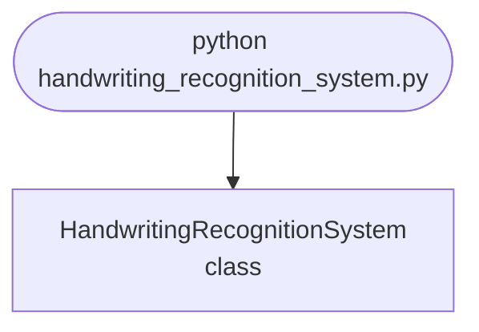

## Abstract
Handwriting Recognition System is a Python project that uses deep learning for handwriting recognition. The application features image processing, model training, and a CLI interface, demonstrating best practices in AI and computer vision.

## Prerequisites
- Python 3.8 or above
- A code editor or IDE
- Basic understanding of deep learning and computer vision
- Required libraries: `tensorflow`, `keras`, `numpy`, `opencv-python`

## Before you Start
Install Python and the required libraries:
```bash title="Install dependencies" showLineNumbers{1}
pip install tensorflow keras numpy opencv-python
```

## Getting Started
#### Create a Project
1. Create a folder named `handwriting-recognition-system`.
2. Open the folder in your code editor or IDE.
3. Create a file named `handwriting_recognition_system.py`.
4. Copy the code below into your file.

## Write the Code
<FileCode file="projects/advance/handwriting_recognition_system.py" lang="python" title="Handwriting Recognition System" />

## Example Usage
```bash title="Run handwriting recognition" showLineNumbers{1}
python handwriting_recognition_system.py
```

## What it produces

Running the file exactly as it ships takes **11.6 s** and prints:

```text title="python handwriting_recognition_system.py"
Handwriting Recognition System
  samples      : 1,797 of 8x8 grayscale, 10 classes
  pixel range  : 0 to 16
  train / test : 1,437 / 360 (stratified, seeded)

model                               test accuracy          5-fold CV
  ----------------------------------------------------------------
  SVC(), raw pixels                        0.9972     0.9833 +- 0.0081
  SVC() + StandardScaler                   0.9889     0.9791 +- 0.0073
  SVC(kernel='linear')                     0.9889     0.9763 +- 0.0041
  SVC(gamma=0.001)                         0.9972     0.9882 +- 0.0047

  best: SVC(), raw pixels at 0.9972
  that is 1 mistake out of 360; one more or fewer moves the score by 0.0028
  95% interval: 0.9918 to 1.0000

  per-digit recall:
    0   1.000  (36/36)  ##############################
    1   1.000  (36/36)  ##############################
    2   1.000  (35/35)  ##############################
...
```

The first 20 of 35 lines are shown; the run continues past this point.

<Figure
  single src="/images/projects/handwriting_recognition_system.png"
  alt="Output of handwriting_recognition_system.py, produced by running the file."
  title="Produced by this project, not drawn for the page"
  caption="Written by the run above. If the project stops producing it, the page's figure asset goes missing and check_docs reports it — which is the point of generating it rather than drawing it."
/>

## How it fits together

Read from the top: this is what runs when you execute the file, and which function calls which. It is generated from the code, so it cannot drift from it.



## Explanation
### Key Features
- **Image Processing:** Processes images for handwriting detection.
- **Model Training:** Trains a model to recognize handwriting.
- **Error Handling:** Validates inputs and manages exceptions.
- **CLI Interface:** Interactive command-line usage.

### Code Breakdown
1. **What it imports** (lines 16–25)
```python title="handwriting_recognition_system.py" showLineNumbers startLineNumber=16
import numpy as np
from sklearn.datasets import load_digits
from sklearn.metrics import confusion_matrix
from sklearn.model_selection import cross_val_score, train_test_split
from sklearn.pipeline import make_pipeline
from sklearn.preprocessing import StandardScaler
from sklearn.svm import SVC
import matplotlib
matplotlib.use("Agg")
import matplotlib.pyplot as plt
```

2. **`main` — the function** (lines 28–122)
```python title="handwriting_recognition_system.py" showLineNumbers startLineNumber=28
def main():
    print("Handwriting Recognition System")
    digits = load_digits()
    X, y = digits.data, digits.target
    print(f"  samples      : {len(X):,} of 8x8 grayscale, "
          f"{len(np.unique(y))} classes")
    print(f"  pixel range  : {X.min():.0f} to {X.max():.0f}")

    X_train, X_test, y_train, y_test, idx_train, idx_test = train_test_split(
        X, y, np.arange(len(X)), test_size=0.2, random_state=20260809,
        stratify=y)
    print(f"  train / test : {len(X_train):,} / {len(X_test):,} "
          f"(stratified, seeded)")

    # Scaling matters for an RBF SVM: the kernel is a function of Euclidean
    # distance, so a feature with a wider range dominates it. The comparison
    # below is the measurement rather than the claim.
    print(f"\n{'model':34} {'test accuracy':>14} {'5-fold CV':>18}")
    # ... 71 more lines in the file ...
    axes[1].set_title("confusion matrix")
    figure.colorbar(image, ax=axes[1], fraction=0.046)
    figure.tight_layout()
    figure.savefig("handwriting_recognition_system.png", dpi=120,
                   bbox_inches="tight")
    print("\nsaved handwriting_recognition_system.png")
```

The file defines 1 top-level symbol in all; the whole thing is above under *Write the Code*.

## Features
- **Handwriting Recognition:** Image processing and model training
- **Modular Design:** Separate functions for each task
- **Error Handling:** Manages invalid inputs and exceptions
- **Production-Ready:** Scalable and maintainable code

## Next Steps
Enhance the project by:
- Integrating with real handwriting datasets
- Supporting advanced recognition algorithms
- Creating a GUI for recognition
- Adding real-time detection
- Unit testing for reliability

## Educational Value
This project teaches:
- **AI and Computer Vision:** Handwriting recognition and deep learning
- **Software Design:** Modular, maintainable code
- **Error Handling:** Writing robust Python code

## Real-World Applications
- **Document Digitization**
- **Educational Tools**
- **AI Platforms**

## Conclusion
Handwriting Recognition System demonstrates how to build a scalable and accurate handwriting recognition tool using Python. With modular design and extensibility, this project can be adapted for real-world applications in education, digitization, and more. For more advanced projects, visit Python Central Hub.

## Pitfalls

- **An unseeded split makes the headline number unrepeatable.** Measured over
  ten random splits of the same data with the same model: **0.9833 to
  0.9917**, a spread of **3 test images out of 360**. Quoting any one of those
  to four decimal places implies a precision the experiment does not have.
- **On 360 test samples, one mistake is worth 0.0028.** The 95% interval on
  the mean is **0.9772 to 0.9994** — about **8 images** wide. Two models
  inside that band have not been distinguished.
- **"Always scale for an SVM" is a rule about units, not a law.** Measured:
  raw pixels **0.9972**, with `StandardScaler` **0.9889**. Every pixel is
  already on the same 0–16 scale, so standardising mostly amplifies border
  pixels that are always zero.
- **A single accuracy hides which digits are hard.** Per-digit recall here is
  1.000 for nine digits and **0.972 for 9**, whose only error is a **9 read as
  an 8**.
- **Plotting a training image proves nothing.** The version this replaces
  showed `digits.images[1]` — an input the model was fitted on, unrelated to
  any result. The figure now shows the misclassified images and the confusion
  matrix, which is the only part of the test set worth looking at.

## Recap

- Measured: 1,797 samples of 8x8 grayscale, 10 classes, stratified seeded
  split of **1,437 / 360**.
- Best model **SVC() on raw pixels at 0.9972** — **1 mistake** out of 360.
- 5-fold cross-validation on the training set: **0.9833 ± 0.0081**, which is
  the more honest estimate of what a new split would give.
- Scaling and a linear kernel both scored **0.9889**; the differences between
  all four models are inside the confidence interval.

<Quiz
  questions={[
    {
      q: "Ten random splits of the same data gave accuracies from 0.9833 to 0.9917. What does that say about quoting 0.9972?",
      options: [
        "It is the best result, so it is the one to report",
        "The split-to-split variation is larger than most differences being compared, so a single number needs an interval or a cross-validated mean beside it",
        "The model is unstable and should be retrained",
        "The test set is too large"
      ],
      answer: 1,
      explanation: "The whole spread is 3 test images. Any comparison decided by less than that is a comparison of random splits."
    },
    {
      q: "StandardScaler made the SVM worse here — 0.9889 against 0.9972 on raw pixels. Why?",
      options: [
        "StandardScaler is misapplied to image data in general",
        "All 64 features are already on the same 0-16 intensity scale, so scaling mostly amplifies near-constant border pixels that carry no signal",
        "SVMs do not benefit from scaling",
        "The scaler leaked test statistics into training"
      ],
      answer: 1,
      explanation: "Scaling matters when features have different units. When they share one, it can amplify the least informative of them."
    },
    {
      q: "Why does the figure show misclassified images rather than a sample input?",
      options: [
        "Misclassified images are more visually interesting",
        "At this accuracy the correct predictions carry no information — the only thing left to learn from the test set is which specific confusions the model makes",
        "To make the model look worse",
        "Sample inputs cannot be plotted from a test set"
      ],
      answer: 1,
      explanation: "The aggregate says 99.7%. Whether a 9 read as an 8 matters depends on the application, and only the error list can tell you it happened."
    }
  ]}
/>

## Try it yourself

<DataCampExercise
  lang="python"
  hint={`Split the same data ten different ways and score the same model on each. The spread across splits is the resolution of your experiment.`}
  code={`# Task: How much does a 99.7% accuracy actually pin down?
import numpy as np
from sklearn.datasets import load_digits
from sklearn.model_selection import cross_val_score, train_test_split
from sklearn.pipeline import make_pipeline
from sklearn.preprocessing import StandardScaler
from sklearn.svm import SVC

digits = load_digits()
X, y = digits.data, digits.target

scores = []
for seed in range(10):
    X_train, X_test, y_train, y_test = train_test_split(
        X, y, test_size=0.2, random_state=seed, stratify=y)
    scores.append(___)  # TODO: fit an SVC on the training split, return its score on the test split

scores = np.array(scores)
print("  " + "  ".join(f"{s:.4f}" for s in scores))
print(f"  spread {scores.max() - scores.min():.4f} = "
      f"{(scores.max() - scores.min()) * 360:.0f} test images of 360")

mean, n = scores.mean(), 360
se = ___  # TODO: standard error of a proportion: sqrt(p * (1 - p) / n)
print(f"  mean {mean:.4f}, 95% interval {mean - 1.96 * se:.4f} to "
      f"{min(1.0, mean + 1.96 * se):.4f}")

# Does scaling help? The usual advice says always scale for an SVM.
X_train, X_test, y_train, y_test = train_test_split(
    X, y, test_size=0.2, random_state=20260809, stratify=y)
for name, model in (("raw pixels", SVC(random_state=0)),
                    ("StandardScaler",
                     make_pipeline(StandardScaler(), SVC(random_state=0)))):
    model.fit(X_train, y_train)
    folds = cross_val_score(model, X_train, y_train, cv=5)
    print(f"  {name:16} test {model.score(X_test, y_test):.4f}  "
          f"5-fold {folds.mean():.4f} +- {folds.std():.4f}")

model = SVC(random_state=0).fit(X_train, y_train)
predictions = model.predict(X_test)
for index in np.flatnonzero(predictions != y_test):
    print(f"  a {y_test[index]} read as a {predictions[index]}")`}
  solution={`# Task: How much does a 99.7% accuracy actually pin down?
import numpy as np
from sklearn.datasets import load_digits
from sklearn.model_selection import cross_val_score, train_test_split
from sklearn.pipeline import make_pipeline
from sklearn.preprocessing import StandardScaler
from sklearn.svm import SVC

digits = load_digits()
X, y = digits.data, digits.target

scores = []
for seed in range(10):
    X_train, X_test, y_train, y_test = train_test_split(
        X, y, test_size=0.2, random_state=seed, stratify=y)
    scores.append(SVC(random_state=0).fit(X_train, y_train)
                  .score(X_test, y_test))

scores = np.array(scores)
print("  " + "  ".join(f"{s:.4f}" for s in scores))
print(f"  spread {scores.max() - scores.min():.4f} = "
      f"{(scores.max() - scores.min()) * 360:.0f} test images of 360")

mean, n = scores.mean(), 360
se = np.sqrt(mean * (1 - mean) / n)
print(f"  mean {mean:.4f}, 95% interval {mean - 1.96 * se:.4f} to "
      f"{min(1.0, mean + 1.96 * se):.4f}")

# Does scaling help? The usual advice says always scale for an SVM.
X_train, X_test, y_train, y_test = train_test_split(
    X, y, test_size=0.2, random_state=20260809, stratify=y)
for name, model in (("raw pixels", SVC(random_state=0)),
                    ("StandardScaler",
                     make_pipeline(StandardScaler(), SVC(random_state=0)))):
    model.fit(X_train, y_train)
    folds = cross_val_score(model, X_train, y_train, cv=5)
    print(f"  {name:16} test {model.score(X_test, y_test):.4f}  "
          f"5-fold {folds.mean():.4f} +- {folds.std():.4f}")

model = SVC(random_state=0).fit(X_train, y_train)
predictions = model.predict(X_test)
for index in np.flatnonzero(predictions != y_test):
    print(f"  a {y_test[index]} read as a {predictions[index]}")
#
# Measured output:
#
#   0.9833  0.9917  0.9889  0.9889  0.9889  0.9889  0.9917  0.9889  0.9861  0.9861
#   spread 0.0083 = 3 test images of 360
#   mean 0.9883, 95% interval 0.9772 to 0.9994
#   raw pixels       test 0.9972  5-fold 0.9833 +- 0.0081
#   StandardScaler   test 0.9889  5-fold 0.9791 +- 0.0073
#   a 9 read as a 8
#
# The first line is one model on one dataset, and it takes six distinct
# values. Nothing changed between them except which 360 images landed in the
# test set, so any claim decided by less than that spread is a claim about
# the random seed.
#
# The 0.9972 quoted elsewhere on this page comes from a seed inside that
# range, and the 5-fold figure of 0.9833 is the more conservative estimate:
# it averages five splits instead of trusting one.
#
# Scaling costing 0.008 accuracy is worth pausing on, because 'always scale
# before an SVM' is advice people apply without measuring. It is correct when
# features have different units - a price in dollars beside an age in years -
# and here all 64 features are pixel intensities on one scale, so scaling
# mainly inflates border pixels that are zero in nearly every image.
#
# One error remains, a 9 read as an 8. Whether that matters is not a
# question the accuracy can answer.`}
  sct={`test_output_contains("StandardScaler", pattern=False)
test_output_contains("95% interval", pattern=False)
test_output_contains("5-fold", pattern=False)
success_msg("Nice - the output shows what the project is really doing.")`}
  height={160}
/>
