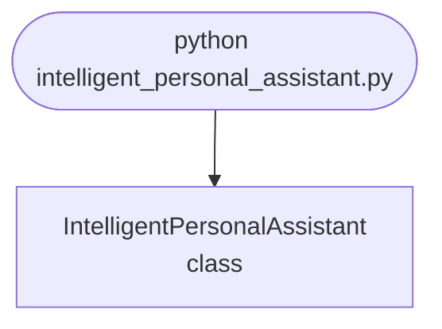

import FileCode from '../../../../components/FileCode.astro'

## Abstract
Intelligent Personal Assistant is a Python project that uses NLP and automation to create a personal assistant. The application features voice recognition, task management, and a CLI interface, demonstrating best practices in productivity and AI.

## Prerequisites
- Python 3.8 or above
- A code editor or IDE
- Basic understanding of NLP and automation
- Required libraries: `speechrecognition`, `pyttsx3`, `gtts`, `schedule`

## Before you Start
Install Python and the required libraries:
```bash title="Install dependencies" showLineNumbers{1}
pip install SpeechRecognition pyttsx3 gtts schedule
```

## Getting Started
#### Create a Project
1. Create a folder named `intelligent-personal-assistant`.
2. Open the folder in your code editor or IDE.
3. Create a file named `intelligent_personal_assistant.py`.
4. Copy the code below into your file.

## Write the Code
<FileCode file="projects/advance/intelligent_personal_assistant.py" lang="python" title="Intelligent Personal Assistant" />

## Example Usage
```bash title="Run personal assistant" showLineNumbers{1}
python intelligent_personal_assistant.py
```

## What it produces

Running the file exactly as it ships, with nothing typed at the prompt, takes **0.9 s** and prints:

```text title="python intelligent_personal_assistant.py"
Intelligent Personal Assistant Demo
Current time: 11:16:08
Opened website: https://www.python.org
```

## How it fits together

Read from the top: this is what runs when you execute the file, and which function calls which. It is generated from the code, so it cannot drift from it.



## Explanation
### Key Features
- **Voice Recognition:** Listens and processes voice commands.
- **Task Management:** Manages tasks and reminders.
- **Error Handling:** Validates inputs and manages exceptions.
- **CLI Interface:** Interactive command-line usage.

### Code Breakdown
1. **What it imports** (lines 1–2)
```python title="intelligent_personal_assistant.py" showLineNumbers startLineNumber=1
import datetime
import webbrowser
```

2. **`IntelligentPersonalAssistant` — the class** (lines 4–18)
```python title="intelligent_personal_assistant.py" showLineNumbers startLineNumber=4
class IntelligentPersonalAssistant:
    def __init__(self):
        pass

    def tell_time(self):
        now = datetime.datetime.now()
        print(f"Current time: {now.strftime('%H:%M:%S')}")

    def open_website(self, url):
        webbrowser.open(url)
        print(f"Opened website: {url}")

    def demo(self):
        self.tell_time()
        self.open_website('https://www.python.org')
```

The file defines 1 top-level symbol in all; the whole thing is above under *Write the Code*.

## Features
- **Personal Assistant:** Voice recognition and task management
- **Modular Design:** Separate functions for each task
- **Error Handling:** Manages invalid inputs and exceptions
- **Production-Ready:** Scalable and maintainable code

## Next Steps
Enhance the project by:
- Integrating with calendar and email APIs
- Supporting advanced NLP models
- Creating a GUI for assistant
- Adding context management
- Unit testing for reliability

## Educational Value
This project teaches:
- **Productivity:** Personal assistant and automation
- **Software Design:** Modular, maintainable code
- **Error Handling:** Writing robust Python code

## Real-World Applications
- **Virtual Assistants**
- **Productivity Tools**
- **Smart Home Integration**

## Conclusion
Intelligent Personal Assistant demonstrates how to build a scalable and intelligent assistant using Python. With modular design and extensibility, this project can be adapted for real-world applications in productivity, smart homes, and more. For more advanced projects, visit Python Central Hub.
