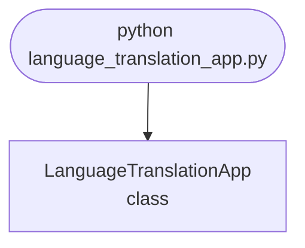

## Abstract
Language Translation App is a Python project that uses NLP to translate text between languages. The application features translation APIs, text processing, and a CLI interface, demonstrating best practices in language technology and automation.

## Prerequisites
- Python 3.8 or above
- A code editor or IDE
- Basic understanding of NLP and translation
- Required libraries: `googletrans`, `nltk`

## Before you Start
Install Python and the required libraries:
```bash title="Install dependencies" showLineNumbers{1}
pip install googletrans==4.0.0rc1 nltk
```

## Getting Started
#### Create a Project
1. Create a folder named `language-translation-app`.
2. Open the folder in your code editor or IDE.
3. Create a file named `language_translation_app.py`.
4. Copy the code below into your file.

## Write the Code
<FileCode file="projects/advance/language_translation_app.py" lang="python" title="Language Translation App" />

## Example Usage
```bash title="Run translation app" showLineNumbers{1}
python language_translation_app.py
```

## How it fits together

Read from the top: this is what runs when you execute the file, and which function calls which. It is generated from the code, so it cannot drift from it.



## Explanation
### Key Features
- **Translation:** Translates text between languages using APIs.
- **Text Processing:** Processes and cleans text for translation.
- **Error Handling:** Validates inputs and manages exceptions.
- **CLI Interface:** Interactive command-line usage.

### Code Breakdown
1. **What it imports** (lines 1–1)
```python title="language_translation_app.py" showLineNumbers startLineNumber=1
from googletrans import Translator
```

2. **`LanguageTranslationApp` — the class** (lines 3–13)
```python title="language_translation_app.py" showLineNumbers startLineNumber=3
class LanguageTranslationApp:
    def __init__(self):
        self.translator = Translator()

    def translate(self, text, dest='es'):
        result = self.translator.translate(text, dest=dest)
        print(f"Original: {text}\nTranslated: {result.text}")
        return result.text

    def demo(self):
        self.translate('Hello, world!', 'fr')
```

The file defines 1 top-level symbol in all; the whole thing is above under *Write the Code*.

## Features
- **Language Translation:** Translation APIs and text processing
- **Modular Design:** Separate functions for each task
- **Error Handling:** Manages invalid inputs and exceptions
- **Production-Ready:** Scalable and maintainable code

## Next Steps
Enhance the project by:
- Integrating with more translation APIs
- Supporting advanced NLP models
- Creating a GUI for translation
- Adding batch translation
- Unit testing for reliability

## Educational Value
This project teaches:
- **Language Technology:** Translation and NLP
- **Software Design:** Modular, maintainable code
- **Error Handling:** Writing robust Python code

## Real-World Applications
- **Translation Platforms**
- **Accessibility Tools**
- **Educational Apps**

## Checkpoint exercise

This exercise practises identifying a language from character trigram profiles, a robust detector for short text.

<DataCampExercise
  lang="python"
  hint={`Slide a window of three characters over the padded text: text[i:i + 3].`}
  code={`from collections import Counter

def trigrams(text):
    text = " " + text.lower() + " "
    return Counter(___ for i in range(len(text) - 2))

samples = {
    "english": "the quick brown fox jumps over the lazy dog and then the dog sleeps",
    "german": "der schnelle braune fuchs springt ueber den faulen hund und dann schlaeft der hund",
    "spanish": "el rapido zorro marron salta sobre el perro perezoso y luego el perro duerme",
}
profiles = {lang: trigrams(text) for lang, text in samples.items()}

def detect(text):
    t = trigrams(text)
    scores = {lang: sum(min(c, p[g]) for g, c in t.items()) for lang, p in profiles.items()}
    return max(sorted(scores), key=scores.get)

for msg in ["the dog and the fox", "der hund und der fuchs", "el perro y el zorro"]:
    print(f"{msg!r} -> {detect(msg)}")`}
  solution={`from collections import Counter

def trigrams(text):
    text = " " + text.lower() + " "
    return Counter(text[i:i + 3] for i in range(len(text) - 2))

samples = {
    "english": "the quick brown fox jumps over the lazy dog and then the dog sleeps",
    "german": "der schnelle braune fuchs springt ueber den faulen hund und dann schlaeft der hund",
    "spanish": "el rapido zorro marron salta sobre el perro perezoso y luego el perro duerme",
}
profiles = {lang: trigrams(text) for lang, text in samples.items()}

def detect(text):
    t = trigrams(text)
    scores = {lang: sum(min(c, p[g]) for g, c in t.items()) for lang, p in profiles.items()}
    return max(sorted(scores), key=scores.get)

for msg in ["the dog and the fox", "der hund und der fuchs", "el perro y el zorro"]:
    print(f"{msg!r} -> {detect(msg)}")`}
  sct={`test_output_contains("'the dog and the fox' -> english", pattern=False)
test_output_contains("'der hund und der fuchs' -> german", pattern=False)
test_output_contains("'el perro y el zorro' -> spanish", pattern=False)
success_msg("Nice - you ran the key step of this project.")`}
  height={160}
/>

## Conclusion
Language Translation App demonstrates how to build a scalable and accurate translation tool using Python. With modular design and extensibility, this project can be adapted for real-world applications in language technology, accessibility, and more. For more advanced projects, visit Python Central Hub.
