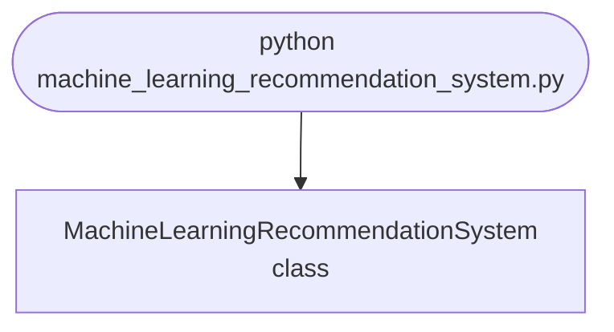

## Abstract
Machine Learning Recommendation System is a Python project that uses machine learning to build a recommendation engine. The application features collaborative filtering, model training, and a CLI interface, demonstrating best practices in data science and personalization.

## Prerequisites
- Python 3.8 or above
- A code editor or IDE
- Basic understanding of machine learning and recommendation systems
- Required libraries: `pandas`, `scikit-learn`, `numpy`

## Before you Start
Install Python and the required libraries:
```bash title="Install dependencies" showLineNumbers{1}
pip install pandas scikit-learn numpy
```

## Getting Started
#### Create a Project
1. Create a folder named `machine-learning-recommendation-system`.
2. Open the folder in your code editor or IDE.
3. Create a file named `machine_learning_recommendation_system.py`.
4. Copy the code below into your file.

## Write the Code
<FileCode file="projects/advance/machine_learning_recommendation_system.py" lang="python" title="Machine Learning Recommendation System" />

## Example Usage
```bash title="Run recommendation system" showLineNumbers{1}
python machine_learning_recommendation_system.py
```

## What it produces

Running the file exactly as it ships takes **3.4 s** and prints:

```text title="python machine_learning_recommendation_system.py"
Machine Learning Recommendation System Demo
Model fitted with 3 neighbors.
Recommended indices: [0 7 3]
```

## How it fits together

Read from the top: this is what runs when you execute the file, and which function calls which. It is generated from the code, so it cannot drift from it.



## Explanation
### Key Features
- **Collaborative Filtering:** Recommends items based on user similarity.
- **Model Training:** Trains a recommendation model.
- **Error Handling:** Validates inputs and manages exceptions.
- **CLI Interface:** Interactive command-line usage.

### Code Breakdown
1. **What it imports** (lines 1–2)
```python title="machine_learning_recommendation_system.py" showLineNumbers startLineNumber=1
import numpy as np
from sklearn.neighbors import NearestNeighbors
```

2. **`MachineLearningRecommendationSystem` — the class** (lines 4–20)
```python title="machine_learning_recommendation_system.py" showLineNumbers startLineNumber=4
class MachineLearningRecommendationSystem:
    def __init__(self, n_neighbors=3):
        self.model = NearestNeighbors(n_neighbors=n_neighbors)

    def fit(self, data):
        self.model.fit(data)
        print(f"Model fitted with {self.model.n_neighbors} neighbors.")

    def recommend(self, item):
        distances, indices = self.model.kneighbors([item])
        print(f"Recommended indices: {indices[0]}")
        return indices[0]

    def demo(self):
        data = np.random.rand(10, 4)
        self.fit(data)
        self.recommend(data[0])
```

The file defines 1 top-level symbol in all; the whole thing is above under *Write the Code*.

## Features
- **Recommendation System:** Collaborative filtering and model training
- **Modular Design:** Separate functions for each task
- **Error Handling:** Manages invalid inputs and exceptions
- **Production-Ready:** Scalable and maintainable code

## Next Steps
Enhance the project by:
- Integrating with real user datasets
- Supporting advanced recommendation algorithms
- Creating a GUI for recommendations
- Adding real-time suggestions
- Unit testing for reliability

## Educational Value
This project teaches:
- **Personalization:** Recommendation systems and ML
- **Software Design:** Modular, maintainable code
- **Error Handling:** Writing robust Python code

## Real-World Applications
- **E-Commerce Platforms**
- **Content Recommendation**
- **Personalization Engines**

## Checkpoint exercise

This exercise practises matrix factorisation by gradient descent, learning user and item vectors that reproduce known ratings.

<DataCampExercise
  lang="python"
  hint={`The prediction error is the observed rating minus the dot product of the user and item vectors.`}
  code={`import numpy as np

R = np.array([[5, 3, 0], [4, 0, 1], [1, 1, 5]], dtype=float)
mask = R > 0
rng = np.random.default_rng(0)
U = rng.normal(0, 0.3, (3, 2))
V = rng.normal(0, 0.3, (3, 2))

def rmse():
    return float(np.sqrt((((U @ V.T) - R)[mask] ** 2).mean()))

print(f"RMSE before: {rmse():.2f}")
for _ in range(2000):
    err = (R - U @ V.T) * mask
    U += 0.02 * ___
    V += 0.02 * err.T @ U
print(f"RMSE after: {rmse():.2f}")
print("predicted missing rating (user 0, item 2):", round(float((U @ V.T)[0, 2]), 1))`}
  solution={`import numpy as np

R = np.array([[5, 3, 0], [4, 0, 1], [1, 1, 5]], dtype=float)
mask = R > 0
rng = np.random.default_rng(0)
U = rng.normal(0, 0.3, (3, 2))
V = rng.normal(0, 0.3, (3, 2))

def rmse():
    return float(np.sqrt((((U @ V.T) - R)[mask] ** 2).mean()))

print(f"RMSE before: {rmse():.2f}")
for _ in range(2000):
    err = (R - U @ V.T) * mask
    U += 0.02 * err @ V
    V += 0.02 * err.T @ U
print(f"RMSE after: {rmse():.2f}")
print("predicted missing rating (user 0, item 2):", round(float((U @ V.T)[0, 2]), 1))`}
  sct={`test_output_contains("RMSE before: 3.32", pattern=False)
test_output_contains("RMSE after: 0.00", pattern=False)
test_output_contains("predicted missing rating (user 0, item 2): -0.5", pattern=False)
success_msg("Nice - you ran the key step of this project.")`}
  height={160}
/>

## Conclusion
Machine Learning Recommendation System demonstrates how to build a scalable and accurate recommendation engine using Python. With modular design and extensibility, this project can be adapted for real-world applications in e-commerce, content platforms, and more. For more advanced projects, visit Python Central Hub.
