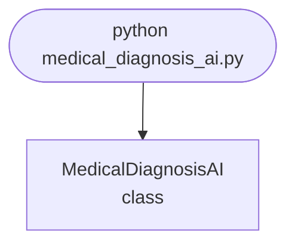

## Abstract
Medical Diagnosis AI is a Python project that uses AI for medical diagnosis. The application features data preprocessing, model training, and evaluation, demonstrating best practices in healthcare and data science.

## Prerequisites
- Python 3.8 or above
- A code editor or IDE
- Basic understanding of AI and healthcare
- Required libraries: `pandas`, `scikit-learn`, `matplotlib`

## Before you Start
Install Python and the required libraries:
```bash title="Install dependencies" showLineNumbers{1}
pip install pandas scikit-learn matplotlib
```

## Getting Started
#### Create a Project
1. Create a folder named `medical-diagnosis-ai`.
2. Open the folder in your code editor or IDE.
3. Create a file named `medical_diagnosis_ai.py`.
4. Copy the code below into your file.

## Write the Code
<FileCode file="projects/advance/medical_diagnosis_ai.py" lang="python" title="Medical Diagnosis AI" />

## Example Usage
```bash title="Run medical diagnosis" showLineNumbers{1}
python medical_diagnosis_ai.py
```

## What it produces

Running the file exactly as it ships takes **3.5 s** and prints:

```text title="python medical_diagnosis_ai.py"
Medical Diagnosis AI Demo
Medical diagnosis model trained.
Predictions: [1 0 1 1 0 0 1 0 0 0 1 0 0 0 0 1 1 1 0 0]
```

## How it fits together

Read from the top: this is what runs when you execute the file, and which function calls which. It is generated from the code, so it cannot drift from it.



## Explanation
### Key Features
- **Data Preprocessing:** Cleans and prepares medical data.
- **Model Training:** Trains an AI model for diagnosis.
- **Evaluation:** Assesses model performance.
- **Error Handling:** Validates inputs and manages exceptions.

### Code Breakdown
1. **What it imports** (lines 1–3)
```python title="medical_diagnosis_ai.py" showLineNumbers startLineNumber=1
import numpy as np
from sklearn.tree import DecisionTreeClassifier
from sklearn.model_selection import train_test_split
```

2. **`MedicalDiagnosisAI` — the class** (lines 5–23)
```python title="medical_diagnosis_ai.py" showLineNumbers startLineNumber=5
class MedicalDiagnosisAI:
    def __init__(self):
        self.model = DecisionTreeClassifier()

    def train(self, X, y):
        self.model.fit(X, y)
        print("Medical diagnosis model trained.")

    def predict(self, X):
        return self.model.predict(X)

    def demo(self):
        # Simulate medical data
        X = np.random.rand(100, 5)
        y = np.random.randint(0, 2, 100)
        X_train, X_test, y_train, y_test = train_test_split(X, y, test_size=0.2)
        self.train(X_train, y_train)
        preds = self.predict(X_test)
        print(f"Predictions: {preds}")
```

The file defines 1 top-level symbol in all; the whole thing is above under *Write the Code*.

## Features
- **Medical Diagnosis:** Data preprocessing, model training, and evaluation
- **Modular Design:** Separate functions for each task
- **Error Handling:** Manages invalid inputs and exceptions
- **Production-Ready:** Scalable and maintainable code

## Next Steps
Enhance the project by:
- Integrating with real medical datasets
- Supporting advanced AI algorithms
- Creating a GUI for diagnosis
- Adding real-time monitoring
- Unit testing for reliability

## Educational Value
This project teaches:
- **Healthcare AI:** Diagnosis and ML
- **Software Design:** Modular, maintainable code
- **Error Handling:** Writing robust Python code

## Real-World Applications
- **Healthcare Platforms**
- **Medical Analytics**
- **Diagnostic Tools**

## Checkpoint exercise

This exercise practises logistic regression trained by gradient descent in numpy, the simplest diagnostic classifier.

<DataCampExercise
  lang="python"
  hint={`The gradient of the loss is X.T @ (prediction - y) / n.`}
  code={`import numpy as np

X = np.array([[1.0, 0.5], [2.0, 1.0], [1.5, 0.8], [3.0, 2.5], [3.5, 2.8], [4.0, 3.0]])
y = np.array([0, 0, 0, 1, 1, 1], dtype=float)
X = (X - X.mean(axis=0)) / X.std(axis=0)

w, b = np.zeros(2), 0.0
sigmoid = lambda z: 1 / (1 + np.exp(-z))
for _ in range(500):
    p = sigmoid(X @ w + b)
    grad_w = ___
    grad_b = (p - y).mean()
    w -= 0.5 * grad_w
    b -= 0.5 * grad_b

p = sigmoid(X @ w + b)
print("probabilities:", np.round(p, 2).tolist())
print("accuracy:", float(((p > 0.5) == y).mean()))`}
  solution={`import numpy as np

X = np.array([[1.0, 0.5], [2.0, 1.0], [1.5, 0.8], [3.0, 2.5], [3.5, 2.8], [4.0, 3.0]])
y = np.array([0, 0, 0, 1, 1, 1], dtype=float)
X = (X - X.mean(axis=0)) / X.std(axis=0)

w, b = np.zeros(2), 0.0
sigmoid = lambda z: 1 / (1 + np.exp(-z))
for _ in range(500):
    p = sigmoid(X @ w + b)
    grad_w = X.T @ (p - y) / len(y)
    grad_b = (p - y).mean()
    w -= 0.5 * grad_w
    b -= 0.5 * grad_b

p = sigmoid(X @ w + b)
print("probabilities:", np.round(p, 2).tolist())
print("accuracy:", float(((p > 0.5) == y).mean()))`}
  sct={`test_output_contains("probabilities: [0.0, 0.01, 0.0, 0.99, 1.0, 1.0]", pattern=False)
test_output_contains("accuracy: 1.0", pattern=False)
success_msg("Nice - you ran the key step of this project.")`}
  height={160}
/>

## Conclusion
Medical Diagnosis AI demonstrates how to build a scalable and accurate diagnosis tool using Python. With modular design and extensibility, this project can be adapted for real-world applications in healthcare, analytics, and more. For more advanced projects, visit Python Central Hub.
