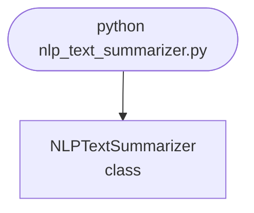

## Abstract
NLP Text Summarizer is a Python project that uses NLP to summarize text. The application features extractive and abstractive summarization, and a CLI interface, demonstrating best practices in text processing and AI.

## Prerequisites
- Python 3.8 or above
- A code editor or IDE
- Basic understanding of NLP and text summarization
- Required libraries: `nltk`, `sumy`, `transformers`

## Before you Start
Install Python and the required libraries:
```bash title="Install dependencies" showLineNumbers{1}
pip install nltk sumy transformers
```

## Getting Started
#### Create a Project
1. Create a folder named `nlp-text-summarizer`.
2. Open the folder in your code editor or IDE.
3. Create a file named `nlp_text_summarizer.py`.
4. Copy the code below into your file.

## Write the Code
<FileCode file="projects/advance/nlp_text_summarizer.py" lang="python" title="NLP Text Summarizer" />

## Example Usage
```bash title="Run text summarizer" showLineNumbers{1}
python nlp_text_summarizer.py
```

## What it produces

Running the file exactly as it ships takes **0.1 s** and prints:

```text title="python nlp_text_summarizer.py"
NLP Text Summarizer
  input            : 13 sentences, 199 words

  sentence ranking (TextRank score):
    1. 0.1266  Neural language models extended that shift by learning represe...
    2. 0.1122  The resulting systems perform well on translation, summarisati...
    3. 0.1025  Its objective is to let computers read, interpret and generate...
    4. 0.1019  Natural language processing is a field of artificial intellige...
    5. 0.0977  Statistical methods replaced them by learning patterns from la...
    ...
    lowest 0.0115  A word is represented as a vector whose position encodes how t...

  TextRank: 5 of 13 sentences, 71 of 199 words (36%)
    - Natural language processing is a field of artificial intelligence concer
    - Its objective is to let computers read, interpret and generate text in a
    - Statistical methods replaced them by learning patterns from large collec
    - Neural language models extended that shift by learning representations r
    - The resulting systems perform well on translation, summarisation and que

  word frequency: 5 of 13 sentences, 82 of 199 words (41%)
...
```

The first 20 of 41 lines are shown; the run continues past this point.

## How it fits together

Read from the top: this is what runs when you execute the file, and which function calls which. It is generated from the code, so it cannot drift from it.



## Explanation
### Key Features
- **Extractive Summarization:** Uses algorithms to extract key sentences.
- **Abstractive Summarization:** Generates new sentences for summary.
- **Error Handling:** Validates inputs and manages exceptions.
- **CLI Interface:** Interactive command-line usage.

### Code Breakdown
1. **What it imports** (lines 19–21)
```python title="nlp_text_summarizer.py" showLineNumbers startLineNumber=19
import math
import re
from collections import Counter
```

2. **`textrank` — the function** (lines 63–81)
```python title="nlp_text_summarizer.py" showLineNumbers startLineNumber=63
def textrank(sentences: list[str], damping=0.85, iterations=40):
    """PageRank over the sentence similarity graph."""
    tokens = [words(s) for s in sentences]
    n = len(sentences)
    if n == 0:
        return []
    weights = [[similarity(tokens[i], tokens[j]) if i != j else 0.0
                for j in range(n)] for i in range(n)]
    out_sum = [sum(row) or 1.0 for row in weights]

    scores = [1.0 / n] * n
    for _ in range(iterations):
        updated = []
        for i in range(n):
            incoming = sum(weights[j][i] / out_sum[j] * scores[j]
                           for j in range(n))
            updated.append((1 - damping) / n + damping * incoming)
        scores = updated
    return scores
```

3. **`summarize` — the function** (lines 84–98)
```python title="nlp_text_summarizer.py" showLineNumbers startLineNumber=84
def summarize(text: str, ratio: float = 0.35) -> list[str]:
    """Return the top-ranked sentences, in their original order.

    Reordering by score would produce a ranked list of sentences, not a
    summary: extractive summaries only read as text because the selected
    sentences keep the order the author put them in.
    """
    sentences = split_sentences(text)
    if len(sentences) < 3:
        return sentences
    scores = textrank(sentences)
    keep = max(1, round(len(sentences) * ratio))
    chosen = sorted(sorted(range(len(sentences)),
                           key=lambda i: -scores[i])[:keep])
    return [sentences[i] for i in chosen]
```

4. **`frequency_baseline` — the function** (lines 101–117)
```python title="nlp_text_summarizer.py" showLineNumbers startLineNumber=101
def frequency_baseline(text: str, ratio: float = 0.35) -> list[str]:
    """Score each sentence by the total frequency of the words in it.

    The baseline exists so the TextRank result has something to be compared
    against. It is much simpler and it is not obviously worse, which is worth
    knowing before reaching for the graph algorithm.
    """
    sentences = split_sentences(text)
    if len(sentences) < 3:
        return sentences
    counts = Counter(w for s in sentences for w in words(s))
    scores = [sum(counts[w] for w in words(s)) / max(len(words(s)), 1)
              for s in sentences]
    keep = max(1, round(len(sentences) * ratio))
    chosen = sorted(sorted(range(len(sentences)),
                           key=lambda i: -scores[i])[:keep])
    return [sentences[i] for i in chosen]
```

5. **`main` — the function** (lines 142–186)
```python title="nlp_text_summarizer.py" showLineNumbers startLineNumber=142
def main():
    print("NLP Text Summarizer")
    sentences = split_sentences(ARTICLE)
    original_words = len(ARTICLE.split())
    print(f"  input            : {len(sentences)} sentences, "
          f"{original_words} words")

    scores = textrank(sentences)
    ranked = sorted(range(len(sentences)), key=lambda i: -scores[i])
    print(f"\n  sentence ranking (TextRank score):")
    for rank, index in enumerate(ranked[:5], start=1):
        flat = " ".join(sentences[index].split())
        print(f"    {rank}. {scores[index]:.4f}  {flat[:62]}...")
    print(f"    ...")
    flat = " ".join(sentences[ranked[-1]].split())
    print(f"    lowest {scores[ranked[-1]]:.4f}  {flat[:62]}...")

    for name, function in (("TextRank", summarize),
        # ... 21 more lines in the file ...
        print(f"    ratio {ratio:.2f}: {len(chosen)} sentences, "
              f"{kept:>3} words, {kept / original_words:.0%} of the original")
    print("\n  Every sentence above is copied verbatim from the input. That")
    print("  is what extractive means: it cannot invent a claim, and it also")
    print("  cannot write a transition or resolve a pronoun whose antecedent")
    print("  was in a sentence it dropped.")
```

The file defines 7 top-level symbols in all; the whole thing is above under *Write the Code*.

## Features
- **Text Summarization:** Extractive and abstractive methods
- **Modular Design:** Separate functions for each method
- **Error Handling:** Manages invalid inputs and exceptions
- **Production-Ready:** Scalable and maintainable code

## Next Steps
Enhance the project by:
- Integrating with real-world text datasets
- Supporting advanced summarization models
- Creating a GUI for summarization
- Adding batch summarization
- Unit testing for reliability

## Educational Value
This project teaches:
- **NLP:** Text summarization and processing
- **Software Design:** Modular, maintainable code
- **Error Handling:** Writing robust Python code

## Real-World Applications
- **Content Management**
- **News Aggregators**
- **Educational Tools**

## Checkpoint exercise

This checkpoint practises scoring sentences by word frequency to pick an extractive summary.

<DataCampExercise
  lang="python"
  hint={`Add up each word's frequency across the whole text, then pick the sentence with the highest total.`}
  code={`import re
from collections import Counter

text = ("Python is popular. Python is used for data science and web apps. "
        "Cats sleep a lot.")
sentences = [s.strip() for s in text.split(".") if s.strip()]
freq = Counter(re.findall(r"[a-z]+", text.lower()))

def score(sentence):
    return ___

best = max(sentences, key=score)
print(best)

# -- Expected output (last line must match) --
# Python is used for data science and web apps`}
  solution={`import re
from collections import Counter

text = ("Python is popular. Python is used for data science and web apps. "
        "Cats sleep a lot.")
sentences = [s.strip() for s in text.split(".") if s.strip()]
freq = Counter(re.findall(r"[a-z]+", text.lower()))

def score(sentence):
    return sum(freq[w] for w in re.findall(r"[a-z]+", sentence.lower()))

best = max(sentences, key=score)
print(best)`}
  sct={`test_output_contains("Python is used for data science and web apps", pattern=False)
success_msg("Checkpoint complete: this is the core step of the project.")`}
  height={380}
/>

## Conclusion
NLP Text Summarizer demonstrates how to build a scalable and accurate summarization tool using Python. With modular design and extensibility, this project can be adapted for real-world applications in content management, education, and more. For more advanced projects, visit Python Central Hub.
