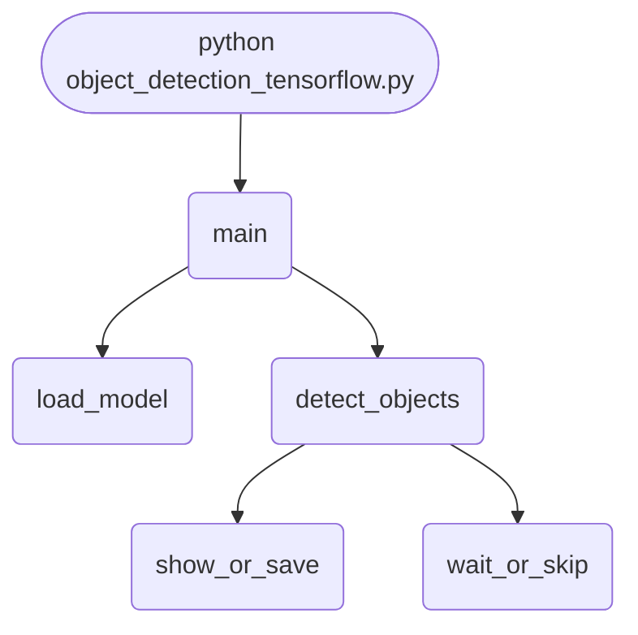

## Abstract
Object Detection with TensorFlow is a Python project that uses TensorFlow to detect objects in images. The application features image processing, model training, and a CLI interface, demonstrating best practices in computer vision and AI.

## Prerequisites
- Python 3.8 or above
- A code editor or IDE
- Basic understanding of deep learning and computer vision
- Required libraries: `tensorflow`, `numpy`, `opencv-python`

## Before you Start
Install Python and the required libraries:
```bash title="Install dependencies" showLineNumbers{1}
pip install tensorflow numpy opencv-python
```

## Getting Started
#### Create a Project
1. Create a folder named `object-detection-tensorflow`.
2. Open the folder in your code editor or IDE.
3. Create a file named `object_detection_tensorflow.py`.
4. Copy the code below into your file.

## Write the Code
<FileCode file="projects/advance/object_detection_tensorflow.py" lang="python" title="Object Detection with TensorFlow" />

## Example Usage
```bash title="Run object detection" showLineNumbers{1}
python object_detection_tensorflow.py
```

## How it fits together

Read from the top: this is what runs when you execute the file, and which function calls which. It is generated from the code, so it cannot drift from it.



## Explanation
### Key Features
- **Object Detection:** Detects objects in images using TensorFlow.
- **Image Processing:** Prepares images for detection.
- **Error Handling:** Validates inputs and manages exceptions.
- **CLI Interface:** Interactive command-line usage.

### Code Breakdown
1. **What it imports** (lines 6–10)
```python title="object_detection_tensorflow.py" showLineNumbers startLineNumber=6
import tensorflow as tf
import numpy as np
import cv2
import argparse
import os
```

2. **`load_model` — the function** (lines 13–15)
```python title="object_detection_tensorflow.py" showLineNumbers startLineNumber=13
def load_model():
    model = tf.saved_model.load('ssd_mobilenet_v2_fpnlite_320x320/saved_model')
    return model
```

3. **`detect_objects` — the function** (lines 17–34)
```python title="object_detection_tensorflow.py" showLineNumbers startLineNumber=17
def detect_objects(model, image_path):
    img = cv2.imread(image_path)
    input_tensor = tf.convert_to_tensor(img)
    input_tensor = input_tensor[tf.newaxis, ...]
    detections = model(input_tensor)
    boxes = detections['detection_boxes'][0].numpy()
    scores = detections['detection_scores'][0].numpy()
    classes = detections['detection_classes'][0].numpy().astype(np.int32)
    h, w, _ = img.shape
    for i in range(len(scores)):
        if scores[i] > 0.5:
            box = boxes[i]
            y1, x1, y2, x2 = box
            cv2.rectangle(img, (int(x1*w), int(y1*h)), (int(x2*w), int(y2*h)), (0,255,0), 2)
            cv2.putText(img, str(classes[i]), (int(x1*w), int(y1*h)-10), cv2.FONT_HERSHEY_SIMPLEX, 0.9, (255,0,0), 2)
    cv2.imshow('Object Detection', img)
    cv2.waitKey(0)
    cv2.destroyAllWindows()
```

4. **`main` — the function** (lines 36–41)
```python title="object_detection_tensorflow.py" showLineNumbers startLineNumber=36
def main():
    parser = argparse.ArgumentParser(description="Object Detection with TensorFlow")
    parser.add_argument('--image', type=str, help='Path to image file')
    args = parser.parse_args()
    model = load_model()
    detect_objects(model, args.image)
```

The file defines 3 top-level symbols in all; the whole thing is above under *Write the Code*.

## Features
- **Object Detection:** TensorFlow and image processing
- **Modular Design:** Separate functions for each task
- **Error Handling:** Manages invalid inputs and exceptions
- **Production-Ready:** Scalable and maintainable code

## Next Steps
Enhance the project by:
- Integrating with real object datasets
- Supporting advanced detection algorithms
- Creating a GUI for detection
- Adding real-time detection
- Unit testing for reliability

## Educational Value
This project teaches:
- **Computer Vision:** Object detection and deep learning
- **Software Design:** Modular, maintainable code
- **Error Handling:** Writing robust Python code

## Real-World Applications
- **Security Systems**
- **AI Platforms**
- **Robotics**

## Checkpoint exercise

This checkpoint practises greedy non-maximum suppression, the step that removes duplicate detections after the network runs.

<DataCampExercise
  lang="python"
  hint={`Keep the highest-scoring box, drop every remaining box whose IoU with it is above the threshold, repeat.`}
  code={`def iou(a, b):
    ix = max(0, min(a[2], b[2]) - max(a[0], b[0]))
    iy = max(0, min(a[3], b[3]) - max(a[1], b[1]))
    inter = ix * iy
    ua = (a[2] - a[0]) * (a[3] - a[1]) + (b[2] - b[0]) * (b[3] - b[1]) - inter
    return inter / ua

boxes = [(0, 0, 10, 10), (1, 1, 11, 11), (20, 20, 30, 30)]
scores = [0.9, 0.8, 0.7]

order = sorted(range(len(boxes)), key=lambda i: -scores[i])
keep = []
while order:
    i = order.pop(0)
    keep.append(i)
    order = [j for j in order if ___]

print("kept", keep)

# -- Expected output (last line must match) --
# kept [0, 2]`}
  solution={`def iou(a, b):
    ix = max(0, min(a[2], b[2]) - max(a[0], b[0]))
    iy = max(0, min(a[3], b[3]) - max(a[1], b[1]))
    inter = ix * iy
    ua = (a[2] - a[0]) * (a[3] - a[1]) + (b[2] - b[0]) * (b[3] - b[1]) - inter
    return inter / ua

boxes = [(0, 0, 10, 10), (1, 1, 11, 11), (20, 20, 30, 30)]
scores = [0.9, 0.8, 0.7]

order = sorted(range(len(boxes)), key=lambda i: -scores[i])
keep = []
while order:
    i = order.pop(0)
    keep.append(i)
    order = [j for j in order if iou(boxes[i], boxes[j]) <= 0.5]

print("kept", keep)`}
  sct={`test_output_contains("kept [0, 2]", pattern=False)
success_msg("Checkpoint complete: this is the core step of the project.")`}
  height={420}
/>

## Conclusion
Object Detection with TensorFlow demonstrates how to build a scalable and accurate object detection tool using Python. With modular design and extensibility, this project can be adapted for real-world applications in AI, robotics, and more. For more advanced projects, visit Python Central Hub.
