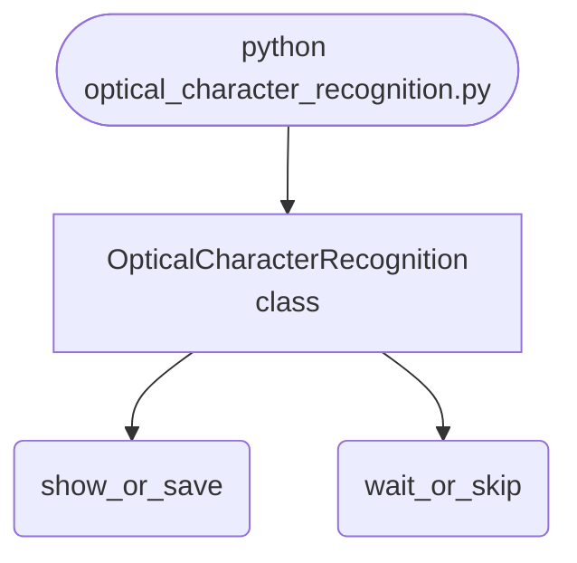

import FileCode from '../../../../components/FileCode.astro'

## Abstract
Optical Character Recognition is a Python project that uses OCR to recognize text in images. The application features image processing, text extraction, and a CLI interface, demonstrating best practices in computer vision and automation.

## Prerequisites
- Python 3.8 or above
- A code editor or IDE
- Basic understanding of OCR and computer vision
- Required libraries: `pytesseract`, `opencv-python`, `numpy`

## Before you Start
Install Python and the required libraries:
```bash title="Install dependencies" showLineNumbers{1}
pip install pytesseract opencv-python numpy
```

## Getting Started
#### Create a Project
1. Create a folder named `optical-character-recognition`.
2. Open the folder in your code editor or IDE.
3. Create a file named `optical_character_recognition.py`.
4. Copy the code below into your file.

## Write the Code
<FileCode file="projects/advance/optical_character_recognition.py" lang="python" title="Optical Character Recognition" />

## Example Usage
```bash title="Run OCR" showLineNumbers{1}
python optical_character_recognition.py
```

## How it fits together

Read from the top: this is what runs when you execute the file, and which function calls which. It is generated from the code, so it cannot drift from it.



## Explanation
### Key Features
- **OCR:** Recognizes text in images.
- **Image Processing:** Prepares images for text extraction.
- **Error Handling:** Validates inputs and manages exceptions.
- **CLI Interface:** Interactive command-line usage.

### Code Breakdown
1. **What it imports** (lines 1–3)
```python title="optical_character_recognition.py" showLineNumbers startLineNumber=1
import cv2
import pytesseract
import numpy as np
```

2. **`OpticalCharacterRecognition` — the class** (lines 5–20)
```python title="optical_character_recognition.py" showLineNumbers startLineNumber=5
class OpticalCharacterRecognition:
    def __init__(self):
        pass

    def recognize_text(self, image):
        text = pytesseract.image_to_string(image)
        print(f"Recognized text: {text}")
        return text

    def demo(self):
        img = np.zeros((100, 300, 3), dtype=np.uint8)
        cv2.putText(img, 'Python OCR', (5, 70), cv2.FONT_HERSHEY_SIMPLEX, 2, (255,255,255), 3)
        self.recognize_text(img)
        cv2.imshow('OCR Demo', img)
        cv2.waitKey(1000)
        cv2.destroyAllWindows()
```

The file defines 1 top-level symbol in all; the whole thing is above under *Write the Code*.

## Features
- **OCR:** Text recognition and image processing
- **Modular Design:** Separate functions for each task
- **Error Handling:** Manages invalid inputs and exceptions
- **Production-Ready:** Scalable and maintainable code

## Next Steps
Enhance the project by:
- Integrating with real image datasets
- Supporting advanced OCR algorithms
- Creating a GUI for OCR
- Adding real-time recognition
- Unit testing for reliability

## Educational Value
This project teaches:
- **Computer Vision:** OCR and image processing
- **Software Design:** Modular, maintainable code
- **Error Handling:** Writing robust Python code

## Real-World Applications
- **Document Digitization**
- **Accessibility Tools**
- **AI Platforms**

## Conclusion
Optical Character Recognition demonstrates how to build a scalable and accurate OCR tool using Python. With modular design and extensibility, this project can be adapted for real-world applications in digitization, accessibility, and more. For more advanced projects, visit Python Central Hub.
