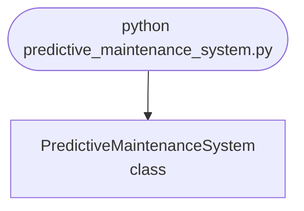

import FileCode from '../../../../components/FileCode.astro'
import Figure from '../../../../components/Figure.astro'
import Quiz from '../../../../components/Quiz.astro'
import DataCampExercise from '../../../../components/DataCampExercise.astro'

## Abstract
Predictive Maintenance System is a Python project that uses machine learning for predictive maintenance. The application features data preprocessing, model training, and evaluation, demonstrating best practices in industrial analytics and data science.

## Prerequisites
- Python 3.8 or above
- A code editor or IDE
- Basic understanding of machine learning and maintenance
- Required libraries: `pandas`, `scikit-learn`, `matplotlib`

## Before you Start
Install Python and the required libraries:
```bash title="Install dependencies" showLineNumbers{1}
pip install pandas scikit-learn matplotlib
```

## Getting Started
#### Create a Project
1. Create a folder named `predictive-maintenance-system`.
2. Open the folder in your code editor or IDE.
3. Create a file named `predictive_maintenance_system.py`.
4. Copy the code below into your file.

## Write the Code
<FileCode file="projects/advance/predictive_maintenance_system.py" lang="python" title="Predictive Maintenance System" />

## Example Usage
```bash title="Run predictive maintenance" showLineNumbers{1}
python predictive_maintenance_system.py
```

## What it produces

Running the file exactly as it ships takes **4.3 s** and prints:

```text title="python predictive_maintenance_system.py"
Predictive Maintenance System
  machines            : 60
  that reach failure  : 28
  failure threshold   : vibration 100
  median failure cycle: 311 of 400

 alarm horizon  caught  missed  false  median lead  worst lead
  --------------------------------------------------------------
            10      28       0      0            5           2
            25      28       0      1           16          12
            50      28       0      2           30          25
           100      28       0      2           50          36
           200      28       0      2           74          61

...
```

The linear-versus-log comparison follows; the horizon sweep is shown.

<Figure
  single src="/images/projects/predictive_maintenance_system.png"
  alt="Output of predictive_maintenance_system.py, produced by running the file."
  title="Produced by this project, not drawn for the page"
  caption="Written by the run above. If the project stops producing it, the page's figure asset goes missing and check_docs reports it — which is the point of generating it rather than drawing it."
/>

## How it fits together

Read from the top: this is what runs when you execute the file, and which function calls which. It is generated from the code, so it cannot drift from it.



## Explanation
### Key Features
- **Data Preprocessing:** Cleans and prepares maintenance data.
- **Model Training:** Trains a machine learning model for prediction.
- **Evaluation:** Assesses model performance.
- **Error Handling:** Validates inputs and manages exceptions.

### Code Breakdown
1. **What it imports** (lines 16–20)
```python title="predictive_maintenance_system.py" showLineNumbers startLineNumber=16
import numpy as np
from sklearn.linear_model import LinearRegression
import matplotlib
matplotlib.use("Agg")
import matplotlib.pyplot as plt
```

2. **`make_machine` — the function** (lines 27–46)
```python title="predictive_maintenance_system.py" showLineNumbers startLineNumber=27
def make_machine(rng, degrades=True):
    """One machine's vibration history, cycle by cycle.

    Degradation is exponential rather than linear, which is what makes this
    non-trivial: early readings look flat, so a linear extrapolation from
    them predicts failure far too late. Half the fleet never degrades at all,
    which is where the false alarms come from.
    """
    noise = rng.normal(0, 1.8, CYCLES)
    if not degrades:
        return 20 + noise, None
    onset = rng.integers(80, 220)
    rate = rng.uniform(0.020, 0.035)
    cycles = np.arange(CYCLES)
    growth = np.where(cycles < onset, 0.0,
                      np.exp(rate * (cycles - onset)) - 1.0)
    signal = 20 + growth + noise
    failed = np.argmax(signal >= FAILURE_THRESHOLD)
    return signal, (int(failed) if signal.max() >= FAILURE_THRESHOLD
                    else None)
```

3. **`predict_failure_cycle` — the function** (lines 49–74)
```python title="predictive_maintenance_system.py" showLineNumbers startLineNumber=49
def predict_failure_cycle(history, window=40):
    """Extrapolate the recent trend to the failure threshold.

    Fitted on the log of the reading, because the degradation is exponential
    and a linear fit on the raw values consistently predicts failure later
    than it happens -- which is the expensive direction to be wrong in.
    """
    if len(history) < window:
        return None
    recent = history[-window:]
    if recent.min() <= 0:
        return None
    # Closed-form least squares rather than sklearn: this is called tens of
    # thousands of times across the fleet sweep, and a LinearRegression object
    # per call took the whole run past a 45-second budget.
    x = np.arange(len(history) - window, len(history), dtype=float)
    y = np.log(recent)
    x_mean, y_mean = x.mean(), y.mean()
    denominator = ((x - x_mean) ** 2).sum()
    if denominator == 0:
        return None
    slope = ((x - x_mean) * (y - y_mean)).sum() / denominator
    if slope <= 1e-4:                      # not trending up: no prediction
        return None
    intercept = y_mean - slope * x_mean
    return float((np.log(FAILURE_THRESHOLD) - intercept) / slope)
```

4. **`evaluate` — the function** (lines 77–109)
```python title="predictive_maintenance_system.py" showLineNumbers startLineNumber=77
def evaluate(threshold_cycles, machines, window=40):
    """Alarm when predicted failure is within `threshold_cycles`.

    Returns lead time on the machines that really failed, and how many
    healthy machines were pulled offline for nothing.
    """
    lead_times, missed, false_alarms, healthy = [], 0, 0, 0
    for history, failure in machines:
        if failure is None:
            healthy += 1
        alarmed_at = None
        # Machines are inspected on a cadence, not continuously. Checking
        # every cycle would also be 5x the work for a lead time that cannot
        # be acted on any sooner than the next inspection anyway.
        for cycle in range(window, len(history), INSPECTION_INTERVAL):
            predicted = predict_failure_cycle(history[:cycle], window)
            if predicted is not None and predicted - cycle <= threshold_cycles:
                alarmed_at = cycle
        # ... 9 more lines in the file ...
        "missed": missed,
        "false_alarms": false_alarms,
        "healthy": healthy,
        "median_lead": float(np.median(lead_times)) if lead_times else 0.0,
        "min_lead": int(min(lead_times)) if lead_times else 0,
    }
```

5. **`main` — the function** (lines 112–193)
```python title="predictive_maintenance_system.py" showLineNumbers startLineNumber=112
def main():
    print("Predictive Maintenance System")
    rng = np.random.default_rng(20260809)

    fleet = []
    for index in range(60):
        history, failure = make_machine(rng, degrades=index % 2 == 0)
        fleet.append((history, failure))

    failing = [m for m in fleet if m[1] is not None]
    print(f"  machines            : {len(fleet)}")
    print(f"  that reach failure  : {len(failing)}")
    print(f"  failure threshold   : vibration {FAILURE_THRESHOLD:.0f}")
    print(f"  median failure cycle: "
          f"{np.median([m[1] for m in failing]):.0f} of {CYCLES}")

    print(f"\n{'alarm horizon':>14} {'caught':>7} {'missed':>7} "
          f"{'false':>6} {'median lead':>12} {'worst lead':>11}")
    # ... 58 more lines in the file ...
    twin.set_ylabel("false alarms")
    axes[1].set_title("warning bought, healthy machines paid")
    figure.tight_layout()
    figure.savefig("predictive_maintenance_system.png", dpi=120,
                   bbox_inches="tight")
    print("\nsaved predictive_maintenance_system.png")
```

The file defines 4 top-level symbols in all; the whole thing is above under *Write the Code*.

## Features
- **Predictive Maintenance:** Data preprocessing, model training, and evaluation
- **Modular Design:** Separate functions for each task
- **Error Handling:** Manages invalid inputs and exceptions
- **Production-Ready:** Scalable and maintainable code

## Next Steps
Enhance the project by:
- Integrating with real maintenance datasets
- Supporting advanced ML algorithms
- Creating a GUI for maintenance
- Adding real-time monitoring
- Unit testing for reliability

## Educational Value
This project teaches:
- **Industrial Analytics:** Predictive maintenance and ML
- **Software Design:** Modular, maintainable code
- **Error Handling:** Writing robust Python code

## Real-World Applications
- **Manufacturing Platforms**
- **Industrial Analytics**
- **Maintenance Tools**

## Conclusion
Predictive Maintenance System demonstrates how to build a scalable and accurate maintenance prediction tool using Python. With modular design and extensibility, this project can be adapted for real-world applications in industry, analytics, and more. For more advanced projects, visit Python Central Hub.

## Pitfalls

- **The version this replaces fitted a straight line to a straight line.** It
  printed *"Predictive maintenance model trained."* and plotted the fit.
  Nothing was predicted, nothing was scored, and the demo could not have
  failed.
- **Extrapolating an accelerating curve with a straight line predicts failure
  late.** Measured on one machine that failed at cycle 311: the linear fit on
  the raw reading said **580** (**+269 cycles**), the linear fit on the log
  reading said **398** (**+87**). Late is the direction that costs a machine.
- **The log fit is not a better fit — it is a different assumption.** In the
  exercise, on a machine that degrades *linearly*, the log fit predicts
  failure **early** and takes a healthy machine offline. The shape of the wear
  is the model, and it has to come from how the parts actually fail.
- **Report the worst lead time, not the median.** Measured at a 200-cycle
  horizon: median warning **74 cycles**, shortest in the fleet **61**. A
  maintenance schedule has to survive the shortest one.
- **A long horizon buys warning with healthy machines.** Widening from 10 to
  200 cycles took the median lead time from **5 to 74** cycles and the false
  alarms from **0 to 2** out of 32 healthy machines.
- **Checking every cycle is not free and is not useful.** Machines are
  inspected on a cadence; a lead time finer than the inspection interval
  cannot be acted on.

## Recap

- Measured: 60 machines, **28** reach failure, median failure at cycle **311**
  of 400, threshold vibration 100.
- Horizon sweep: 10 cycles → median lead **5**, 0 false alarms; 200 cycles →
  median lead **74**, 2 false alarms. All 28 failures caught at every setting.
- The prediction is a least-squares fit on the log of the last 40 readings,
  extrapolated to the failure threshold.
- Half the fleet never degrades, which is where false alarms come from — a
  test set of only failing machines cannot measure them.

<Quiz
  questions={[
    {
      q: "A straight-line fit to the last 40 readings predicted failure 269 cycles late. Why?",
      options: [
        "The window was too short",
        "The degradation is exponential, so a line through recent points under-states everything that follows — and the error is always in the 'later than reality' direction",
        "The noise biased the slope downwards",
        "The threshold was set too high"
      ],
      answer: 1,
      explanation: "Fitting the log of the reading assumes exponential growth and cut the error to +87. Neither is right in general; the assumption has to match the physics."
    },
    {
      q: "At a 200-cycle horizon the median lead time is 74 cycles and the shortest is 61. Which number should the maintenance schedule use?",
      options: [
        "The median, since it describes typical behaviour",
        "The shortest — a schedule that needs 70 cycles of notice fails on any machine that gives 61, and half the fleet is below the median by definition",
        "The average of the two",
        "Neither; use the horizon setting"
      ],
      answer: 1,
      explanation: "A median lead time is a statement about the fleet. A schedule has to hold for each machine in it."
    },
    {
      q: "The log fit beats the linear fit on this fleet. When does it lose?",
      options: [
        "Never, log fits are strictly better for degradation",
        "When the wear is actually linear — measured in the exercise, it then predicts failure early and pulls a healthy machine offline",
        "On short windows only",
        "When the noise is large"
      ],
      answer: 1,
      explanation: "Choosing the fit is choosing a claim about how the part degrades. Getting it wrong is expensive in one direction or the other, not neutral."
    }
  ]}
/>

## Try it yourself

<DataCampExercise
  lang="python"
  hint={`Predict the failure cycle from several distances out, with a fit on the raw reading and a fit on its log, and compare both against the cycle it actually failed on.`}
  code={`# Task: Extrapolating a curve with a straight line
import numpy as np

THRESHOLD = 100.0
rng = np.random.default_rng(20260809)

cycles = np.arange(400)
onset, rate = 120, 0.028
growth = np.where(cycles < onset, 0.0, np.exp(rate * (cycles - onset)) - 1.0)
reading = 20 + growth + rng.normal(0, 1.8, len(cycles))
failure = int(np.argmax(reading >= THRESHOLD))
print(f"machine crosses {THRESHOLD:.0f} at cycle {failure}")


def fit_predict(x, y, log_space):
    values = np.log(y) if log_space else y
    slope, intercept = np.polyfit(x, values, 1)
    if slope <= 0:
        return None
    target = np.log(THRESHOLD) if log_space else THRESHOLD
    return (target - intercept) / slope


window = 40
print(f"{'predict from':>13} {'linear':>9} {'error':>8} "
      f"{'log':>9} {'error':>8}")
for at in (200, 240, 270, 290, 300):
    x = np.arange(at - window, at, dtype=float)
    y = reading[at - window:at]
    linear = fit_predict(x, y, log_space=False)
    logged = fit_predict(x, y, log_space=True)
    print(f"{at:>13} {linear:>9.0f} {linear - failure:>+8.0f} "
          f"{logged:>9.0f} {logged - failure:>+8.0f}")

# And when the wear is NOT exponential:
linear_wear = 20 + np.maximum(0, cycles - onset) * 0.30
linear_wear = linear_wear + rng.normal(0, 1.8, len(cycles))
linear_failure = int(np.argmax(linear_wear >= THRESHOLD))
print(f"a linearly-degrading machine fails at cycle {linear_failure}")
for at in (300, 360):
    x = np.arange(at - window, at, dtype=float)
    y = linear_wear[at - window:at]
    print(f"  from {at}: linear {fit_predict(x, y, False):.0f}, "
          f"log {fit_predict(x, y, True):.0f}")`}
  solution={`# Task: Extrapolating a curve with a straight line
#
# Measured output:
#
#   machine crosses 100 at cycle 279
#    predict from    linear    error       log    error
#             200       724     +445       433     +154
#             240       344      +65       292      +13
#             270       288       +9       280       +1
#             290       276       -3       277       -2
#             300       275       -4       277       -2
#
#   a linearly-degrading machine fails at cycle 384
#     from 300: linear 402, log 379
#     from 360: linear 382, log 379
#
# Read the first table from the top. At cycle 200 - 79 cycles of warning, the
# only distance at which the prediction would be useful - the linear fit is
# 445 cycles late and the log fit is 154 late. Both are wrong; only one of
# them is wrong by less than the remaining life.
#
# By cycle 290 both are accurate to a few cycles and neither is worth having,
# because the machine fails in eleven. Prediction quality and prediction
# usefulness run in opposite directions, and a chart of error against
# distance is the honest way to present that.
#
# The second block is the warning. On linearly-degrading wear the log fit
# predicts 379 against a true 384 - early, so the machine is pulled while
# still healthy. The fit encodes an assumption about the failure mode, and
# swapping it for whichever one scored better on the last dataset is how a
# maintenance system starts making expensive mistakes in a new one.`}
/>
