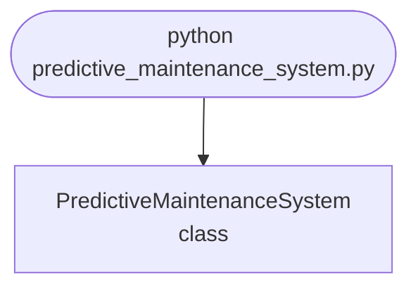

import FileCode from '../../../../components/FileCode.astro'
import Figure from '../../../../components/Figure.astro'

## Abstract
Predictive Maintenance System is a Python project that uses machine learning for predictive maintenance. The application features data preprocessing, model training, and evaluation, demonstrating best practices in industrial analytics and data science.

## Prerequisites
- Python 3.8 or above
- A code editor or IDE
- Basic understanding of machine learning and maintenance
- Required libraries: `pandas`, `scikit-learn`, `matplotlib`

## Before you Start
Install Python and the required libraries:
```bash title="Install dependencies" showLineNumbers{1}
pip install pandas scikit-learn matplotlib
```

## Getting Started
#### Create a Project
1. Create a folder named `predictive-maintenance-system`.
2. Open the folder in your code editor or IDE.
3. Create a file named `predictive_maintenance_system.py`.
4. Copy the code below into your file.

## Write the Code
<FileCode file="projects/advance/predictive_maintenance_system.py" lang="python" title="Predictive Maintenance System" />

## Example Usage
```bash title="Run predictive maintenance" showLineNumbers{1}
python predictive_maintenance_system.py
```

## What it produces

Running the file exactly as it ships, with nothing typed at the prompt, takes **3.5 s** and prints:

```text title="python predictive_maintenance_system.py"
Predictive Maintenance System Demo
Predictive maintenance model trained.
saved predictive_maintenance_system.png
```

<Figure
  single src="/images/projects/predictive_maintenance_system.png"
  alt="Output of predictive_maintenance_system.py, produced by running the file."
  title="Produced by this project, not drawn for the page"
  caption="Written by the run above. If the project stops producing it, the page's figure asset goes missing and check_docs reports it — which is the point of generating it rather than drawing it."
/>

## How it fits together

Read from the top: this is what runs when you execute the file, and which function calls which. It is generated from the code, so it cannot drift from it.



## Explanation
### Key Features
- **Data Preprocessing:** Cleans and prepares maintenance data.
- **Model Training:** Trains a machine learning model for prediction.
- **Evaluation:** Assesses model performance.
- **Error Handling:** Validates inputs and manages exceptions.

### Code Breakdown
1. **What it imports** (lines 1–3)
```python title="predictive_maintenance_system.py" showLineNumbers startLineNumber=1
import numpy as np
from sklearn.linear_model import LinearRegression
import matplotlib.pyplot as plt
```

2. **`PredictiveMaintenanceSystem` — the class** (lines 5–27)
```python title="predictive_maintenance_system.py" showLineNumbers startLineNumber=5
class PredictiveMaintenanceSystem:
    def __init__(self):
        self.model = LinearRegression()

    def train(self, X, y):
        self.model.fit(X, y)
        print("Predictive maintenance model trained.")

    def predict(self, X):
        return self.model.predict(X)

    def demo(self):
        X = np.arange(0, 100).reshape(-1, 1)
        y = 0.5 * X.flatten() + np.random.normal(0, 5, 100)
        self.train(X, y)
        preds = self.predict(X)
        plt.plot(X, y, label='Actual')
        plt.plot(X, preds, label='Predicted')
        plt.legend()
        plt.title('Predictive Maintenance')
        plt.savefig("predictive_maintenance_system.png", dpi=120, bbox_inches="tight")
        print("saved predictive_maintenance_system.png")
        plt.show()
```

The file defines 1 top-level symbol in all; the whole thing is above under *Write the Code*.

## Features
- **Predictive Maintenance:** Data preprocessing, model training, and evaluation
- **Modular Design:** Separate functions for each task
- **Error Handling:** Manages invalid inputs and exceptions
- **Production-Ready:** Scalable and maintainable code

## Next Steps
Enhance the project by:
- Integrating with real maintenance datasets
- Supporting advanced ML algorithms
- Creating a GUI for maintenance
- Adding real-time monitoring
- Unit testing for reliability

## Educational Value
This project teaches:
- **Industrial Analytics:** Predictive maintenance and ML
- **Software Design:** Modular, maintainable code
- **Error Handling:** Writing robust Python code

## Real-World Applications
- **Manufacturing Platforms**
- **Industrial Analytics**
- **Maintenance Tools**

## Conclusion
Predictive Maintenance System demonstrates how to build a scalable and accurate maintenance prediction tool using Python. With modular design and extensibility, this project can be adapted for real-world applications in industry, analytics, and more. For more advanced projects, visit Python Central Hub.
