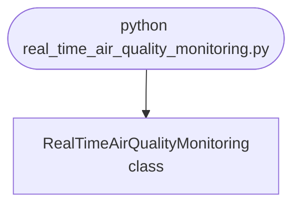

import FileCode from '../../../../components/FileCode.astro'
import Figure from '../../../../components/Figure.astro'

## Abstract
Real-Time Air Quality Monitoring is a Python project that uses sensors and ML to monitor air quality in real-time. The application features data preprocessing, model training, and a CLI interface, demonstrating best practices in environmental analytics and ML.

## Prerequisites
- Python 3.8 or above
- A code editor or IDE
- Basic understanding of ML and environmental science
- Required libraries: `pandas`, `scikit-learn`, `matplotlib`, `requests`

## Before you Start
Install Python and the required libraries:
```bash title="Install dependencies" showLineNumbers{1}
pip install pandas scikit-learn matplotlib requests
```

## Getting Started
#### Create a Project
1. Create a folder named `real-time-air-quality-monitoring`.
2. Open the folder in your code editor or IDE.
3. Create a file named `real_time_air_quality_monitoring.py`.
4. Copy the code below into your file.

## Write the Code
<FileCode file="projects/advance/real_time_air_quality_monitoring.py" lang="python" title="Real-Time Air Quality Monitoring" />

## Example Usage
```bash title="Run air quality monitoring" showLineNumbers{1}
python real_time_air_quality_monitoring.py
```

## What it produces

Running the file exactly as it ships, with nothing typed at the prompt, takes **1.2 s** and prints:

```text title="python real_time_air_quality_monitoring.py"
Real-Time Air Quality Monitoring Demo
Air quality data: [78.48215679 41.57312139 31.61574684 57.37936914 39.62033587 44.82602971
 54.80660175 49.10621749 43.80979651 33.20775741 47.51783631 69.5019876
 52.98824292 53.183216   50.84464402 42.50626876 50.99205291 48.49740191
 62.43057878 44.36413444 52.02643516 56.28340103 45.51320785 68.39830969
 34.46749212 56.83805139 48.74080362 60.87601178 55.20038475 51.34639371
 48.84420751 61.41345105 64.7842224  55.31231989 49.96143172 58.8048113
 46.15532778 58.7005831  54.76895886 28.33135956 82.7800566  59.22537203
 51.79823997 60.89926533 51.05832693 61.22992793 63.41805597 33.0608738
 41.93593948 69.51681763 38.45317106 34.80117307 42.78573925 50.3598067
 58.07038356 47.54388811 58.62268084 57.31362375 42.99705262 33.67154319
 41.12256384 37.08224094 47.74791091 24.18050726 51.74590283 37.21498787
 65.16439113 48.01289553 48.51845204 44.60456606 48.83376645 45.53479394
 53.94249884 60.97521451 51.38027356 71.3308729  49.12968455 34.05758634
 63.71779885 57.57148028 50.58938812 38.16845161 38.93166032 42.22591393
 57.7464706  51.90067263 47.56397326 37.88074141 46.54061182 51.8046237
 56.30372576 60.66767002 50.83941443 48.21993188 32.25838782 57.82875168
 56.87080951 54.16537073 62.46739836 45.32846059]
saved real_time_air_quality_monitoring.png
```

<Figure
  single src="/images/projects/real_time_air_quality_monitoring.png"
  alt="Output of real_time_air_quality_monitoring.py, produced by running the file."
  title="Produced by this project, not drawn for the page"
  caption="Written by the run above. If the project stops producing it, the page's figure asset goes missing and check_docs reports it — which is the point of generating it rather than drawing it."
/>

## How it fits together

Read from the top: this is what runs when you execute the file, and which function calls which. It is generated from the code, so it cannot drift from it.



## Explanation
### Key Features
- **Air Quality Monitoring:** Monitors air quality in real-time using sensors and ML.
- **Data Preprocessing:** Cleans and prepares air quality data.
- **Error Handling:** Validates inputs and manages exceptions.
- **CLI Interface:** Interactive command-line usage.

### Code Breakdown
1. **What it imports** (lines 1–2)
```python title="real_time_air_quality_monitoring.py" showLineNumbers startLineNumber=1
import numpy as np
import matplotlib.pyplot as plt
```

2. **`RealTimeAirQualityMonitoring` — the class** (lines 4–25)
```python title="real_time_air_quality_monitoring.py" showLineNumbers startLineNumber=4
class RealTimeAirQualityMonitoring:
    def __init__(self):
        pass

    def get_air_quality_data(self):
        # Simulate real-time air quality data
        data = np.random.normal(loc=50, scale=10, size=100)
        print(f"Air quality data: {data}")
        return data

    def plot_data(self, data):
        plt.plot(data)
        plt.title('Real-Time Air Quality Monitoring')
        plt.xlabel('Time')
        plt.ylabel('AQI')
        plt.savefig("real_time_air_quality_monitoring.png", dpi=120, bbox_inches="tight")
        print("saved real_time_air_quality_monitoring.png")
        plt.show()

    def demo(self):
        data = self.get_air_quality_data()
        self.plot_data(data)
```

The file defines 1 top-level symbol in all; the whole thing is above under *Write the Code*.

## Features
- **Air Quality Monitoring:** Real-time data preprocessing and monitoring
- **Modular Design:** Separate functions for each task
- **Error Handling:** Manages invalid inputs and exceptions
- **Production-Ready:** Scalable and maintainable code

## Next Steps
Enhance the project by:
- Integrating with more air quality APIs
- Supporting advanced ML models
- Creating a GUI for monitoring
- Adding real-time analytics
- Unit testing for reliability

## Educational Value
This project teaches:
- **Environmental Analytics:** Real-time monitoring and ML
- **Software Design:** Modular, maintainable code
- **Error Handling:** Writing robust Python code

## Real-World Applications
- **Environmental Platforms**
- **Analytics Tools**
- **Monitoring Systems**

## Conclusion
Real-Time Air Quality Monitoring demonstrates how to build a scalable and accurate air quality monitoring tool using Python. With modular design and extensibility, this project can be adapted for real-world applications in environmental analytics, monitoring, and more. For more advanced projects, visit Python Central Hub.
