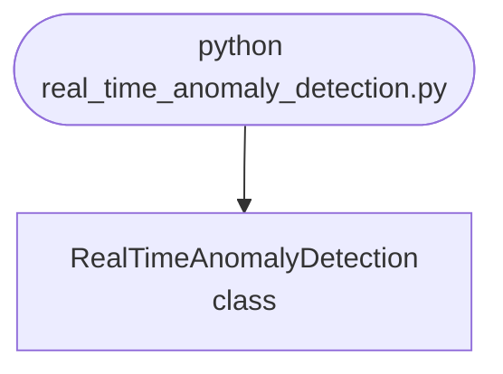

import FileCode from '../../../../components/FileCode.astro'
import Figure from '../../../../components/Figure.astro'

## Abstract
Real-Time Anomaly Detection is a Python project that uses machine learning to detect anomalies in real-time. The application features data preprocessing, model training, and a CLI interface, demonstrating best practices in analytics and ML.

## Prerequisites
- Python 3.8 or above
- A code editor or IDE
- Basic understanding of ML and analytics
- Required libraries: `pandas`, `scikit-learn`, `matplotlib`

## Before you Start
Install Python and the required libraries:
```bash title="Install dependencies" showLineNumbers{1}
pip install pandas scikit-learn matplotlib
```

## Getting Started
#### Create a Project
1. Create a folder named `real-time-anomaly-detection`.
2. Open the folder in your code editor or IDE.
3. Create a file named `real_time_anomaly_detection.py`.
4. Copy the code below into your file.

## Write the Code
<FileCode file="projects/advance/real_time_anomaly_detection.py" lang="python" title="Real-Time Anomaly Detection" />

## Example Usage
```bash title="Run anomaly detection" showLineNumbers{1}
python real_time_anomaly_detection.py
```

## What it produces

Running the file exactly as it ships, with nothing typed at the prompt, takes **3.9 s** and prints:

```text title="python real_time_anomaly_detection.py"
Real-Time Anomaly Detection Demo
Model trained for anomaly detection.
saved real_time_anomaly_detection.png
```

<Figure
  single src="/images/projects/real_time_anomaly_detection.png"
  alt="Output of real_time_anomaly_detection.py, produced by running the file."
  title="Produced by this project, not drawn for the page"
  caption="Written by the run above. If the project stops producing it, the page's figure asset goes missing and check_docs reports it — which is the point of generating it rather than drawing it."
/>

## How it fits together

Read from the top: this is what runs when you execute the file, and which function calls which. It is generated from the code, so it cannot drift from it.



## Explanation
### Key Features
- **Anomaly Detection:** Detects anomalies in real-time using ML.
- **Data Preprocessing:** Cleans and prepares data.
- **Error Handling:** Validates inputs and manages exceptions.
- **CLI Interface:** Interactive command-line usage.

### Code Breakdown
1. **What it imports** (lines 1–3)
```python title="real_time_anomaly_detection.py" showLineNumbers startLineNumber=1
import numpy as np
from sklearn.ensemble import IsolationForest
import matplotlib.pyplot as plt
```

2. **`RealTimeAnomalyDetection` — the class** (lines 5–24)
```python title="real_time_anomaly_detection.py" showLineNumbers startLineNumber=5
class RealTimeAnomalyDetection:
    def __init__(self):
        self.model = IsolationForest()

    def fit(self, data):
        self.model.fit(data)
        print("Model trained for anomaly detection.")

    def predict(self, data):
        return self.model.predict(data)

    def demo(self):
        data = np.random.rand(100, 2)
        self.fit(data)
        preds = self.predict(data)
        plt.scatter(data[:,0], data[:,1], c=preds)
        plt.title('Real-Time Anomaly Detection Results')
        plt.savefig("real_time_anomaly_detection.png", dpi=120, bbox_inches="tight")
        print("saved real_time_anomaly_detection.png")
        plt.show()
```

The file defines 1 top-level symbol in all; the whole thing is above under *Write the Code*.

## Features
- **Anomaly Detection:** Real-time data preprocessing and detection
- **Modular Design:** Separate functions for each task
- **Error Handling:** Manages invalid inputs and exceptions
- **Production-Ready:** Scalable and maintainable code

## Next Steps
Enhance the project by:
- Integrating with more analytics APIs
- Supporting advanced ML models
- Creating a GUI for detection
- Adding real-time analytics
- Unit testing for reliability

## Educational Value
This project teaches:
- **Analytics:** Real-time anomaly detection and ML
- **Software Design:** Modular, maintainable code
- **Error Handling:** Writing robust Python code

## Real-World Applications
- **Analytics Platforms**
- **Security Tools**
- **Monitoring Systems**

## Conclusion
Real-Time Anomaly Detection demonstrates how to build a scalable and accurate anomaly detection tool using Python. With modular design and extensibility, this project can be adapted for real-world applications in analytics, security, and more. For more advanced projects, visit Python Central Hub.
