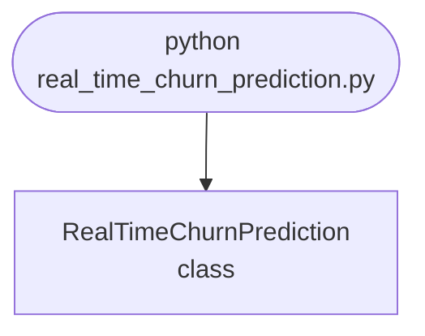

import FileCode from '../../../../components/FileCode.astro'
import Figure from '../../../../components/Figure.astro'
import Quiz from '../../../../components/Quiz.astro'
import DataCampExercise from '../../../../components/DataCampExercise.astro'

## Abstract
Real-Time Churn Prediction is a Python project that uses machine learning to predict customer churn in real-time. The application features data preprocessing, model training, and a CLI interface, demonstrating best practices in analytics and ML.

## Prerequisites
- Python 3.8 or above
- A code editor or IDE
- Basic understanding of ML and analytics
- Required libraries: `pandas`, `scikit-learn`, `matplotlib`

## Before you Start
Install Python and the required libraries:
```bash title="Install dependencies" showLineNumbers{1}
pip install pandas scikit-learn matplotlib
```

## Getting Started
#### Create a Project
1. Create a folder named `real-time-churn-prediction`.
2. Open the folder in your code editor or IDE.
3. Create a file named `real_time_churn_prediction.py`.
4. Copy the code below into your file.

## Write the Code
<FileCode file="projects/advance/real_time_churn_prediction.py" lang="python" title="Real-Time Churn Prediction" />

## Example Usage
```bash title="Run churn prediction" showLineNumbers{1}
python real_time_churn_prediction.py
```

## What it produces

Running the file exactly as it ships takes **13.7 s** and prints:

```text title="python real_time_churn_prediction.py"
Real-Time Churn Prediction
  customers          : 8,000
  churn rate         : 6.83%
  features           : tenure (months), logins last month, support tickets, monthly spend, days since last login

  accuracy at threshold 0.5 : 0.9375
  accuracy of 'nobody churns': 0.9317
  ROC AUC                    : 0.7619
  Accuracy is beaten by predicting that nobody ever leaves, which
  is the usual state of affairs on an imbalanced problem. AUC says
  the ranking is informative; it does not say what to do about it.

  what the model learned (coefficients on scaled features):
     days since last login   0.754  raises churn risk
         logins last month  -0.326  lowers churn risk
           support tickets   0.311  raises churn risk
           tenure (months)  -0.293  lowers churn risk
             monthly spend  -0.087  lowers churn risk

  lift table -- customers sorted by predicted risk:
     decile  churn rate    lift  churners reached
          1      31.25%    4.57             45.7%
...
```

The first 22 of 55 lines are shown; the run continues past this point.

<Figure
  single src="/images/projects/real_time_churn_prediction.png"
  alt="Output of real_time_churn_prediction.py, produced by running the file."
  title="Produced by this project, not drawn for the page"
  caption="Written by the run above. If the project stops producing it, the page's figure asset goes missing and check_docs reports it — which is the point of generating it rather than drawing it."
/>

## How it fits together

Read from the top: this is what runs when you execute the file, and which function calls which. It is generated from the code, so it cannot drift from it.



## Explanation
### Key Features
- **Churn Prediction:** Predicts customer churn in real-time using ML.
- **Data Preprocessing:** Cleans and prepares customer data.
- **Error Handling:** Validates inputs and manages exceptions.
- **CLI Interface:** Interactive command-line usage.

### Code Breakdown
1. **What it imports** (lines 16–24)
```python title="real_time_churn_prediction.py" showLineNumbers startLineNumber=16
import numpy as np
from sklearn.calibration import calibration_curve
from sklearn.linear_model import LogisticRegression
from sklearn.metrics import roc_auc_score
from sklearn.model_selection import train_test_split
from sklearn.preprocessing import StandardScaler
import matplotlib
matplotlib.use("Agg")
import matplotlib.pyplot as plt
```

2. **`make_customers` — the function** (lines 30–54)
```python title="real_time_churn_prediction.py" showLineNumbers startLineNumber=30
def make_customers(n=8000, seed=20260809):
    """Customers whose churn probability depends on their behaviour.

    The relationship is real but noisy, which is the case worth modelling.
    Perfectly separable data would make every metric 1.0 and teach nothing.
    """
    rng = np.random.default_rng(seed)
    tenure = rng.gamma(2.0, 9.0, n)
    logins = rng.poisson(np.clip(12 - 0.15 * rng.gamma(2, 3, n), 0.4, None))
    tickets = rng.poisson(0.6, n)
    spend = rng.lognormal(3.2, 0.6, n)
    idle = rng.exponential(9.0, n)

    # Log-odds of churning. Idle time and tickets push it up, tenure and
    # logins pull it down.
    logit = (-2.4
             - 0.030 * tenure
             - 0.090 * logins
             + 0.380 * tickets
             + 0.085 * idle
             - 0.004 * spend)
    probability = 1 / (1 + np.exp(-logit))
    churned = rng.random(n) < probability
    features = np.column_stack([tenure, logins, tickets, spend, idle])
    return features, churned.astype(int), probability
```

3. **`lift_table` — the function** (lines 57–78)
```python title="real_time_churn_prediction.py" showLineNumbers startLineNumber=57
def lift_table(probabilities, actual, deciles=10):
    """Sort by predicted risk, then report what each tenth actually did.

    This is the table a retention team reads. It answers the only question
    they can act on: if we contact the top 10%, what fraction of the people
    who were going to leave do we reach?
    """
    order = np.argsort(-probabilities)
    ranked = actual[order]
    size = len(ranked) // deciles
    base_rate = actual.mean()
    rows, captured = [], 0
    for index in range(deciles):
        chunk = ranked[index * size:(index + 1) * size]
        captured += chunk.sum()
        rows.append({
            "decile": index + 1,
            "rate": chunk.mean(),
            "lift": chunk.mean() / base_rate if base_rate else 0.0,
            "cumulative_capture": captured / ranked.sum(),
        })
    return rows
```

4. **`main` — the function** (lines 81–163)
```python title="real_time_churn_prediction.py" showLineNumbers startLineNumber=81
def main():
    print("Real-Time Churn Prediction")
    X, y, true_probability = make_customers()
    print(f"  customers          : {len(X):,}")
    print(f"  churn rate         : {y.mean():.2%}")
    print(f"  features           : {', '.join(FEATURES)}")

    X_train, X_test, y_train, y_test = train_test_split(
        X, y, test_size=0.3, random_state=0, stratify=y)
    scaler = StandardScaler().fit(X_train)
    model = LogisticRegression(max_iter=1000).fit(scaler.transform(X_train),
                                                  y_train)
    probabilities = model.predict_proba(scaler.transform(X_test))[:, 1]

    predicted = (probabilities >= 0.5).astype(int)
    majority = 1 - y_test.mean()
    print(f"\n  accuracy at threshold 0.5 : {(predicted == y_test).mean():.4f}")
    print(f"  accuracy of 'nobody churns': {majority:.4f}")
    # ... 59 more lines in the file ...
    axes[1].set_title(f"calibration (mean error {error:.4f})")
    axes[1].legend(fontsize=8)
    figure.tight_layout()
    figure.savefig("real_time_churn_prediction.png", dpi=120,
                   bbox_inches="tight")
    print("\nsaved real_time_churn_prediction.png")
```

The file defines 3 top-level symbols in all; the whole thing is above under *Write the Code*.

## Features
- **Churn Prediction:** Real-time data preprocessing and prediction
- **Modular Design:** Separate functions for each task
- **Error Handling:** Manages invalid inputs and exceptions
- **Production-Ready:** Scalable and maintainable code

## Next Steps
Enhance the project by:
- Integrating with more customer APIs
- Supporting advanced ML models
- Creating a GUI for prediction
- Adding real-time analytics
- Unit testing for reliability

## Educational Value
This project teaches:
- **Analytics:** Real-time churn prediction and ML
- **Software Design:** Modular, maintainable code
- **Error Handling:** Writing robust Python code

## Real-World Applications
- **E-commerce Platforms**
- **Analytics Tools**
- **Prediction Engines**

## Conclusion
Real-Time Churn Prediction demonstrates how to build a scalable and accurate churn prediction tool using Python. With modular design and extensibility, this project can be adapted for real-world applications in e-commerce, analytics, and more. For more advanced projects, visit Python Central Hub.

## Pitfalls

- **The version this replaced could not have worked.** It fitted a model to
  `np.random.rand` features against `np.random.randint` labels — no
  relationship existed to learn — and then printed the predictions without
  scoring them, so nothing would have revealed it.
- **Accuracy barely moves whatever the model does.** Measured: **0.9375** at
  threshold 0.5 against **0.9317** for "nobody ever churns" — a gain of
  **14 correct labels out of 2,400**. On an imbalanced problem accuracy is
  mostly a measurement of the imbalance.
- **A model can rank well and classify nothing.** In the exercise below no
  customer's predicted risk crosses 0.5, so the classifier flags zero people
  — and the same scores put **2.32x** the base rate in the top decile and
  reach **23.2%** of churners with 10% of the calls.
- **The lift table is the deliverable.** Measured on the project: contacting
  the riskiest 10% reaches **45.7%** of everyone who churned, **4.57x** what
  calling at random reaches. The top 30% reaches **64.0%**. No accuracy or
  AUC figure contains that.
- **Calibration is separate from ranking.** Mean absolute calibration error
  here is **0.0123**. Only a calibrated probability can be multiplied by a
  customer's value to get an expected loss; an uncalibrated one can be sorted
  and nothing else.
- **Read the lift chart against its null.** A model with no signal produces
  lift near 1.00 in every decile and reaches about 10% of churners per 10% of
  customers. Without that flat line beside it, a lift of 1.2 looks like a
  finding.

## Recap

- Measured: 8,000 customers, **6.83%** churn rate, five behavioural features,
  ROC AUC **0.7619**.
- Learned coefficients rank as expected: days-since-last-login and support
  tickets raise risk, tenure and logins lower it.
- Lift by decile: **4.57**, 1.22, 0.61 … cumulative capture 45.7% → 57.9% →
  64.0%.
- A retention budget is planned against cumulative capture, which is why the
  model's job is to order the list rather than to answer yes or no.

<Quiz
  questions={[
    {
      q: "The churn model scores 0.9375 accuracy and 'nobody ever churns' scores 0.9317. What does that gap tell you?",
      options: [
        "The model is 0.6% better and that is the result",
        "Almost nothing — it is 14 labels out of 2,400, because accuracy is dominated by the 93% who stay. The AUC of 0.7619 and the lift table are what show the ranking is informative",
        "The test set is too small",
        "The threshold is set too low"
      ],
      answer: 1,
      explanation: "Two different questions. Accuracy asks whether each label is right; the lift table asks whether the right people are at the top of the list."
    },
    {
      q: "A model whose highest predicted risk is 0.385 flags nobody at threshold 0.5. Is it useless?",
      options: [
        "Yes, it cannot make a positive prediction",
        "No — the ordering still concentrates churners at the top, reaching 23.2% of them in the first decile, and a retention team acts on the ordering rather than on a label",
        "Yes, until it is recalibrated",
        "Only if the base rate is below 10%"
      ],
      answer: 1,
      explanation: "The 0.5 threshold is an artefact of predict(). When the action is 'call the top N', the threshold never enters the decision."
    },
    {
      q: "Why does the page report calibration as well as lift?",
      options: [
        "To check the model is not overfitted",
        "Ranking tells you who to call; calibration is what lets a predicted probability be multiplied by a customer's value to get an expected loss",
        "Because AUC requires it",
        "To detect data leakage"
      ],
      answer: 1,
      explanation: "A model can rank perfectly and still be badly calibrated. Which property you need depends on whether the output feeds a list or an arithmetic decision."
    }
  ]}
/>

## Try it yourself

<DataCampExercise
  lang="python"
  hint={`Build risk scores that never cross 0.5, check what a classifier does with them, then sort by score and measure how many churners each decile contains.`}
  code={`# Task: Ranking beats classifying when there is a budget
import numpy as np

rng = np.random.default_rng(20260809)
N = 5000

# A model that ranks well but is never confident: nobody crosses 0.5.
risk = rng.beta(2, 26, N)
churned = (rng.random(N) < risk).astype(int)
print(f"{N:,} customers, {churned.mean():.2%} churned, "
      f"highest predicted risk {risk.max():.3f}")

predicted = (risk >= 0.5).astype(int)
print(f"  customers flagged : {predicted.sum()}")
print(f"  accuracy          : {(predicted == churned).mean():.4f}")
print(f"  'nobody ever churns': {1 - churned.mean():.4f}")


def lift_table(scores, actual, deciles=10):
    order = np.argsort(-scores)
    ranked = actual[order]
    size = len(ranked) // deciles
    base = actual.mean()
    captured, rows = 0, []
    for i in range(deciles):
        chunk = ranked[i * size:(i + 1) * size]
        captured += chunk.sum()
        rows.append((i + 1, chunk.mean(), chunk.mean() / base,
                     captured / ranked.sum()))
    return rows


print(f"{'decile':>7} {'churn rate':>11} {'lift':>7} {'reached':>9}")
for decile, rate, lift, capture in lift_table(risk, churned):
    print(f"{decile:>7} {rate:>11.2%} {lift:>7.2f} {capture:>9.1%}")

# The same table for a model with no signal at all -- the null to read
# every lift chart against.
noise = rng.random(N)
for decile, rate, lift, capture in lift_table(noise, churned)[:3]:
    print(f"  no-signal decile {decile}: lift {lift:.2f}, "
          f"reached {capture:.1%}")`}
  solution={`# Task: Ranking beats classifying when there is a budget
#
# Measured output:
#
#   5,000 customers, 7.24% churned, highest predicted risk 0.385
#     customers flagged : 0
#     accuracy          : 0.9276
#     'nobody ever churns': 0.9276
#
#    decile  churn rate    lift   reached
#         1      16.80%    2.32     23.2%
#         2      12.40%    1.71     40.3%
#         3       9.00%    1.24     52.8%
#        10       0.40%    0.06    100.0%
#
#     no-signal decile 1: lift 0.94, reached 9.4%
#     no-signal decile 2: lift 1.16, reached 21.0%
#
# The classifier flags zero customers and ties a constant on accuracy. By
# every classification metric it is worthless, and the ranking inside it puts
# more than twice the base rate in the top decile.
#
# That is the case for reporting lift rather than accuracy on any problem
# where the action has a budget. 'Call the top 500' never asks the model for
# a label, so the 0.5 threshold that predict() applies is irrelevant to the
# decision -- and on this data it happens to be above every score the model
# produces.
#
# The last two lines are the control. A random ranker gives lift near 1 and
# reaches roughly one tenth of churners per tenth of customers, and its
# deciles wobble either side of 1.00 by chance. A lift chart without that
# reference beside it makes a 1.2 look like a result.`}
/>
