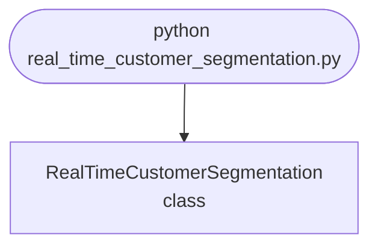

## Abstract
Real-Time Customer Segmentation is a Python project that uses machine learning to segment customers in real-time. The application features data preprocessing, model training, and a CLI interface, demonstrating best practices in analytics and ML.

## Prerequisites
- Python 3.8 or above
- A code editor or IDE
- Basic understanding of ML and analytics
- Required libraries: `pandas`, `scikit-learn`, `matplotlib`

## Before you Start
Install Python and the required libraries:
```bash title="Install dependencies" showLineNumbers{1}
pip install pandas scikit-learn matplotlib
```

## Getting Started
#### Create a Project
1. Create a folder named `real-time-customer-segmentation`.
2. Open the folder in your code editor or IDE.
3. Create a file named `real_time_customer_segmentation.py`.
4. Copy the code below into your file.

## Write the Code
<FileCode file="projects/advance/real_time_customer_segmentation.py" lang="python" title="Real-Time Customer Segmentation" />

## Example Usage
```bash title="Run customer segmentation" showLineNumbers{1}
python real_time_customer_segmentation.py
```

## What it produces

Running the file exactly as it ships takes **13.5 s** and prints:

```text title="python real_time_customer_segmentation.py"
Real-Time Customer Segmentation
  customers          : 600
  features           : spend per month, visits per month
  scaling            : z-score, because spend is ~50x visits

  k-means run on both datasets, k = 2 to 8:

   k  inertia (real)  silhouette    inertia (blob)  silhouette
  --------------------------------------------------------------------
   2           605.6       0.525             802.8       0.310
   3           150.7       0.718             538.3       0.337
   4           113.2       0.634             417.1       0.336
   5            83.3       0.554             352.4       0.322
   6            63.9       0.484             289.5       0.343
   7            54.4       0.468             254.8       0.340
   8            45.8       0.445             226.5       0.337

  real data: best silhouette 0.718 at k=3
  one blob : best silhouette 0.343 at k=6

...
```

The first 20 of 52 lines are shown; the run continues past this point.

<Figure
  single src="/images/projects/real_time_customer_segmentation.png"
  alt="Output of real_time_customer_segmentation.py, produced by running the file."
  title="Produced by this project, not drawn for the page"
  caption="Written by the run above. If the project stops producing it, the page's figure asset goes missing and check_docs reports it — which is the point of generating it rather than drawing it."
/>

## How it fits together

Read from the top: this is what runs when you execute the file, and which function calls which. It is generated from the code, so it cannot drift from it.



## Explanation
### Key Features
- **Customer Segmentation:** Segments customers in real-time using ML.
- **Data Preprocessing:** Cleans and prepares customer data.
- **Error Handling:** Validates inputs and manages exceptions.
- **CLI Interface:** Interactive command-line usage.

### Code Breakdown
1. **What it imports** (lines 17–22)
```python title="real_time_customer_segmentation.py" showLineNumbers startLineNumber=17
import numpy as np
from sklearn.cluster import KMeans
from sklearn.metrics import adjusted_rand_score, silhouette_score
import matplotlib
matplotlib.use("Agg")
import matplotlib.pyplot as plt
```

2. **`real_segments` — the function** (lines 27–37)
```python title="real_time_customer_segmentation.py" showLineNumbers startLineNumber=27
def real_segments(n=600, seed=20260809):
    """Three genuinely separate customer groups."""
    rng = np.random.default_rng(seed)
    groups = [
        rng.multivariate_normal([25, 2.0], [[30, 1], [1, 0.5]], n // 3),
        rng.multivariate_normal([80, 6.0], [[90, 2], [2, 1.2]], n // 3),
        rng.multivariate_normal([210, 3.5], [[400, 3], [3, 0.9]], n - 2 * (n // 3)),
    ]
    data = np.vstack(groups)
    truth = np.concatenate([np.full(len(g), i) for i, g in enumerate(groups)])
    return data, truth
```

3. **`scaled` — the function** (lines 46–53)
```python title="real_time_customer_segmentation.py" showLineNumbers startLineNumber=46
def scaled(data):
    """z-score each column.

    Spend runs to hundreds and visits to single digits, so without this the
    Euclidean distance k-means minimises is essentially the spend alone, and
    the second feature may as well not be there.
    """
    return (data - data.mean(axis=0)) / data.std(axis=0)
```

4. **`stability` — the function** (lines 66–86)
```python title="real_time_customer_segmentation.py" showLineNumbers startLineNumber=66
def stability(data, k, trials=20, seed=0):
    """How much the labelling changes when the data is resampled.

    Two bootstrap samples are clustered and their labels compared on the
    points they share, using the adjusted Rand index. Real structure survives
    resampling; a partition of a blob moves every time.
    """
    rng = np.random.default_rng(seed)
    scores = []
    for _ in range(trials):
        a = rng.choice(len(data), len(data), replace=True)
        b = rng.choice(len(data), len(data), replace=True)
        shared = np.intersect1d(a, b)
        if len(shared) < 10:
            continue
        labels_a = KMeans(n_clusters=k, n_init=10,
                          random_state=0).fit(data[a]).predict(data[shared])
        labels_b = KMeans(n_clusters=k, n_init=10,
                          random_state=0).fit(data[b]).predict(data[shared])
        scores.append(adjusted_rand_score(labels_a, labels_b))
    return float(np.mean(scores)), float(np.std(scores))
```

5. **`main` — the function** (lines 89–193)
```python title="real_time_customer_segmentation.py" showLineNumbers startLineNumber=89
def main():
    print("Real-Time Customer Segmentation")
    real, truth = real_segments()
    blob = no_segments()
    print(f"  customers          : {len(real):,}")
    print(f"  features           : {', '.join(FEATURES)}")
    print(f"  scaling            : z-score, because spend is ~50x visits")

    real_s, blob_s = scaled(real), scaled(blob)

    print(f"\n  k-means run on both datasets, k = 2 to 8:\n")
    print(f"{'k':>4} {'inertia (real)':>15} {'silhouette':>11}   "
          f"{'inertia (blob)':>15} {'silhouette':>11}")
    print("  " + "-" * 68)
    real_rows, blob_rows = sweep(real_s), sweep(blob_s)
    for (k, ri, rs), (_, bi, bs) in zip(real_rows, blob_rows):
        print(f"{k:>4} {ri:>15,.1f} {rs:>11.3f}   {bi:>15,.1f} {bs:>11.3f}")

    # ... 81 more lines in the file ...
    axes[2].set_title("the score that tells them apart")
    axes[2].legend(fontsize=8)
    figure.tight_layout()
    figure.savefig("real_time_customer_segmentation.png", dpi=120,
                   bbox_inches="tight")
    print("\nsaved real_time_customer_segmentation.png")
```

The file defines 6 top-level symbols in all; the whole thing is above under *Write the Code*.

## Features
- **Customer Segmentation:** Real-time data preprocessing and segmentation
- **Modular Design:** Separate functions for each task
- **Error Handling:** Manages invalid inputs and exceptions
- **Production-Ready:** Scalable and maintainable code

## Next Steps
Enhance the project by:
- Integrating with more analytics APIs
- Supporting advanced ML models
- Creating a GUI for segmentation
- Adding real-time analytics
- Unit testing for reliability

## Educational Value
This project teaches:
- **Analytics:** Real-time customer segmentation and ML
- **Software Design:** Modular, maintainable code
- **Error Handling:** Writing robust Python code

## Real-World Applications
- **E-commerce Platforms**
- **Analytics Tools**
- **Segmentation Engines**

## Conclusion
Real-Time Customer Segmentation demonstrates how to build a scalable and accurate customer segmentation tool using Python. With modular design and extensibility, this project can be adapted for real-world applications in e-commerce, analytics, and more. For more advanced projects, visit Python Central Hub.

## Pitfalls

- **k-means cannot decline.** The version this replaces ran
  `KMeans(n_clusters=3)` on `np.random.rand(100, 2)` and reported three
  segments. Uniform points have no segments; the algorithm returns a
  partition anyway, with centroids, labels and a convincing scatter plot.
- **The elbow is not evidence.** Measured in the exercise below: inertia on a
  uniform square falls 4,692 → 2,994 → 1,848 → 1,257 as k rises. The curve
  bends because inertia always falls and always decelerates, not because
  there are clusters at the bend.
- **Silhouette is the score that separates the two cases.** Measured:
  **0.718** on three real segments against **0.343** at the blob's best k.
  Above roughly 0.5 means points sit closer to their own centre than to the
  next one.
- **Stability is the other check.** Clustering two bootstrap resamples and
  comparing them gives **0.996 ± 0.006** on real segments and
  **0.627 ± 0.248** on the blob. A boundary the data does not have cannot be
  found twice.
- **"Always scale" is not a rule that survives measurement.** Here the
  unscaled clustering scored **0.990** against **0.970** scaled, because
  these groups differ mostly in spend. On a second dataset whose groups
  differ in *visits* — the small-range feature — unscaled scores **0.002**
  and scaled **0.466**. Scaling matters when the signal is in the small
  column, and which column that is cannot be known in advance.

## Recap

- Measured: 600 customers, two features, best silhouette **0.718 at k=3**,
  agreement with the true groups **0.970**.
- The same sweep on a single gaussian blob peaks at **0.339**, and on a
  uniform square at **0.397** — both well under the 0.5 line.
- Recovered segments: 206 customers at £26/month, 194 at £81, 200 at £209.
- The honest sequence is: cluster, then score the silhouette, then check
  stability, then compare against a null built from your own data.

<Quiz
  questions={[
    {
      q: "KMeans(n_clusters=3) on uniform random points returns three clusters. What does that tell you about the data?",
      options: [
        "That it contains three groups",
        "Nothing — k-means partitions whatever it is given, so the output is a statement about the algorithm and the k you chose, not about the data",
        "That k should have been larger",
        "That the data needs scaling"
      ],
      answer: 1,
      explanation: "Measured: silhouette 0.397 on a uniform square against 0.718 on genuinely separated groups. The labels look identical; the scores do not."
    },
    {
      q: "The inertia curve on a uniform square has a clear bend. Why is reading k off it unsafe?",
      options: [
        "The bend is in the wrong place",
        "Inertia falls with every extra centre and the decreases get smaller, so a bend appears whether or not clusters exist",
        "Inertia is only valid for spherical clusters",
        "The curve needs more values of k"
      ],
      answer: 1,
      explanation: "Measured drops of 3,664 then 2,346 then 1,266 then 429 on data with no structure at all. The elbow is a property of the curve, not of the data."
    },
    {
      q: "Scaling improved one dataset from 0.002 to 0.466 and made another slightly worse (0.990 to 0.970). What decides which happens?",
      options: [
        "The number of clusters",
        "Which feature carries the signal — scaling helps when the groups differ in the small-range column and is unnecessary when they differ in the large one",
        "The sample size",
        "Whether the data is normally distributed"
      ],
      answer: 1,
      explanation: "Euclidean distance is dominated by the widest column. If that column happens to carry the signal, ignoring the other one costs nothing."
    }
  ]}
/>

## Try it yourself

<DataCampExercise
  lang="python"
  hint={`Run the same sweep over three datasets: one with real groups, one gaussian blob and one uniform square. Then compare each score against a null made by shuffling the columns.`}
  code={`# Task: Does the clustering you found actually exist?
import numpy as np
from sklearn.cluster import KMeans
from sklearn.metrics import silhouette_score

rng = np.random.default_rng(20260809)
N = 300

datasets = {
    "three real groups": np.vstack([rng.normal([0, 0], 0.6, (N // 3, 2)),
                                    rng.normal([5, 5], 0.6, (N // 3, 2)),
                                    rng.normal([10, 0], 0.6, (N // 3, 2))]),
    "one gaussian blob": rng.normal([5, 2], 3.2, (N, 2)),
    "uniform square": rng.uniform(0, 10, (N, 2)),
}

best_k = {}
for name, data in datasets.items():
    scores = [silhouette_score(data, KMeans(n_clusters=k, n_init=3,
                                            random_state=0).fit_predict(data))
              for k in range(2, 7)]
    best_k[name] = (___, max(scores))  # TODO: the k with the highest score (k starts at 2)
    print(f"{name:>20} " + " ".join(f"{s:.3f}" for s in scores))

for name, (k, score) in best_k.items():
    print(f"  {name:20} best k={k}, silhouette {score:.3f}  -> "
          f"{'structure' if score > ___ else 'no real structure'}")

print("inertia (the elbow curve) on the uniform square:")
previous = None
for k in range(1, 8):
    inertia = KMeans(n_clusters=k, n_init=3,
                     random_state=0).fit(datasets["uniform square"]).inertia_
    drop = "" if previous is None else f"  drop {previous - inertia:7.1f}"
    print(f"  k={k}: inertia {inertia:8.1f}{drop}")
    previous = inertia


def gap(data, k, trials=8):
    # Shuffling each column keeps every marginal and destroys the joint
    # structure -- so it is the score k-means gets for free on data shaped
    # like yours.
    real = silhouette_score(data, KMeans(n_clusters=k, n_init=3,
                                         random_state=0).fit_predict(data))
    null = []
    for _ in range(trials):
        shuffled = np.column_stack([rng.permutation(data[:, c])
                                    for c in range(data.shape[1])])
        null.append(silhouette_score(shuffled,
                                     KMeans(n_clusters=k, n_init=3,
                                            random_state=0
                                            ).fit_predict(shuffled)))
    return real, float(np.mean(null)), float(np.std(null))


for name, data in datasets.items():
    k = best_k[name][0]
    real, mean, sd = gap(data, k)
    print(f"  {name:20} k={k}: real {real:.3f}, null {mean:.3f} +- {sd:.3f}, "
          f"{(real - mean) / sd:>6.1f} sd above")`}
  solution={`# Task: Does the clustering you found actually exist?
import numpy as np
from sklearn.cluster import KMeans
from sklearn.metrics import silhouette_score

rng = np.random.default_rng(20260809)
N = 300

datasets = {
    "three real groups": np.vstack([rng.normal([0, 0], 0.6, (N // 3, 2)),
                                    rng.normal([5, 5], 0.6, (N // 3, 2)),
                                    rng.normal([10, 0], 0.6, (N // 3, 2))]),
    "one gaussian blob": rng.normal([5, 2], 3.2, (N, 2)),
    "uniform square": rng.uniform(0, 10, (N, 2)),
}

best_k = {}
for name, data in datasets.items():
    scores = [silhouette_score(data, KMeans(n_clusters=k, n_init=3,
                                            random_state=0).fit_predict(data))
              for k in range(2, 7)]
    best_k[name] = (int(np.argmax(scores)) + 2, max(scores))
    print(f"{name:>20} " + " ".join(f"{s:.3f}" for s in scores))

for name, (k, score) in best_k.items():
    print(f"  {name:20} best k={k}, silhouette {score:.3f}  -> "
          f"{'structure' if score > 0.5 else 'no real structure'}")

print("inertia (the elbow curve) on the uniform square:")
previous = None
for k in range(1, 8):
    inertia = KMeans(n_clusters=k, n_init=3,
                     random_state=0).fit(datasets["uniform square"]).inertia_
    drop = "" if previous is None else f"  drop {previous - inertia:7.1f}"
    print(f"  k={k}: inertia {inertia:8.1f}{drop}")
    previous = inertia


def gap(data, k, trials=8):
    # Shuffling each column keeps every marginal and destroys the joint
    # structure -- so it is the score k-means gets for free on data shaped
    # like yours.
    real = silhouette_score(data, KMeans(n_clusters=k, n_init=3,
                                         random_state=0).fit_predict(data))
    null = []
    for _ in range(trials):
        shuffled = np.column_stack([rng.permutation(data[:, c])
                                    for c in range(data.shape[1])])
        null.append(silhouette_score(shuffled,
                                     KMeans(n_clusters=k, n_init=3,
                                            random_state=0
                                            ).fit_predict(shuffled)))
    return real, float(np.mean(null)), float(np.std(null))


for name, data in datasets.items():
    k = best_k[name][0]
    real, mean, sd = gap(data, k)
    print(f"  {name:20} k={k}: real {real:.3f}, null {mean:.3f} +- {sd:.3f}, "
          f"{(real - mean) / sd:>6.1f} sd above")
#
# Measured output:
#
#     three real groups   best k=3, silhouette 0.846  -> structure
#     one gaussian blob   best k=3, silhouette 0.339  -> no real structure
#     uniform square      best k=6, silhouette 0.397  -> no real structure
#
#   inertia on the uniform square:
#     k=1: 4692.1   k=2: 2994.3 (drop 1697.8)   k=3: 1848.4 (drop 1145.9)
#     k=4: 1257.1 (drop 591.2)   k=5: 1009.4 (drop 247.7)
#
#     three real groups k=3: real 0.846, null 0.511 +- 0.003,  126.9 sd above
#     one gaussian blob k=3: real 0.339, null 0.342 +- 0.011,   -0.2 sd above
#     uniform square    k=6: real 0.397, null 0.378 +- 0.004,    4.5 sd above
#
# All three datasets produced clusters, a best k, and an elbow. The uniform
# square - the one case where the answer is definitely 'there are no groups'
# - produced the cleanest-looking elbow of the three.
#
# The null comparison is the check that separates them, and it is stricter
# than the raw silhouette. A score of 0.397 sounds mediocre rather than
# meaningless; against its own null of 0.378 it is barely above what k-means
# scores on structureless data of the same shape, while the real groups beat
# theirs by more than 0.3. The uniform square is not a weak clustering. It
# is almost no clustering. (With this few points the 'sd above' column is
# noisy; read the gap in silhouette, not the ratio.)
#
# Shuffling each column independently is the right null because it preserves
# every marginal distribution - same ranges, same spread, same skew - and
# destroys only the relationship between columns, which is the only thing
# clustering can legitimately find.`}
  sct={`test_output_contains("three real groups    best k=3", pattern=False)
test_output_contains("no real structure", pattern=False)
test_output_contains("inertia (the elbow curve) on the uniform square:", pattern=False)
success_msg("Nice - the output shows what the project is really doing.")`}
  height={160}
/>
