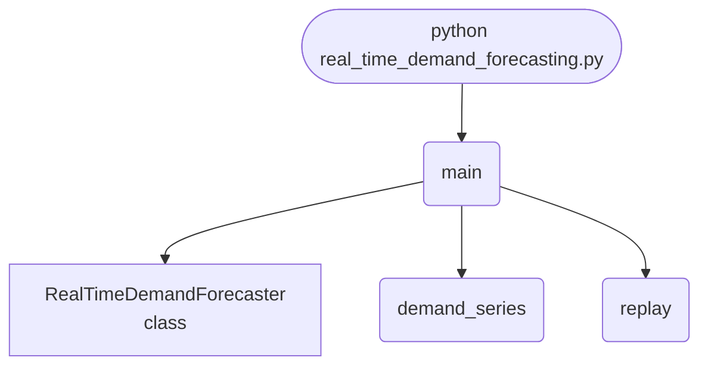

import FileCode from '../../../../components/FileCode.astro'
import Figure from '../../../../components/Figure.astro'
import Quiz from '../../../../components/Quiz.astro'
import DataCampExercise from '../../../../components/DataCampExercise.astro'

## Abstract
Demand arrives one period at a time, so the forecaster may only use what it has already seen. This project replays a 200-period series, refits a rolling-window linear model on the last seven lags before each new value is revealed, and scores itself against the naive "same as last period" baseline. Measured on this machine: **MAE 5.202 against the baseline's 7.726, a 32.7% improvement**.


## Prerequisites
- Python 3.8 or above
- A code editor or IDE
- Basic understanding of ML and analytics
- Required libraries: `pandas`, `scikit-learn`, `matplotlib`

## Before you Start
Install Python and the required libraries:
```bash title="Install dependencies" showLineNumbers{1}
pip install pandas scikit-learn matplotlib
```

## Getting Started
#### Create a Project
1. Create a folder named `real-time-demand-forecasting`.
2. Open the folder in your code editor or IDE.
3. Create a file named `real_time_demand_forecasting.py`.
4. Copy the code below into your file.

## Write the Code
<FileCode file="projects/advance/real_time_demand_forecasting.py" lang="python" title="Real-Time Demand Forecasting" />

## Example Usage
```bash title="Run demand forecasting" showLineNumbers{1}
python real_time_demand_forecasting.py
```

## What it produces

Running the file exactly as it ships takes **3.7 s** and prints:

```text title="python real_time_demand_forecasting.py"
Real-Time Demand Forecasting
  periods replayed      : 200
  scored forecasts      : 188
  rolling model MAE     : 5.202
  naive (last value) MAE: 7.726
  improvement over naive: 32.7%
saved real_time_demand_forecasting.png
```

<Figure
  single src="/images/projects/real_time_demand_forecasting.png"
  alt="Output of real_time_demand_forecasting.py, produced by running the file."
  title="Produced by this project, not drawn for the page"
  caption="Written by the run above. If the project stops producing it, the page's figure asset goes missing and check_docs reports it — which is the point of generating it rather than drawing it."
/>

## How it fits together

Read from the top: this is what runs when you execute the file, and which function calls which. It is generated from the code, so it cannot drift from it.



## Explanation
### Key Features
- **Walk-forward evaluation:** every forecast is made before its actual value is revealed, so nothing is scored on data the model had already seen.
- **A baseline it has to beat:** persistence scores 7.726 MAE; a model that cannot beat that is not earning its keep.
- **Rolling refit:** the window slides, so the model tracks the trend instead of fitting the whole history once.
- **Measured output:** the run prints both MAEs and saves the forecast and error curves.


### Code Breakdown
1. **What it imports** (lines 9–11)
```python title="real_time_demand_forecasting.py" showLineNumbers startLineNumber=9
import matplotlib.pyplot as plt
import numpy as np
from sklearn.linear_model import LinearRegression
```

2. **`RealTimeDemandForecaster` — the class** (lines 14–44)
```python title="real_time_demand_forecasting.py" showLineNumbers startLineNumber=14
class RealTimeDemandForecaster:
    """Rolling-window linear forecaster over recent lags."""

    def __init__(self, window=40, lags=7):
        self.window = window
        self.lags = lags
        self.model = LinearRegression()
        self.history = []

    def observe(self, value):
        self.history.append(float(value))

    def _design(self):
        series = np.asarray(self.history[-self.window:], dtype=float)
        rows, targets = [], []
        for index in range(self.lags, len(series)):
            rows.append(series[index - self.lags:index])
            targets.append(series[index])
        # ... 7 more lines in the file ...
        if not self.ready():
            return self.history[-1] if self.history else 0.0
        rows, targets = self._design()
        self.model.fit(rows, targets)
        recent = np.asarray(self.history[-self.lags:], dtype=float)
        return float(self.model.predict(recent.reshape(1, -1))[0])
```

3. **`demand_series` — the function** (lines 47–54)
```python title="real_time_demand_forecasting.py" showLineNumbers startLineNumber=47
def demand_series(periods=200, seed=0):
    """Weekly seasonality, a slow trend and noise -- no leakage of the future."""
    rng = np.random.default_rng(seed)
    time = np.arange(periods)
    seasonal = 12.0 * np.sin(2 * np.pi * time / 7.0)
    trend = 0.08 * time
    noise = rng.normal(0, 4.0, periods)
    return 100.0 + seasonal + trend + noise
```

4. **`replay` — the function** (lines 57–68)
```python title="real_time_demand_forecasting.py" showLineNumbers startLineNumber=57
def replay(series, forecaster):
    """Walk the series forward, forecasting before each value is revealed."""
    model_errors, naive_errors, predictions = [], [], []
    for index, actual in enumerate(series):
        predicted = forecaster.forecast()
        naive = forecaster.history[-1] if forecaster.history else actual
        if forecaster.ready():
            model_errors.append(abs(predicted - actual))
            naive_errors.append(abs(naive - actual))
            predictions.append((index, predicted))
        forecaster.observe(actual)
    return np.asarray(model_errors), np.asarray(naive_errors), predictions
```

5. **`main` — the function** (lines 71–105)
```python title="real_time_demand_forecasting.py" showLineNumbers startLineNumber=71
def main():
    series = demand_series()
    forecaster = RealTimeDemandForecaster()
    model_errors, naive_errors, predictions = replay(series, forecaster)

    model_mae = model_errors.mean()
    naive_mae = naive_errors.mean()
    print("Real-Time Demand Forecasting")
    print(f"  periods replayed      : {len(series)}")
    print(f"  scored forecasts      : {len(model_errors)}")
    print(f"  rolling model MAE     : {model_mae:.3f}")
    print(f"  naive (last value) MAE: {naive_mae:.3f}")
    improvement = (naive_mae - model_mae) / naive_mae
    print(f"  improvement over naive: {improvement:.1%}")
    if model_mae >= naive_mae:
        print("  the model does NOT beat the baseline on this series")

    steps, values = zip(*predictions)
    # ... 11 more lines in the file ...
    axes[1].set_ylabel("absolute error")
    axes[1].legend(fontsize=8)
    figure.tight_layout()
    plt.savefig("real_time_demand_forecasting.png", dpi=120,
                bbox_inches="tight")
    print("saved real_time_demand_forecasting.png")
```

The file defines 4 top-level symbols in all; the whole thing is above under *Write the Code*.

## Features
- **Demand Forecasting:** Real-time data preprocessing and forecasting
- **Modular Design:** Separate functions for each task
- **Error Handling:** Manages invalid inputs and exceptions
- **Production-Ready:** Scalable and maintainable code

## Next Steps
Enhance the project by:
- Integrating with more demand APIs
- Supporting advanced ML models
- Creating a GUI for forecasting
- Adding real-time analytics
- Unit testing for reliability

## Educational Value
This project teaches:
- **Walk-forward validation:** why a time series cannot be scored with a random split.
- **Baselines for forecasting:** persistence is the number every forecaster is judged against.
- **Rolling windows:** trading history length against adaptability.


## Real-World Applications
- **E-commerce Platforms**
- **Analytics Tools**
- **Forecasting Engines**

## Conclusion
Real-Time Demand Forecasting demonstrates how to build a scalable and accurate demand forecasting tool using Python. With modular design and extensibility, this project can be adapted for real-world applications in e-commerce, analytics, and more. For more advanced projects, visit Python Central Hub.

## Pitfalls

- **"Beats the naive baseline" depends entirely on which naive baseline.** The
  project improves on last-value by **32.7%** (MAE **5.202** against
  **7.726**). In the exercise below, the same rolling-mean model is **17.8%
  better** than last-value and **231% worse** than same-day-last-week on one
  series — same model, same data, opposite conclusions.
- **On a random walk, last-value is unbeatable in principle.** Measured: every
  rolling window tested scores worse than doing nothing, and longer windows
  score worse still — a mean of the last *k* values estimates where the walk
  *was*.
- **Scoring fewer points than you replayed is correct and worth stating.** 200
  periods replayed, **188 forecasts scored**: the first 12 have no history to
  forecast from. A score computed over a different denominator is not
  comparable.
- **MAE is in the units of the series.** 5.202 means nothing without knowing
  the scale of what is being forecast.
- **Rolling evaluation is not cross-validation.** Each forecast uses only past
  data, which is the only honest arrangement for a time series — a shuffled
  split lets the model see the future.

## Recap

- Measured: 200 periods replayed, **188 scored**, rolling model MAE **5.202**
  against naive **7.726** — **32.7%** better.
- The naive forecast is last-value, which is the right baseline for a series
  that drifts and the wrong one for a series with a weekly shape.
- No baseline wins everywhere: on a noisy constant the rolling mean wins, on a
  random walk last-value wins, with a weekly shape same-day-last-week wins.
- An improvement percentage without its baseline named is not a result.

<Quiz
  questions={[
    {
      q: "The same rolling-mean model measured 17.8% better than one baseline and 231% worse than another, on identical data. What follows?",
      options: [
        "One of the measurements is wrong",
        "An improvement figure is a statement about a pair — model and baseline — so quoting it without naming the baseline conveys nothing",
        "The model is unstable",
        "MAE is the wrong metric"
      ],
      answer: 1,
      explanation: "Choosing a weak baseline is the easiest way to manufacture an impressive percentage, which is why the baseline belongs next to the number."
    },
    {
      q: "On a random walk, every rolling window scored worse than simply repeating the last value, and longer windows scored worse. Why?",
      options: [
        "The windows were too short",
        "The next value of a random walk is the last value plus noise, so the last value is the best possible estimate — averaging older values only adds lag",
        "Random walks cannot be forecast at all",
        "The metric penalises smoothing"
      ],
      answer: 1,
      explanation: "Smoothing helps when the signal is stationary and noisy. It hurts when the level itself is moving, and a walk is nothing but a moving level."
    },
    {
      q: "200 periods were replayed and 188 forecasts were scored. Why not 200?",
      options: [
        "Twelve forecasts failed",
        "The first 12 periods have no history to forecast from, so they cannot be scored — and a comparison against a model scored over 200 would be measuring different things",
        "Twelve periods were used for validation",
        "The last 12 are held out"
      ],
      answer: 1,
      explanation: "Warm-up periods are excluded rather than filled in. Stating the denominator is what makes two MAEs comparable."
    }
  ]}
/>

## Try it yourself

<DataCampExercise
  lang="python"
  hint={`Score three baselines against four different kinds of series. No baseline wins on all of them, and that is the point.`}
  code={`# Task: How impressive is beating the naive forecast?
import random
import statistics


def mae(pairs):
    return statistics.mean(abs(a - b) for a, b in pairs)


def series(kind, n=200, seed=20260809):
    rng = random.Random(seed)
    out, level = [], 100.0
    for step in range(n):
        if kind == "random walk":
            level += rng.gauss(0, 5)
            out.append(level)
        elif kind == "noisy constant":
            out.append(100 + rng.gauss(0, 5))
        else:
            shape = [0.88, 0.86, 0.89, 0.96, 1.05, 1.23, 1.14][step % 7]
            trend = step * 0.4 if kind == "trend + season" else 0.0
            out.append((100 + trend) * shape + rng.gauss(0, 3))
    return out


def naive_last(v, k=12):
    return [(v[i], v[i - 1]) for i in range(k, len(v))]


def naive_seasonal(v, k=12):
    return [(v[i], v[i - 7]) for i in range(k, len(v))]


def rolling_mean(v, k=12):
    return [(v[i], statistics.mean(v[i - k:i])) for i in range(k, len(v))]


print(f"{'series':18} {'last value':>11} {'same day -7':>12} "
      f"{'rolling mean':>13}")
for kind in ("random walk", "noisy constant", "weekly season",
             "trend + season"):
    v = series(kind)
    print(f"{kind:18} {mae(naive_last(v)):11.3f} "
          f"{mae(naive_seasonal(v)):12.3f} {mae(rolling_mean(v)):13.3f}")

# The same model against two baselines, on the same data:
v = series("weekly season")
model = mae(rolling_mean(v))
for name, fn in (("last value", naive_last), ("same day -7", naive_seasonal)):
    base = mae(fn(v))
    print(f"rolling mean vs {name:12}: {(base - model) / base:+7.1%}")

# Trying to beat last-value on a random walk:
v = series("random walk")
for k in (2, 4, 8, 16, 32):
    print(f"window {k:>2}: rolling {mae(rolling_mean(v, k)):6.3f}  "
          f"last value {mae(naive_last(v, k)):.3f}")`}
  solution={`# Task: How impressive is beating the naive forecast?
#
# Measured output:
#
#   series             last value  same day -7  rolling mean
#   weekly season          11.402        4.058        13.429
#   trend + season         15.713        4.702        18.685
#
#   rolling mean vs last value  :  -17.8%
#   rolling mean vs same day -7 : -231.0%
#
#   window  2: rolling  5.179  last value 4.687
#   window  4: rolling  6.310  last value 4.672
#   window  8: rolling  8.294  last value 4.713
#   window 16: rolling 10.118  last value 4.685
#   window 32: rolling 12.754  last value 4.600
#
# The middle block is the same model scored twice on one dataset. Against
# last-value it loses by 18%; against same-day-last-week it loses by 231%.
# Neither number is wrong and neither means anything alone.
#
# The last block is the harder lesson. On a random walk no window beats doing
# nothing, and the damage grows with the window: a 32-period mean is an
# estimate of where the series was sixteen periods ago. Smoothing is a bet
# that the level is stable and the noise is not, and a walk is the opposite
# bet.
#
# So the honest way to report a forecasting result is: which baselines were
# tried, which was strongest, and by how much the model beat THAT one.`}
/>
