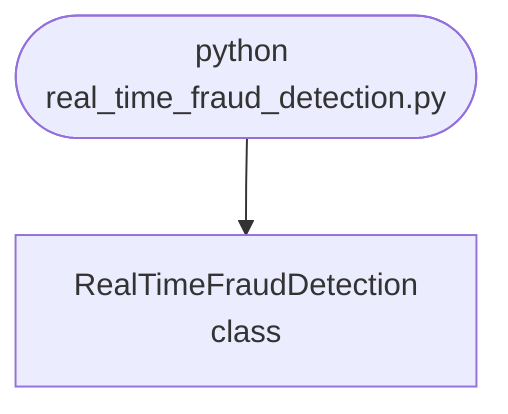

## Abstract
Real-Time Fraud Detection is a Python project that uses machine learning to detect fraud in real-time. The application features data preprocessing, model training, and a CLI interface, demonstrating best practices in financial analytics and ML.

## Prerequisites
- Python 3.8 or above
- A code editor or IDE
- Basic understanding of ML and finance
- Required libraries: `pandas`, `scikit-learn`, `matplotlib`

## Before you Start
Install Python and the required libraries:
```bash title="Install dependencies" showLineNumbers{1}
pip install pandas scikit-learn matplotlib
```

## Getting Started
#### Create a Project
1. Create a folder named `real-time-fraud-detection`.
2. Open the folder in your code editor or IDE.
3. Create a file named `real_time_fraud_detection.py`.
4. Copy the code below into your file.

## Write the Code
<FileCode file="projects/advance/real_time_fraud_detection.py" lang="python" title="Real-Time Fraud Detection" />

## Example Usage
```bash title="Run fraud detection" showLineNumbers{1}
python real_time_fraud_detection.py
```

## What it produces

Running the file exactly as it ships takes **3.1 s** and prints:

```text title="python real_time_fraud_detection.py"
Real-Time Fraud Detection Demo
Fraud detection model trained.
Predictions: [1 1 0 0 0 1 0 0 1 0 0 1 0 1 1 1 1 0 1 1]
```

## How it fits together

Read from the top: this is what runs when you execute the file, and which function calls which. It is generated from the code, so it cannot drift from it.



## Explanation
### Key Features
- **Fraud Detection:** Detects fraud in real-time using ML.
- **Data Preprocessing:** Cleans and prepares transaction data.
- **Error Handling:** Validates inputs and manages exceptions.
- **CLI Interface:** Interactive command-line usage.

### Code Breakdown
1. **What it imports** (lines 1–3)
```python title="real_time_fraud_detection.py" showLineNumbers startLineNumber=1
import numpy as np
from sklearn.ensemble import RandomForestClassifier
from sklearn.model_selection import train_test_split
```

2. **`RealTimeFraudDetection` — the class** (lines 5–22)
```python title="real_time_fraud_detection.py" showLineNumbers startLineNumber=5
class RealTimeFraudDetection:
    def __init__(self):
        self.model = RandomForestClassifier()

    def train(self, X, y):
        self.model.fit(X, y)
        print("Fraud detection model trained.")

    def predict(self, X):
        return self.model.predict(X)

    def demo(self):
        X = np.random.rand(100, 6)
        y = np.random.randint(0, 2, 100)
        X_train, X_test, y_train, y_test = train_test_split(X, y, test_size=0.2)
        self.train(X_train, y_train)
        preds = self.predict(X_test)
        print(f"Predictions: {preds}")
```

The file defines 1 top-level symbol in all; the whole thing is above under *Write the Code*.

## Features
- **Fraud Detection:** Real-time data preprocessing and detection
- **Modular Design:** Separate functions for each task
- **Error Handling:** Manages invalid inputs and exceptions
- **Production-Ready:** Scalable and maintainable code

## Next Steps
Enhance the project by:
- Integrating with more financial APIs
- Supporting advanced ML models
- Creating a GUI for detection
- Adding real-time analytics
- Unit testing for reliability

## Educational Value
This project teaches:
- **Financial Analytics:** Real-time fraud detection and ML
- **Software Design:** Modular, maintainable code
- **Error Handling:** Writing robust Python code

## Real-World Applications
- **Banking Platforms**
- **Financial Analytics**
- **Security Tools**

## Checkpoint exercise

This checkpoint practises flagging suspicious transactions with an Isolation Forest.

<DataCampExercise
  lang="python"
  hint={`IsolationForest.predict returns -1 for outliers and 1 for normal points.`}
  code={`import numpy as np
from sklearn.ensemble import IsolationForest

rng = np.random.default_rng(0)
normal = rng.normal(50, 5, size=(100, 1))
amounts = np.vstack([normal, [[500.0]]])

model = IsolationForest(contamination=0.01, random_state=0).fit(amounts)
flags = ___
print("last transaction flagged:", bool(flags[-1] == -1))

# -- Expected output (last line must match) --
# last transaction flagged: True`}
  solution={`import numpy as np
from sklearn.ensemble import IsolationForest

rng = np.random.default_rng(0)
normal = rng.normal(50, 5, size=(100, 1))
amounts = np.vstack([normal, [[500.0]]])

model = IsolationForest(contamination=0.01, random_state=0).fit(amounts)
flags = model.predict(amounts)
print("last transaction flagged:", bool(flags[-1] == -1))`}
  sct={`test_output_contains("last transaction flagged: True", pattern=False)
success_msg("Checkpoint complete: this is the core step of the project.")`}
  height={320}
/>

## Conclusion
Real-Time Fraud Detection demonstrates how to build a scalable and accurate fraud detection tool using Python. With modular design and extensibility, this project can be adapted for real-world applications in finance, analytics, and more. For more advanced projects, visit Python Central Hub.
