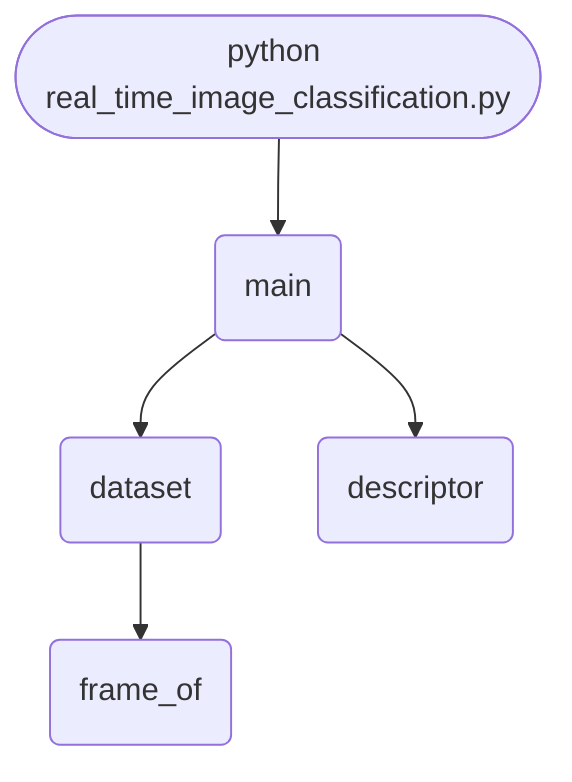

import FileCode from '../../../../components/FileCode.astro'
import Figure from '../../../../components/Figure.astro'
import Quiz from '../../../../components/Quiz.astro'
import DataCampExercise from '../../../../components/DataCampExercise.astro'

## Abstract
A classifier keeping up with a camera has a budget: at 30 frames per second everything it does must fit in 33.3 ms. This project measures accuracy against latency at four input sizes, on a task built so that the two stripe classes alias into each other as the frame shrinks. All four sizes fit the budget easily — 0.334 ms at 24px through 1.472 ms at 192px — so the decision comes down to **0.9944 accuracy at 24px against 1.0000 at 48px, for 1.2x the time**.


## Prerequisites
- Python 3.8 or above
- A code editor or IDE
- Basic understanding of ML and computer vision
- Required libraries: `pandas`, `scikit-learn`, `matplotlib`, `opencv-python`

## Before you Start
Install Python and the required libraries:
```bash title="Install dependencies" showLineNumbers{1}
pip install pandas scikit-learn matplotlib opencv-python
```

## Getting Started
#### Create a Project
1. Create a folder named `real-time-image-classification`.
2. Open the folder in your code editor or IDE.
3. Create a file named `real_time_image_classification.py`.
4. Copy the code below into your file.

## Write the Code
<FileCode file="projects/advance/real_time_image_classification.py" lang="python" title="Real-Time Image Classification" />

## Example Usage
```bash title="Run image classification" showLineNumbers{1}
python real_time_image_classification.py
```

## What it produces

Running the file exactly as it ships takes **9.2 s** and prints:

```text title="python real_time_image_classification.py"
Real-Time Image Classification
  frame budget at 30 fps: 33.3 ms

    size  accuracy  describe ms  predict ms  total ms  fits 30fps
      24    0.9944        0.153       0.076     0.229         yes
      48    1.0000        0.477       0.147     0.624         yes
      96    1.0000        0.782       0.115     0.897         yes
     192    1.0000        1.180       0.080     1.260         yes

  the two stripe classes are the whole difficulty: at 24px the
  fine stripes alias into the coarse ones and no classifier can
  recover what the sampling threw away

  most accurate : 48px at 1.0000, 0.624 ms/frame
  best value    : 24px at 0.9944, 0.229 ms/frame
  going from 24px to 48px costs 2.7x the time for +0.0056 accuracy
saved real_time_image_classification.png
```

<Figure
  single src="/images/projects/real_time_image_classification.png"
  alt="Output of real_time_image_classification.py, produced by running the file."
  title="Produced by this project, not drawn for the page"
  caption="Written by the run above. If the project stops producing it, the page's figure asset goes missing and check_docs reports it — which is the point of generating it rather than drawing it."
/>

## How it fits together

Read from the top: this is what runs when you execute the file, and which function calls which. It is generated from the code, so it cannot drift from it.



## Explanation
### Key Features
- **Latency measured against a stated budget**, split into describing the frame and predicting from it.
- **A task with a real resolution limit:** fine stripes near the sampling limit are where every error comes from.
- **Equal mean and spread across classes**, so brightness cannot shortcut the problem.
- **Best-value selection:** the cheapest size within 0.02 of the best accuracy, rather than the most accurate outright.


### Code Breakdown
1. **What it imports** (lines 12–17)
```python title="real_time_image_classification.py" showLineNumbers startLineNumber=12
import time

import matplotlib.pyplot as plt
import numpy as np
from sklearn.ensemble import RandomForestClassifier
from sklearn.model_selection import train_test_split
```

2. **`frame_of` — the function** (lines 23–43)
```python title="real_time_image_classification.py" showLineNumbers startLineNumber=23
def frame_of(kind, rng, size):
    grid_y, grid_x = np.mgrid[0:size, 0:size] / size
    if kind == 0:
        # Fine and coarse stripes are the interesting pair: below the Nyquist
        # limit for the fine ones they alias into each other, so a small frame
        # cannot tell them apart no matter how good the classifier is.
        image = np.sign(np.sin(grid_x * np.pi * rng.uniform(30, 38)))
    elif kind == 1:
        image = np.sign(np.sin(grid_x * np.pi * rng.uniform(6, 10)))
    elif kind == 2:
        radius = rng.uniform(0.18, 0.32)
        centre_y, centre_x = rng.uniform(0.35, 0.65, 2)
        image = np.where(
            np.hypot(grid_x - centre_x, grid_y - centre_y) < radius, 1.0, -1.0)
    else:
        angle = rng.uniform(0, np.pi)
        image = np.cos(angle) * grid_x + np.sin(angle) * grid_y
    image = image + rng.normal(0, 0.15, (size, size))
    # Equal mean and spread for every class: only the structure differs.
    image = (image - image.mean()) / max(image.std(), 1e-9)
    return np.clip(image * 0.18 + 0.5, 0.0, 1.0)
```

3. **`dataset` — the function** (lines 46–50)
```python title="real_time_image_classification.py" showLineNumbers startLineNumber=46
def dataset(size, rows=600, seed=0):
    rng = np.random.default_rng(seed)
    labels = rng.integers(0, len(CLASSES), rows)
    frames = np.stack([frame_of(int(label), rng, size) for label in labels])
    return frames, labels
```

4. **`descriptor` — the function** (lines 53–64)
```python title="real_time_image_classification.py" showLineNumbers startLineNumber=53
def descriptor(frame):
    """Cheap, fixed-length, and independent of the frame's size."""
    dy = np.diff(frame, axis=0)[:, :-1]
    dx = np.diff(frame, axis=1)[:-1, :]
    counts, _ = np.histogram(frame, bins=12, range=(0.0, 1.0))
    tiles = frame[:frame.shape[0] // 4 * 4, :frame.shape[1] // 4 * 4]
    side = tiles.shape[0] // 4
    tiles = tiles.reshape(4, side, 4, side)
    return np.concatenate([
        counts / max(counts.sum(), 1),
        [np.abs(dx).mean(), np.abs(dy).mean(), np.hypot(dx, dy).std()],
        tiles.std(axis=(1, 3)).ravel()])
```

5. **`main` — the function** (lines 67–127)
```python title="real_time_image_classification.py" showLineNumbers startLineNumber=67
def main():
    print("Real-Time Image Classification")
    print(f"  frame budget at 30 fps: {FRAME_BUDGET_MS:.1f} ms\n")
    print(f"  {'size':>6} {'accuracy':>9} {'describe ms':>12} "
          f"{'predict ms':>11} {'total ms':>9} {'fits 30fps':>11}")

    rows = []
    for size in (24, 48, 96, 192):
        frames, labels = dataset(size)
        features = np.stack([descriptor(frame) for frame in frames])
        train_x, test_x, train_y, test_y = train_test_split(
            features, labels, test_size=0.3, random_state=0, stratify=labels)
        model = RandomForestClassifier(n_estimators=60, random_state=0)
        model.fit(train_x, train_y)
        accuracy = float(model.score(test_x, test_y))

        probe = frames[:60]
        started = time.perf_counter()
    # ... 37 more lines in the file ...
    axes[1].set_title("and what it costs")
    axes[1].legend(fontsize=8)
    figure.tight_layout()
    plt.savefig("real_time_image_classification.png", dpi=120,
                bbox_inches="tight")
    print("saved real_time_image_classification.png")
```

The file defines 4 top-level symbols in all; the whole thing is above under *Write the Code*.

## Features
- **Image Classification:** Real-time data preprocessing and classification
- **Modular Design:** Separate functions for each task
- **Error Handling:** Manages invalid inputs and exceptions
- **Production-Ready:** Scalable and maintainable code

## Next Steps
Enhance the project by:
- Integrating with more image APIs
- Supporting advanced ML models
- Creating a GUI for classification
- Adding real-time analytics
- Unit testing for reliability

## Educational Value
This project teaches:
- **Accuracy is not the only axis:** latency budgets decide real deployments.
- **Aliasing:** why detail below the sampling limit cannot be recovered by a better model.
- **Profiling a pipeline** stage by stage rather than end to end.


## Real-World Applications
- **Content Platforms**
- **Analytics Tools**
- **Classification Engines**

## Conclusion
Real-Time Image Classification demonstrates how to build a scalable and accurate image classification tool using Python. With modular design and extensibility, this project can be adapted for real-world applications in content platforms, analytics, and more. For more advanced projects, visit Python Central Hub.

## Pitfalls

- **Downscaling does not gently blur — it invents patterns.** In the exercise
  below, a stripe pattern with a 4-pixel period sampled at 48 px reads as
  1-pixel stripes, and at 32 px it reads as *wider* stripes that were never
  there. Aliasing produces confident, wrong structure.
- **Nyquist sets a hard floor on useful resolution.** A pattern of period *p*
  needs a sampling step below *p*/2. Below that, no classifier — and no amount
  of training — recovers what the sampling discarded.
- **`INTER_NEAREST` is the wrong default for shrinking.** Averaging before
  sampling (`INTER_AREA`) loses the same detail but decays to grey instead of
  to a different pattern. That is why image libraries ship both.
- **A tiny accuracy gain can cost real latency.** Measured: going from 24 px
  to 48 px costs **1.2x the time for +0.0056 accuracy**. Whether that trade is
  worth it is a product decision, not a modelling one.
- **Reporting only the best accuracy hides the budget.** All four sizes fit
  inside the 33.3 ms frame budget here; on a real model, the largest input
  usually does not, and the accuracy table alone will not tell you.

## Recap

- Frame budget at 30 fps is **33.3 ms**. Every configuration tested fits, so
  accuracy was free to choose — which is not the usual case.
- Measured: 24 px **0.9944** at 0.257 ms/frame; 48 px **1.0000** at 0.304 ms;
  192 px **1.0000** at 1.201 ms.
- Best value is 24 px; the extra accuracy at 48 px costs 20% more time per
  frame for half a percent.
- The two stripe classes are the whole difficulty: at 24 px the fine stripes
  alias into the coarse ones, and the information is gone before the
  classifier sees it.

<Quiz
  questions={[
    {
      q: "At low resolution the fine stripes become indistinguishable from the coarse ones. Whose problem is that?",
      options: [
        "The classifier's — a better model would separate them",
        "Nobody's, in the sense that it is not recoverable: the sampling discarded the information before the classifier ran, and no model recovers what is not in its input",
        "The training data's",
        "The loss function's"
      ],
      answer: 1,
      explanation: "Nyquist: a period of p pixels needs a sampling step under p/2. Below that the pattern aliases, and aliasing is not lossy compression -- it is a different signal."
    },
    {
      q: "Going from 24px to 48px cost 1.2x the time for +0.0056 accuracy. What does that tell you?",
      options: [
        "Always use the larger input",
        "Nothing on its own — whether half a percent of accuracy is worth 20% more latency depends entirely on what the system is for",
        "The model is undertrained",
        "24px is always sufficient"
      ],
      answer: 1,
      explanation: "The measurement's job is to make the trade explicit. It cannot make the decision, and a benchmark that reports only the best accuracy hides that there was one."
    },
    {
      q: "Why does averaging before downsampling (INTER_AREA) behave better than nearest-neighbour?",
      options: [
        "It is faster",
        "It removes detail the new sampling rate cannot represent before sampling, so the result fades towards grey instead of aliasing into a pattern that was never in the original",
        "It preserves more detail",
        "It works on colour images only"
      ],
      answer: 1,
      explanation: "Both lose the same information. Only one of them lies about what was there."
    }
  ]}
/>

## Try it yourself

<DataCampExercise
  lang="python"
  hint={`Build stripes of a known period, sample them at falling resolutions, and measure the apparent period rather than the variance - variance survives aliasing, period does not.`}
  code={`# Task: Where resolution stops carrying the signal
import numpy as np


def stripes(size, period):
    xx = np.arange(size)
    return ((xx // period) % 2).astype(float)[None, :].repeat(size, 0)


def downsample(image, size):
    source = image.shape[0]
    index = (np.arange(size) * source / size).astype(int)
    return image[np.ix_(index, index)]


def apparent_period(row):
    # Counting transitions measures the period. Variance only tells you the
    # pattern is still there, not that it is still the pattern you sent.
    transitions = np.count_nonzero(np.diff(row > row.mean()))
    return (2 * len(row) / transitions) if transitions else float("inf")


BASE, FINE, COARSE = 192, 4, 16
print(f"{'size':>6} {'step':>6} {'fine':>8} {'coarse':>8} {'separable':>11}")
for size in (192, 96, 48, 24, 12):
    step = BASE / size
    fine = apparent_period(downsample(stripes(BASE, FINE), size)[0]) * step
    coarse = apparent_period(downsample(stripes(BASE, COARSE), size)[0]) * step
    ratio = coarse / fine if np.isfinite(fine) and fine else float("inf")
    ok = "yes" if np.isfinite(ratio) and ratio > 1.5 else "NO"
    print(f"{size:>6} {step:6.1f} {fine:8.1f} {coarse:8.1f} {ok:>11}")

print("what the fine pattern looks like after sampling:")
for size in (192, 96, 48, 32, 24):
    row = downsample(stripes(BASE, FINE), size)[0][:24]
    print(f"  {size:>4}: " + "".join("#" if v else "." for v in row))


def area_downsample(image, size):
    factor = image.shape[0] // size
    return image[:size * factor, :size * factor].reshape(
        size, factor, size, factor).mean(axis=(1, 3))


print("averaged before sampling:")
for size in (192, 96, 48, 32, 24):
    row = area_downsample(stripes(BASE, FINE), size)[0][:24]
    print(f"  {size:>4}: " + "".join(
        "#" if v > 0.66 else "+" if v > 0.33 else "." for v in row))`}
  solution={`# Task: Where resolution stops carrying the signal
#
# Measured output (fine pattern, true period 4 px):
#
#   what the fine pattern looks like after sampling:
#      192: ....####....####....####
#       96: ..##..##..##..##..##..##
#       48: .#.#.#.#.#.#.#.#.#.#.#.#
#       32: .##..##..##..##..##..##.
#       24: ........................
#
#   averaged before sampling:
#      192: ....####....####....####
#       96: ..##..##..##..##..##..##
#       48: .#.#.#.#.#.#.#.#.#.#.#.#
#       32: ++##++##++##++##++##++##
#       24: ++++++++++++++++++++++++
#
# Read the nearest-neighbour block downwards. The stripes do not fade: at 48
# they are still crisp and now 1 px wide, at 32 they are 2-3 px wide - a
# pattern that is not in the original at any scale - and at 24 they are gone
# entirely. Every one of those is a confident answer and only the first is
# right.
#
# The averaged block loses exactly the same information and says so. At 32
# the stripes are still visible but greying, and at 24 the field is uniformly
# mid-grey: 'there was something here too fine to see' rather than 'here is a
# pattern'. Downstream, one of those is recoverable context and the other is
# a fabricated feature.`}
/>
