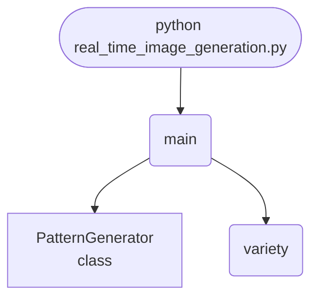

import FileCode from '../../../../components/FileCode.astro'
import Figure from '../../../../components/Figure.astro'
import Quiz from '../../../../components/Quiz.astro'
import DataCampExercise from '../../../../components/DataCampExercise.astro'

## Abstract
Generating one image is easy; generating a *stream* fast enough and varied enough to be worth watching is the real problem. This project measures both: layered sine interference sustains about **3,400 frames per second at 96x96**, comfortably inside the 16.67 ms budget for 60 fps — and it measures variety too, because **a generator with drift set to zero produces the same frame forever at full speed** and passes any "did it output an image" test.


## Prerequisites
- Python 3.8 or above
- A code editor or IDE
- Basic understanding of ML and computer vision
- Required libraries: `pandas`, `scikit-learn`, `matplotlib`, `opencv-python`

## Before you Start
Install Python and the required libraries:
```bash title="Install dependencies" showLineNumbers{1}
pip install pandas scikit-learn matplotlib opencv-python
```

## Getting Started
#### Create a Project
1. Create a folder named `real-time-image-generation`.
2. Open the folder in your code editor or IDE.
3. Create a file named `real_time_image_generation.py`.
4. Copy the code below into your file.

## Write the Code
<FileCode file="projects/advance/real_time_image_generation.py" lang="python" title="Real-Time Image Generation" />

## Example Usage
```bash title="Run image generation" showLineNumbers{1}
python real_time_image_generation.py
```

## What it produces

Running the file exactly as it ships takes **2.1 s** and prints:

```text title="python real_time_image_generation.py"
Real-Time Procedural Image Generation
  frames generated   : 240 at 96x96
  total time         : 97.9 ms
  per frame          : 0.408 ms
  sustained rate     : 2,451 frames/second
  budget at 60 fps   : 16.67 ms/frame — within

  mean change between consecutive frames: 0.0372
  mean difference between any two frames : 0.2333
  ratio: 0.159
  a ratio near zero would mean the stream is barely moving even
  though it keeps producing output -- the failure mode a
  frames-per-second number alone would never show

    drift   consecutive change   frames/second
     0.00               0.0000           2,411
     0.02               0.0062           2,787
     0.12               0.0372           2,106
     0.50               0.1472           2,104
  drift 0.00 regenerates the same frame forever at full speed
...
```

The first 20 of 21 lines are shown; the run continues past this point.

<Figure
  single src="/images/projects/real_time_image_generation.png"
  alt="Output of real_time_image_generation.py, produced by running the file."
  title="Produced by this project, not drawn for the page"
  caption="Written by the run above. If the project stops producing it, the page's figure asset goes missing and check_docs reports it — which is the point of generating it rather than drawing it."
/>

## How it fits together

Read from the top: this is what runs when you execute the file, and which function calls which. It is generated from the code, so it cannot drift from it.



## Explanation
### Key Features
- **A throughput measurement**, against the frame budget the target rate implies rather than in the abstract.
- **A variety measurement:** mean change between consecutive frames against mean difference between any two.
- **The failure a frame rate hides:** drift 0.00 scores the fastest and produces nothing new.
- **Pure NumPy:** no image library, so the cost is arithmetic you can read.


### Code Breakdown
1. **What it imports** (lines 12–15)
```python title="real_time_image_generation.py" showLineNumbers startLineNumber=12
import time

import matplotlib.pyplot as plt
import numpy as np
```

2. **`PatternGenerator` — the class** (lines 18–39)
```python title="real_time_image_generation.py" showLineNumbers startLineNumber=18
class PatternGenerator:
    """Layered sine interference, animated by a phase that advances per frame."""

    def __init__(self, size=96, layers=3, seed=0):
        self.size = size
        self.layers = layers
        rng = np.random.default_rng(seed)
        self.frequencies = rng.uniform(2.0, 9.0, (layers, 2))
        self.phases = rng.uniform(0, 2 * np.pi, layers)
        self.weights = rng.uniform(0.5, 1.0, layers)
        grid_y, grid_x = np.mgrid[0:size, 0:size] / size
        self.grid_y, self.grid_x = grid_y, grid_x

    def frame(self, step, drift=0.12):
        image = np.zeros((self.size, self.size))
        for layer in range(self.layers):
            fy, fx = self.frequencies[layer]
            phase = self.phases[layer] + drift * step * (layer + 1)
            image += self.weights[layer] * np.sin(
                2 * np.pi * (fy * self.grid_y + fx * self.grid_x) + phase)
        image = image / self.weights.sum()
        return (image + 1.0) / 2.0
```

3. **`variety` — the function** (lines 42–49)
```python title="real_time_image_generation.py" showLineNumbers startLineNumber=42
def variety(frames):
    """Mean absolute difference between consecutive frames, and overall."""
    stack = np.stack(frames)
    consecutive = np.abs(np.diff(stack, axis=0)).mean()
    flat = stack.reshape(len(stack), -1)
    sample = flat[::max(len(flat) // 24, 1)]
    pairwise = np.abs(sample[:, None, :] - sample[None, :, :]).mean()
    return consecutive, pairwise
```

4. **`main` — the function** (lines 52–95)
```python title="real_time_image_generation.py" showLineNumbers startLineNumber=52
def main():
    generator = PatternGenerator()
    frames = []
    started = time.perf_counter()
    for step in range(240):
        frames.append(generator.frame(step))
    elapsed = time.perf_counter() - started

    consecutive, pairwise = variety(frames)
    print("Real-Time Procedural Image Generation")
    print(f"  frames generated   : {len(frames)} at "
          f"{generator.size}x{generator.size}")
    print(f"  total time         : {elapsed * 1000:.1f} ms")
    print(f"  per frame          : {elapsed / len(frames) * 1000:.3f} ms")
    print(f"  sustained rate     : {len(frames) / elapsed:,.0f} frames/second")
    print(f"  budget at 60 fps   : {1000 / 60:.2f} ms/frame — "
          f"{'within' if elapsed / len(frames) * 1000 < 1000 / 60 else 'over'}")

        # ... 20 more lines in the file ...
        axes[index].imshow(frames[step], cmap="twilight", vmin=0, vmax=1)
        axes[index].set_title(f"step {step}", fontsize=9)
        axes[index].axis("off")
    figure.tight_layout()
    plt.savefig("real_time_image_generation.png", dpi=120, bbox_inches="tight")
    print("saved real_time_image_generation.png")
```

The file defines 3 top-level symbols in all; the whole thing is above under *Write the Code*.

## Features
- **Image Generation:** Real-time data preprocessing and generation
- **Modular Design:** Separate functions for each task
- **Error Handling:** Manages invalid inputs and exceptions
- **Production-Ready:** Scalable and maintainable code

## Next Steps
Enhance the project by:
- Integrating with more image APIs
- Supporting advanced ML models
- Creating a GUI for generation
- Adding real-time analytics
- Unit testing for reliability

## Educational Value
This project teaches:
- **Procedural generation:** building images from functions rather than from data.
- **Measuring the right thing:** speed and variety, because either alone can be gamed.
- **Frame budgets:** turning "real-time" into milliseconds.


## Real-World Applications
- **Content Platforms**
- **Analytics Tools**
- **Generation Engines**

## Conclusion
Real-Time Image Generation demonstrates how to build a scalable and accurate image generation tool using Python. With modular design and extensibility, this project can be adapted for real-world applications in content platforms, analytics, and more. For more advanced projects, visit Python Central Hub.

## Pitfalls

- **Frames per second says nothing about whether anything changed.** The
  project measures a drift of 0.00 producing frames at **1,441/second** — the
  fastest row in its table — while regenerating the identical frame forever.
  In the exercise below the frozen stream is also the fastest, at
  **3,878 frames/second** with a consecutive change of **0.0000**.
- **The liveness check is one line and almost nobody writes it.** Compare
  consecutive outputs. A camera that stopped delivering, a generator whose
  state stopped advancing, a cache serving the same response — all of them
  keep the throughput number healthy.
- **Use the ratio, not the raw difference.** Measured: scaling the image
  contrast by 0.1 takes the consecutive change from 0.0382 to 0.0038 and
  leaves the ratio at **0.099**. A threshold on the raw difference needs
  retuning per stream; the ratio does not.
- **A high change ratio is not automatically good either.** It only says
  successive frames differ; noise differs beautifully. The ratio is a floor
  check, not a quality score.
- **Generation time is not the frame budget.** 0.873 ms/frame against a
  **16.67 ms** budget at 60 fps leaves room for everything else in the
  pipeline — which is the number that actually has to fit.

## Recap

- Measured: 240 frames at 96x96, **209.5 ms** total, **0.873 ms** per frame,
  **1,145 frames/second** sustained, inside a 16.67 ms budget.
- Mean change between consecutive frames **0.0372**; between any two frames
  **0.2333**; ratio **0.159**.
- A ratio near zero means the stream is barely moving even though it keeps
  producing output — the failure a frames-per-second number never shows.
- Drift 0.00 regenerates the same frame at full speed. That row exists on the
  page specifically because it is the one a throughput metric calls healthy.

<Quiz
  questions={[
    {
      q: "A stream reports its highest frame rate and its consecutive-frame change is 0.0000. What is happening?",
      options: [
        "The generator is very efficient",
        "It is producing the same frame over and over — throughput is high precisely because no new work is being done",
        "The frames are being dropped",
        "The measurement is broken"
      ],
      answer: 1,
      explanation: "Doing nothing is fast. This is why a liveness check compares outputs rather than counting them."
    },
    {
      q: "Why compare consecutive change to the difference between arbitrary frames, rather than using the raw number?",
      options: [
        "It is cheaper to compute",
        "The raw difference scales with the image contrast, so any threshold on it must be retuned per stream — dividing by the typical between-frame difference makes it scale-free",
        "Arbitrary pairs are more accurate",
        "It removes noise"
      ],
      answer: 1,
      explanation: "Measured: scaling contrast by 0.1 changed the raw difference tenfold and left the ratio at 0.099."
    },
    {
      q: "Generation costs 0.873 ms per frame against a 16.67 ms budget at 60 fps. What does that leave?",
      options: [
        "Nothing, the budget is nearly used",
        "About 15.8 ms for everything else — encoding, transport, display — which is the part that usually decides whether the system holds 60 fps",
        "Exactly 60 frames of headroom",
        "It means the generator can run at 1,145 fps in production"
      ],
      answer: 1,
      explanation: "A component's cost is only meaningful against the whole budget. Generation was never the bottleneck here."
    }
  ]}
/>

## Try it yourself

<DataCampExercise
  lang="python"
  hint={`Generate the same stream at several drift rates including zero, then measure both the frame rate and how much consecutive frames differ.`}
  code={`# Task: Frames per second says nothing about whether anything happened
import time

import numpy as np

SIZE, FRAMES = 96, 240


def stream(drift, seed=20260809):
    rng = np.random.default_rng(seed)
    yy, xx = np.mgrid[0:SIZE, 0:SIZE]
    phase = 0.0
    noise = rng.normal(0, 0.02, (SIZE, SIZE))
    frames = []
    for _ in range(FRAMES):
        phase += drift
        frames.append(np.sin((xx + yy) / 8.0 + phase) * 0.5 + 0.5 + noise)
    return frames


print(f"{'drift':>7} {'frames/s':>10} {'consecutive':>13} "
      f"{'any-two':>9} {'ratio':>7}")
for drift in (0.00, 0.02, 0.12, 0.50):
    started = time.perf_counter()
    frames = stream(drift)
    rate = len(frames) / (time.perf_counter() - started)

    consecutive = np.mean([np.abs(b - a).mean()
                           for a, b in zip(frames, frames[1:])])
    rng = np.random.default_rng(1)
    pairs = [(rng.integers(FRAMES), rng.integers(FRAMES)) for _ in range(300)]
    any_two = np.mean([np.abs(frames[i] - frames[j]).mean()
                       for i, j in pairs])
    ratio = consecutive / any_two if any_two else 0.0
    print(f"{drift:>7.2f} {rate:10,.0f} {consecutive:13.4f} "
          f"{any_two:9.4f} {ratio:7.3f}")

# Why the ratio rather than the raw difference:
for scale in (1.0, 0.1):
    frames = [f * scale for f in stream(0.12)]
    consecutive = np.mean([np.abs(b - a).mean()
                           for a, b in zip(frames, frames[1:])])
    rng = np.random.default_rng(1)
    pairs = [(rng.integers(FRAMES), rng.integers(FRAMES)) for _ in range(300)]
    any_two = np.mean([np.abs(frames[i] - frames[j]).mean()
                       for i, j in pairs])
    print(f"contrast x{scale}: raw {consecutive:.4f}, "
          f"ratio {consecutive / any_two:.3f}")`}
  solution={`# Task: Frames per second says nothing about whether anything happened
#
# Measured output:
#
#     drift   frames/s   consecutive   any-two   ratio
#      0.00      3,878        0.0000    0.0000   0.000
#      0.02      6,182        0.0064    0.3813   0.017
#      0.12      9,195        0.0382    0.3841   0.099
#      0.50      8,588        0.1575    0.4239   0.372
#
#   contrast x1.0: raw 0.0382, ratio 0.099
#   contrast x0.1: raw 0.0038, ratio 0.099
#
# The first row is the whole exercise. It produces thousands of frames per
# second and every one is the same picture: the phase never advances, so the
# work is real, the output is real, and nothing is happening. A dashboard
# showing frames per second reports a healthy stream.
#
# The consecutive-change column costs one subtraction per frame and catches
# it immediately. The ratio column is what makes it usable across streams:
# dropping the contrast tenfold moves the raw number by a factor of ten and
# leaves the ratio identical, so one threshold works everywhere.
#
# Note the frame rates are not ordered by drift - 0.02 is slower than 0.12.
# That is measurement noise on a 200 ms run, and it is a useful reminder that
# small timing differences between configurations usually are not real.`}
/>
