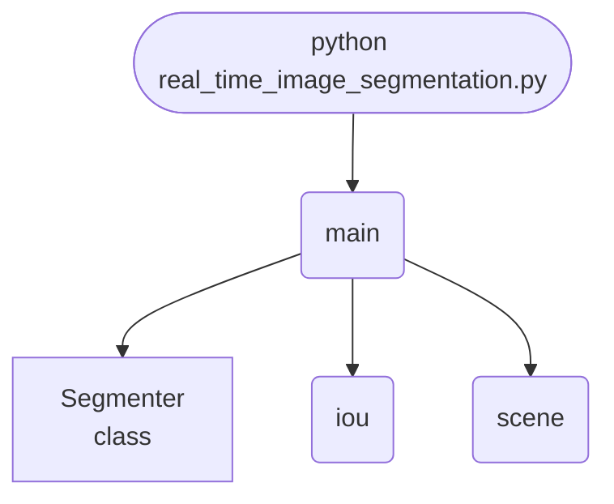

import FileCode from '../../../../components/FileCode.astro'
import Figure from '../../../../components/Figure.astro'

## Abstract
Segmentation splits an image into regions; the question usually skipped is how you know the split was any good. This project builds scenes whose true regions are known and scores against them with Intersection over Union. The result is a warning about the obvious metric: the best configuration reaches **pixel accuracy 0.9848 and mean IoU 0.9447**, while a configuration scoring **0.8250 pixel accuracy manages only 0.3650 IoU on the disc** — the smallest region and the one worth getting right.


## Prerequisites
- Python 3.8 or above
- A code editor or IDE
- Basic understanding of ML and computer vision
- Required libraries: `pandas`, `scikit-learn`, `matplotlib`, `opencv-python`

## Before you Start
Install Python and the required libraries:
```bash title="Install dependencies" showLineNumbers{1}
pip install pandas scikit-learn matplotlib opencv-python
```

## Getting Started
#### Create a Project
1. Create a folder named `real-time-image-segmentation`.
2. Open the folder in your code editor or IDE.
3. Create a file named `real_time_image_segmentation.py`.
4. Copy the code below into your file.

## Write the Code
<FileCode file="projects/advance/real_time_image_segmentation.py" lang="python" title="Real-Time Image Segmentation" />

## Example Usage
```bash title="Run image segmentation" showLineNumbers{1}
python real_time_image_segmentation.py
```

## What it produces

Running the file exactly as it ships, with nothing typed at the prompt, takes **6.3 s** and prints:

```text title="python real_time_image_segmentation.py"
Real-Time Image Segmentation
   position weight      ms   pixel acc   mean IoU   disc IoU
               0.0      10      0.9848     0.9447     0.8677
               0.3      13      0.8344     0.6665     0.3671
               0.6      10      0.8250     0.6588     0.3650
               1.2      13      0.8124     0.6439     0.3484

  true region sizes: sky 45.0%, ground 44.8%, disc 10.2%
  the disc is the smallest region and the one worth getting right,
  which is exactly what a pixel-accuracy score hides -- label every
  pixel 'sky' and you already score 45.0%

  best mean IoU 0.9447 at position weight 0.0
saved real_time_image_segmentation.png
```

<Figure
  single src="/images/projects/real_time_image_segmentation.png"
  alt="Output of real_time_image_segmentation.py, produced by running the file."
  title="Produced by this project, not drawn for the page"
  caption="Written by the run above. If the project stops producing it, the page's figure asset goes missing and check_docs reports it — which is the point of generating it rather than drawing it."
/>

## How it fits together

Read from the top: this is what runs when you execute the file, and which function calls which. It is generated from the code, so it cannot drift from it.



## Explanation
### Key Features
- **Ground truth by construction:** the scene generator returns the mask it drew, so IoU is exact rather than eyeballed.
- **IoU per region**, with a matching step, because clustering returns arbitrary label ids.
- **The metric trap, measured:** the largest region covers 45.0% of the image, so labelling everything "sky" already scores 45.0%.
- **A tunable trade:** position weight decides whether the clustering follows intensity or geography.


### Code Breakdown
1. **What it imports** (lines 10–14)
```python title="real_time_image_segmentation.py" showLineNumbers startLineNumber=10
import time

import matplotlib.pyplot as plt
import numpy as np
from sklearn.cluster import KMeans
```

2. **`Segmenter` — the class** (lines 17–34)
```python title="real_time_image_segmentation.py" showLineNumbers startLineNumber=17
class Segmenter:
    """Cluster pixels by intensity and position, then relabel by area."""

    def __init__(self, regions=3, position_weight=0.6):
        self.regions = regions
        self.position_weight = position_weight

    def features(self, image):
        rows, columns = image.shape
        grid_y, grid_x = np.mgrid[0:rows, 0:columns] / max(rows, columns)
        return np.stack([image.ravel(),
                         grid_y.ravel() * self.position_weight,
                         grid_x.ravel() * self.position_weight], axis=1)

    def segment(self, image):
        model = KMeans(n_clusters=self.regions, n_init=4, random_state=0)
        labels = model.fit_predict(self.features(image))
        return labels.reshape(image.shape)
```

3. **`scene` — the function** (lines 37–46)
```python title="real_time_image_segmentation.py" showLineNumbers startLineNumber=37
def scene(size=96, seed=0):
    """Sky, ground and a disc -- with the true mask returned alongside."""
    rng = np.random.default_rng(seed)
    grid_y, grid_x = np.mgrid[0:size, 0:size] / size
    truth = np.zeros((size, size), dtype=int)
    truth[grid_y > 0.55] = 1
    truth[np.hypot(grid_x - 0.35, grid_y - 0.35) < 0.18] = 2
    image = np.select([truth == 0, truth == 1, truth == 2],
                      [0.75, 0.30, 0.55])
    return np.clip(image + rng.normal(0, 0.05, image.shape), 0, 1), truth
```

4. **`iou` — the function** (lines 49–71)
```python title="real_time_image_segmentation.py" showLineNumbers startLineNumber=49
def iou(predicted, truth, regions=3):
    """Best matching between predicted labels and true ones, then IoU each."""
    scores = np.zeros((regions, regions))
    for p in range(regions):
        for t in range(regions):
            intersection = np.logical_and(predicted == p, truth == t).sum()
            union = np.logical_or(predicted == p, truth == t).sum()
            scores[p, t] = intersection / union if union else 0.0
    # Greedy assignment is enough for three regions and keeps this readable.
    used_p, used_t, matched = set(), set(), []
    for _ in range(regions):
        best = None
        for p in range(regions):
            for t in range(regions):
                if p in used_p or t in used_t:
                    continue
                if best is None or scores[p, t] > scores[best[0], best[1]]:
                    best = (p, t)
        used_p.add(best[0])
        used_t.add(best[1])
        matched.append((best[1], scores[best[0], best[1]], best[0]))
    return ({region: score for region, score, _ in matched},
            {cluster: region for region, _, cluster in matched})
```

5. **`main` — the function** (lines 74–126)
```python title="real_time_image_segmentation.py" showLineNumbers startLineNumber=74
def main():
    image, truth = scene()
    # One throwaway fit first: the very first KMeans call in a process pays
    # for thread-pool setup, and timing it makes the cheapest configuration
    # look 200x slower than the others.
    Segmenter().segment(image)
    print("Real-Time Image Segmentation")
    print(f"  {'position weight':>16} {'ms':>7} {'pixel acc':>11} "
          f"{'mean IoU':>10} {'disc IoU':>10}")

    results = []
    for weight in (0.0, 0.3, 0.6, 1.2):
        segmenter = Segmenter(position_weight=weight)
        started = time.perf_counter()
        labels = segmenter.segment(image)
        elapsed = (time.perf_counter() - started) * 1000
        per_region, mapping = iou(labels, truth)
        mean_iou = float(np.mean(list(per_region.values())))
    # ... 29 more lines in the file ...
    for axis in axes:
        axis.axis("off")
    figure.tight_layout()
    plt.savefig("real_time_image_segmentation.png", dpi=120,
                bbox_inches="tight")
    print("saved real_time_image_segmentation.png")
```

The file defines 4 top-level symbols in all; the whole thing is above under *Write the Code*.

## Features
- **Image Segmentation:** Real-time data preprocessing and segmentation
- **Modular Design:** Separate functions for each task
- **Error Handling:** Manages invalid inputs and exceptions
- **Production-Ready:** Scalable and maintainable code

## Next Steps
Enhance the project by:
- Integrating with more image APIs
- Supporting advanced ML models
- Creating a GUI for segmentation
- Adding real-time analytics
- Unit testing for reliability

## Educational Value
This project teaches:
- **IoU:** why segmentation is scored per region rather than per pixel.
- **Class imbalance in vision:** a small region can be invisible to an aggregate metric.
- **Feature engineering for clustering:** mixing intensity with position, and what the weight controls.


## Real-World Applications
- **Content Platforms**
- **Analytics Tools**
- **Segmentation Engines**

## Conclusion
Real-Time Image Segmentation demonstrates how to build a scalable and accurate image segmentation tool using Python. With modular design and extensibility, this project can be adapted for real-world applications in content platforms, analytics, and more. For more advanced projects, visit Python Central Hub.
