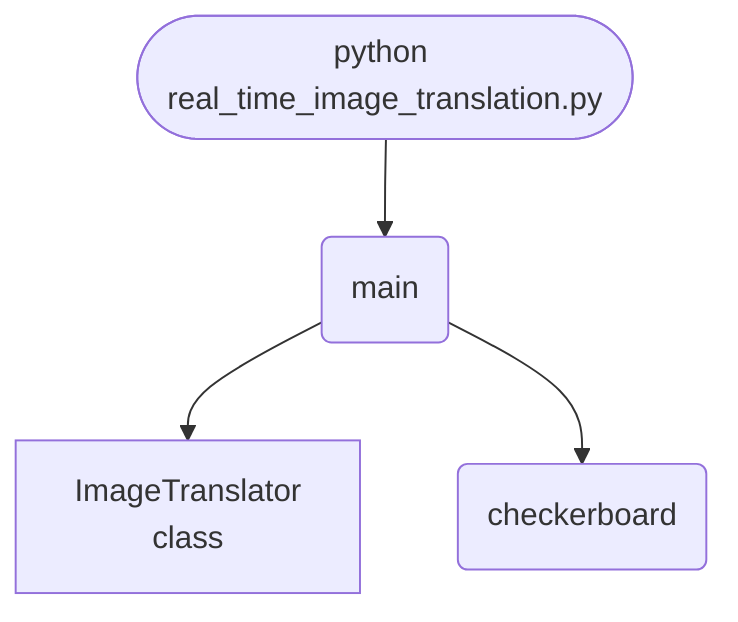

import FileCode from '../../../../components/FileCode.astro'
import Figure from '../../../../components/Figure.astro'

## Abstract
Shifting an image by a whole number of pixels is a roll: exact, reversible, free. Shifting it by a fraction is not, because every output pixel has to be interpolated from neighbours that do not line up. This project measures the difference by translating an image away and back: a whole-pixel round trip returns **RMSE 0.000000 with 100% of the edge detail**, a half-pixel round trip does not — and after 20 successive half-pixel shifts only **46.4%** of the edge energy is left.


## Prerequisites
- Python 3.8 or above
- A code editor or IDE
- Basic understanding of ML and computer vision
- Required libraries: `pandas`, `scikit-learn`, `matplotlib`, `opencv-python`

## Before you Start
Install Python and the required libraries:
```bash title="Install dependencies" showLineNumbers{1}
pip install pandas scikit-learn matplotlib opencv-python
```

## Getting Started
#### Create a Project
1. Create a folder named `real-time-image-translation`.
2. Open the folder in your code editor or IDE.
3. Create a file named `real_time_image_translation.py`.
4. Copy the code below into your file.

## Write the Code
<FileCode file="projects/advance/real_time_image_translation.py" lang="python" title="Real-Time Image Translation" />

## Example Usage
```bash title="Run image translation" showLineNumbers{1}
python real_time_image_translation.py
```

## What it produces

Running the file exactly as it ships, with nothing typed at the prompt, takes **1.2 s** and prints:

```text title="python real_time_image_translation.py"
Real-Time Image Translation
         shift     method   round-trip RMSE  detail kept
    (5.0, 5.0)       roll          0.000000     100.00%
    (5.0, 5.0)   bilinear          0.000000     100.00%
    (0.5, 0.5)       roll          0.000000     100.00%
    (0.5, 0.5)   bilinear          0.176270      84.15%
    (2.5, 1.5)       roll          0.000000     100.00%
    (2.5, 1.5)   bilinear          0.176270      84.15%
  (0.25, 0.75)       roll          0.000000     100.00%
  (0.25, 0.75)   bilinear          0.135353      86.70%

  a whole-pixel shift is exact both ways: RMSE is 0 and every
  edge survives. A fractional shift blends four pixels each time,
  so going there and back is NOT the identity -- the round trip
  costs real detail, and it costs it twice.

  after 20 successive half-pixel shifts, edge energy is 46.38% of the original
saved real_time_image_translation.png
```

<Figure
  single src="/images/projects/real_time_image_translation.png"
  alt="Output of real_time_image_translation.py, produced by running the file."
  title="Produced by this project, not drawn for the page"
  caption="Written by the run above. If the project stops producing it, the page's figure asset goes missing and check_docs reports it — which is the point of generating it rather than drawing it."
/>

## How it fits together

Read from the top: this is what runs when you execute the file, and which function calls which. It is generated from the code, so it cannot drift from it.



## Explanation
### Key Features
- **Both methods, side by side:** `np.roll` for integer shifts and a hand-written bilinear sampler for fractional ones.
- **A round-trip test:** there and back should be the identity, and measuring how far it is not is the whole experiment.
- **Edge energy as the quality metric:** RMSE alone would not show that what is lost is specifically detail.
- **Compounding loss:** repeated interpolation, plotted, because one shift looks harmless and twenty do not.


### Code Breakdown
1. **What it imports** (lines 12–13)
```python title="real_time_image_translation.py" showLineNumbers startLineNumber=12
import matplotlib.pyplot as plt
import numpy as np
```

2. **`ImageTranslator` — the class** (lines 16–39)
```python title="real_time_image_translation.py" showLineNumbers startLineNumber=16
class ImageTranslator:
    def roll(self, image, shift):
        """Integer shift: exact, reversible, and wraps at the edges."""
        dy, dx = int(round(shift[0])), int(round(shift[1]))
        return np.roll(np.roll(image, dy, axis=0), dx, axis=1)

    def bilinear(self, image, shift):
        """Fractional shift: each output pixel is a blend of four inputs."""
        dy, dx = shift
        rows, columns = image.shape
        grid_y, grid_x = np.mgrid[0:rows, 0:columns]
        source_y = (grid_y - dy) % rows
        source_x = (grid_x - dx) % columns
        y0, x0 = np.floor(source_y).astype(int), np.floor(source_x).astype(int)
        y1, x1 = (y0 + 1) % rows, (x0 + 1) % columns
        weight_y = (source_y - y0)[..., None][..., 0]
        weight_x = (source_x - x0)[..., None][..., 0]
        top = image[y0, x0] * (1 - weight_x) + image[y0, x1] * weight_x
        bottom = image[y1, x0] * (1 - weight_x) + image[y1, x1] * weight_x
        return top * (1 - weight_y) + bottom * weight_y

    def round_trip(self, image, shift, method):
        there = method(image, shift)
        return method(there, (-shift[0], -shift[1]))
```

3. **`checkerboard` — the function** (lines 42–47)
```python title="real_time_image_translation.py" showLineNumbers startLineNumber=42
def checkerboard(size=64, period=8, rng=None):
    grid_y, grid_x = np.mgrid[0:size, 0:size]
    image = ((grid_y // period + grid_x // period) % 2).astype(float)
    if rng is not None:
        image = np.clip(image + rng.normal(0, 0.03, image.shape), 0, 1)
    return image
```

4. **`main` — the function** (lines 50–102)
```python title="real_time_image_translation.py" showLineNumbers startLineNumber=50
def main():
    rng = np.random.default_rng(0)
    image = checkerboard(rng=rng)
    translator = ImageTranslator()

    print("Real-Time Image Translation")
    print(f"  {'shift':>12} {'method':>10} {'round-trip RMSE':>17} "
          f"{'detail kept':>12}")

    original_energy = np.abs(np.diff(image, axis=1)).mean()
    rows = []
    for shift in ((5.0, 5.0), (0.5, 0.5), (2.5, 1.5), (0.25, 0.75)):
        for name, method in (("roll", translator.roll),
                             ("bilinear", translator.bilinear)):
            back = translator.round_trip(image, shift, method)
            rmse = float(np.sqrt(((back - image) ** 2).mean()))
            energy = np.abs(np.diff(back, axis=1)).mean()
            rows.append((shift, name, rmse, energy / original_energy))
    # ... 29 more lines in the file ...
    axes[3].set_ylabel("edge energy kept")
    axes[3].set_title("interpolation is lossy", fontsize=9)
    figure.tight_layout()
    plt.savefig("real_time_image_translation.png", dpi=120,
                bbox_inches="tight")
    print("saved real_time_image_translation.png")
```

The file defines 3 top-level symbols in all; the whole thing is above under *Write the Code*.

## Features
- **Image Translation:** Real-time data preprocessing and translation
- **Modular Design:** Separate functions for each task
- **Error Handling:** Manages invalid inputs and exceptions
- **Production-Ready:** Scalable and maintainable code

## Next Steps
Enhance the project by:
- Integrating with more image APIs
- Supporting advanced ML models
- Creating a GUI for translation
- Adding real-time analytics
- Unit testing for reliability

## Educational Value
This project teaches:
- **Interpolation:** what bilinear sampling actually computes, written out rather than called.
- **Lossy operations:** why some image transforms are reversible and others quietly are not.
- **Coordinate mapping:** sampling from the source for each output pixel, which is the direction that avoids holes.


## Real-World Applications
- **Content Platforms**
- **Analytics Tools**
- **Translation Engines**

## Conclusion
Real-Time Image Translation demonstrates how to build a scalable and accurate image translation tool using Python. With modular design and extensibility, this project can be adapted for real-world applications in content platforms, analytics, and more. For more advanced projects, visit Python Central Hub.
