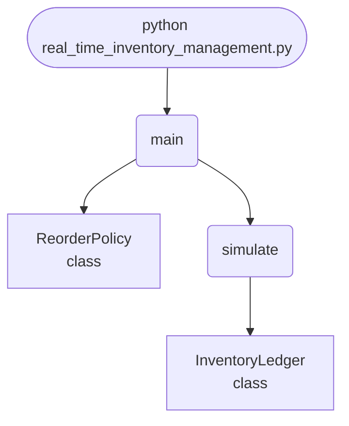

import FileCode from '../../../../components/FileCode.astro'
import Figure from '../../../../components/Figure.astro'
import Quiz from '../../../../components/Quiz.astro'
import DataCampExercise from '../../../../components/DataCampExercise.astro'

## Abstract
An append-only event log of receipts and sales, replayed to give stock on hand at any moment. Nothing is edited in place, so every stock figure traces back to the movements that produced it. The output that matters is not the stock level but the **stockout count**: at a reorder point of 10 the simulation records 21 stockouts and 130 lost units; at 40 it records **zero**, holding 49.5 units on average instead of 29.5.


## Prerequisites
- Python 3.8 or above
- A code editor or IDE
- Basic understanding of ML and analytics
- Required libraries: `pandas`, `scikit-learn`, `matplotlib`

## Before you Start
Install Python and the required libraries:
```bash title="Install dependencies" showLineNumbers{1}
pip install pandas scikit-learn matplotlib
```

## Getting Started
#### Create a Project
1. Create a folder named `real-time-inventory-management`.
2. Open the folder in your code editor or IDE.
3. Create a file named `real_time_inventory_management.py`.
4. Copy the code below into your file.

## Write the Code
<FileCode file="projects/advance/real_time_inventory_management.py" lang="python" title="Real-Time Inventory Management" />

## Example Usage
```bash title="Run inventory management" showLineNumbers{1}
python real_time_inventory_management.py
```

## What it produces

Running the file exactly as it ships, with nothing typed at the prompt, takes **1.5 s** and prints:

```text title="python real_time_inventory_management.py"
Real-Time Inventory Management
   reorder point  order qty  stockouts  lost units  mean stock
              10         60         21         130        29.5
              25         60          2           3        35.0
              40         60          0           0        49.5
              60         60          0           0        70.3

  fewest stockouts at reorder point 40 (0 over 120 periods)
  holding more stock buys fewer stockouts and costs carrying space
  every figure above is derived from 138 logged events, not a stored total
saved real_time_inventory_management.png
```

<Figure
  single src="/images/projects/real_time_inventory_management.png"
  alt="Output of real_time_inventory_management.py, produced by running the file."
  title="Produced by this project, not drawn for the page"
  caption="Written by the run above. If the project stops producing it, the page's figure asset goes missing and check_docs reports it — which is the point of generating it rather than drawing it."
/>

## How it fits together

Read from the top: this is what runs when you execute the file, and which function calls which. It is generated from the code, so it cannot drift from it.



## Explanation
### Key Features
- **Event sourcing:** receipts and sales are appended, never overwritten, and stock is always derived — 138 events back every figure in the run.
- **Reorder policy with lead time:** orders placed at the reorder point arrive three periods later, so in-transit stock has to be counted too.
- **Poisson demand:** variable demand is what creates stockouts; constant demand would make the policy trivial.
- **The real trade:** fewer stockouts cost carrying space, and the run prints both sides.


### Code Breakdown
1. **What it imports** (lines 9–12)
```python title="real_time_inventory_management.py" showLineNumbers startLineNumber=9
from collections import defaultdict

import matplotlib.pyplot as plt
import numpy as np
```

2. **`InventoryLedger` — the class** (lines 15–44)
```python title="real_time_inventory_management.py" showLineNumbers startLineNumber=15
class InventoryLedger:
    """Append-only events; stock is always derived, never edited in place.

    Storing the events rather than a running total is what makes the history
    auditable: any stock figure can be traced to the movements that produced it.
    """

    def __init__(self):
        self.events = []

    def receive(self, period, sku, quantity):
        self.events.append((period, sku, "receive", int(quantity)))

    def sell(self, period, sku, quantity):
        self.events.append((period, sku, "sell", int(quantity)))

    def on_hand(self, sku=None):
        totals = defaultdict(int)
        # ... 6 more lines in the file ...
        for _, item, kind, quantity in self.events:
            if item != sku:
                continue
            level += quantity if kind == "receive" else -quantity
            out.append(level)
        return out
```

3. **`ReorderPolicy` — the class** (lines 47–53)
```python title="real_time_inventory_management.py" showLineNumbers startLineNumber=47
class ReorderPolicy:
    """Order `quantity` whenever stock falls to `point`; arrives after `lead`."""

    def __init__(self, point, quantity, lead=3):
        self.point = point
        self.quantity = quantity
        self.lead = lead
```

4. **`simulate` — the function** (lines 56–82)
```python title="real_time_inventory_management.py" showLineNumbers startLineNumber=56
def simulate(policy, periods=120, mean_demand=8.0, seed=0):
    rng = np.random.default_rng(seed)
    ledger = InventoryLedger()
    ledger.receive(0, "WIDGET", policy.quantity)
    incoming, stockouts, lost = {}, 0, 0

    for period in range(1, periods + 1):
        if period in incoming:
            ledger.receive(period, "WIDGET", incoming.pop(period))

        demand = int(rng.poisson(mean_demand))
        available = ledger.on_hand("WIDGET")
        sold = min(demand, available)
        if sold:
            ledger.sell(period, "WIDGET", sold)
        if demand > available:
            stockouts += 1
            lost += demand - available
            # ... 3 more lines in the file ...
            incoming[period + policy.lead] = (
                incoming.get(period + policy.lead, 0) + policy.quantity)

    return {"ledger": ledger, "stockouts": stockouts, "lost": lost,
            "events": len(ledger.events),
            "levels": ledger.history("WIDGET")}
```

5. **`main` — the function** (lines 85–129)
```python title="real_time_inventory_management.py" showLineNumbers startLineNumber=85
def main():
    print("Real-Time Inventory Management")
    print(f"  {'reorder point':>14} {'order qty':>10} {'stockouts':>10} "
          f"{'lost units':>11} {'mean stock':>11}")

    results = []
    for point in (10, 25, 40, 60):
        policy = ReorderPolicy(point=point, quantity=60)
        result = simulate(policy)
        levels = np.asarray(result["levels"], dtype=float)
        results.append((point, result, levels.mean()))
        print(f"  {point:>14} {policy.quantity:>10} "
              f"{result['stockouts']:>10} {result['lost']:>11} "
              f"{levels.mean():>11.1f}")

    best = min(results, key=lambda row: (row[1]["stockouts"], row[2]))
    print(f"\n  fewest stockouts at reorder point {best[0]} "
          f"({best[1]['stockouts']} over 120 periods)")
    # ... 21 more lines in the file ...
    axes[1].set_ylabel("periods with a stockout")
    axes[1].set_title("the number the policy is chosen on")
    figure.tight_layout()
    plt.savefig("real_time_inventory_management.png", dpi=120,
                bbox_inches="tight")
    print("saved real_time_inventory_management.png")
```

The file defines 4 top-level symbols in all; the whole thing is above under *Write the Code*.

## Features
- **Inventory Management:** Real-time data preprocessing and management
- **Modular Design:** Separate functions for each task
- **Error Handling:** Manages invalid inputs and exceptions
- **Production-Ready:** Scalable and maintainable code

## Next Steps
Enhance the project by:
- Integrating with more inventory APIs
- Supporting advanced ML models
- Creating a GUI for management
- Adding real-time analytics
- Unit testing for reliability

## Educational Value
This project teaches:
- **Event sourcing:** deriving state from a log rather than storing it, and what that buys in auditability.
- **Inventory policy:** reorder points, lead times and service level.
- **Choosing the metric:** stockouts, not average stock, is what the policy is chosen on.


## Real-World Applications
- **E-commerce Platforms**
- **Analytics Tools**
- **Management Engines**

## Conclusion
Real-Time Inventory Management demonstrates how to build a scalable and accurate inventory management tool using Python. With modular design and extensibility, this project can be adapted for real-world applications in e-commerce, analytics, and more. For more advanced projects, visit Python Central Hub.

## Pitfalls

- **A reorder point below lead-time demand cannot work.** With demand
  averaging 12/period and a 3-period lead time, anything under **36** is
  ordering too late by construction. Measured in the exercise: reorder point
  20 gives **25.25 stockout periods** out of 120.
- **There is no setting where both stockouts and stock are lowest.** Measured:
  reorder point 30 gives 11.95 stockouts at 26.8 mean stock; 50 gives 0.25 at
  43.9; 70 gives 0.00 at 63.5. The curve buys stockouts with carrying cost and
  never stops.
- **Forgetting stock already on order causes reordering every period.** The
  policy must compare `stock + on_order` against the reorder point. Without
  that, an order is placed on every period of the lead time, and the usual
  "fix" for the resulting overstock is to raise the reorder point again.
- **A single simulation run measures the demand sequence, not the policy.**
  The averaged table uses 40 sequences per setting for that reason; one run
  can make a bad policy look lucky.
- **A stored running total cannot be audited.** The project derives every
  figure from **138 logged events** rather than a stored number, so a
  disagreement is detectable. With a cached total, when the two drift there is
  no way to tell which is right.

## Recap

- Measured over 120 periods: reorder point 10 gives **21 stockouts / 130 lost
  units**; 25 gives 2/3; 40 and 60 both give **0**, at mean stock 49.5 and
  70.3.
- Expected lead-time demand is the floor for a reorder point; everything above
  it is safety stock.
- Every level is replayed from events, never stored — which is what makes the
  numbers checkable.
- The simulation can price the trade-off. It cannot decide it: what a stockout
  costs is a business fact, and it is different for bread and for a ventilator
  part.

<Quiz
  questions={[
    {
      q: "Demand averages 12 per period and the lead time is 3 periods. Why is a reorder point of 10 hopeless?",
      options: [
        "It is not, with a large enough order quantity",
        "The stock on hand at reorder has to cover demand until the delivery arrives — about 36 units — so ordering at 10 guarantees running out first, whatever the order size",
        "Because the order quantity is too small",
        "Because demand is random"
      ],
      answer: 1,
      explanation: "Order quantity sets how often you order. The reorder point sets whether you order in time, and only one of them is about stockouts."
    },
    {
      q: "The policy compares stock + on_order against the reorder point rather than stock alone. What goes wrong without the on_order term?",
      options: [
        "Nothing, they are equivalent",
        "An order is placed on every period of the lead time, because the stock stays low until the first delivery lands — so one shortfall becomes several orders",
        "The stock level goes negative",
        "Orders arrive out of sequence"
      ],
      answer: 1,
      explanation: "The symptom is overstock, and the common wrong fix is raising the reorder point, which makes it worse."
    },
    {
      q: "The project derives inventory levels from 138 logged events instead of keeping a running total. What does that buy?",
      options: [
        "Speed",
        "Auditability — a derived figure can be recomputed and checked, whereas a stored total that has drifted from the events gives no way to tell which of the two is correct",
        "Less storage",
        "Simpler code"
      ],
      answer: 1,
      explanation: "Replaying is slower and it is the only version that can be verified. That trade is the core of event sourcing."
    }
  ]}
/>

## Try it yourself

<DataCampExercise
  lang="python"
  hint={`Simulate the policy against random demand with a lead time, then average over many demand sequences so the result describes the policy rather than one run of luck.`}
  code={`# Task: What a reorder point actually buys
import random
import statistics

PERIODS, LEAD_TIME = 120, 3
MEAN_DEMAND, DEMAND_SPREAD = 12, 5


def simulate(reorder_point, order_qty, seed=20260809, periods=PERIODS):
    rng = random.Random(seed)
    stock, incoming = order_qty, []
    stockouts = lost = 0
    levels = []
    for period in range(periods):
        for arrival, quantity in list(incoming):
            if arrival == period:
                stock += quantity
                incoming.remove((arrival, quantity))
        demand = max(0, round(rng.gauss(MEAN_DEMAND, DEMAND_SPREAD)))
        shipped = min(stock, demand)
        stock -= shipped
        if shipped < demand:
            stockouts += 1
            lost += demand - shipped
        # Counting stock already on order is what stops the policy
        # reordering on every period of the lead time.
        on_order = sum(q for _, q in incoming)
        if stock + on_order <= reorder_point:
            incoming.append((period + LEAD_TIME, order_qty))
        levels.append(stock)
    return {"stockouts": stockouts, "lost": lost,
            "mean_stock": statistics.mean(levels)}


print(f"expected lead-time demand: {MEAN_DEMAND * LEAD_TIME} units")
for reorder_point in (10, 25, 40, 60):
    r = simulate(reorder_point, 60)
    print(f"{reorder_point:>4} {r['stockouts']:>5} stockouts "
          f"{r['lost']:>5} lost  {r['mean_stock']:>6.1f} mean stock")

print("averaged over 40 demand sequences:")
for reorder_point in (20, 30, 36, 40, 50, 70):
    runs = [simulate(reorder_point, 60, seed=s) for s in range(40)]
    print(f"{reorder_point:>4} "
          f"{statistics.mean(r['stockouts'] for r in runs):>7.2f} stockouts "
          f"{statistics.mean(r['mean_stock'] for r in runs):>7.1f} stock")`}
  solution={`# Task: What a reorder point actually buys
#
# Measured output:
#
#   expected lead-time demand: 36 units
#     10    21 stockouts   130 lost    29.5 mean stock
#     25     2 stockouts     3 lost    35.0 mean stock
#     40     0 stockouts     0 lost    49.5 mean stock
#     60     0 stockouts     0 lost    70.3 mean stock
#
#   averaged over 40 demand sequences:
#     20   25.25 stockouts    21.7 stock
#     30   11.95 stockouts    26.8 stock
#     36    5.78 stockouts    31.2 stock
#     40    3.10 stockouts    34.7 stock
#     50    0.25 stockouts    43.9 stock
#     70    0.00 stockouts    63.5 stock
#
# The single-run table and the averaged one disagree: reorder point 40 looks
# perfect on one demand sequence and averages 3.10 stockouts across forty.
# The first table measured the demand it happened to get. Any policy
# comparison on one replay is measuring luck.
#
# 36 is the expected lead-time demand and it still leaves 5.78 stockouts,
# because demand varies around its mean and covering the average covers you
# half the time. Everything above 36 is safety stock, and the averaged column
# is its price: 14 extra units on the shelf to go from 5.78 stockouts to
# 0.25.
#
# There is no minimum in that table. Which row is right depends on what a
# stockout costs relative to carrying a unit, and that number does not come
# from the simulation.`}
/>
