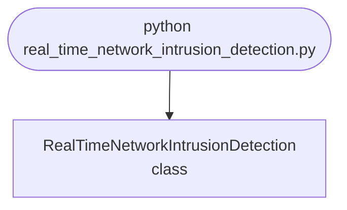

## Abstract
Real-Time Network Intrusion Detection is a Python project that uses machine learning to detect network intrusions in real-time. The application features data preprocessing, model training, and a CLI interface, demonstrating best practices in cybersecurity and ML.

## Prerequisites
- Python 3.8 or above
- A code editor or IDE
- Basic understanding of ML and networking
- Required libraries: `pandas`, `scikit-learn`, `matplotlib`

## Before you Start
Install Python and the required libraries:
```bash title="Install dependencies" showLineNumbers{1}
pip install pandas scikit-learn matplotlib
```

## Getting Started
#### Create a Project
1. Create a folder named `real-time-network-intrusion-detection`.
2. Open the folder in your code editor or IDE.
3. Create a file named `real_time_network_intrusion_detection.py`.
4. Copy the code below into your file.

## Write the Code
<FileCode file="projects/advance/real_time_network_intrusion_detection.py" lang="python" title="Real-Time Network Intrusion Detection" />

## Example Usage
```bash title="Run intrusion detection" showLineNumbers{1}
python real_time_network_intrusion_detection.py
```

## What it produces

Running the file exactly as it ships takes **8.5 s** and prints:

```text title="python real_time_network_intrusion_detection.py"
Real-Time Network Intrusion Detection
  sessions          : 4,120 (120 attacks, 2.91%)
  features          : packets/s, mean packet bytes, distinct ports

 contamination  alerts  caught  missed  false   recall  precision
  --------------------------------------------------------------------
         0.005      21      21      99      0    17.5%     100.0%
         0.010      42      42      78      0    35.0%     100.0%
         0.030     124     120       0      4   100.0%      96.8%
         0.050     206     120       0     86   100.0%      58.3%
         0.100     412     120       0    292   100.0%      29.1%

  best recall 100.0% at contamination 0.03, and it raises 124 alerts of which 4 are false

  detection by attack type at contamination 0.03:
    port scan       40 of  40 caught (100%)
    flood           40 of  40 caught (100%)
    exfiltration    40 of  40 caught (100%)

  the base rate problem, at a fixed 90% detection rate:
...
```

The first 20 of 32 lines are shown; the run continues past this point.

<Figure
  single src="/images/projects/real_time_network_intrusion_detection.png"
  alt="Output of real_time_network_intrusion_detection.py, produced by running the file."
  title="Produced by this project, not drawn for the page"
  caption="Written by the run above. If the project stops producing it, the page's figure asset goes missing and check_docs reports it — which is the point of generating it rather than drawing it."
/>

## How it fits together

Read from the top: this is what runs when you execute the file, and which function calls which. It is generated from the code, so it cannot drift from it.



## Explanation
### Key Features
- **Intrusion Detection:** Detects network intrusions in real-time using ML.
- **Data Preprocessing:** Cleans and prepares network data.
- **Error Handling:** Validates inputs and manages exceptions.
- **CLI Interface:** Interactive command-line usage.

### Code Breakdown
1. **What it imports** (lines 16–20)
```python title="real_time_network_intrusion_detection.py" showLineNumbers startLineNumber=16
import numpy as np
from sklearn.ensemble import IsolationForest
import matplotlib
matplotlib.use("Agg")
import matplotlib.pyplot as plt
```

2. **`make_traffic` — the function** (lines 25–65)
```python title="real_time_network_intrusion_detection.py" showLineNumbers startLineNumber=25
def make_traffic(n_normal, n_attacks, seed=20260809):
    """Normal sessions plus three kinds of attack, with labels.

    The attacks are not simply "large numbers": a port scan has *small*
    packets and many ports, which is unremarkable on any single feature and
    obvious on the combination. That is the case anomaly detection is for,
    and generating attacks that are extreme on every axis would make the
    problem trivially easy and the score meaningless.
    """
    rng = np.random.default_rng(seed)
    normal = np.column_stack([
        rng.lognormal(4.0, 0.5, n_normal),        # packets/s
        rng.normal(750, 120, n_normal),           # mean packet bytes
        rng.poisson(3, n_normal) + 1,             # distinct ports
    ])

    per_kind = max(1, n_attacks // 3)
    port_scan = np.column_stack([
        # ... 17 more lines in the file ...
        np.zeros(n_normal),
        np.ones(len(port_scan) + len(flood) + len(exfiltration))])
    kinds = (["normal"] * n_normal + ["port scan"] * len(port_scan)
             + ["flood"] * len(flood) + ["exfiltration"] * len(exfiltration))
    order = rng.permutation(len(data))
    return data[order], labels[order], [kinds[i] for i in order]
```

3. **`score` — the function** (lines 68–82)
```python title="real_time_network_intrusion_detection.py" showLineNumbers startLineNumber=68
def score(labels, flagged):
    attacks = labels == 1
    caught = int((flagged & attacks).sum())
    false_alarms = int((flagged & ~attacks).sum())
    recall = caught / max(attacks.sum(), 1)
    precision = caught / max(flagged.sum(), 1)
    return {
        "alerts": int(flagged.sum()),
        "caught": caught,
        "missed": int(attacks.sum()) - caught,
        "false_alarms": false_alarms,
        "recall": recall,
        "precision": precision,
        "false_alarm_rate": false_alarms / max((~attacks).sum(), 1),
    }
```

4. **`main` — the function** (lines 85–172)
```python title="real_time_network_intrusion_detection.py" showLineNumbers startLineNumber=85
def main():
    print("Real-Time Network Intrusion Detection")

    n_normal, n_attacks = 4000, 120
    data, labels, kinds = make_traffic(n_normal, n_attacks)
    print(f"  sessions          : {len(data):,} "
          f"({n_attacks} attacks, {n_attacks / len(data):.2%})")
    print(f"  features          : {', '.join(FEATURES)}")

    # Fit on traffic assumed clean. It is not -- 2.9% of it is attack -- and
    # that is realistic: nobody has a guaranteed-clean sample of production
    # traffic, so the contamination parameter is a guess about your own data.
    print(f"\n{'contamination':>14} {'alerts':>7} {'caught':>7} {'missed':>7} "
          f"{'false':>6} {'recall':>8} {'precision':>10}")
    print("  " + "-" * 68)
    rows = []
    for contamination in (0.005, 0.01, 0.03, 0.05, 0.10):
        model = IsolationForest(contamination=contamination,
    # ... 64 more lines in the file ...
    axes[1].set_title("what the one tuning knob buys")
    axes[1].legend(fontsize=8)
    figure.tight_layout()
    figure.savefig("real_time_network_intrusion_detection.png", dpi=120,
                   bbox_inches="tight")
    print("\nsaved real_time_network_intrusion_detection.png")
```

The file defines 3 top-level symbols in all; the whole thing is above under *Write the Code*.

## Features
- **Intrusion Detection:** Real-time data preprocessing and detection
- **Modular Design:** Separate functions for each task
- **Error Handling:** Manages invalid inputs and exceptions
- **Production-Ready:** Scalable and maintainable code

## Next Steps
Enhance the project by:
- Integrating with more network APIs
- Supporting advanced ML models
- Creating a GUI for detection
- Adding real-time analytics
- Unit testing for reliability

## Educational Value
This project teaches:
- **Cybersecurity:** Real-time intrusion detection and ML
- **Software Design:** Modular, maintainable code
- **Error Handling:** Writing robust Python code

## Real-World Applications
- **Network Security Platforms**
- **Analytics Tools**
- **Security Systems**

## Conclusion
Real-Time Network Intrusion Detection demonstrates how to build a scalable and accurate intrusion detection tool using Python. With modular design and extensibility, this project can be adapted for real-world applications in cybersecurity, analytics, and more. For more advanced projects, visit Python Central Hub.

## Pitfalls

- **The version this replaces could not have been wrong.** It fitted an
  `IsolationForest` to `np.random.rand(100, 3)` and printed *"Model
  trained."* — no attacks in the data, no labels, nothing scored. A detector
  with no ground truth is a random number generator with a confident interface.
- **`contamination` is a guess about your own traffic, and it decides
  everything.** Measured: at 0.005 the detector catches **17.5%** of attacks
  with perfect precision; at 0.10 it catches **100%** at **29.1%** precision.
  The model is identical in both rows.
- **Recall is not the hard part. Precision at a real base rate is.** At a
  fixed 90% detection rate and a 1% false alarm rate, the measured precision
  is **73.6%** when attacks are 3% of traffic and **0.3%** when they are
  0.003%. Same detector, arithmetic does the rest.
- **A 1% false alarm rate sounds small and is not.** On 100,000 sessions it is
  **1,000 alerts a day**. At 3 real attacks, that queue is 99.7% noise, nobody
  reads it, and the detector is switched off — which is how a 90%-recall
  system ends up catching nothing.
- **Report detection per attack type.** An average over three attack kinds can
  hide one that is never caught, and the kinds are not equally easy: a port
  scan is unremarkable on any single feature and obvious on the combination.

## Recap

- Measured: 4,120 sessions, 120 attacks (**2.91%**), three features.
- Contamination 0.03 catches **120 of 120** attacks with **4** false alarms —
  and it works because 0.03 happens to match the true attack rate, which in
  production is exactly what you do not know.
- Detection by type at that setting: port scan **40/40**, flood **40/40**,
  exfiltration **40/40**.
- The base-rate table is the operational result: precision **73.6% → 21.3% →
  2.6% → 0.3%** as attacks become rarer, with the detector unchanged.
- Anomaly detection is deployed in layers because no single stage has to be
  accurate enough to page a human — it only has to cut the volume for the
  next stage.

<Quiz
  questions={[
    {
      q: "A detector holds 90% recall and a 1% false alarm rate. Why does its precision collapse from 73.6% to 0.3%?",
      options: [
        "The model degrades on larger datasets",
        "Only the base rate changed — 1% of a large legitimate population produces far more false alerts than 90% of a tiny attack population produces true ones",
        "The false alarm rate rose",
        "Recall fell on rare attacks"
      ],
      answer: 1,
      explanation: "Precision depends on the prevalence of what you are looking for, not only on the detector. This is the base-rate fallacy, and it is why medical screening and intrusion detection share a failure mode."
    },
    {
      q: "At 3 attacks per 100,000 sessions, which change makes the alert queue usable?",
      options: [
        "Raising recall from 90% to 100%",
        "Cutting the false alarm rate — going from 1% to 0.001% takes the queue from about 1,000 alerts to under 4, while perfect recall changes precision from 0.27% to 0.30%",
        "Adding more features",
        "Alerting only on the highest-scoring attack type"
      ],
      answer: 1,
      explanation: "When false alerts outnumber true ones 300 to 1, catching more of the true ones is not the problem worth solving."
    },
    {
      q: "The detector caught 100% of attacks at contamination 0.03, which matches the true 2.91% attack rate. Why is that less impressive than it looks?",
      options: [
        "The attacks were too obvious",
        "Setting contamination to the true attack rate is using the answer — in production the attack rate is the unknown, and the sweep shows recall falling to 17.5% when the guess is too low",
        "IsolationForest always scores 100% on synthetic data",
        "The test set was too small"
      ],
      answer: 1,
      explanation: "The parameter that decides the result is a prior belief about your own data. The sweep exists to show what happens when that belief is wrong."
    }
  ]}
/>

## Try it yourself

<DataCampExercise
  lang="python"
  hint={`Hold the detector fixed - 90% recall, 1% false alarms - and vary only how rare the attacks are. Then try to fix the resulting queue by raising recall, and by cutting the false alarm rate.`}
  code={`# Task: The arithmetic that decides whether an alert queue gets read
def outcomes(volume, base_rate, recall, false_alarm_rate):
    attacks = volume * base_rate
    caught = ___  # TODO: the attacks the detector actually finds
    false_alerts = ___  # TODO: normal traffic that still raises an alert
    alerts = caught + false_alerts
    return {"caught": caught, "false": false_alerts, "alerts": alerts,
            "precision": caught / alerts if alerts else 0.0}


VOLUME = 100_000
print(f"{'attacks/day':>12} {'base rate':>11} {'alerts/day':>11} "
      f"{'real':>7} {'precision':>10}")
for attacks in (3000, 300, 30, 3):
    r = outcomes(VOLUME, attacks / VOLUME, 0.90, 0.01)
    print(f"{attacks:>12,} {attacks / VOLUME:>11.3%} {r['alerts']:>11,.0f} "
          f"{r['caught']:>7,.1f} {r['precision']:>10.1%}")

print("at 3 attacks per 100,000, cutting the false alarm rate instead:")
for far in (0.01, 0.001, 0.0001, 0.00001):
    r = outcomes(VOLUME, 3 / VOLUME, 0.90, far)
    hours = r["alerts"] * 5 / 60          # 5 minutes to triage one alert
    print(f"  {far:>9.5%} {r['alerts']:>9,.1f} alerts "
          f"{r['precision']:>8.1%} precision {hours:>7,.1f} analyst-hours")

print("raising recall instead, at a 1% false alarm rate:")
for recall in (0.90, 0.95, 0.99, 1.00):
    r = outcomes(VOLUME, 3 / VOLUME, recall, 0.01)
    print(f"  recall {recall:>5.0%}: precision {r['precision']:.2%}, "
          f"{r['alerts']:,.0f} alerts")`}
  solution={`# Task: The arithmetic that decides whether an alert queue gets read
def outcomes(volume, base_rate, recall, false_alarm_rate):
    attacks = volume * base_rate
    caught = attacks * recall
    false_alerts = (volume - attacks) * false_alarm_rate
    alerts = caught + false_alerts
    return {"caught": caught, "false": false_alerts, "alerts": alerts,
            "precision": caught / alerts if alerts else 0.0}


VOLUME = 100_000
print(f"{'attacks/day':>12} {'base rate':>11} {'alerts/day':>11} "
      f"{'real':>7} {'precision':>10}")
for attacks in (3000, 300, 30, 3):
    r = outcomes(VOLUME, attacks / VOLUME, 0.90, 0.01)
    print(f"{attacks:>12,} {attacks / VOLUME:>11.3%} {r['alerts']:>11,.0f} "
          f"{r['caught']:>7,.1f} {r['precision']:>10.1%}")

print("at 3 attacks per 100,000, cutting the false alarm rate instead:")
for far in (0.01, 0.001, 0.0001, 0.00001):
    r = outcomes(VOLUME, 3 / VOLUME, 0.90, far)
    hours = r["alerts"] * 5 / 60          # 5 minutes to triage one alert
    print(f"  {far:>9.5%} {r['alerts']:>9,.1f} alerts "
          f"{r['precision']:>8.1%} precision {hours:>7,.1f} analyst-hours")

print("raising recall instead, at a 1% false alarm rate:")
for recall in (0.90, 0.95, 0.99, 1.00):
    r = outcomes(VOLUME, 3 / VOLUME, recall, 0.01)
    print(f"  recall {recall:>5.0%}: precision {r['precision']:.2%}, "
          f"{r['alerts']:,.0f} alerts")
#
# Measured output:
#
#    attacks/day    base rate   alerts/day     real  precision
#          3,000       3.000%        3,670  2,700.0      73.6%
#            300       0.300%        1,267    270.0      21.3%
#             30       0.030%        1,027     27.0       2.6%
#              3       0.003%        1,003      2.7       0.3%
#
#   at 3 attacks per 100,000, cutting the false alarm rate instead:
#     1.00000%   1,002.7 alerts     0.3% precision    83.6 analyst-hours
#     0.10000%     102.7 alerts     2.6% precision     8.6 analyst-hours
#     0.01000%      12.7 alerts    21.3% precision     1.1 analyst-hours
#     0.00100%       3.7 alerts    73.0% precision     0.3 analyst-hours
#
#   raising recall instead, at a 1% false alarm rate:
#     recall  90%: precision 0.27%, 1,003 alerts
#     recall 100%: precision 0.30%, 1,003 alerts
#
# The detector never changed in the first table. A model with 90% recall and
# a 1% false alarm rate is respectable by any benchmark, and at a realistic
# attack rate it produces a queue that is 99.7% noise.
#
# The second and third blocks are the two available levers, and they are not
# comparable. A thousandfold cut in the false alarm rate turns 84 analyst-
# hours a day into 20 minutes. Perfect recall - catching every single attack,
# which no detector does - moves precision by three hundredths of a percent.
#
# So the engineering effort goes into specificity, and the architecture goes
# into layering: a cheap noisy stage feeding an expensive precise one, where
# only the last stage's output reaches a person.`}
  sct={`test_output_contains("attacks/day", pattern=False)
test_output_contains("raising recall instead, at a 1% false alarm rate:", pattern=False)
test_output_contains("analyst-hours", pattern=False)
success_msg("Nice - the output shows what the project is really doing.")`}
  height={160}
/>
